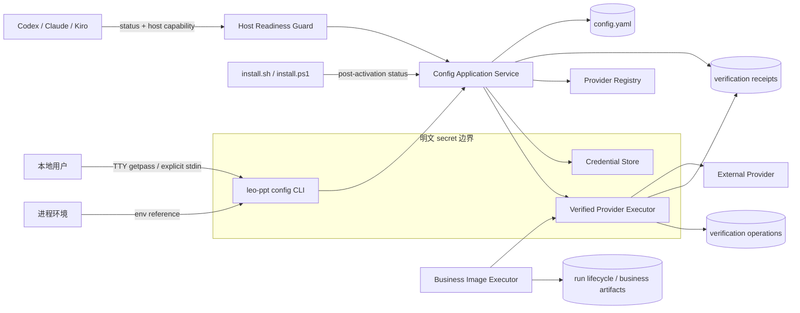
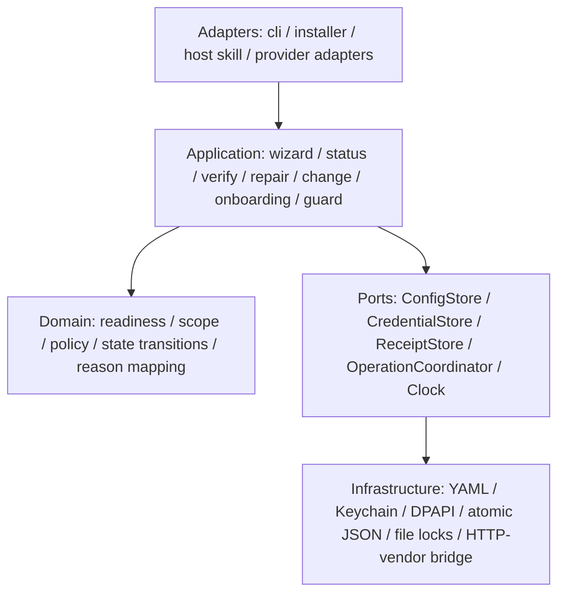
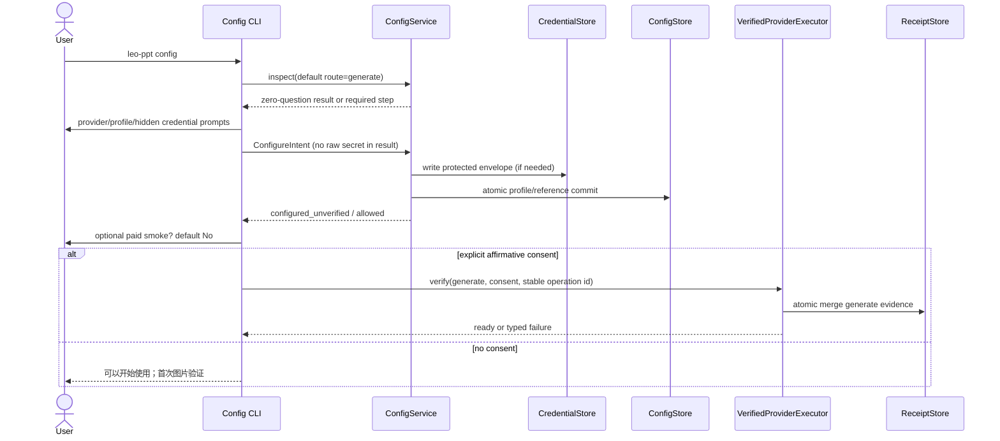
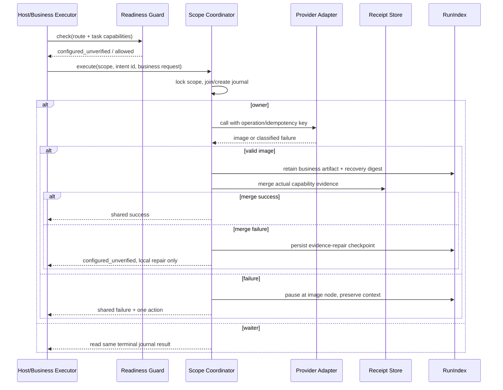
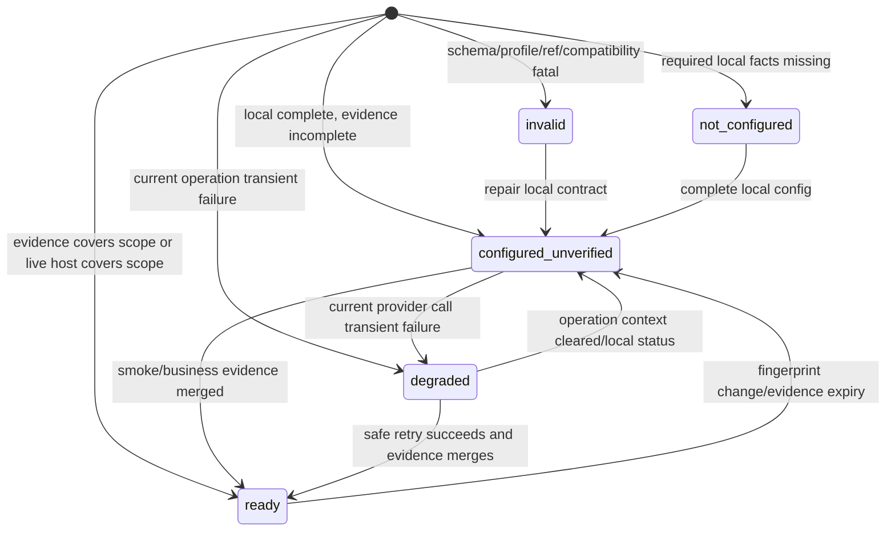

# Design Document

## Overview

`guided-provider-config` 在现有受管 runtime、平台凭据存储、Provider backend 和 run lifecycle 之上增加统一的配置与 readiness 控制面。设计以 `requirements.md`、`config-file.md` 和 `flow.md` 为产品合同；三者定义的状态、费用授权、安全边界和恢复语义优先于当前开发期实现。实现不引入浏览器或 localhost 服务，不修改生成投影作为持久真值。

核心目标是把“安装成功”“本地配置完整”“当前能力已真实验证”“当前 Route 可执行”拆成独立事实，再由一个纯函数状态内核聚合。`leo-ppt config status`、安装 onboarding、宿主 guard 和业务执行器都消费同一内核，不各自推断 readiness。

### 研究结论与现状约束

- `skills/leo-ppt-generator/runtime/src/leo_ppt_generator/config/runtime_config.py` 已拥有 `LEO_PPT_HOME` 解析、YAML 读取和原子写入基础，但当前 schema 只识别开发期字段；正式实现应替换为完整 v1，而不是叠加迁移层。
- `skills/leo-ppt-generator/runtime/src/leo_ppt_generator/credentials.py` 已有 Keychain、DPAPI 和环境变量入口，但 macOS 当前通过 `security ... -w <secret>` 把 secret 放入子进程 argv，违反本规格。设计改为进程内调用 Keychain `SecItem` API，并序列化并发访问。Apple 对 `SecItem` 的并发建议也支持串行访问策略：[SecItem pitfalls and best practices](https://developer.apple.com/forums/thread/724013)。
- Windows 继续使用当前用户 DPAPI，不启用 machine scope；官方合同说明默认保护通常绑定同一机器、同一登录用户：[CryptProtectData](https://learn.microsoft.com/en-us/windows/win32/api/dpapi/nf-dpapi-cryptprotectdata)。
- `skills/leo-ppt-generator/scripts/runtime_manager.py` 已返回绝对 `cli`、使用安装锁、operation receipt 和原子 `current` 切换；`install.sh` 与 `install.ps1` 已把 runtime/doctor/Skill 激活组成事务。配置 onboarding 必须在激活成功后运行，失败不进入安装回滚分支。
- `skills/leo-ppt-generator/runtime/src/leo_ppt_generator/application/run_index.py` 已提供 FileLock、revision、operation id、lease 和原子状态更新，可承载任务暂停/恢复引用；Provider 验证协调仍需独立的跨 run scope journal。
- `skills/leo-ppt-generator/runtime/src/leo_ppt_generator/config/backend_contract.py` 的静态 Backend 表只描述候选 capability，尚未表达 probe、模型发现、幂等、重试和 TTL。它将被单一 Provider Registry 替代/包裹，静态 capability 永不直接产生 `ready`。
- 测试采用现有 pytest/unittest 体系，并增加固定版本 Hypothesis 作为测试依赖。Hypothesis 的 rule-based state machine 适合验证配置事务与 receipt 合并的操作序列：[Stateful testing](https://hypothesis.readthedocs.io/en/latest/stateful.html)。

### 设计原则

1. **单一真值**：Route 基础能力、Provider 安全策略、配置 schema、Reason Code 和 receipt 写入分别只有一个 owner。
2. **纯内核、薄适配器**：状态计算、scope、fingerprint 和失败映射是无 I/O 逻辑；CLI、安装器、宿主和 Provider 调用只是适配层。
3. **secret 最小暴露**：secret 只存在于输入读取栈帧、受保护 Credential Store 和调用 Provider 所需的短生命周期进程环境中；不进入 argv、文件、输出或异常。
4. **先持久化意图，再产生费用**：每个可能计费请求先获得稳定 operation id 并写 operation journal；并发者加入同一意图。
5. **业务产物优先**：图片成功即由 run owner 保留；receipt 写入失败只降低 readiness，不删除图片也不再次调用 Provider。
6. **fail closed 但不误阻断**：未知探测/幂等策略不自动执行；本地配置完整但未验证是 `configured_unverified/allowed`。
## Architecture

### Context and trust boundaries



外部 Provider、环境变量、终端输入、现有配置文件和平台 API 返回都视为不可信输入。`Config_File`、receipt、operation journal、日志和 run metadata 均位于 secret 边界之外，必须可在完全不含 secret 的情况下诊断和恢复。

### Layering



Domain 层不得 import `argparse`、subprocess、平台凭据 API 或 vendor SDK。Application 层只通过 port 调用 I/O；这样 `status` 可证明不经过 Provider port，状态组合和恢复行为可进行 property-based testing。

### Source ownership and proposed paths

| Owner | 仓库相对路径 | 职责 |
| --- | --- | --- |
| CLI adapter | `skills/leo-ppt-generator/runtime/src/leo_ppt_generator/cli.py` | 注册 `config` 命令组、解析公开参数、选择 human/JSON renderer、映射退出类别；不持有状态规则 |
| Config application | `skills/leo-ppt-generator/runtime/src/leo_ppt_generator/config/service.py` | `status/configure/verify/repair/change` 用例编排与 Paid Consent 边界 |
| Wizard adapter | `skills/leo-ppt-generator/runtime/src/leo_ppt_generator/config/wizard.py` | TTY 提问、默认“否”、取消和零提问 happy path；不直接写文件 |
| Config schema/store | `skills/leo-ppt-generator/runtime/src/leo_ppt_generator/config/runtime_config.py` | 完整 schema v1 校验、敏感字段扫描、来源解析和 ConfigStore 原子事务 |
| Domain models | `skills/leo-ppt-generator/runtime/src/leo_ppt_generator/config/models.py` | enum、dataclass、协议 payload 和 invariant validation |
| Readiness engine | `skills/leo-ppt-generator/runtime/src/leo_ppt_generator/config/readiness.py` | 纯函数计算 configuration/verification/status/eligibility/readiness/action intent |
| Route capability owner | `skills/leo-ppt-generator/runtime/src/leo_ppt_generator/application/routes.py` | 在现有 RouteDefinition 上新增唯一 `base_capabilities`；setup、config、run 共用 |
| Provider Registry | `skills/leo-ppt-generator/runtime/src/leo_ppt_generator/config/provider_registry.py` | Provider/adapter capability、probe、model discovery、idempotency、retry、TTL、policy version 的 fail-closed 静态真值 |
| Credential owner | `skills/leo-ppt-generator/runtime/src/leo_ppt_generator/credentials.py` | 输入通道之外的平台 secret envelope、环境引用解析、generation、Fingerprint_Key |
| Receipt owner | `skills/leo-ppt-generator/runtime/src/leo_ppt_generator/config/receipt_store.py` | fingerprint、逐能力证据校验、原子 merge、失效和新鲜度派生 |
| Config transaction owner | `skills/leo-ppt-generator/runtime/src/leo_ppt_generator/config/transactions.py` | 凭据覆盖、profile 更新、change 候选切换、pending journal 与 repair |
| Verification owner | `skills/leo-ppt-generator/runtime/src/leo_ppt_generator/config/verification.py` | smoke/业务图片共用包装器、artifact validation、错误分类、operation id、重试安全性 |
| Scope coordinator | `skills/leo-ppt-generator/runtime/src/leo_ppt_generator/config/verification_operations.py` | scope FileLock、持久化 operation journal、single-flight、崩溃恢复和结果共享 |
| Backend bridge | `skills/leo-ppt-generator/runtime/src/leo_ppt_generator/backend_execution.py` | 从受控 credential resolver 建立最小执行上下文；接受验证 policy 和 idempotency key |
| Setup integration | `skills/leo-ppt-generator/runtime/src/leo_ppt_generator/setup.py` | 消费 readiness report 与现场 Host_Capability_State；删除本地能力映射副本 |
| Run recovery | `skills/leo-ppt-generator/runtime/src/leo_ppt_generator/application/run_index.py` | 保存非敏感 readiness pause/resume checkpoint、图片与 evidence-persist recovery ref |
| Runtime manager | `skills/leo-ppt-generator/scripts/runtime_manager.py` | 解析绝对 CLI、提供 onboarding 子命令/包装、保持安装事务边界 |
| Installer | `install.sh`, `install.ps1` | 激活后调用 onboarding；正确引用绝对 CLI；不代理 secret 或费用同意 |
| Host source | `skills/leo-ppt-generator/SKILL.md`, `skills/leo-ppt-generator/references/first-use.md` | 强制 guard、单一 Primary_Action、用户修复后复查并恢复；不直接改生成投影 |
| Protocol schemas | `skills/leo-ppt-generator/runtime/src/leo_ppt_generator/schemas/config-report-v1.json`, `verification-receipt-v1.json` | 机器协议与持久化回执结构校验 |
| Reason catalog | `skills/leo-ppt-generator/runtime/src/leo_ppt_generator/config/reason_codes.py` | 稳定 Reason_Code、状态类别和 typed Primary_Action intent 的唯一映射 |

现有 `BackendRegistry` 可保留兼容 backend contract loader，但其 Provider 元数据必须由 `ProviderRegistry` 构造或引用，不能继续维护第二份 capability 表。`setup._route_capabilities()` 删除，改为调用 `route_definition(route).base_capabilities`。
### Main execution paths

#### Local configuration and explicit verification



`PaidVerificationConsent` 是一次调用内的不可持久化值。`ConfigService.verify()` 的签名要求显式 consent token；`status`、onboarding 和 host guard 的类型接口没有该参数，因此不能误调用付费 smoke。

#### Lazy business verification and recovery



#### Installation/update onboarding

`install.sh` 和 `install.ps1` 的下载、runtime ensure、四 Route doctor、备份与原子 Skill 激活保持原 Install_Transaction。激活成功后进入独立 Post_Activation_Onboarding：

1. 从 bootstrap receipt 或激活后 launcher 的 `print-cli` 解析绝对 CLI_Path。
2. 以参数数组调用 `<CLI_Path> config status --json --route generate`，不经 shell 字符串重解析。
3. `ready`/`configured_unverified` 分别输出 `ready`/`usable_unverified`；blocked/retryable 在 TTY 中只询问“立即配置/稍后”，无 TTY 直接完成 `installed_not_ready`。
4. 只有用户选择立即配置才启动 CLI；安装器不读取 secret、不传 `--verify`、不构造 consent。
5. onboarding 的任意失败发生在激活之后，只影响 Installation_Readiness，不触发旧 Skill 回滚。

更新路径调用相同 onboarding，但禁止覆盖 `LEO_PPT_HOME`；本地 status 不继承历史 degraded。若调用方显式携带正在恢复的 operation context，则原样传播该 context 的 typed action。

### Host integration

宿主入口只通过项目拥有的 `skills/leo-ppt-generator/SKILL.md` 和 `skills/leo-ppt-generator/references/first-use.md` 改变；发布/安装流程负责投影到 Codex、Claude、Kiro。Host_Readiness_Guard 的输入为：绝对 CLI_Path、Route、任务附加能力、现场 Host_Capability_State、可选 run/resume reference。输出为 `continue_external`、`continue_host` 或 `pause`，以及至多一个 Primary_Action。

宿主不得把用户消息映射成 credential input。暂停时由宿主会话保存用户主题、材料和约束；runtime 只保存 task/run id、Route、暂停 stage、required capabilities、operation id、artifact refs 等非敏感 checkpoint。若已有 run，则 `RunIndex` 原子记录 `readiness_pause`；若尚未创建 run，host 保留 opaque task resume token，不把用户材料复制到配置日志。复查 `allowed` 后清除 pause 并从同一图片节点恢复。
## Components and Interfaces

### Domain interfaces

以下为逻辑接口，名称可按实现语言惯例调整，但 owner 和数据边界不可合并回 CLI：

```python
class RouteCapabilityResolver(Protocol):
    def resolve(self, route: RouteName, task: TaskCapabilityFlags) -> frozenset[Capability]: ...

class ProviderRegistry(Protocol):
    def provider(self, name: ProviderName, endpoint_origin: str | None) -> ProviderDefinition: ...
    def policy(self, name: ProviderName, endpoint_origin: str | None) -> VerificationPolicy: ...

class ConfigStore(Protocol):
    def read(self) -> ConfigSnapshot: ...
    def compare_and_swap(self, expected_digest: str | None, candidate: ConfigDocument) -> ConfigSnapshot: ...

class CredentialStore(Protocol):
    def inspect(self, provider: ProviderName) -> CredentialMetadata: ...
    def write_envelope(self, provider: ProviderName, secret: SecretBuffer,
                       generation: int, write_id: str) -> CredentialMetadata: ...
    def resolve(self, credential_ref: str, expected_generation: int | None) -> SecretBuffer: ...
    def fingerprint_key(self, create: bool) -> SecretBuffer | None: ...

class ReceiptStore(Protocol):
    def inspect(self, provider: ProviderName, fingerprint: VerificationFingerprint,
                now: datetime) -> ReceiptInspection: ...
    def merge(self, fingerprint: VerificationFingerprint,
              evidence: Mapping[Capability, CapabilityEvidence]) -> VerificationReceipt: ...
    def invalidate(self, provider: ProviderName, cause: str, operation_id: str) -> None: ...

class VerificationCoordinator(Protocol):
    def execute(self, scope: VerificationScope, intent: VerificationIntent,
                request: ProviderRequest) -> VerificationResult: ...
```

`SecretBuffer` 不可序列化，repr 固定为 redacted，并提供显式 `close()` 清空可变缓冲；Python 无法保证消除所有不可变字符串副本，因此实现避免格式化、异常串联和长期缓存，并将 secret 生命周期限制在输入、store 调用和 provider 环境构造之间。

### ConfigService

`ConfigService` 暴露五个用例：

- `status(StatusRequest) -> ConfigReport`：只允许 ConfigStore、CredentialStore metadata、Registry、ReceiptStore 和 Clock；测试以 spy 断言 ProviderAdapter 零调用。
- `configure(ConfigureRequest) -> ConfigReport`：解析输入通道、执行 profile/credential 事务、local check；只有 request 内含一次性 consent 才委托 verify。
- `verify(VerifyRequest, PaidVerificationConsent) -> ConfigReport`：固定 `generate` capability；即使已有证据也创建新的验证意图，但不刷新其他能力。
- `repair(RepairRequest) -> ConfigReport`：从 Reason_Code catalog 定位最早未完成 step，消费 pending journal；evidence-persist repair 路径禁止 Provider port。
- `change(ChangeRequest) -> ConfigReport`：先构建候选 provider 配置；原 selected provider 在候选成功原子切换前保持不变。

所有用例最后都调用同一个 `build_config_report(snapshot, scope, operation_context)`。human renderer 仅使用 report 的 conclusion 与 primary_action；JSON renderer 输出完整 v1，不重新计算状态。

### Provider Registry

`ProviderDefinition` 对每一项使用三态 `supported/unsupported/unknown`，字段缺失在 loader 中规范化为 `unknown`。Registry 是 Python checked-in source，可在构建时导出快照供 schema/test 使用，但运行时不从用户文件覆盖。每个 provider/endpoint policy 包含：

- adapter identity/version、候选 capabilities、默认 model；
- Auth Probe 和 model discovery 的 endpoint、费用/副作用声明；
- idempotency key 支持、可证明未接受请求的条件；
- 可重试错误类别、最大 attempts、backoff 参数；
- 每能力 TTL 与 verification policy version；
- 支持的产物 media type 和最大验证大小。

任意用户配置的 `openai-compatible` endpoint 采用 generic policy：probe/model discovery/idempotency 均为 `unknown`。只有 checked-in、可复核的 endpoint matcher 才可提升声明。matcher 必须匹配规范化 origin，禁止模糊后缀或用户可控查询参数。

### Credential input and storage

`CredentialInputResolver` 严格按以下顺序返回描述性 result：已有匹配环境变量引用；已有 OS store 引用；真实 TTY 的隐藏输入；显式 `--key-stdin` 一次读取；否则 unavailable。无 `--key-stdin` 时绝不读取非 TTY stdin。CLI parser 不注册 `--api-key`。

macOS adapter 使用进程内 Security.framework `SecItemCopyMatching`、`SecItemAdd`、`SecItemUpdate`、`SecItemDelete`，query 以 service/account 唯一定位，并用进程内锁串行化。Windows adapter 使用 `CryptProtectData`/`CryptUnprotectData` 的 current-user scope，稳定文件为 `credentials/<provider>.dpapi`，写前后检查目录和文件 ACL；任何 ACL 放宽均 fail closed。

OS store 的密文/Keychain value 是受保护 envelope：`{schema_version, provider, generation, write_id, secret}`。`write_id` 是非敏感随机关联值。Config_File 仍只保存合同规定的稳定 credential_ref 与 generation；pending transaction journal 保存 generation/write_id 而不保存 secret。repair 可比较 store metadata 与 journal，确认“secret 已写但 config 尚未提交”，无需重写 secret 或猜 generation。

环境变量 credential version 为 `HMAC-SHA256(Fingerprint_Key, provider || 0x00 || env_name || 0x00 || secret)`。Fingerprint_Key 通过同一 CredentialStore 保护；缺失/变化只让 receipt stale。HMAC 全值仅进入 receipt fingerprint 输入，不进入 human output。
### Verification executor and artifact validation

`VerifiedProviderExecutor` 是 smoke 与首张业务图片的唯一验证包装器。输入包含 ProviderRequest、规范化 capabilities、VerificationIntent、Registry policy 和 artifact ownership (`ephemeral_smoke` 或 `business`)。处理顺序固定为：

1. 可选免费 Auth Probe / model discovery（仅 registry 为 supported 且明确无费用、无实质副作用）。
2. 在调用前持久化 operation id，并在支持时把同一值传为 idempotency key。
3. 通过已有 backend/vendor bridge 发起请求；异常立即归一为稳定 ProviderFailure，不保留原始 body。
4. 校验产物为普通文件、非空、大小在 policy 上限内、Pillow 可完整 decode、media type 在 allowlist，并计算 SHA-256。
5. smoke 产物在摘要产生后删除；business 产物先交给 run owner 原子收录，再写 receipt。
6. 仅为本次实际执行的能力生成 evidence。

重试由 policy 与 failure phase 共同决定：只有 registry 明确支持幂等，或 adapter 在发送前失败并能证明 Provider 未接受，才复用 operation id 有界重试。结果不确定且幂等 unknown/unsupported 时写 `provider_outcome_unknown` terminal operation，Primary_Action 为 `confirm_new_request`；用户确认后必须产生新 intent 和 operation id。

### Primary Action and shell rendering

Domain 层只产生 `ActionIntent(kind, command_verb, reason_code, resume_ref)`，不拼 shell 字符串。`CommandRenderer` 接收已解析的绝对 CLI_Path：POSIX 使用单引号并正确转义单引号，PowerShell 使用 call operator `&` 和单引号转义。配置类 `run_cli` 动作只能渲染 `config/verify/repair/change`；`cli_path_unresolved` 只能使用安装器掌握的绝对 launcher/runtime-manager。其他 action kind 的 schema 禁止 `command` 字段。

Reason catalog 为每个用户可修复 Reason_Code 指定一个默认 ActionIntent。429/5xx 可返回 `wait_and_retry`，不附 CLI；unknown outcome 返回 `confirm_new_request`；allowed host resume 返回 `resume_task`。report validator 强制 action enum、命令条件和 `null` 唯一空表示。

## Data Models

### Core enums and scope

```text
ProviderName = openai | openai-compatible | atlascloud | builtin-imagegen
Capability = generate | edit | mask | reference
RouteName = generate | direct-editable | upgrade-full | upgrade-selected
ConfigurationState = not_configured | locally_configured | invalid
VerificationState = not_run | passed | failed | stale
ConfigStatus = not_configured | configured_unverified | ready | degraded | invalid
ExecutionEligibility = allowed | retryable | blocked
InstallationReadiness = ready | usable_unverified | installed_not_ready
HostCapabilityState = unknown | available | unavailable
PrimaryActionKind = run_cli | start_task | resume_task | wait_and_retry | confirm_new_request
```

`ReadinessScope`：

```json
{
  "route": "generate",
  "required_capabilities": ["generate"],
  "verified_capabilities": ["generate"],
  "missing_capabilities": [],
  "fingerprint_sha256": "<internal JSON only>"
}
```

required capabilities 由 RouteDefinition 的基础集合并集任务实际使用的 `mask/reference` 后排序去重。`VerificationScopeKey = SHA256(fingerprint_sha256 || canonical_json(required_capabilities))`，只用于协调，不替代 receipt 的基础 fingerprint。

### Config document

`ConfigDocumentV1` 精确实现 `config-file.md`：schema_version、可选 selected_provider、runtime limits/timeouts、External Provider profiles。未知非敏感字段也拒绝或按正式 schema 策略处理；旧开发期字段组合返回 `development_config_reset_required`，不猜测迁移。扫描器递归检查未知字段名中的 `token/secret/password/key`，并对疑似 credential value 返回 `unknown_sensitive_field`，错误对象只含 JSON pointer，不含值。

配置快照额外包含非持久化字段：canonical digest、source map、path、validation issues。`Config_Status` 等派生字段绝不写回 YAML。

### Verification fingerprint and receipt

基础 fingerprint 的 canonical payload 为：

```json
{
  "provider": "openai-compatible",
  "endpoint_origin": "https://images.example.com",
  "model": "gpt-image-2",
  "credential_version": "generation:2",
  "runtime_identity": "leo-ppt-generator/…",
  "adapter_version": "openai-compatible/v1",
  "verification_policy_version": 1
}
```

实现使用 UTF-8 canonical JSON（键排序、无多余空白）计算 SHA-256。capabilities、验证结果和时间不在 fingerprint 中。

`CapabilityEvidence` 包含 capability、verified_at、expires_at、operation_id、verification_source 和 ArtifactDigest。ReceiptStore loader 要求 map key 与 evidence.capability 相等、时间为 UTC、`expires_at > verified_at` 且不超过 registry TTL。merge 仅保留同 fingerprint 且在 merge 时仍有效的其他 evidence；本次 evidence 覆盖同 capability。fingerprint 不同则新建内容，不携带旧 evidence。
### Config report protocol

`ConfigReportV1` 至少包含合同字段，并补充 schema_version、stage 和 non-sensitive details：

```json
{
  "protocol": "leo-ppt-config/v1",
  "schema_version": 1,
  "status": "configured_unverified",
  "configuration_state": "locally_configured",
  "verification": {"status": "not_run"},
  "execution_eligibility": "allowed",
  "installation_readiness": "usable_unverified",
  "readiness_scope": {
    "route": "generate",
    "required_capabilities": ["generate"],
    "verified_capabilities": [],
    "missing_capabilities": ["generate"]
  },
  "reason_code": "provider_verification_not_run",
  "selected_provider": "openai",
  "providers": [],
  "evidence_refs": [],
  "primary_action": {"kind": "start_task"}
}
```

Provider list 的每项独立计算 local status、候选 capabilities、当前 scope compatibility、credential reference type、verification state 和 reason code。非目标 provider 的 invalid 记录在其条目中；只要 selected/可选择 provider 满足目标 Route，就不抬升为全局 invalid。

### Verification operation journal

位置：`<LEO_PPT_HOME>/verification-operations/<scope-key>.json`；同目录 `.lock` 由 FileLock 管理。journal 不含请求 prompt、用户材料、secret、header 或完整响应：

```json
{
  "protocol": "leo-ppt-verification-operation/v1",
  "scope_key": "<sha256>",
  "operation_id": "<opaque>",
  "intent_id": "<stable caller intent>",
  "state": "running|succeeded|failed|outcome_unknown|evidence_pending",
  "attempt": 1,
  "provider_acceptance": "not_sent|accepted|unknown",
  "required_capabilities": ["generate"],
  "reason_code": null,
  "artifact_recovery_ref": null,
  "updated_at": "<UTC>"
}
```

owner 在 scope lock 内创建 journal，并可在持锁状态执行首个可能计费请求，使同机其他进程阻塞。完成后先写 terminal journal，再释放锁。等待者获得锁后复查 receipt/journal并共享结果，不产生 operation id。进程崩溃后，接管者根据 journal phase 与 registry idempotency：未发送可安全继续；已接受且幂等 supported 可复用 operation id；结果 unknown 则禁止自动重试。terminal failure 只绑定同一 intent；新的显式验证或用户确认新请求使用新 intent，允许替换 journal。

### Config transaction journal

位置：`<LEO_PPT_HOME>/config-operations/<operation-id>.json`。状态：`prepared -> receipt_invalidated -> credential_written -> config_committed -> completed`，每一步原子写。字段仅含 provider、old/new config digest、target_generation、credential_write_id、profile digest 和 step。事务恢复规则：

- `prepared`：无外部变更，可取消；
- `receipt_invalidated`：可继续写 secret；readiness 不得为 ready；
- `credential_written`：核对 protected envelope metadata 后只提交 config，不重复读取输入；
- `config_committed`：重跑 local check 后标记 completed；
- metadata 缺失或冲突：`invalid/credential_transaction_inconsistent`，等待显式 repair。

profile-only 修改先写新 config，再由 fingerprint mismatch 自然使旧 receipt stale；credential overwrite 必须先显式 invalidate receipt，再写 store，再提交 generation。ConfigStore CAS 防止并发向导丢失更新。

### State machines

#### Aggregate readiness



优先级固定为 invalid、not_configured、operation-local degraded、ready、configured_unverified。Host available 只在当前 host guard evaluation 中覆盖 External evidence，不写 receipt。

#### Wizard

`inspect -> choose_provider -> resolve_credential -> collect_profile -> local_check -> configured -> optional_verify -> done`。任一步 cancel 进入 `cancelled`，但只回滚未提交内存候选；之前已经完成的原子 step 保留。`repair` 从 Reason catalog 映射的 earliest_step 进入；ready/configured_unverified 且无 change/verify intent 直接 `done`。

#### Host guard

`capture_context -> local_status -> host_probe -> choose_execution -> continue|pause -> recheck -> resume`。pause 不清除任务上下文；每次 recheck 都重新计算 scope。allowed 转 resume，retryable/blocked 更新唯一 action，禁止重新收集用户已提交内容。
## Correctness Properties

定义：*A pro&#112;erty is a characteristic or behavior that should hold true across all valid executions of a system-essentially, a formal statement about what the system should do. Pro&#112;erties serve as the bridge between human-readable specifications and machine-verifiable correctness guarantees.*

### 性质去重说明

预分析中的重复性质按 owner 合并：R2 与 R16 的能力子集/状态规则合并为 readiness 代数；R3 与 R10 的输入通道规则合并为 credential channel 非干扰；R6/R7/R13 的 evidence merge failure 合并为“业务产物与本地恢复”；R4/R6/R19 的 probe/model/idempotency unknown 合并为 Registry fail-closed。未合并“重试安全”和“single-flight”，因为前者约束一个意图的 attempts，后者约束并发调用数；未合并 fingerprint、TTL 和 receipt merge，因为三者分别验证身份、时间和更新代数，任一都不能推出另外两项。

### Property 1: Route scope conservation

**For all** 合法 Route 与任务级 `mask/reference` 标志，`required_capabilities` 必须等于该 Route 唯一基础能力集合与实际附加能力的并集；未指定 Route 时必须使用 `generate`，并且 `verified_capabilities` 与 `missing_capabilities` 不相交且并集等于 required 集合。

**Validates: Requirements 2.16, 6.19, 16.2, 16.3, 16.4, 16.8**

### Property 2: Aggregate status is deterministic and priority-safe

**For all** 本地配置事实、当前 scope evidence、现场 host 状态和当前 operation context，聚合函数必须确定性地产生合同定义的 Configuration_State、Verification_State、Config_Status、Execution_Eligibility 和 Installation_Readiness；`invalid` 优先于其他状态，`degraded` 只在当前操作上下文存在时产生。

**Validates: Requirements 2.2, 2.3, 2.4, 2.5, 2.6, 2.7, 2.8, 2.9, 2.10, 6.18**

### Property 3: Ready requires current capability evidence or live host coverage

**For all** readiness scopes，如果 Host_Provider 未在当前宿主覆盖目标能力，则 `ready` 当且仅当 required capabilities 是同一基础 fingerprint 下当前有效 Capability_Evidence 的子集；Provider 的静态 capability 全集本身不能使状态变为 `ready`。

**Validates: Requirements 2.6, 2.16, 7.4, 16.3, 19.5**

### Property 4: Config report protocol is closed and semantically consistent

**For all** 可构造的 domain reports，JSON 序列化必须通过 `leo-ppt-config/v1` schema，包含彼此独立的三层状态；human renderer 必须表达相同 status、reason 和至多一个 action，`primary_action` 缺失语义只能表示为 `null`，命令退出类别必须由 command×result 矩阵唯一确定。

**Validates: Requirements 2.1, 2.11, 2.12, 2.14, 2.15, 15.1, 15.5**

### Property 5: Shell command rendering round-trips safely

**For all** 支持平台和包含空格、引号及 Unicode 的绝对 CLI 路径，渲染后的 POSIX/PowerShell `run_cli` 命令必须解析回原路径和参数；CLI 未解析时不得出现伪造 CLI 路径，只能渲染已知绝对 launcher/runtime-manager repair 命令。

**Validates: Requirements 2.13, 8.7, 10.7**

### Property 6: Credential channel selection is explicit and non-interfering

**For all** TTY、环境变量、OS store、stdin 内容和 `--key-stdin` 组合，resolver 必须按规定优先级选择恰一个通道；非 TTY 且无显式 flag 时不得读取 stdin/getpass，环境变量路径只持久化引用，TTY/显式 stdin 路径只向 CredentialStore 传递 secret。

**Validates: Requirements 3.1, 3.2, 3.3, 3.5, 3.6, 10.2, 10.3, 10.4**

### Property 7: Secrets never cross forbidden sinks

**For all** 高熵 canary secrets、header、请求正文和失败路径，Config_File、receipt、operation journal、run metadata、stdout、stderr、日志、异常、遥测、argv 与普通临时文件中均不得包含 canary；明文 CLI/URL/chat 输入形式必须被拒绝。

**Validates: Requirements 3.4, 3.10, 3.11, 10.5, 11.5, 15.2**

### Property 8: Existing credentials are preserved without overwrite consent

**For all** 已存在的有效 credential envelopes，未明确确认覆盖时重复配置不得改变 envelope metadata、secret generation 或 receipt；确认覆盖后，旧 receipt 必须先失效，系统在任何可观察步骤都不能出现“新 secret + 旧 evidence ready”。

**Validates: Requirements 3.8, 3.9, 13.1**

### Property 9: Provider profiles are normalized, isolated, and secret-free

**For all** endpoint/model/credential combinations，合法 OpenAI-compatible endpoint 必须规范化为无 userinfo/query/fragment 的 HTTPS origin，model trim 后非空，profile YAML 不含 secret，且 credential reference 必须与 Provider 身份精确匹配。

**Validates: Requirements 4.2, 4.3, 4.4, 4.5**

### Property 10: Local status is side-effect free

**For all** Config_File、credential metadata、receipt 和 Route scope 快照，`config status` 只能读取本地 ports，Provider probe/image 调用数必须为零；输出 Provider 集合等于配置集合，多 Provider 无 selected 的结果不受 map/文件遍历顺序影响。

**Validates: Requirements 5.1, 5.2, 5.3, 5.4**
### Property 11: Sensitive unknown fields fail without disclosure

**For all** 嵌套未知字段名和 canary values，只要字段名或值触发敏感检测，loader 必须返回 `unknown_sensitive_field`，所有 error/report renderer 只能包含安全 JSON pointer，不能包含字段值；Registry 安全声明不能被这些用户字段覆盖。

**Validates: Requirements 5.5, 15.2, 18.4, 19.8**

### Property 12: Paid verification requires a one-shot affirmative capability

**For all** 配置流程和 consent 输入，缺失、默认回车、否、取消、超时、安装器、更新器或宿主都必须产生零次付费图片调用；只有当次 wizard affirmative、显式 `config verify` 或 `--verify` 创建的一次性 consent 才能授权一次验证意图，且不能授权后续调用。

**Validates: Requirements 1.4, 6.1, 6.2, 6.3**

### Property 13: Valid images are the only source of capability evidence

**For all** Provider 产物字节与实际执行 capability 集合，只有非空、可完整读取且 media type 受支持的图片才能产生 evidence；evidence keys 必须精确等于实际执行能力，smoke 只能产生 `generate`，任何失败都不得新增成功 evidence。

**Validates: Requirements 6.4, 6.6, 6.7, 6.19, 7.8**

### Property 14: Artifact ownership controls retention

**For all** 已校验图片和执行结果，`ephemeral_smoke` 产物在摘要后不得作为交付物保留，而 `business` 产物必须在 receipt merge 前交给 run owner 保留；Provider 或 receipt 失败不得删除既有业务产物。

**Validates: Requirements 6.9, 6.10, 6.16, 13.5**

### Property 15: Receipt merge is atomic and capability-preserving

**For all** 同 fingerprint 的有效 evidence maps 和本次成功 evidence 子集，原子 merge 后本次 capability 被新增/刷新，其他仍有效 capability 保持等价；不同 fingerprint 时旧 evidence 不得迁移，写入失败时旧 receipt 字节保持完整且当前 Route 不得 ready。

**Validates: Requirements 6.5, 6.6, 7.9, 13.5**

### Property 16: Fingerprint changes exactly with base identity

**For all** Verification_Fingerprint 输入，改变 provider、endpoint、model、credential version、runtime/adapter identity 或 policy version 中任一项必须改变 fingerprint；只改变 evidence、验证结果、operation id 或验证时间不得改变 fingerprint。

**Validates: Requirements 4.6, 7.3, 7.5, 19.7**

### Property 17: Capability expiry is independent and policy-bounded

**For all** capability evidence 和 Registry TTL，某项 evidence 的有效性只由其自身时间、基础 fingerprint 与 policy 决定；一项过期不能删除其他有效项，生成的 expires_at 不得晚于 policy TTL，用户配置不能延长 TTL。

**Validates: Requirements 7.4, 7.10**

### Property 18: Explicit re-verification refreshes generate only

**For all** 包含多能力有效 evidence 的 receipt，显式 `config verify` 成功后只有 `generate` evidence 的 operation/time/artifact 可变化，其他能力 evidence 必须保持等价。

**Validates: Requirements 7.6**

### Property 19: Environment credential versions are keyed and rotation-sensitive

**For all** provider、环境变量名、secret 与设备 Fingerprint_Key，相同输入产生稳定 credential version，任一 secret/key/provider/name 变化都改变版本；receipt/config/human output 不得包含裸 API Key hash 或完整 HMAC，Fingerprint_Key 缺失必须使旧 receipt stale。

**Validates: Requirements 7.7**

### Property 20: Registry policy is fail-closed

**For all** Provider Registry 文档及未显式注册的 OpenAI-compatible origins，缺失策略必须规范化为 `unknown`；unknown probe/model discovery 不被调用，unknown idempotency 不允许结果不确定后的自动重试，用户配置不能提升策略。

**Validates: Requirements 4.7, 6.11, 6.12, 19.2, 19.3, 19.4, 19.6, 19.8**

### Property 21: Probe success never implies image readiness

**For all** Auth Probe 结果，失败必须阻止后续图片请求并映射鉴权原因；成功不得写 Capability_Evidence、不得刷新 receipt，也不得单独将状态变为 ready。

**Validates: Requirements 6.11, 6.12**
### Property 22: Retry occurs if and only if outcome safety is established

**For all** transient failures、request phases 和 Registry idempotency 声明，执行器只能在明确支持幂等或可证明请求尚未被接受时有界重试；同一 intent 的所有 attempts 必须复用 operation id，结果不确定且不安全时调用数为一并返回 `confirm_new_request`。

**Validates: Requirements 6.13, 6.14, 6.15, 19.4**

### Property 23: Verification is single-flight per scope

**For all** 同一 Verification_Scope 的并发调用集合，在完整 evidence 出现前可能计费的在途 Provider 请求数最多为一；所有 joiners 必须共享 owner 的 operation id、成功 evidence 或同一失败结果，不得自行创建付费调用。

**Validates: Requirements 6.17**

### Property 24: Evidence persistence recovery never recalls the Provider

**For all** 已成功保留的业务图片和 receipt merge 故障，状态必须保持 configured_unverified，recovery ref 必须足以从本地产物重建 evidence，任意次数的 evidence repair 都必须产生零次 Provider 调用。

**Validates: Requirements 6.16, 13.5**

### Property 25: Provider failures preserve configuration and map safely

**For all** 401/403/404/429/5xx/网络/超时/空产物/损坏产物结果，failure classifier 必须产生稳定且非敏感的 Reason_Code 与唯一 typed action，不新增 evidence，并保持原 Config_File、Provider_Profile 与 credential metadata 不变。

**Validates: Requirements 6.7, 6.8, 15.4**

### Property 26: Onboarding decisions do not alter installation truth

**For all** config reports、TTY 状态与 CLI 解析结果，post-activation onboarding 必须按合同映射 Installation_Readiness；External ready 仍保持 host unknown，configured_unverified 可用，blocked/retryable 才未就绪，向导失败/推迟不能把已激活 Skill 变回未安装。

**Validates: Requirements 8.2, 8.3, 8.4, 8.5, 8.6**

### Property 27: Update checks reuse valid state and preserve typed recovery

**For all** 更新后的本地快照，有效 fingerprint/evidence 必须零提问零付费复用；缺失、过期或 mismatch 必须回到 usable_unverified；若携带当前 operation context，其 `run_cli/wait_and_retry/confirm_new_request` action 必须结构等价地传播。

**Validates: Requirements 9.2, 9.3, 9.5**

### Property 28: Host guard is capability-local and receipt-independent

**For all** Host_Capability_State、External Provider 状态和目标 scope，只有现场 available host 可覆盖能力；否则按 ready、configured_unverified、degraded、blocked/invalid 决策继续或暂停。改变 host 状态不得改变 External Verification_State 或 receipt bytes。

**Validates: Requirements 11.2, 11.3, 11.4, 12.1, 12.2, 12.3, 12.4, 12.5**

### Property 29: Guard recheck resumes the same task state

**For all** 从图片节点暂停的 host/run checkpoint，用户完成修复后必须先重新检查；若 allowed，则 resume 的 task/run id、Route、stage、输入 refs 与已完成 artifact refs 必须等于暂停前值，blocked/retryable 时只替换 Primary_Action。

**Validates: Requirements 11.6, 11.7, 11.8**

### Property 30: Config transactions are crash-consistent and provider-isolated

**For all** ConfigStore/CredentialStore/ReceiptStore 事务 checkpoint 和故障注入点，恢复后只能观察旧完整状态或新完整状态；已成功步骤不重复，repair 从最早未完成步骤继续且不修改无关 Provider，矛盾 metadata 必须 fail closed。

**Validates: Requirements 3.9, 13.2, 13.3, 13.4, 13.6, 14.4**

### Property 31: Provider change preserves the previous ready selection until commit

**For all** 原 ready Provider 与候选 Provider 配置/验证失败点，在候选本地配置成功并原子切换前，selected_provider、原 credential reference 和原有效 receipt 必须保持可恢复；候选失败不能破坏原 Route 执行资格。

**Validates: Requirements 13.7**

### Property 32: Credential storage fails closed on unsupported or unsafe platforms

**For all** unsupported platforms、ACL 状态、blob 状态和 `LEO_PPT_HOME` overrides，CredentialStore 必须使用同一解析根和当前用户 scope；不支持、ACL 过宽或 blob 无效时返回稳定错误，不创建明文替代或可被识别为有效凭据的临时文件。

**Validates: Requirements 14.3, 14.4, 14.5**

### Property 33: Provider and Route isolation is order-independent

**For all** 多 Provider 状态与 capability 集合，目标 Route 的可用/不可用 Route partition 必须完整且不重叠；非目标 Provider 的损坏不得改变兼容且可用目标 Provider 的 readiness，OpenAI-compatible 使用与其他 External Provider 相同的归并规则。

**Validates: Requirements 10.8, 16.5, 16.6, 16.7**

### Property 34: Development config reset never guesses or leaks

**For all** 不符合正式 v1 的开发期 Config_File，status 必须返回 `development_config_reset_required` 且不修改文件；repair 未确认不写，确认后只重建合法非敏感 v1，并保持无法确认归属的 CredentialStore items 不变。

**Validates: Requirements 18.3, 18.4**

### Property 35: Registry consumers observe one policy

**For all** Provider/endpoint/capability 查询，setup、ConfigService 和 VerifiedProviderExecutor 必须从同一 Registry snapshot 得到相同 candidate capability 与安全策略；任何消费者都不能通过本地默认表扩大声明。

**Validates: Requirements 1.6, 16.9, 19.1**

### Property 36: Reason documentation is total and single-action

**For all** Reason catalog 中标记为用户可修复的稳定 Reason_Code，故障排查文档必须存在恰好一个对应条目与一个默认 Primary_Action，且 catalog/document 集合无孤儿项。

**Validates: Requirements 17.6**
## Error Handling

### Error model

所有可预期错误转换为 `DomainFailure(stage, reason_code, category, retry_safety, safe_details, action_intent)`。原始异常只作为内部 cause，不直接序列化。`safe_details` 使用字段 allowlist；Provider response body、请求 prompt、header、secret 和用户材料永不进入错误对象。

| Category | 典型 Reason_Code | 聚合结果 | 默认恢复 |
| --- | --- | --- | --- |
| Config schema | `config_schema_too_new`, `development_config_reset_required`, `unknown_sensitive_field` | invalid | `run_cli: config repair` |
| Selection/profile | `provider_selection_required`, `provider_profile_invalid:endpoint_origin`, `provider_profile_invalid:model` | invalid/not_configured | `run_cli: config repair/change` |
| Credential channel | `credential_input_channel_unavailable`, `credential_empty`, `credential_overwrite_confirmation_required` | not_configured/当前步骤未完成 | 选择安全通道或重新输入 |
| Credential store | `credential_store_unsupported`, `credential_store_locked`, `credential_store_denied`, `credential_blob_invalid`, `credential_store_acl_too_broad` | invalid | `run_cli: config repair`，绝不明文回退 |
| Environment reference | `credential_environment_missing` | not_configured | `run_cli: config repair` |
| Provider auth/profile | `provider_authentication_failed`, `provider_permission_denied`, `provider_endpoint_not_found`, `provider_model_not_found` | invalid 或 degraded（仅临时策略） | repair/change |
| Provider transient | `provider_rate_limited`, `provider_server_error`, `provider_network_error`, `provider_timeout` | degraded | `wait_and_retry` 或 repair |
| Unknown paid outcome | `provider_outcome_unknown` | degraded | `confirm_new_request` |
| Artifact validation | `provider_artifact_empty`, `provider_artifact_unreadable`, `provider_artifact_media_type_unsupported` | degraded | verify/repair |
| Receipt | `verification_receipt_invalid`, `verification_evidence_persist_failed` | configured_unverified | 仅本地 evidence repair |
| Transaction | `credential_transaction_inconsistent`, `config_write_failed` | invalid/configured_unverified | journal-driven repair |
| CLI/onboarding | `cli_path_unresolved`, `config_protocol_invalid`, `config_check_unavailable` | installed_not_ready | 绝对 launcher repair 或重试 |
| Host | `host_check_required`, `host_image_capability_unavailable` | 外部状态决定 | external fallback/config |

403 由 adapter 的可解释分类决定：明确永久权限不足为 invalid；明确临时 policy 拒绝为 degraded；不能判定时 fail closed 为 degraded 且不自动重试。404 在 Auth Probe/model discovery 与图片 endpoint 分别映射 model/path profile error，不暴露原始 URL query。

### Failure recovery rules

- **Config write**：临时文件写入、重解析、fsync、replace 任一步失败都清理 temp 并保留旧文件；replace 后目录 fsync 不支持时记录非敏感 durability warning，但候选仍须可重读。
- **Credential overwrite**：receipt invalidation 失败则不写 secret；secret 已写、config commit 失败则保留 pending journal，status 不得 ready，repair 通过 envelope generation/write_id 续接。
- **Provider call before send**：可用同 operation id 安全重试；after send unknown 依据 Registry，unknown/unsupported 禁止自动重试。
- **Business artifact success / receipt failure**：RunIndex 先保存 artifact digest 和 recovery ref，再报告 configured_unverified；repair 读取本地 artifact，不调用 Provider。
- **Process crash**：FileLock 自动释放；接管者读取 operation/config journal 的 phase 决定 resume、share terminal result 或 `provider_outcome_unknown`，不得仅凭锁消失假定请求未发送。
- **Wizard cancellation**：只丢弃尚未 commit 的内存 candidate；已 commit 的 credential/profile 保留，report 给出 earliest incomplete step。
- **Host pause**：不 cancel run，不递增为新 task；保存非敏感 checkpoint。修复后 status+setup recheck，allowed 才恢复。
- **Installer onboarding failure**：不进入 Install_Transaction rollback；输出 Skill installed 与 installed_not_ready 的分层结果。

### Privacy and observability

每个 stage 记录 operation id、provider、Route、capability names、Reason_Code、result、耗时桶和 evidence refs。endpoint 只记录规范化 origin；日志 serializer 对 key 名和 value 做双重 redaction，并在测试中使用 canary 扫描。operation journal 与 run event 不记录 prompt、用户材料、完整 Provider body 或图片，只记录 digest/size/media type。human 和 JSON 输出从同一 `ConfigReport` 渲染，避免自由文本泄漏或语义漂移。
## Testing Strategy

### PBT applicability and tooling

本功能适合 property-based testing：readiness 聚合、scope 集合、fingerprint、receipt merge、Registry fail-closed、shell quoting 和事务恢复都具有清晰输入/输出及大组合空间。外部 Provider、Keychain/DPAPI、安装器与宿主流程本身不做高次数 PBT，而用 fake ports、平台 integration 和少量端到端用例。

使用 `Hypothesis==6.165.5`（作为测试依赖精确锁定并写入平台 lock/测试环境，不加入 runtime 必需依赖）与 pytest。每条 Correctness Property 对应**一个且仅一个** property test，至少运行 100 examples；状态事务使用 `RuleBasedStateMachine`，并设置 deterministic CI profile、deadline 仅在已证明平台稳定时启用。每个测试包含注释：

```python
# Feature: guided-provider-config, Property 23: Verification is single-flight per scope
@given(...)
@settings(max_examples=100)
def test_single_flight_per_scope(...): ...
```

不得用 PBT 直接产生真实付费请求。Provider、Clock、CredentialStore 和 filesystem failure points 全部通过受控 fake；并发性质使用计数 adapter 与真实 FileLock/多进程测试各覆盖一次。

### Unit and property tests

建议测试落点：

- `tests/unit/test_config_models.py`：enum/schema/report/action invariant。
- `tests/unit/test_readiness.py`：Properties 1–4、3、33；集合与状态优先级。
- `tests/unit/test_command_rendering.py`：Property 5；POSIX/PowerShell token round-trip。
- `tests/unit/test_credential_input.py`：Properties 6–8；TTY/env/stdin、overwrite 和 canary。
- `tests/unit/test_runtime_config.py`：Properties 9–11、34；正式 schema v1、敏感字段、开发配置重建。
- `tests/unit/test_verification_receipts.py`：Properties 13、15–19、24；fingerprint/TTL/merge/HMAC。
- `tests/unit/test_provider_registry.py`：Properties 20–21、35；三态、unknown 和消费者一致性。
- `tests/unit/test_verification_execution.py`：Properties 12–14、22、25；consent、artifact、retry/error mapping。
- `tests/unit/test_config_transactions.py`：Properties 30–31；rule-based state machine 与 checkpoint 故障注入。
- `tests/unit/test_reason_catalog.py`：Property 36；catalog/schema/docs 集合一致。

示例型单元测试聚焦 PBT 不适合表达的固定 UX：CLI parser/help、四项 Provider 菜单、默认“否”提示、空 key 重试、JSON/human golden、五个子命令和 exact configured_unverified 文案。每个 Reason_Code 至少有一个具体示例，但不为已由 property 覆盖的大量随机输入重复枚举测试。

### Integration tests

- `tests/integration/test_config_cli.py`：通过真实 subprocess 参数数组执行五个命令；验证退出码、stdout/stderr 分离、无 `--key-stdin` 不消费管道、status 无网络。
- `tests/integration/test_verification_singleflight.py`：多进程共享 `LEO_PPT_HOME`，同 scope fake paid adapter 调用一次；owner crash 分别覆盖 pre-send、post-send unknown 和 idempotent resume。
- `tests/integration/test_config_transaction_recovery.py`：在 invalidate/store/config commit 每个 barrier 杀进程，随后 `config repair` 收敛到旧或新完整状态。
- `tests/integration/test_run_lifecycle.py`：首次业务图片失败/成功-evidence失败场景，验证同 run、同 stage、已有 artifacts 和 resume refs。
- `tests/integration/test_runtime_manager.py`：绝对 CLI_Path、`config status --route generate` 包装、protocol validation 和 launcher repair。
- `tests/release/test_installer.py`：macOS shell/Windows PowerShell 的 post-activation 顺序、TTY 推迟、无 TTY 非阻塞、向导失败不回滚、路径含空格引用。
- `tests/skill-evals/test_skill_contract.py`：Host_Readiness_Guard 必经、禁止聊天 secret、单 Primary_Action、复查恢复和无 post-install hook fallback。

### Platform credential tests

- macOS arm64 CI：对隔离 service/account 执行 SecItem add/update/read/delete round-trip，spy/进程表确认 secret 不在 argv；locked/denied 通过 adapter fake 验证稳定分类。测试结束清理隔离 item。
- Windows x64 CI：current-user DPAPI round-trip，另一个用户不可解密（可用受控测试账户时）、目录/文件 ACL 不包含 `Users`/`Everyone` 写权限，blob 损坏和 ACL 放宽均 fail closed。
- 非支持平台：adapter contract test 断言 `credential_store_unsupported`，不存在 plaintext fallback。

这些是 integration tests，不以 100 次随机真实平台调用代替；PBT 只针对平台 adapter 前后的纯 envelope/metadata 逻辑。
### Provider and cost-safety tests

默认测试全部使用 fake adapter，记录 probe/image calls、operation/idempotency keys、send phase 与 artifacts。真实 Provider 测试仅作为手工或受保护 CI opt-in：必须设置独立低额度账户、显式环境开关并显示费用提示；永不由普通 test suite、安装器或 PR 自动运行。generate-only smoke 验证一张最小图，执行后删除；任何 edit/mask/reference evidence 只能来自专门业务场景。

契约测试对每个 Registry provider 验证：adapter identity、capability、probe/discovery 三态、idempotency、retry 和 TTL 字段完整；generic OpenAI-compatible endpoint 始终 unknown。HTTP fake 覆盖 401、403 permanent/temporary、404 endpoint/model、429 Retry-After、5xx、DNS/TLS/connect、timeout、空 body、损坏图片和不支持格式。

### Security tests

1. 对随机 canary secret 运行成功、取消和每个故障分支，递归扫描 `LEO_PPT_HOME`、run 目录、captured stdout/stderr/log/exception/telemetry、subprocess argv。
2. 解析所有 Config_File/receipt/journal，禁止 secret-like key 和完整 request/response；仅允许明确 schema 字段。
3. 对 endpoint 生成 userinfo/query/fragment，确认拒绝；日志始终只有安全 origin。
4. monkeypatch subprocess runner，任何参数或 command echo 中出现 canary 立即失败。
5. symlink、特殊文件、宽 ACL 和 temp-file race 测试确保 store/config/receipt 不越出 `LEO_PPT_HOME` 或接受不安全目标。

### Installer, host, and documentation acceptance

安装器测试复用现有 staged candidate/backup fixture，新增“激活是 commit point”的断言。onboarding 不计入回滚事务，输出同时包含 installed、configuration、verification、eligibility。无 TTY 测试关闭 stdin 并设置短超时，证明不会等待；POSIX 与 PowerShell 都对包含空格和单引号的安装路径执行命令。

宿主 journey 覆盖 Codex、Claude、Kiro 三种 capability 声明：host available 零 key；host unavailable + External unverified 进入首图；blocked 时只给终端命令；用户回复配置完成后重新查询并恢复同任务。Agent tool transcript 做 canary 扫描，确保不读取或转发 secret。

release test 比较 `README.md`、`docs/user-guide.md`、`docs/troubleshooting.md`、`skills/leo-ppt-generator/SKILL.md`、CLI help 与 Reason catalog：入口统一、状态术语一致、所有用户可修复 Reason_Code 有唯一动作、官方 Provider 链接和费用提示存在。生成投影目录不作为测试更新目标。

### Validation gates

实现完成必须依次通过：

1. 受影响 unit + property tests（每条 property ≥100 examples）；
2. config/receipt JSON Schema validation 与 type/lint；
3. macOS arm64、Windows x64 平台 credential integration；
4. single-flight 多进程、transaction crash-injection、run resume integration；
5. installer release tests 与三宿主 skill eval；
6. 全套离线测试证明零真实 Provider 调用；可选付费 smoke 仅在人工显式授权后单独执行。

测试失败若 Hypothesis 给出 counterexample，保留 seed/最小示例并修复实现；不得降低 examples、扩大 retry 或放宽 secret scan 来绕过失败。
