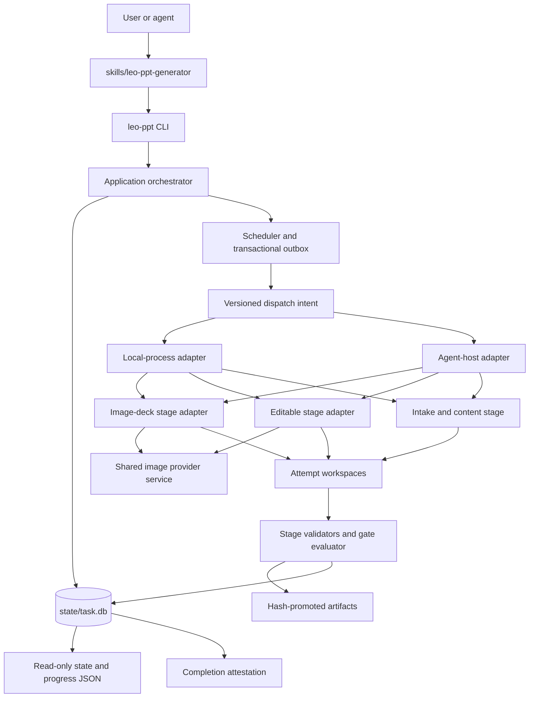
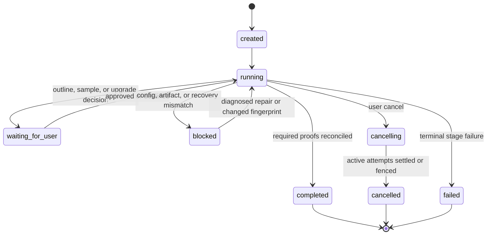

# PPT Orchestration Skill - Plan

## Goal Capsule

- **Objective:** 为个人或企业内部 PPT 生产者提供一个统一的 PPT skill 产品，把 `codex-ppt` 与 `image-to-editable-ppt` 的源码能力集成进当前项目并重新编排，先把内容或视觉材料变成高质量图片式 PPT，再按需将整套或指定页面重建为对象级可编辑 PPT。
- **Recommended approach:** 新建一个 Python package、一个 `leo-ppt` CLI 和一个仓库拥有的 `skills/leo-ppt-generator/` skill surface；以 SQLite 事务库作为唯一任务写模型，以统一 scheduler 管理所有 slide/page/local work，并把两个上游的生成与重建算法改造成无状态 stage adapters。
- **Authority hierarchy:** Product Contract 决定产品行为；本 Planning Contract 决定实现边界；目标仓库源码、契约和测试决定完成证据。两个上游仓库只提供固定版本的导入依据，不再拥有运行时事实。
- **Decision focus:** 单一 runtime、canonical state、租约与 fencing、配置和凭据迁移、产物哈希链、阶段验收、URL 安全及上游同步。
- **Verification focus:** 先用上游行为 characterization 固定能力，再验证状态不变量、并发竞态、图片版完整性、可编辑页对象来源、跨阶段恢复和真实云端最小 smoke。
- **Largest risk:** 状态事务与文件产物不能天然原子，外部 agent 生命周期也不能被本地进程完全事务化；采用 attempt 沙箱、transactional outbox、fencing token、哈希晋级和启动 reconciliation 限制该风险。
- **Stop conditions:** Product Contract 发生范围变化、无法从干净 Git tree 固定上游来源、canonical state 与产物哈希不一致、凭据只能明文落盘，或 required proof 缺失时停止推进，不以旧 runtime 或手改状态降级绕过。
- **Execution profile:** Deep 软件实施计划，共 8 个依赖有序的 Implementation Units；第一版保持单人单项目、CLI/skill 交互，不建设网页端或桌面端。
- **Tail ownership:** `spec-work` 或人工实现者按 U-ID 执行；完成判定以 Verification Contract 和 Definition of Done 为准，计划文件本身不记录实施进度。

## Product Contract

### Summary

上层 skill 统一接收主题、公开文章链接、文字稿、详细 PPT 内容稿、PPT/PPTX、PDF、截图和图片等输入，先完成运行就绪检查与输入分流，再通过内容澄清和大纲确认生成图片式 PPT；用户确认视觉结果后，可选择整套或指定页面升级为可编辑 PPT。

### Problem Frame

现有两个底层 skill 分别解决“从内容生成整页图片式 PPT”和“从视觉页面重建对象级可编辑 PPT”，但用户需要自己理解两个入口、判断何时切换，并承担不必要的配置和流程决策。

第一版的核心价值不是提供一个完整的桌面或网页工作台，而是验证一条低决策成本的生产路径：先快速得到可用的视觉初稿，确认值得继续后，再投入更高成本做可编辑重建。

### Key Decisions

- **D1. 单一 runtime 源码合并：** 当前项目吸收两个 skill 的必要源码能力，并由一个可安装、可诊断、可升级的 runtime 统一拥有入口、配置、状态、调度和产物生命周期；原有 runtime 不再作为主流程中的独立事实来源。
- **D2. 图片初稿优先：** 生成图片式 PPT 是默认第一交付；可编辑重建只有在用户确认后触发。
- **D3. 配置按需检查：** 只生成图片版时只检查图片生成能力；用户选择可编辑升级时再检查 OCR、页面重建和图片编辑能力。
- **D4. 单人单项目：** 第一版不引入多人协作、评论、审批、项目历史或复杂工作台。
- **D5. 公开链接边界：** 外部文章只支持无需登录、无需付费墙且可正常读取的公开链接。
- **D6. 多类输入统一分流：** 文字内容和已有视觉页面同时支持；已有页面可以作为转换源，也可以作为视觉参考，不能默认混为同一种输入。
- **D7. 共享配置与产物规范：** 集成后的能力必须共享统一的用户级配置边界、任务级状态和过程产物目录规范，避免两个底层能力各自生成互不关联的配置、缓存和结果。
- **D8. 统一编排与进度监控：** 当前项目必须拥有一套跨图片生成和可编辑重建的任务流程、状态和进度视图；底层能力的内部状态只能映射到这套统一编排，不得形成两套互相矛盾的用户进度。
- **D9. 单一状态权威：** 每个任务只有一个 canonical task state；slide/page 子任务可以保留内部粒度，但只能作为该任务状态下的子记录，不能独立决定任务是否完成。
- **D10. 单一调度权威：** 所有 slide worker、page worker、本地主 agent 任务、重试、取消和并发额度都由统一调度器分配并记录，底层模块不得自行派发未登记任务。
- **D11. 分层验收：** 图片版和可编辑版分别拥有阶段验收门；用户选择不升级时，图片版可作为最终交付，用户选择升级时，只有可编辑重建及 deck 校验通过后才能声称可编辑交付完成。
- **D12. 可追踪的上游治理：** 两个来源仓库的许可证、版本快照、引入文件、保留契约、本地修改和后续同步必须进入可审计账本，禁止无法回源的源码复制。

### Actors

- **A1. PPT 生产者：** 提供主题、文章、文字稿或页面文件，确认内容大纲、视觉样张和是否升级可编辑版。
- **A2. 上层编排 skill：** 执行运行就绪检查、输入识别、内容澄清、路由、阶段状态和用户提示。
- **A3. 集成后的图片式 PPT 能力：** 根据确认后的内容和视觉决策生成图片式 PPT、页面图片、演讲稿和 PPTX；其行为来源于 `codex-ppt` 的源码能力。
- **A4. 集成后的可编辑重建能力：** 根据图片/PDF/PPTX 页面重建文本框、简单形状和独立图片资产，并执行页面和 deck 校验；其行为来源于 `image-to-editable-ppt` 的源码能力。
- **A5. 外部文章来源：** 提供公开正文和来源信息；抓取失败或内容不完整时不得被假设为已读取。

### Key Flows

#### F1. 运行就绪与按需配置

- **Trigger:** 用户开始一个新任务。
- **Steps:** 检查统一入口、集成后的两个能力、当前阶段所需的图片后端和运行时；读取共享配置边界；展示可用、缺失或需补充的状态；仅在当前路径需要时引导配置。
- **Outcome:** 用户知道任务能否开始，以及缺失配置会阻塞哪一阶段；配置不会因底层能力切换而重复要求或分散存储。

#### F2. 主题或文字内容输入

- **Trigger:** 用户提供主题、公开文章链接、文字初稿或详细 PPT 内容稿。
- **Steps:** 提取可用内容，识别信息完整度；信息不足时询问目标听众、分享目的、核心结论、时长/页数、素材和必须包含内容；形成大纲和待确认项。
- **Outcome:** 用户确认一份可用于视觉生成的内容结构；原始事实、术语和用户明确要求不得被静默改写。

#### F3. 已有视觉页面输入

- **Trigger:** 用户提供 PPT/PPTX、PDF、截图或图片版幻灯片。
- **Steps:** 判断用户是要生成新视觉稿、把页面作为视觉参考，还是直接重建可编辑版本；保留页面顺序和可用备注信息；缺少目标时询问一次并路由到对应阶段。
- **Outcome:** 页面文件不会被错误地当成文字内容稿或被无条件覆盖。

#### F4. 图片式 PPT 生成

- **Trigger:** 内容结构和生成所需的视觉决策已确认。
- **Steps:** 进入集成后的图片式 PPT能力所保留的大纲、风格、图片后端、样张、全量生成和质量检查流程；输出图片式 PPT 和其相关交付物。
- **Outcome:** 用户先获得可审阅、可分享的视觉初稿。

#### F5. 可选可编辑升级

- **Trigger:** 图片式 PPT 已生成，用户选择继续编辑。
- **Steps:** 说明可编辑重建的范围和额外成本；让用户选择整套或指定页面；按需检查 editable runtime/OCR/image backend；进入集成后的可编辑重建能力并报告结构验证结果。
- **Outcome:** 输出与原图片版关联的可编辑 PPT；复杂视觉元素的图片资产边界和任何警告可见。

#### F6. 失败与降级

- **Trigger:** 公开链接不可读取、配置缺失、图片后端失败、页面重建失败或用户取消。
- **Steps:** 指明失败阶段和影响范围；保留已完成的阶段产物；提供补充材料、修复配置、重试当前阶段或结束任务的选择；不得把未完成阶段伪装成成功。
- **Outcome:** 用户可以从最近的有效阶段继续，而不是重复整个任务或误用不完整结果。

### Requirements

#### 输入与分流

- R1. 上层 skill 必须支持主题、公开文章链接、文字内容初稿、详细 PPT 内容稿、PPT/PPTX、PDF、截图和图片作为输入。
- R2. 上层 skill 必须在处理前识别输入的内容来源和视觉来源，并允许一次任务同时存在两类来源。
- R3. 对公开文章链接，系统必须保留来源信息并在无法完整读取时明确报告，不得声称已经读取未获得的正文。
- R4. 对文字内容输入，系统必须根据完整度选择直接结构化、补充澄清或大纲确认路径。
- R5. 对已有页面文件，系统必须区分“生成新稿”“作为视觉参考”和“直接转可编辑”三种意图。

#### 内容澄清与生成

- R6. 当用户只提供主题或内容不足以形成可靠大纲时，系统必须先询问目标听众、分享目的、核心结论、页数/时长和必要素材中会影响生成的最小问题集。
- R7. 系统必须在进入集成后的图片生成阶段前展示可确认的大纲、页面结构、必需素材和待补充项。
- R8. 对详细内容稿，系统必须优先保留用户提供的事实、术语和结论，只对影响生成的歧义发起澄清。
- R9. 集成后的图片生成阶段完成后，系统必须把图片式 PPT 作为独立可交付阶段报告给用户。

#### 阶段升级与可编辑边界

- R10. 系统不得默认触发可编辑重建，必须在图片式 PPT 交付后取得用户选择。
- R11. 用户选择升级时，系统必须支持整套页面或指定页面两种范围。
- R12. 系统必须在升级前说明可编辑重建主要覆盖文本框、简单形状和独立图片资产，不能承诺所有复杂视觉元素都成为原生 PowerPoint 对象。
- R13. 集成后的可编辑阶段必须保留 `image-to-editable-ppt` 的页面决策、manifest、record 和 finalize 校验语义，不得用整页截图叠加少量文字框冒充可编辑结果。

#### 配置与任务状态

- R14. 系统必须区分一次性运行环境配置和当前任务配置，并仅在当前路径需要时要求用户补充图片后端、OCR 或其他凭据。
- R15. 系统必须展示当前阶段的就绪状态、缺失依赖和对应阻塞范围。
- R16. 系统必须保留图片生成阶段和可编辑重建阶段的关联，以及每个阶段的完成、失败、取消和可恢复状态。
- R17. 任何阶段失败时，系统必须报告具体阶段、影响页面或输入、证据位置和可执行的恢复选项。

#### 源码集成与统一入口

- R18. 当前项目必须交付一个统一可发现的 skill 入口，用户不需要分别安装、选择或理解两个底层 skill 才能完成主流程。
- R19. 当前项目必须纳入两个底层 skill 的必要源码能力，并由当前项目的单一 runtime 重新编排其输入、阶段和产物边界。
- R20. 源码集成不得静默削弱既有的图片后端约束、页面重建决策、状态记录、结构校验和失败处理语义；任何有意变化必须成为后续计划中的显式决策。

#### 共享配置与过程产物

- R21. 集成后的图片生成、内容处理和可编辑重建能力必须从统一的共享配置边界读取用户级凭据、后端选择和运行时设置，禁止同一配置在多个底层位置形成互相漂移的副本。
- R22. 每次任务必须拥有可识别的任务级产物根目录，并按输入、内容结构、大纲、图片式 PPT、可编辑重建和验证结果区分过程产物。
- R23. 过程产物目录必须保留阶段之间的来源关联、状态、媒体来源和验证证据，使任务可以从最近的有效阶段继续，而不必重复已经完成的阶段。
- R24. 最终交付物、临时缓存、失败尝试和用户可复用素材必须有明确的归属和清理边界；临时失败产物不得冒充最终结果。
- R25. 目录结构和配置规范必须由当前项目统一拥有，底层集成能力不得各自引入无法被上层任务状态识别的私有产物布局。

#### 统一编排与进度监控

- R26. 当前项目必须为每次任务维护一套统一的阶段流程，覆盖输入准备、内容澄清、大纲确认、图片式 PPT 生成、用户升级选择、可编辑重建、验证和交付。
- R27. 用户可见的任务状态必须来自统一编排状态，而不是分别展示两个底层能力的独立状态。
- R28. 进度监控必须区分未开始、进行中、等待用户、配置阻塞、失败、可恢复和已完成等状态，并标明当前阻塞属于哪个阶段。
- R29. 统一编排必须允许在图片版完成后暂停，等待用户决定是否进入可编辑阶段；等待期间不得被误报为失败或完成。
- R30. 统一编排必须支持从最近的有效阶段恢复，并在恢复时复用已记录的过程产物和验证证据，避免无意义地重复整个任务。
- R31. 底层能力的内部重试、页面级任务和并发状态必须映射回统一任务进度，且不能绕过统一的失败、取消和交付判定。

#### 单一 Runtime Contract

- R32. 当前项目必须只向用户和 agent 暴露一套安装、检查、配置、任务推进和诊断入口，主流程不得要求用户另行操作旧 runtime。
- R33. 单一 runtime 必须成为输入规范化、内容生成、图片生成、可编辑重建、验证和最终交付的生命周期 owner。
- R34. 集成模块可以保留内部能力边界，但不得直接维护与 canonical task state 竞争的任务级状态、配置副本或最终交付判定。
- R35. 旧 runtime 的配置和产物只能通过受控迁移或兼容读取进入新 runtime，迁移后不得对新旧位置双写。
- R36. runtime 必须提供统一的 readiness/doctor 结果，并区分当前任务必需能力、可选升级能力和已知降级能力。

#### State Contract

- R37. 每个任务必须有一个 canonical task state，记录当前阶段、用户决策、子任务摘要、阻塞、恢复点、交付变体和完整历史。
- R38. canonical task state 只能由统一 runtime 通过受控状态转换修改，禁止 worker、底层模块或人工直接改写任务完成状态。
- R39. slide/page 子任务必须拥有稳定标识并关联到父任务、所属阶段、输入、输出、worker、尝试次数和验证结果。
- R40. 等待大纲确认、样张确认或可编辑升级选择必须使用明确的 `waiting_for_user` 语义，不得占用执行租约或被解释为失败。
- R41. `completed` 必须携带明确交付变体：图片版完成或可编辑版完成；选择升级后的任务在可编辑验收前不得降格为图片版完成来掩盖失败。
- R42. 任务恢复必须根据已记录状态和产物哈希确认可复用范围；状态与产物不一致时必须进入可诊断的阻塞状态，而不是猜测继续。

#### Configuration Contract

- R43. runtime 必须拥有一个 canonical user configuration authority，统一管理图片后端、模型、API endpoint、OCR、运行时偏好和非敏感默认值。
- R44. 配置解析优先级必须固定并可解释，遵循本次任务显式选择、受支持的环境变量、用户级配置、内置默认值的顺序。
- R45. 凭据不得写入任务目录、prompt、manifest、日志或诊断报告；任何面向用户的输出必须遮蔽敏感值。
- R46. 配置检查必须按阶段延迟执行，未选择可编辑升级的任务不得因 OCR 或可编辑专属配置缺失而阻塞图片版生成。
- R47. 从旧 `codex-ppt` 与 `editppt` 配置导入时必须报告来源、映射、冲突和结果；冲突不得静默选择，成功迁移后不得继续依赖旧配置作为并列事实来源。
- R48. 用户自定义风格等可复用非敏感资产必须与凭据配置分离，并具有独立的保留、升级和删除语义。

#### Scheduling Contract

- R49. 统一调度器必须管理所有生成页、重建页和本地执行单元的队列、并发额度、租约、取消、重试和结果记录。
- R50. 调度器不得对同一阶段和同一工作单元重复派发有效租约；重新派发必须有终止、取消、租约失效或已确认失败的证据。
- R51. 重试必须保留失败尝试和根因，并且只有在输入、配置、prompt、后端或运行条件发生相关变化后才能再次执行同一失败单元。
- R52. 用户取消必须停止新的任务派发，并把已运行单元的结果、未完成单元和可恢复点写回 canonical task state。
- R53. 页面内要求串行的图片编辑与素材处理不得被全局并发策略打乱；不同页面或 slide 的并发必须受统一额度约束。
- R54. worker 返回结果不能直接成为最终产物，必须经过统一记录、来源校验和阶段验收后才能进入正式目录。

#### Acceptance Contract

- R55. runtime readiness 验收必须证明当前路径所需依赖可用，并把可选能力缺失与主流程阻塞分开报告。
- R56. 内容阶段验收必须证明输入来源已记录、大纲已获用户确认、必需素材已映射、未解决缺口已显式披露。
- R57. 图片版验收必须证明预期页面齐全、后端来源可追踪、样张方法被继承、逐页 QA 完成且 PPTX 可打开。
- R58. 可编辑版验收必须证明每个选定页面由可重建 manifest 驱动、页面验证通过、最终 deck 页序和媒体关系正确，并且不存在整页源图叠加少量文字框的伪可编辑模式。
- R59. 图片版与可编辑版之间必须执行逐页对照；文字缺失、布局溢出、关键对象丢失、背景明显漂移和错误对象来源属于必须修复的问题，低风险装饰差异才可以作为 warning 交付。
- R60. 任何阶段未通过其必需验收门时，统一 runtime 不得把相应交付变体标记为完成。

#### Upstream Governance Contract

- R61. 当前项目必须维护两个来源仓库的 provenance ledger，至少记录来源 URL、许可证、引入版本或 commit、引入文件范围、本地修改和当前 owner。
- R62. 所有复制或修改的上游源码和实质性文档必须保留适用的 MIT 版权及许可证声明。
- R63. 上游同步必须先形成版本差异和文件账本，再分别判断安全修复、行为变化、契约变化和本地冲突，禁止无审查覆盖本地集成代码。
- R64. 上游原有的关键测试、fixture 和质量契约必须迁移或建立等价验证；缺失覆盖的上游行为不得被宣称为已保留。
- R65. 当前项目对统一 runtime 和产品行为拥有最终责任；上游更新是输入证据，不得自动覆盖当前项目已经确认的 Product Contract。
- R66. 不再使用的上游模块必须在账本中标记淘汰原因和替代能力，避免残留两套可被误调用的 runtime 路径。

### Acceptance Examples

- AE1. **主题输入：** Given 用户只提供“AI First 汇报”主题，when 没有足够的听众、目的和核心结论信息，then 系统先进行最小内容澄清，不直接调用图片生成。
- AE2. **公开文章：** Given 用户提供无需登录的公开文章链接，when 正文可读取，then 系统提取正文和来源后生成可确认的大纲；when 页面被付费墙或登录拦截，then 系统报告不可读取并要求用户提供正文或替代来源。
- AE3. **文字初稿：** Given 用户上传 Markdown 或 Word 内容初稿，when 内容足以形成页面结构，then 系统保留其事实和术语，展示结构化大纲供确认。
- AE4. **详细内容稿：** Given 用户上传逐页 PPT 内容稿，when 只有少量页面信息含糊，then 系统只询问这些歧义，不重新创作整套内容。
- AE5. **已有页面：** Given 用户上传图片版 PPT，when 用户要求直接转可编辑，then 系统跳过新稿生成，进入集成后的可编辑重建阶段；when 用户要求基于其风格重新创作，then 系统把页面作为视觉参考而不是直接转换源。
- AE6. **按需升级：** Given 图片式 PPT 已交付，when 用户选择指定第 2、5 页转可编辑，then 系统只对这些页面执行升级并报告其余页面仍为图片式结果。
- AE7. **失败恢复：** Given 图片版已完成但可编辑阶段 OCR 或图片后端失败，then 系统保留图片版产物，明确可编辑阶段未完成，并提供配置修复或重试当前阶段的选择。
- AE8. **单一状态：** Given 图片页生成任务和可编辑页面任务同时存在，when 用户查看进度，then 系统从 canonical task state 展示一个总阶段和可追踪的子任务明细，而不是返回两套互相冲突的完成状态。
- AE9. **等待用户：** Given 图片版已经通过验收，when 系统等待用户决定是否升级，then 任务进入 `waiting_for_user`，不继续派发 page worker，也不占用执行租约。
- AE10. **旧配置迁移：** Given 用户机器同时存在旧 `.codex-ppt-skill` 和 `.editppt` 配置，when 新 runtime 首次迁移，then 系统展示字段映射和冲突，写入 canonical 配置后停止对旧位置双写。
- AE11. **重复派发保护：** Given 某页面 worker 仍持有有效租约，when 调度器再次评估待办任务，then 不得为同一工作单元创建第二个 worker；只有终止、取消、失效或失败证据成立后才能重派。
- AE12. **验收隔离：** Given 用户只需要图片版，when 图片版验收通过而 OCR 未配置，then 任务可以以图片版交付完成；when 用户随后选择可编辑升级，then OCR/readiness 检查只阻塞新增的可编辑阶段。
- AE13. **防止伪可编辑：** Given 可编辑 PPTX 可以打开但页面仍是整页源图叠加少量文字框，when 执行可编辑验收，then 该页面必须失败，不能以 warning 或完成状态交付。
- AE14. **上游同步：** Given 某来源仓库发布新版本，when 维护者准备同步，then 必须先产出来源版本和文件差异账本，并在回归验证通过后才更新当前项目的上游快照记录。

### Success Criteria

- 用户可以用主题、文字稿、公开文章链接或已有页面文件启动任务，而无需理解两个底层 skill 的内部名称和命令。
- 用户在图片生成前能确认内容结构，在图片生成后能明确选择是否承担可编辑重建成本。
- 只生成图片版的任务不会被不必要的 OCR 或可编辑后端配置阻塞。
- 失败任务不会丢失已经完成的阶段产物，也不会把未完成阶段报告为成功。
- 生成结果和可编辑升级结果之间保留清晰的来源和阶段关系。
- 用户只需要安装和操作当前项目的一套 runtime，不需要额外管理旧 `codex-ppt` 或 `editppt` runtime。
- 任一任务的总状态、子任务、进度、阻塞和交付判定都能追溯到同一个 canonical task state。
- 配置迁移后不存在新旧配置双写，任务产物中不存在明文凭据。
- 同一有效工作单元不会因轮询、恢复或并发补位而被重复派发。
- 图片版与可编辑版分别通过其阶段验收，且不会把结构有效但对象来源违规的 PPTX 宣称为可编辑成功。
- 每次上游同步都能回溯来源版本、文件范围、本地改动、验证结果和保留的许可证信息。

### Scope Boundaries

#### Deferred for later

- 登录后文章、付费墙文章和内部链接。
- 多人协作、评论、审批、项目历史和批量项目管理。
- 桌面端、网页工作台和跨设备同步界面。
- 企业内网、本地-only 运行和本地 PowerPoint 深度集成。
- 自动事实核查、完整演讲训练和内容研究代理。

#### Outside this product's identity

- 以纯手工 PowerPoint 编辑器或通用在线文档编辑器为核心的产品。
- 以所有复杂视觉元素 100% 原生可编辑为承诺的完美重绘工具。

### Dependencies / Assumptions

- 两个 skill 的 MIT 源码、运行时和相关文档可以在保留版权及许可声明的前提下纳入当前项目，并允许重新编排其入口和状态边界。
- 云端图片生成和必要的 OCR/图片编辑能力在任务对应阶段可用；具体后端、凭据和配额属于后续规划与运行时验证范围。
- 公开文章抓取能力只对无需登录、无需付费墙且可正常读取的 URL 提供保证。
- 用户能够在大纲确认和可编辑升级两个关键节点做出选择。
- 复杂视觉资产在可编辑版中可能仍以独立图片存在，这是产品边界而非异常。
- 单一 runtime 可以保留生成、重建、OCR、图片后端和文档处理等内部模块边界；“单一”约束的是事实来源和操作入口，而不是要求所有代码进入一个不可分层的模块。

### Outstanding Questions

#### Deferred to Planning

- 单一 runtime 的包、模块、命令和内部适配边界如何组织。
- canonical task state、子任务记录和状态转换的具体 schema 与持久化方式。
- 调度器如何实现租约、并发额度、取消传播、重试和进程恢复。
- canonical 用户级配置的具体位置、密钥存储机制、环境变量兼容和一次性迁移实现。
- 任务产物根目录及阶段子目录的具体命名、保留周期、缓存复用、哈希和清理实现。
- 图片版与可编辑版逐页对照采用哪些自动指标和人工判断，warning 阈值如何校准。
- provenance ledger、上游版本锁定、同步脚本和回归矩阵的具体实现。
- 公开文章正文提取、图片下载和来源记录的具体运行时策略。

### Sources / Research

- `codex-ppt` skill documentation, observed 2026-08-20: https://github.com/ningzimu/codex-ppt-skill — establishes image-based slide generation, approval gates, backend selection, slide QA and speaker-note assembly.
- `image-to-editable-ppt` skill documentation, observed 2026-08-20: https://github.com/ningzimu/image-to-editable-ppt-skill — establishes visual-input normalization, page reconstruction, editable-object boundaries, OCR/image backend policy and deterministic validation.
- Current target repository snapshot, observed 2026-08-20: contains workflow governance files but no existing product implementation; implementation assumptions remain for `spec-plan` to verify.

---

## Planning Contract

Product Contract unchanged (byte-preserved upstream source slice).

### Implementation Summary

实现采用一个仓库拥有的 Python package、一个 `leo-ppt` CLI 和一个轻量 skill surface。CLI 是人和 agent 的唯一受控入口；Python package 持有输入、内容、图片生成、可编辑重建、状态、调度、配置和验收逻辑；skill 只描述交互与调用契约，不复制 runtime 规则。

任务状态写入 SQLite，文件系统保存大体积输入、attempt 产物、正式产物和验证报告。图片生成与可编辑重建保留独立领域边界，但只能通过统一 scheduler 取得工作、通过统一 record/validation 入口提交结果，不能再写 `slide_run_state.json`、`page_jobs.json` 或其他竞争状态。

### Key Technical Decisions

- KTD1. **建立新的单一 runtime owner。** 架构 posture 为 `new + reuse/extend`：`src/leo_ppt_generator/` 新建控制面、状态、调度和配置 owner；从两个上游固定 commit 复用并改造图片生成、PPTX 组装、输入归一化、manifest 构建、OCR、资产处理和校验算法。拒绝薄包装两个旧 CLI，因为它会保留两套状态、配置、重试和完成判定。
- KTD2. **SQLite 是唯一任务写模型，JSON 只做投影。** 每个任务的 `state/task.db` 使用 SQLite WAL、外键、约束、事务和 schema migration；`state/task_state.json` 与 `reports/progress.json` 由 runtime 原子重建，删除后可恢复。运行中数据库的备份只能在停止新 mutation、处理 active lease 后通过 SQLite Online Backup API 生成，并在迁移或恢复前执行完整性、schema 和哈希校验；禁止只复制活动的 `task.db`。拒绝继续合并多份 JSON，因为 editable 上游直接 `write_text`，并发 record 会丢更新；codex 上游即使有 FileLock，也会在 jobs 与 run state 之间产生跨文件分裂。
- KTD3. **任务阶段与运行状态正交。** `stage` 使用 `readiness → input_normalization → content_clarification → outline_approval → visual_sample_approval → image_generation → image_acceptance → editable_choice → editable_reconstruction → final_acceptance → delivery`；`status` 使用 `created | running | waiting_for_user | blocked | cancelling | cancelled | failed | completed`。`completed` 必须绑定 `delivery_variant=image|editable|hybrid` 和 completion attestation；只有全部页面通过 editable gate 才能声明 `editable`，指定页面升级必须声明 `hybrid`，选择升级后未通过适用 gate 时不得改写为图片版完成。
- KTD4. **统一 scheduler 使用事务 outbox、attempt 和 fencing lease。** scheduler 在同一事务中检查依赖与全局/类型额度，创建不可变 attempt、dispatch intent、lease 和 outbox；execution adapter 再激活 local-process 或 agent-host worker 并确认 handle。`task next` 只返回版本化 dispatch intent；agent-host 必须通过 `activate → heartbeat/record → terminal` 协议回写，不得由 Python runtime 假定自己能直接调用宿主 subagent 或 image tool。worker 结果必须匹配 `attempt_id + fencing_token + input_hash`；迟到结果进入 quarantine，不能覆盖正式产物。租约超时只标记 `suspect`，需终态、重复不可达且无进度或可靠 fencing 证据后才能 revoke 和重派。
- KTD5. **状态与文件以 attempt 沙箱和哈希晋级连接。** worker 只能写 `work/<stage>/<unit>/attempt_<n>/`。runtime 先验证文件、来源、哈希和当前 lease，再原子晋级到 `artifacts/`；DB 记录 promotion intent 并在启动时 reconciliation。重试追加 attempt，不清空旧 prompt、配置指纹、失败原因或验证结果。
- KTD6. **配置和凭据只有一个 authority。** `${LEO_PPT_HOME}` 可覆盖基于 `platformdirs` 的用户配置根；非敏感配置存 `config.yaml`，secret 只保存 key reference，值来自任务显式运行时选择、受支持环境变量、OS credential store 或受控只读外部 resolver。`CODEX_AUTH_FILE` 是只读外部 credential reference：runtime 不复制其中 token，只验证文件存在性、格式、权限和可判断的过期状态。CLI 禁止通过参数接收 secret。旧 `.codex-ppt-skill/.env` 与 `.editppt/config.yaml` 仅由 `config migrate --dry-run|--apply` 一次性只读导入，成功后不再读取或双写旧位置，也不自动删除旧文件。
- KTD7. **一个 image service，按 job kind 约束能力和最小披露。** 合并 codex 上游的 provider abstraction、AtlasCloud/OpenAI-compatible 支持和 editable 上游的 Codex OAuth、重建输入/fallback 语义；全页 slide job 可跨页并发，同一 editable page 内的 image edit、分离和处理必须按依赖串行。每种 job kind 使用 versioned payload schema 和数据类别 allowlist，只发送完成该操作所需的文本、图像或引用；provider、模型、精确 credential origin、允许的数据类别、输入/输出哈希进入脱敏指纹及 provenance，不允许底层模块自行选择另一 backend。
- KTD8. **可编辑页面的 `manifest.json` 保留为页面构建权威，但不是任务状态。** `contracts/editable-page-manifest.schema.json` 固定跨模块字段和版本；builder、page validator 与 finalizer 都只消费已记录且哈希匹配的 manifest。正式 deck 在 finalize 前重新计算 manifest、asset 和 notes hash，消除 record 后篡改的 TOCTOU 缺口。
- KTD9. **阶段验收采用 G0–G7 required-proof gates。** 图片版和 editable/hybrid 版分别完成；结构、对象来源、文字完整性、视觉比较和用户确认是不同 proof。唯一完成转换由 gate evaluator 在事务中写入，并生成绑定 task revision、validator version、proof hashes 和最终产物 hash 的 `completion_attestation.json`。
- KTD10. **外部文章抓取是受限输入适配器。** 只允许公开 `http/https`，每次 redirect 都重做 DNS/IP 校验，拒绝 loopback、private、link-local、metadata endpoint、凭据 URL 和非允许 scheme；限制跳转、时间、响应大小、MIME 和子资源数量，不携带 cookie 或认证。网页内容视为 untrusted data，不能通过正文指令改变工具、配置或工作流。
- KTD11. **上游同步使用 clean-tree provenance ledger。** 只从固定 commit 的 Git tree 导入，不从 dirty working tree 复制。`third_party/upstreams.yaml` 记录来源、commit、license 和 dirty policy；`third_party/path-map.yaml` 逐文件记录 verbatim/adapted/reimplemented/reference-only/retired、blob hash、target、owner 和回归测试。同步必须先 staging、diff、ledger 校验和回归，再更新 pin；禁止 blind rsync 或 subtree 覆盖。
- KTD12. **安全边界由 runtime 强制，prompt 只做 best-effort 治理。** worker prompt 可以提醒最小权限和写入范围，但不能作为凭据、输入或状态隔离的证明。runtime 必须只提供 allowlisted 输入引用和 attempt 写目录，不把 DB 或 credential handle 暴露给 worker，并在结果晋级前验证 envelope、文件 containment、哈希和 provenance；宿主未提供可验证隔离时记录 `worker_isolation=unproven`，不得声称 worker 已被沙箱化。
- KTD13. **Office 输入按不可信主动内容处理。** PPT/PPTX 摄取在解析或转换前拒绝 VBA、OLE、DDE、外部 relationships 和远程 media；需要外部 converter 时使用无网络、受限工作目录、no-follow 文件访问以及 CPU、内存和时间上限。提取失败保留 blocked reason 和原始哈希，不通过打开文件或下载远程依赖继续猜测。
- KTD14. **Provider endpoint 与 credential 绑定同一信任策略。** 自定义 endpoint 必须解析为经 allowlist/policy 接受的精确 HTTPS origin，启用证书校验；认证请求禁止跨 origin redirect，并在连接及每次 redirect 前抵御 private/link-local/metadata 地址与 DNS rebinding。credential resolver 只向其绑定 origin 提供 secret，不能被 provider adapter、系统代理或响应重定向转发到其他 origin。

### High-Level Technical Design





`waiting_for_user` 必须没有 active lease。图片版验收通过后，任务可以在 `editable_choice/waiting_for_user` 保留一个已接受的 image deliverable；用户明确不升级时才进入 `completed/image`。若用户选择升级，任务只能在 G6/G7 通过后进入 `completed/editable`（全部页面可编辑）或 `completed/hybrid`（仅指定页面可编辑）。

### Output Structure

```text
pyproject.toml
src/leo_ppt_generator/
  cli/
  application/
  domain/
  runtime/state/
  runtime/scheduler/
  runtime/config/
  runtime/workers/
  inputs/
  content/
  image/
  image_deck/
  editable/
  validation/
contracts/
  task-state.schema.json
  worker-envelope.schema.json
  content-document.schema.json
  provider-payload.schema.json
  editable-page-manifest.schema.json
  validation-report.schema.json
  completion-attestation.schema.json
skills/leo-ppt-generator/
  SKILL.md
  prompts/
  references/
  styles/
tests/
  unit/
  contracts/
  integration/
  e2e/
  evals/
  upstream/
  fixtures/
evals/
  cases/
LICENSES/
THIRD_PARTY_NOTICES.md
third_party/
  upstreams.yaml
  path-map.yaml
scripts/
  sync_upstreams.py
  verify_upstreams.py
```

任务运行目录由 `leo-ppt task create` 创建，目录结构固定如下：

```text
<workspace>/<task_id>/
  state/{task.db,task_state.json}
  inputs/{originals/,normalized/,source_manifest.json}
  content/{brief.md,outline.md,deck_spec.json,decisions.json}
  work/<stage>/<unit>/attempt_<n>/
  artifacts/image/{slides/,qa/,deck.pptx}
  artifacts/editable/{selection.json,pages/,qa/,deck.pptx}
  deliverables/
  reports/{progress.json,readiness.json,acceptance.json,completion_attestation.json}
  logs/events.ndjson
```

`state/task.db` 是唯一可写状态；`events.ndjson`、JSON 投影和所有领域 manifest 都不能推进任务状态。正式产物不可被重试就地覆盖。全局缓存不得保存正文、源页或 OCR 全文；第一版不自动删除任务，`task cleanup --dry-run|--apply` 由 runtime 拥有，必须先输出分类范围、拒绝 active lease、执行 no-follow containment，并把脱敏 receipt 写到删除目标之外或保留的 `reports/` 目录。

### Interface Contracts

| Interface / mode | Consumers | Canonical artifact | Contract summary | Compatibility | Verification owner |
| --- | --- | --- | --- | --- | --- |
| `leo-ppt` CLI / greenfield | skill、用户、自动化执行器 | `src/leo_ppt_generator/cli/`，U1/U4 | `doctor/config/task create|next|activate|heartbeat|record|terminal|status|approve|upgrade|cancel|retry|recover|cleanup`；机器模式输出 versioned JSON 和稳定 reason code，错误不通过自由文本传递 | v1 内字段只做 additive；破坏性变更升 schema/major version；旧 `editppt` 与脚本入口不作并列兼容 | `tests/contracts/test_cli_contract.py` |
| Task state / greenfield | orchestrator、scheduler、progress、gate evaluator | `src/leo_ppt_generator/runtime/state/migrations/` 与 `contracts/task-state.schema.json`，U2 | DB 是写模型；JSON schema 描述只读投影；mutation 使用 expected revision；事件具有单调 seq、actor、reason 和 evidence refs | forward-only migration；迁移前停止新 mutation 并用 SQLite Online Backup API 生成、校验和记录备份；较旧 runtime 遇到新 schema 必须拒绝启动 | `tests/unit/state/` 与 `tests/contracts/test_task_state_schema.py` |
| Worker dispatch and result / greenfield | scheduler、local-process adapter、agent host、slide/page worker | `contracts/worker-envelope.schema.json`，U4 | `task next` 返回 dispatch intent；`activate/heartbeat/record/terminal` 固定 attempt、lease、fencing、input/prompt/config hash、allowed input refs/write scope、outputs、hashes、validation refs 和终态 | v1 additive；未知 required field 或版本 fail closed；每次回写幂等；迟到旧 token 只归档 | `tests/contracts/test_worker_envelope.py` 与 `tests/integration/test_agent_host_adapter.py` |
| Content document / greenfield | input router、clarifier、outline、direct-editable router | `contracts/content-document.schema.json`，U5 | Markdown、DOCX 和 PPTX 统一为有序 block/page；每段、标题、表格单元和 speaker note 保留 source locator、用途和原始 hash | schema v1 additive；无法保真的元素标 unsupported/partial，不静默丢弃或臆造顺序 | `tests/contracts/test_content_document_schema.py` |
| Provider job payload / greenfield | image planner、provider transport、spy provider、privacy report | `contracts/provider-payload.schema.json`，U6 | 每个 job kind 固定 schema version、数据类别 allowlist、精确 endpoint origin、credential reference 和 payload hash；未声明字段 fail closed | 新字段先升级 schema/allowlist；provider adapter 不得透传任意 task/context 字典 | `tests/contracts/test_provider_payload.py` 与 `tests/unit/image/test_minimum_disclosure.py` |
| Editable page manifest / evolution | editable planner、builder、validator、finalizer | `contracts/editable-page-manifest.schema.json`，U7 | 保留上游 `manifest.json` 的 slide/content box、object coordinates、inventory、asset provenance 和 quality checks；新增 page mode、source hashes 和 validator version | 从上游 schema v1 显式迁移；不接受缺坐标、缺 top-level pass 或不明对象来源 | `tests/contracts/test_manifest_compat.py` |
| Validation and completion / greenfield | stage validators、gate evaluator、status/report | `contracts/validation-report.schema.json` 与 `contracts/completion-attestation.schema.json`，U8 | proof 有 owner、validator version、subject hash、status、severity；attestation 按 `image|editable|hybrid` 解析 required set、逐页 mode 和 selection hash，并绑定最终 artifact | validator 规则变化使旧 proof stale，不静默沿用；hybrid 不兼容降级为 editable | `tests/contracts/test_required_proof_reconciliation.py` |
| Upstream ledger / greenfield | sync script、maintainer、reviewer | `third_party/upstreams.yaml` 与 `third_party/path-map.yaml`，U1 | pin、license、源/目标文件、处置、hash、本地 patch、owner、测试一一对应 | 上游更新必须形成新 diff 和验证记录；删除前需要 retired 原因与替代 owner | `tests/upstream/test_upstream_ledger.py` |

### State, Scheduling, and Recovery Invariants

- `(task_id, unit_id)` 最多一个 active lease；额度检查、attempt 创建、lease、outbox 和状态转换在同一事务完成。
- 每个 mutation 携带 expected task revision；状态转换、事件追加和进度聚合在同一事务提交。
- work unit 依次经历 `pending → dispatch_intent → leased → running → result_submitted → validating → succeeded`；失败、取消、suspect 和 revoked 是显式分支，`accepted` 是 validation/gate 结果而非执行状态。
- `task next` 不直接假定执行能力，只签发可幂等领取的 dispatch intent。local-process 与 agent-host adapter 都必须以当前 fencing token 调用 `activate`，定期 `heartbeat`，通过 `record` 提交候选产物，并用 `terminal` 结束 attempt；缺步、乱序或旧 token 回写 fail closed。
- prompt 中的写入范围只是 best-effort 提醒。runtime 通过只读输入引用、无 DB/credential handle、attempt 目录 containment 和产物晋级校验强制边界；宿主隔离无法验证时把 `worker_isolation=unproven` 写入 attempt/proof limitation。
- `cancelling/cancelled` 禁止新 claim。无法撤销的 provider 调用标记 `cancel_requested`；迟到产物隔离，不能使任务自动完成。
- 同 fingerprint 的确定性失败禁止盲重试；瞬态错误只有在分类、退避和 attempt cap 明确时可同 fingerprint 重试。输入、prompt、配置、backend、runtime 或外部条件变化必须进入 retry evidence。
- 下游 unit 保存依赖 artifact hashes；上游内容、决策或样张变化使受影响下游 proof stale。
- 启动恢复顺序为 DB integrity/schema、未完成 outbox、lease/worker reachability、正式产物 hash、projection rebuild。任何无法证明的一致性进入 `blocked/artifact_mismatch`，不猜测继续。
- scheduler 可以通过 `global_max_workers=1` 安全降级，但不得退回旧脚本或旧状态作为第二事实源。

### Acceptance Gates

| Gate | Required proof | Failure behavior |
| --- | --- | --- |
| G0 Stage readiness | runtime/package version、当前阶段依赖、backend capability、可选能力和脱敏配置摘要 | 仅阻塞依赖该能力的阶段；配置存在但网络未验证时标 `unproven` |
| G1 Input | MIME、size、SHA-256、用途、归一化结果；URL 请求/final URL、MIME、正文/HTML hash、extractor/version 和完整性状态；Office 主动内容扫描与 converter sandbox receipt | 非法路径、archive/PPTX zip 风险、VBA/OLE/DDE/外部关系/远程媒体、SSRF、超限或软拦截进入 blocked，不声称已读取 |
| G2 Content | source ledger、outline version/hash、用户确认 event、素材映射和 unresolved gaps | 未确认不得进入视觉生成 |
| G3 Visual contract | style/backend/sample method、样张 hash、用户批准 event；后续 job 必须匹配 backend family 和方法 | 不匹配结果隔离并失败，不自动换 backend |
| G4 Image deck | 预期 slide ID 集合精确相等、每页 hash/backend/attempt/QA、无 active/blocked、PPTX 实际页数/页序/notes 和 render smoke | 缺页、额外页、组装 warning 或 QA hard issue 均失败；通过后可交付 image variant |
| G5 Selected editable pages | versioned manifest、required native text、对象坐标/来源、asset/media hash、page validation、round-trip render comparison | 伪可编辑、文字缺失/溢出、对象来源违规或 hash mismatch hard fail |
| G6 Editable/hybrid deck | record hash 重算、immutable manifests、page mode、页数/页序、notes/media relationships、final hash、open/render smoke | 未选页明确保留 image mode；不得把 hybrid 声称为全套 editable |
| G7 Completion | 当前 task/decision revision 下所有 required proof、用户决策、validator version 和 final artifact hash | 任一 proof missing/failed/stale/hash mismatch 时拒绝 `completed` |

editable 页的自动视觉筛查默认使用同尺寸渲染：全页 SSIM `<0.90` 或用户标记关键区域 `<0.85` 为 hard failure，`0.90–0.95` 为 warning，`>=0.95` 为自动视觉 pass。U8 必须用 golden fixtures 校准阈值；阈值只能帮助筛查，不能覆盖 required text 100% 原生命中、溢出、对象来源、整页栅格或结构错误。

任何覆盖率 `>=98%` 的单一 raster 都要进入整页图检测，不依赖文件名或自述 provenance。editable 页的 required text 必须 100% 以 native text 表达；公式或复杂插画只有逐对象用户批准才能以独立 raster 保留。source OCR boxes 与背景 raster OCR 还需检查 baked-text overlap，避免整页源图改名后叠一个文本框通过。

### Configuration, Privacy, and Network Boundaries

- 配置优先级固定为任务显式非敏感选择、环境变量、用户配置、内置默认值；输出必须解释每个生效值的来源，但 secret 只显示 presence、reference 和不可逆指纹。
- secret 不得进入 CLI argv、任务 DB/投影、prompt、manifest、日志、异常、subprocess command、diagnostic 或 proof。用户配置权限为 0600，拒绝 symlink 覆盖；secret canary 必须扫描全任务目录和诊断包。
- OS credential store 不可用时仅允许环境变量注入，doctor 报告 capability missing；不得回退为明文配置。`CODEX_AUTH_FILE` 只作为外部只读 reference，doctor 独立报告 missing、malformed、unsafe-permissions 和 expired/unverifiable，不复制 token 或把完整路径写入任务。旧明文迁移先 preview mapping/conflict，再写 secret store、验证 reference、写 migration marker，保留旧文件只读并提示用户清理。
- provider credential 绑定精确 HTTPS origin；传输必须校验证书，禁止携带认证跨 origin redirect，并对初始连接和每次 redirect 执行 private/link-local/metadata IP 与 DNS rebinding 防护。系统代理、adapter fallback 或用户自定义 endpoint 都不能放宽该策略。
- 云端处理按阶段记录 provider、job kind、payload schema version、实际上传数据类别、用途和已知 retention；每种 job kind 的 data-class allowlist 默认拒绝无关原文、OCR、内部 prompt、日志和其他页面。spy provider 必须断言真实 request 仅含允许字段。“允许云端”不等于允许把全部原文、源页和 OCR 发送给任意 provider。诊断默认只含脱敏元数据，含正文或图像的 support bundle 必须显式 opt-in。
- 结构化日志使用字段 allowlist；默认禁止正文、OCR、prompt、图片内容、绝对路径和 URL query，路径只记录 task-relative handle 或不可逆 hash，URL 只记录经策略接受且去 query 的 origin。测试必须使用 PII、内部术语、恶意文件名、OCR 和 query canary，而不只扫描 secret。
- URL 抓取不执行正文中的指令，不访问登录态，不使用系统代理凭据绕过边界。200 响应或 extractor 成功不能单独证明正文完整，truncated、paywall-like 或 blocked reason 必须保留。

### Implementation Scope Boundaries

- 产品源码只能进入 `src/`、`contracts/`、`skills/leo-ppt-generator/`、`tests/`、`evals/`、`third_party/`、`LICENSES/` 和受控脚本；`.agents/skills/**` 与 `.codex/**` 是宿主治理/runtime 面，不是产品实现目录。
- `skills/leo-ppt-generator/` 只拥有入口、prompt、reference 和 styles。状态机、CLI 实现、provider、builder 和 validator 必须在 `src/leo_ppt_generator/`，避免 skill 文件成为第二 runtime。
- 第一版不提供 daemon、server、桌面/网页 UI 或多人锁；scheduler 是由 CLI/agent 驱动的本地控制面，但仍使用真实 lease 和事务。
- 不支持旧任务原地继续；若提供导入，只生成新 task id 和 reconciliation report，失败不修改 legacy 目录。
- 旧命令不承诺长期兼容。若实现短期 shim，只能只读提示新命令或单向转发，必须带移除版本且禁止双写。
- 当前目标目录不是 Git repo。开始源码导入前应取得版本化授权并建立 source identity；若仍无 Git，必须以完整文件 hash ledger 替代，但不得声称具备 revision-bound 验证或安全上游同步。

### Evidence & Limitations

- 目标仓库在 2026-08-20 只有治理文件、CHANGELOG 和本计划，没有产品源码、测试、Git identity 或 `.codegraph/`；所有目标路径都是本计划的新 owner，实施时需先验证目录和依赖仍为空。
- `codex-ppt-skill` 固定到 `f2ed80372f65bb05fe62dd07979b239a17ac065d`。其 working tree 对 `CHANGELOG.md`、`docs/README.md`、`docs/_sidebar.md` 有修改，另有未跟踪 `docs/execution-flow.md`；U1 只能从 HEAD tree 导入，不能复制这些用户变更。
- `image-to-editable-ppt-skill` 固定到 `fb869763127fd31ba7288d905671ffc4ea542f60`，研究时 clean。两者均为 MIT，license hash 相同但来源归属必须分别保留。
- codex 上游没有自动化 tests，其样张、backend、逐页 QA 和组装行为只能先建 characterization coverage；不能把文档合同声称为已验证行为。editable 上游 tests 提供强回归起点，但没有证明真实并发写、可执行租约、取消或恢复。
- 当前上游图片组装对缺页可 warning 后继续保存；editable finalize 不重算 record hashes；editable state 直接写 JSON；现有整页图检测依赖部分文件名/provenance 条件。这些缺口分别落入 U6、U7、U2/U4 和 U7 的 must-fix tests。
- 本轮只做本地源码研究，未联网核验第三方库最新版本、provider 政策或 retention。依赖版本在 U1 锁定前需以官方 metadata 验证；该限制不改变接口和安全边界。
- 三个获授权的只读研究视角分别覆盖 runtime/state/scheduler、上游集成、验收/风险；它们提供独立问题发现，但所有结论仍由本计划和实施期 current-source 验证负责。

### Resolved During Planning

| Deferred question | Resolution |
| --- | --- |
| 包、模块、命令和适配边界 | 一个 `leo_ppt_generator` package、一个 `leo-ppt` CLI、一个静态 skill surface；两个能力为内部 stage adapters |
| canonical state 与持久化 | SQLite WAL 写模型、append-only event/attempt、versioned JSON projection |
| 租约、并发、取消、重试和恢复 | transactional outbox、原子 claim、fencing token、suspect/revoke 证据、fingerprint-aware retry |
| 配置与密钥迁移 | platformdirs root + `LEO_PPT_HOME` override；YAML 非敏感配置；env/credential store secret；dry-run/apply 单次迁移 |
| 产物目录、缓存、哈希和清理 | attempt 沙箱、验证后 hash promote、任务显式清理、全局缓存不存敏感内容 |
| 图片与 editable 对照 | G0–G7 gates；硬合同优先，SSIM 仅作视觉筛查并由 golden corpus 校准 |
| provenance 与同步 | clean-tree pin、upstream/path-map ledger、license notices、staging diff 和回归后更新 |
| 公开文章策略 | 安全 fetch adapter、逐 redirect SSRF 防护、完整 provenance、untrusted content 隔离 |

### Deferred / Open Questions

| Concern | Disposition | Owner / trigger |
| --- | --- | --- |
| Product Contract 的 Summary 未概括已由 F3、R5 和 AE5 定义的 direct-editable 路径 | 不在 `spec-plan` 中改写只读 Product Contract；当前实现继续以稳定 R/F/AE 为准，因此这不是 implementation-ready blocker | 返回 `spec-brainstorm` owner；下一次产品契约修订时补齐 Summary，并重新校验所有下游引用 |

### Sequencing and Rollback

U1 建立 package、版本和上游账本；U2 建立 canonical state；U3 建立配置和 readiness；U4 在 U2 上建立 scheduler；U5、U6、U7 再分别接入输入内容、图片生成和可编辑升级；U8 最后完成统一 skill、跨阶段验收和发布证据。U6 与 U7 可以在 U1–U5 稳定后并行，但不能各自创建状态或配置。

每次 DB migration 前先停止新 mutation，拒绝或等待 active lease 收敛，再通过 SQLite Online Backup API 写入独立备份文件；备份必须通过 `integrity_check`、schema/version 和哈希记录后才可迁移。恢复同样在 mutation 冻结下进行，恢复后重跑完整性和 artifact reconciliation；禁止复制运行中的单个 `task.db` 或忽略 WAL。旧 runtime 遇到更高 schema version 必须拒绝启动。正式产物只通过新 attempt 晋级，不覆盖旧 accepted artifact。上游算法回滚到上一个 pinned commit 时保留 task DB、attempt 和交付物；若旧代码不能读取当前 schema，停止并要求恢复匹配版本，禁止静默重建状态。

配置迁移是 copy-on-write：不修改或删除 legacy 文件。应用失败不写 marker；应用成功后新 runtime 只读 canonical config/credential reference。上游同步每次独立变更并可回滚 pin、path map 和适配代码，不能把目标仓库本地修改覆盖回上游形态。

### System-Wide Impact

| Surface | Disposition | Impact |
| --- | --- | --- |
| User/agent entry | in-scope | 从两个 skill/CLI 收敛到一个 skill 和 `leo-ppt`，保留确认节点与结构化进度 |
| Runtime/backend | in-scope | 单一 Python environment、provider service、stage-lazy doctor；外部工具按能力分级 |
| State/data | in-scope | 新 SQLite schema、events、attempts、leases、artifact/proof hashes 和 projection |
| Cross-module contracts | in-scope | CLI JSON、task projection、worker envelope、editable manifest、validation/attestation schemas |
| Operations | in-scope | status、cancel、retry、recover、diagnostics、startup reconciliation 和 explicit cleanup |
| Security/privacy | in-scope | SSRF、Office 主动内容、converter sandbox、provider origin、credential store、payload/log allowlist、redaction、cloud transfer disclosure、support bundle opt-in |
| Verification | in-scope | 上游 characterization、unit/contract/integration/e2e、skill eval、真实 provider smoke、人工视觉验收 |
| Desktop/web UI | out-of-scope: Product Contract deferred | CLI/skill 投影提供未来 UI 可消费的稳定 JSON，但本版本不实现 UI |
| Collaboration/history service | out-of-scope: single-user v1 | 不增加账号、服务端数据库、共享锁、评论或审批 |
| Deployment service | out-of-scope: local installable runtime | 不建设常驻服务；发布只验证 wheel/skill bundle 和本地安装生命周期 |

### Risks and Mitigations

| Risk | Mitigation | Rollback / owner-visible signal |
| --- | --- | --- |
| DB 与文件跨介质不原子 | attempt 沙箱、fsync/hash、promotion intent、启动 reconciliation | `artifact_mismatch` 阻塞；保留旧 accepted artifact，由 runtime owner repair |
| worker spawn 无法事务化 | outbox、幂等 activation、fencing、迟到隔离 | stale/duplicate/late-result 指标；安全降级为单 worker |
| 宿主 Agent 隔离能力不可证明 | prompt 仅作治理提醒；runtime 强制输入、凭据、写目录和晋级边界，记录 `worker_isolation=unproven` | proof limitation 可见；不能声明 sandboxed worker，由 runtime owner 决定是否禁用高敏 job |
| 合并 provider 改变输出默认值 | operation-specific defaults、sample method pin、provider contract tests | 回滚 provider adapter/pin，不改变 canonical state |
| editable 假通过 | 覆盖率、native text、baked-text、来源、round-trip 与人工关键页复核 | G5 hard fail；不能用 warning override |
| URL/文件输入攻击 | SSRF、redirect DNS/IP、大小/MIME/zip/path/symlink、Office 主动内容和受限 converter；prompt-injection 隔离 | blocked reason 和 source evidence；不下载子资源或激活文档内容继续猜测 |
| provider endpoint 或过量披露 | credential-origin binding、TLS、认证 redirect 禁止、payload schema/data-class allowlist、spy provider | 请求策略失败即阻塞；轮换泄漏 credential，并由 privacy receipt 暴露实际数据类别 |
| secret 泄漏 | credential reference、argv 禁止、全链路 redaction、canary scan、0600 | completion gate 阻塞，撤销并轮换 credential |
| 上游同步覆盖本地改造 | pinned clean tree、path map、staging diff、owner review、回归矩阵 | 回滚 pin 和独立同步变更集 |
| 自动指标误判视觉 | 硬合同优先、golden calibration、人审关键页 | threshold 变更需 fixture evidence；保留 warning owner/decision |
| 无 Git source identity | 导入前初始化版本控制或完整 hash ledger | 未 source-bound 时限制完成声明，不做上游同步 |

---

## Implementation Units

### U1. Bootstrap Package and Governed Upstream Baseline

- **Goal:** 建立可安装 package、开发工具链、repo-owned skill 目录和可审计上游导入基线，不复制旧 runtime 入口。
- **Requirements:** R18–R20、R32–R35、R61–R66；F1；AE14。
- **Dependencies:** 无。
- **Files:** `pyproject.toml`、`src/leo_ppt_generator/__init__.py`、`src/leo_ppt_generator/cli/__init__.py`、`skills/leo-ppt-generator/SKILL.md`、`third_party/upstreams.yaml`、`third_party/path-map.yaml`、`THIRD_PARTY_NOTICES.md`、`LICENSES/codex-ppt-skill-MIT.txt`、`LICENSES/image-to-editable-ppt-skill-MIT.txt`、`scripts/sync_upstreams.py`、`scripts/verify_upstreams.py`、`tests/upstream/test_upstream_ledger.py`、`tests/contracts/test_package_surface.py`。
- **Approach:** 统一 Python `>=3.10` 和两个上游必需依赖；先从两个固定 commit 的 clean Git tree 生成逐文件 source ledger，再按 `adapted/reimplemented/reference-only/retired` 导入。runtime 只在 `src/`，skill 只持有 agent-facing contract。旧独立 CLI、state scripts 和 runtime homes 标记 retired，不进入公开入口。
- **Patterns to follow:** codex 上游的 `skills/codex-ppt/scripts/image_providers/` 和 editable 上游 `skills/image-to-editable-ppt/cli/pyproject.toml` 提供 package/provider 事实；两个仓库 `LICENSE` 提供法律文本。导入不得读取 codex dirty working-tree 文件。
- **Test scenarios:**
  1. Covers AE14. ledger 中每个导入文件都有 pinned commit、source blob hash、target、处置、owner 和测试，缺任一项验证失败。
  2. 对 codex dirty 文件运行 staging 同步时，脚本只读取 HEAD tree，未跟踪文件不进入 snapshot。
  3. 两份 MIT notice 和 copyright 均存在，打包 wheel/skill bundle 后仍可发现。
  4. 安装后只暴露 `leo-ppt`，不暴露可写旧 task state 的 console entry point。
- **Verification:** package metadata 可构建；ledger hash 对固定 tree 可重复；所有 product source 都在声明目录且没有 `.agents/skills/**` write target。

### U2. Canonical State Store and Artifact Ledger

- **Goal:** 实现唯一事务状态、受控转换、事件/attempt 历史、artifact hash ledger 和可重建进度投影。
- **Requirements:** R16–R17、R21–R25、R33–R42；F6；AE7–AE9。
- **Dependencies:** U1。
- **Files:** `src/leo_ppt_generator/domain/task.py`、`src/leo_ppt_generator/domain/artifacts.py`、`src/leo_ppt_generator/runtime/state/store.py`、`src/leo_ppt_generator/runtime/state/transitions.py`、`src/leo_ppt_generator/runtime/state/projections.py`、`src/leo_ppt_generator/runtime/state/backup.py`、`src/leo_ppt_generator/runtime/state/migrations/`、`contracts/task-state.schema.json`、`tests/unit/state/test_transitions.py`、`tests/unit/state/test_atomic_store.py`、`tests/unit/state/test_projection.py`、`tests/unit/state/test_schema_migration.py`、`tests/unit/state/test_backup_restore.py`、`tests/contracts/test_task_state_schema.py`。
- **Approach:** 使用 SQLite WAL 和 schema version；task、decision、unit、attempt、lease、event、artifact、proof 分表但同一 DB authority。所有 mutation 使用 transaction 和 expected revision；正式 JSON/NDJSON 为只读输出。领域文件只通过 artifact ledger 和 SHA-256 关联，不含 task completion 字段。backup service 在 migration/recovery maintenance lock 下停止新 mutation、处理 active lease，通过 SQLite Online Backup API 生成一致快照并验证 integrity/schema/hash；不复制活动 DB 单文件。
- **Patterns to follow:** 参考 codex `slide_run_state.py` 的 atomic replace/FileLock 意图，但以 DB 事务替代跨 JSON 文件；拒绝 editable `deck_run_state.py` 的无锁 read-modify-write。
- **Test scenarios:**
  1. Covers AE8. 并发写入 unit result 和 task cancel 时只有合法顺序提交，另一个收到 revision conflict 且状态不丢失。
  2. Covers AE9. 进入三类 `waiting_for_user` 时 active lease 数为零，projection 显示 wait reason 与 resume stage。
  3. 非法 `completed`、缺 delivery variant 或缺 attestation 被 transition guard 拒绝。
  4. task DB 在事务中断后重开保持一致；删除 projection 后可从 DB 重建出相同 schema 与 revision。
  5. 上游 artifact hash 变化使依赖 proof stale，并将任务置于可诊断 blocked，而非复用旧完成状态。
  6. WAL 有未 checkpoint 内容时 Online Backup 仍包含已提交事务；活动 mutation/lease 阻止 migration，截断或 schema/hash 不匹配备份不能恢复。
- **Verification:** 状态转换表、DB constraints、Online Backup/restore 和 contract tests 同时证明单一 authority；没有其他模块直接写 task completion。

### U3. Unified Configuration, Secrets, and Stage Readiness

- **Goal:** 建立一个配置/secret authority、stage-lazy doctor 和旧配置一次性迁移。
- **Requirements:** R14–R15、R21、R32、R35–R36、R43–R48、R55；F1、F6；AE10、AE12。
- **Dependencies:** U1、U2。
- **Files:** `src/leo_ppt_generator/runtime/config/models.py`、`src/leo_ppt_generator/runtime/config/loader.py`、`src/leo_ppt_generator/runtime/config/secrets.py`、`src/leo_ppt_generator/runtime/config/migration.py`、`src/leo_ppt_generator/runtime/readiness.py`、`src/leo_ppt_generator/runtime/logging.py`、`src/leo_ppt_generator/cli/config.py`、`src/leo_ppt_generator/cli/doctor.py`、`tests/unit/config/test_precedence.py`、`tests/unit/config/test_secret_redaction.py`、`tests/unit/config/test_codex_auth_file.py`、`tests/unit/config/test_legacy_migration.py`、`tests/unit/config/test_permissions.py`、`tests/unit/runtime/test_log_allowlist.py`、`tests/integration/test_stage_readiness.py`。
- **Approach:** 非敏感配置从 task/env/user/default 解析并输出来源；secret 只通过 env、credential store 或受控外部 resolver。`CODEX_AUTH_FILE` 仅解析为只读 reference，值不进入 canonical config 或 task。doctor 分别报告 package、input converter、image backend、OCR、formula renderer、agent tool capability 以及外部 credential 的 missing/malformed/permissions/expiry 状态，区分 required/optional/unproven/degraded。结构化日志以字段 allowlist 和 task-relative/hash 引用替代自由文本与绝对路径。迁移支持 dry-run、冲突报告、apply、marker 和重新执行幂等。
- **Patterns to follow:** 保留 codex `codex_ppt_runtime.py` 与 editable `runtime_env.py` 的 masking/readiness 项目，但移除 plaintext secret write、CLI secret 参数和隐式旧配置 fallback。
- **Test scenarios:**
  1. task 非敏感选择覆盖 env/user/default；secret env 覆盖 credential reference，但值从不出现在解释结果。
  2. Covers AE12. image-only 路径在 OCR 未配置时 G0 通过并显示 optional missing；选择 editable 后同一缺失变成当前阶段 blocker。
  3. Covers AE10. 两个旧配置映射相同值时迁移一次成功；冲突时 dry-run 不写 canonical config/marker；apply 后不再读取旧值。
  4. secret canary 注入后，任务目录、prompt、manifest、events、exception、diagnostic 和 proof 全量扫描为零命中。
  5. credential store 不可用时 doctor 要求 env，不创建明文 fallback；配置 symlink 或非 0600 权限被拒绝/修复前不使用。
  6. `CODEX_AUTH_FILE` 缺失、损坏、权限过宽、已过期和无法判断过期分别返回稳定状态；任何响应、日志、task 文件和 migration 都不复制 token 或绝对文件路径。
  7. PII、内部术语、正文、OCR、prompt、图片、恶意文件名和带 query URL canary 进入各日志调用点时均被拒绝或转换为允许的脱敏字段。
- **Verification:** doctor JSON、日志 schema/allowlist 与迁移报告通过；配置迁移不修改 legacy 文件，不产生双写。

### U4. Unified Scheduler, Worker Protocol, and Recovery

- **Goal:** 统一全部 slide/page/local work 的队列、额度、租约、取消、重试、结果提交和崩溃恢复。
- **Requirements:** R26–R31、R37–R42、R49–R54；F4–F6；AE8、AE9、AE11。
- **Dependencies:** U2、U3。
- **Files:** `src/leo_ppt_generator/runtime/scheduler/service.py`、`src/leo_ppt_generator/runtime/scheduler/leases.py`、`src/leo_ppt_generator/runtime/scheduler/outbox.py`、`src/leo_ppt_generator/runtime/scheduler/recovery.py`、`src/leo_ppt_generator/runtime/scheduler/policies.py`、`src/leo_ppt_generator/runtime/workers/protocol.py`、`src/leo_ppt_generator/runtime/workers/local_process.py`、`src/leo_ppt_generator/runtime/workers/agent_host.py`、`src/leo_ppt_generator/runtime/cleanup.py`、`src/leo_ppt_generator/cli/task.py`、`contracts/worker-envelope.schema.json`、`tests/unit/scheduler/test_atomic_claim.py`、`tests/unit/scheduler/test_fencing.py`、`tests/unit/scheduler/test_cancellation.py`、`tests/unit/scheduler/test_retry_policy.py`、`tests/unit/scheduler/test_crash_recovery.py`、`tests/unit/runtime/test_cleanup.py`、`tests/contracts/test_cli_contract.py`、`tests/contracts/test_worker_envelope.py`、`tests/integration/test_agent_host_adapter.py`、`tests/integration/test_concurrent_result_recording.py`、`tests/integration/test_task_cleanup.py`。
- **Approach:** `task next` 只从 canonical store 派生版本化 dispatch intent；claim、容量、attempt、lease/outbox 原子提交。local-process 和 agent-host adapter 共享 `activate/heartbeat/record/terminal` 回写协议，宿主负责实际 subagent/image-tool 调用，Python runtime 不伪造该能力。worker prompt 只做 best-effort 提醒；runtime 仅提供 allowlisted input refs 和 attempt write scope，不给 DB、credential handle 或任意 task root。record 先验证 envelope、token、hash、containment 和当前 revision；cancel 冻结新派发，recover 先 reconciliation，retry 必须满足失败分类和 fingerprint policy。cleanup 先产生分类 dry-run，active lease 时拒绝 apply，通过 no-follow containment 删除显式类别并生成脱敏 receipt。
- **Patterns to follow:** 保留两个上游“worker 只拥有单页/单 slide”的隔离；替换其“先 spawn 后记录”和把 `dispatched` 当 lease 的非原子模式。
- **Test scenarios:**
  1. Covers AE11. 两个 scheduler 同时 claim 同一 unit，只有一个取得 lease；全局最大 1 时不超发。
  2. 在 outbox commit、spawn、activation、result submit 和 promote 各 crash point 重启，恢复既不重复派发也不丢失已验证结果。
  3. 旧 attempt 在 revoke 后提交同 hash 结果，结果进入 quarantine，当前 attempt 和正式 artifact 不变。
  4. 用户取消时停止新 claim；无法撤销 provider 调用的迟到结果被隔离；所有 active unit settled 后才进入 cancelled。
  5. 同 fingerprint 的 contract failure 不可重试；明确 transient failure 按 backoff/cap 重试；配置或输入变化形成新 fingerprint 和 attempt。
  6. 同一 editable page 的 image edit→split→manifest→validate 串行，不同页面按统一 per-kind/global limits 并发。
  7. agent host 对同一 intent 重复 activate/record/terminal 保持幂等；缺 heartbeat、乱序调用、旧 fencing token、越界输入引用和宿主工具失败都形成可恢复终态，不能直接晋级产物。
  8. cleanup dry-run 精确列出类别/数量/bytes；active lease、symlink escape、未知类别或 accepted deliverable 默认删除均被拒绝，成功 apply 留下不含正文/绝对路径的 receipt。
- **Verification:** concurrency/race tests 在真实 SQLite 临时 DB 上运行；agent-host contract 可由 fixture host 重放；worker 无法通过 prompt 或文件写入改变 canonical state；cleanup 不越过 task containment。

### U5. Input Routing, Public Article Safety, and Content Approval

- **Goal:** 统一主题、URL、文字和视觉文件输入，形成有 provenance 的 brief、outline、素材映射和确认事件。
- **Requirements:** R1–R8、R14–R17、R22–R23、R26、R56；F2、F3、F6；AE1–AE5。
- **Dependencies:** U2–U4。
- **Files:** `src/leo_ppt_generator/inputs/router.py`、`src/leo_ppt_generator/inputs/local_files.py`、`src/leo_ppt_generator/inputs/documents.py`、`src/leo_ppt_generator/inputs/office_security.py`、`src/leo_ppt_generator/inputs/converter.py`、`src/leo_ppt_generator/inputs/article_fetcher.py`、`src/leo_ppt_generator/inputs/provenance.py`、`src/leo_ppt_generator/content/clarifier.py`、`src/leo_ppt_generator/content/outline.py`、`src/leo_ppt_generator/content/deck_spec.py`、`contracts/content-document.schema.json`、`skills/leo-ppt-generator/references/input-routing.md`、`skills/leo-ppt-generator/prompts/content-clarification.md`、`tests/unit/inputs/test_router.py`、`tests/unit/inputs/test_documents.py`、`tests/unit/inputs/test_url_policy.py`、`tests/unit/inputs/test_archive_safety.py`、`tests/unit/inputs/test_office_active_content.py`、`tests/unit/inputs/test_converter_sandbox.py`、`tests/contracts/test_content_document_schema.py`、`tests/integration/test_content_approval.py`、`tests/e2e/test_public_url_to_outline.py`。
- **Approach:** 输入先 copy/reference、MIME/size/hash 和 content/visual/both 分类。Markdown 保留标题、段落和列表顺序；DOCX 提取标题、段落、表格和 source locator；PPTX 以页面为序提取 shape text、表格和 speaker notes；三者写入统一 versioned content-document，无法保真的元素明确标 partial/unsupported。Office 文件在任何解析/转换前扫描 VBA、OLE、DDE、外部 relationship 和远程 media；converter 无网络、限定目录/no-follow，并有 CPU、内存和时间上限。URL adapter 使用受限 fetch 和可替换 extractor，保存 raw/extracted hash 与完整性状态。clarifier 根据缺口生成最小问题集；详细逐页稿只标歧义。outline approval 写入 decision revision，修改后使下游失效。
- **Patterns to follow:** editable 上游 `_input_normalization.py` 的 PDF/PPTX/image/notes 归一化可复用；其路径 containment 要扩展到 symlink、archive 和统一 task root。文章正文只作为数据，不作为 agent 指令。
- **Test scenarios:**
  1. Covers AE1. 仅主题且缺听众/目的/结论时进入 `outline_approval/waiting_for_user` 前先返回最小问题集，不创建 image jobs。
  2. Covers AE2. 公开 URL 完整正文生成 provenance 和大纲；登录/软付费墙、truncated 或 extractor 空结果明确 blocked/partial，不声称完整读取。
  3. redirect 到 localhost、private/link-local/metadata IP、DNS rebinding、超限 body、伪 MIME 和恶意正文 prompt injection 均不能访问内部资源或改变工作流。
  4. Covers AE3/AE4. Markdown/DOCX 文字初稿保留标题、段落、表格、事实和术语；PPTX 内容稿保留页序、shape text、表格和 speaker notes；详细逐页稿只询问含糊页，统一 content-document 的每个 block 可回溯原始来源。
  5. Covers AE5. 同一 PPTX 分别路由为内容源、视觉参考或 direct editable；缺意图只询问一次并记录选择。
  6. PDF/PPTX zip bomb、path traversal、symlink escape 和不支持格式在写 attempt 外部前失败。
  7. 含 VBA、OLE、DDE、外部 relationship 或远程 media 的 PPT/PPTX 在 converter 前 blocked；converter 即使收到恶意输入也无法联网、越出受限目录或突破 CPU/内存/时间上限。
- **Verification:** G1/G2 机器报告通过；确认前无图片生成 side effect；source manifest 能追溯每个 outline/asset。

### U6. Integrated Image-Deck Generation and Image Acceptance

- **Goal:** 把 codex-ppt 的 planner、provider、样张、逐页生成、QA、notes 和 assembly 迁入统一 runtime，并修复缺页仍成功的问题。
- **Requirements:** R7–R9、R18–R20、R26–R31、R49–R57；F4、F6；AE6–AE9、AE11–AE12。
- **Dependencies:** U1–U5。
- **Files:** `src/leo_ppt_generator/image/service.py`、`src/leo_ppt_generator/image/providers/base.py`、`src/leo_ppt_generator/image/providers/transport.py`、`src/leo_ppt_generator/image/providers/openai_compatible.py`、`src/leo_ppt_generator/image/providers/atlascloud.py`、`src/leo_ppt_generator/image/providers/codex_oauth.py`、`src/leo_ppt_generator/image_deck/planner.py`、`src/leo_ppt_generator/image_deck/assembler.py`、`src/leo_ppt_generator/image_deck/validation.py`、`contracts/provider-payload.schema.json`、`skills/leo-ppt-generator/prompts/slide-worker.md`、`skills/leo-ppt-generator/references/image-deck.md`、`tests/upstream/codex_ppt/`、`tests/unit/image/test_provider_contract.py`、`tests/unit/image/test_provider_endpoint_policy.py`、`tests/unit/image/test_minimum_disclosure.py`、`tests/contracts/test_provider_payload.py`、`tests/integration/test_image_deck_flow.py`、`tests/integration/test_image_acceptance.py`、`tests/e2e/test_theme_to_image.py`。
- **Approach:** 先用 fixtures 为 prompt job、sample method、backend provenance、assembly/notes 建 characterization tests，再将 pure logic package 化。sample approval 成为 decision event；每页 job 通过 U4 调度。provider transport 解析并固定精确 HTTPS origin、校验证书、禁止认证跨 origin redirect，并在连接/redirect 前执行地址与 DNS rebinding 防护；credential 只对绑定 origin 解析。每种 job kind 由 payload schema 和 data-class allowlist 构造最小请求，不允许透传 task、OCR、日志或内部 prompt context。assembler 在写 deck 前要求 expected slide set 精确相等，写后重新读取实际页数/页序/notes 并 render smoke，任何 warning 不能替代 G4。
- **Patterns to follow:** 复用上游 `prepare_slide_prompts.py`、`image_gen.py`、`image_providers/`、`assemble_ppt.py` 和 `record_slide_result.py` 的领域规则；淘汰它们的 CLI/state/config ownership。
- **Test scenarios:**
  1. 样张批准后所有 slide job 携带相同 backend family、sample method、style ref hash 和必需资产；不匹配结果被隔离。
  2. 缺 `slide_03`、多余 `slide_99` 或页序错误时 assembler hard fail，不能保存并返回成功。
  3. provider 瞬态失败按 U4 重试；backend/config 不变的确定性 prompt/contract failure 不盲重试。
  4. worker 只写 attempt 目录，record 后正式 slide hash/provenance 可重建；已接受样张不被全量生成覆盖。
  5. G4 验证 PPTX zip、实际页数、页面 media、notes、全部逐页 QA 和 render；通过后在 editable 未选择时可交付 image variant。
  6. Covers AE12. OCR 缺失不影响 image-only；agent built-in image tool 不可用时只按已记录 fallback policy 选择 CLI provider。
  7. HTTP endpoint、证书失败、认证跨 origin redirect、private/link-local/metadata 地址、DNS rebinding、系统代理改写 origin 均在发送 credential 或 payload 前失败。
  8. spy provider 对每种 job kind 捕获实际 request；只出现 schema/allowlist 字段，不含无关原文、其他页、OCR、日志、内部 prompt 或绝对路径。
- **Verification:** codex behavior ledger 中每个 retained contract 有目标测试；图片 deck 的完成 proof 不引用旧 JSON state。

### U7. Integrated Editable Reconstruction and Anti-Fake Acceptance

- **Goal:** 迁入 editable 输入归一化、OCR/text hints、资产分离、manifest builder 和 validator，并支持整套、指定页及 direct editable 路由。
- **Requirements:** R10–R13、R16–R20、R26–R31、R49–R54、R58–R60；F3、F5、F6；AE5–AE7、AE13。
- **Dependencies:** U1–U5；image-first 升级场景依赖 U6，direct editable 不依赖 U6 产物。
- **Files:** `src/leo_ppt_generator/editable/prepare.py`、`src/leo_ppt_generator/editable/manifest.py`、`src/leo_ppt_generator/editable/builder.py`、`src/leo_ppt_generator/editable/text_hints.py`、`src/leo_ppt_generator/editable/formula.py`、`src/leo_ppt_generator/editable/assets.py`、`src/leo_ppt_generator/editable/validation.py`、`src/leo_ppt_generator/validation/visual_compare.py`、`contracts/editable-page-manifest.schema.json`、`skills/leo-ppt-generator/prompts/page-worker.md`、`skills/leo-ppt-generator/references/editable-page.md`、`tests/upstream/editppt/`、`tests/contracts/test_manifest_compat.py`、`tests/integration/test_editable_page_acceptance.py`、`tests/integration/test_finalize_rehashes_recorded_inputs.py`、`tests/integration/test_hybrid_finalize.py`、`tests/fixtures/pptx/`。
- **Approach:** 保留 page manifest 的构建权威和上游对象决策树；把 prepare/record/finalize 改成 U2/U4 services。selected page mode 与选择 hash 固化，attempt 内构建 page PPTX、preview、validation 和 assets；record 保存每个 hash，finalize 重新核对并从 immutable manifests 重建。加强近整页 raster、native text、baked text、对象来源和 round-trip visual gates。
- **Patterns to follow:** 复用 editable 上游 `_input_normalization.py`、`build_pptx_from_manifest.py`、`validate_pptx.py`、text/formula/asset helpers 及现有 tests；不复用 `main.py`、`deck_run_state.py`、dispatch/record/reset/finalize 状态入口。
- **Test scenarios:**
  1. Covers AE6. 选择第 2、5 页时 selection hash 固定，只有两页进入 editable unit；其余页明确 `page_mode=image`，报告为 hybrid 而非整套 editable。
  2. Covers AE13. `source.png`、改名源图、伪 provenance、imagegen 整页 raster 加一个文本框、baked-text background 都因覆盖/文字/来源规则失败。
  3. required text native coverage 不是 100%、文字溢出、manifest 缺坐标、foreground crop/approximation、top-level `passed` 不是布尔 true 均 hard fail。
  4. record 后修改 manifest、asset 或 notes，finalize 复算 hash 后进入 `artifact_mismatch`，不构建完成 deck。
  5. Covers AE7. OCR/provider 失败保留已接受 image deck 和所有 attempts；editable task 不完成，修复配置后只重试受影响页。
  6. direct editable 的 image/PDF/PPTX、非 16:9 canvas、notes、公式和 page order 使用上游 fixture 回归；manifest→PPTX→render 能重建。
  7. SSIM 和关键区域阈值在 valid/invalid golden fixtures 上分类稳定；人工 override 只能处理低风险装饰 warning。
- **Verification:** G5/G6 全部 proof source-bound；final deck 页序/media/notes 和 final hash 可追溯到每个 recorded page manifest。

### U8. Unified Skill Experience, Completion Gates, and Release Proof

- **Goal:** 完成一个对用户可发现的 skill、结构化进度、全流程验收、行为 eval、迁移/恢复文档和发布门。
- **Requirements:** R1–R66；F1–F6；AE1–AE14；全部 Success Criteria。
- **Dependencies:** U1–U7。
- **Files:** `src/leo_ppt_generator/application/orchestrator.py`、`src/leo_ppt_generator/application/progress.py`、`src/leo_ppt_generator/validation/gates.py`、`src/leo_ppt_generator/validation/attestation.py`、`contracts/validation-report.schema.json`、`contracts/completion-attestation.schema.json`、`skills/leo-ppt-generator/SKILL.md`、`skills/leo-ppt-generator/references/workflow.md`、`docs/runtime.md`、`docs/migration.md`、`docs/recovery.md`、`docs/cleanup.md`、`docs/privacy.md`、`evals/cases/`、`tests/evals/test_skill_behavior.py`、`tests/contracts/test_required_proof_reconciliation.py`、`tests/integration/test_image_then_optional_editable.py`、`tests/integration/test_cancel_resume_recover.py`、`tests/e2e/test_existing_pptx_direct_editable.py`、`tests/e2e/test_selected_page_upgrade.py`、`tests/e2e/test_input_route_matrix.py`。
- **Approach:** skill 只通过 `leo-ppt ... --json` 与 runtime 交互，显示一个 task stage 和子任务摘要；审批/升级选择通过 versioned decision command 写入。gate evaluator 严格按 `image|editable|hybrid`、逐页 mode 和 selection hash 解析 required proof set 并生成 attestation。行为 eval 覆盖主题、URL、详细稿、视觉输入、等待、失败恢复、清理和升级边界；发布前运行离线全量、真实 provider 最小 smoke 与人工关键页复核。
- **Patterns to follow:** 保留两个上游 SKILL 的审批和单页 worker 最小权限意图，但不把 prompt 或未证明的宿主隔离当安全边界；只引用新的唯一 references/commands。相同规则只在一个 source file 定义，prompt 只做短指针和高风险提醒。
- **Test scenarios:**
  1. Covers AE1–AE5. 输入 route matrix 产生正确 clarification/approval/direct-editable action，用户无需知道旧 skill 名称。
  2. Covers AE8/AE9. progress 始终来自同一 projection；三个 waiting gate 不占 lease，resume 只恢复其后依赖单元。
  3. Covers AE7/AE11. editable 失败、cancel、stale lease、进程重启和 hash mismatch 都保留最近有效交付与明确 recovery action，不重复有效工作。
  4. G7 对 image-only、full editable、selected-page hybrid 使用不同 required proof set；逐页 mode/selection hash 与 delivery variant 不一致或 missing/stale/wrong validator proof 一律拒绝 completed，hybrid 不得声明 full editable。
  5. 真实 provider 仅生成一个最小 slide 和一个最小 editable page，报告 provider、上传数据类别、网络结果、成本/配额和 source revision；无凭据时明确 deferred，不伪造 green。
  6. 人工逐页复核 cover、普通内容、数据/流程和结束页；Microsoft PowerPoint 未实机 smoke 时只声明 OOXML/LibreOffice 结构兼容。
  7. skill eval 的 deterministic checks 验证不跳过大纲/样张/升级确认、不要求无关 OCR、不把伪 editable 或部分失败报告为成功。
- **Verification:** G0–G7 reconciliation 生成唯一 completion attestation；wheel、skill bundle、docs、ledger 和所有 required proof 指向同一 source identity。

---

## Verification Contract

### Product Confirmation and Largest Unproven Risk

- **Product Contract confirmation:** `confirmed`，owner/source basis 为本计划 Product Contract 中当前用户已确认的 D1–D12、R1–R66 和 AE1–AE14。计划、实现和部分审查可能由同一 agent 链路完成，除当前用户决策和获授权的只读研究外，不暗示独立人工批准。
- **Largest unproven risk:** 外部 worker 生命周期、SQLite 状态和文件系统产物在 crash/cancel/late-result 竞态下仍保持单一完成事实，并且 editable 结构通过不掩盖整页栅格伪装。
- **Claim ceiling:** 单元/契约测试证明本地机制；fixture e2e 证明受控工作流；真实 provider smoke 只证明当次凭据/网络/模型路径；逐页人工复核证明选定样例视觉。任何一层都不能外推为所有 provider、所有 PPT 或真实 Microsoft PowerPoint 环境结果。

### Required Proof Intents

| Proof intent | Status | Owner | Required evidence / limitation |
| --- | --- | --- | --- |
| P1 Upstream/legal integrity | required | U1 | clean-tree pin、path map、license/notices、characterization mapping |
| P2 Canonical state invariants | required | U2/U4 | transition、atomic claim、Online Backup/restore、revision conflict、agent-host dispatch、fencing、cancel/retry/recovery/cleanup tests |
| P3 Secret/privacy boundary | required | U3/U5/U6 | secret/PII/OCR/log canary、external credential/config permissions、Office/converter、SSRF/provider-origin、payload allowlist 和 cloud disclosure records |
| P4 Image delivery | required when image path runs | U6 | G0–G4、expected slide set、actual PPTX page order、QA/render evidence |
| P5 Editable/hybrid delivery | required when selected | U7 | G5–G6、manifest/assets hash recheck、anti-fake、native text、round-trip visual |
| P6 End-to-end behavior | required | U8 | input/route/state matrix、skill eval、G7 attestation、package install smoke |
| P7 Real cloud provider | required before release claim | runtime owner | one-slide generation and one-page reconstruction smoke；无用户凭据时 deferred 且阻止 cloud-ready claim |
| P8 Human visual acceptance | required before quality claim | Product Owner/maintainer | 样张与代表性关键页逐页复核；自动指标不能替代 |
| P9 Microsoft PowerPoint desktop | deferred | release owner | 只有真实 PowerPoint open/edit/save smoke 才能声称桌面兼容；否则声明结构验证边界 |

### Verification Commands

以下命令在 U1 建立的项目环境中成为 repo-native gate；实施若调整 package manager，必须在同一 PR 更新本节对应脚本或文档，不能保留失效命令。

| Gate | Command | Observable pass condition |
| --- | --- | --- |
| Static quality | `python -m ruff check src tests scripts` | exit 0，无跳过目标源码 |
| Unit and contract | `python -m pytest -q tests/unit tests/contracts` | 所有 state/config/scheduler/schema/security tests 通过 |
| Upstream regression | `python -m pytest -q tests/upstream` | ledger 中 retained/adapted contract 均有并通过对应测试 |
| Integration | `python -m pytest -q tests/integration` | image/editable/hybrid、竞态、cancel/retry/recovery 和 hash mismatch 通过 |
| Offline e2e | `python -m pytest -q tests/e2e -m 'not live_provider'` | 全输入/路由矩阵通过，无网络依赖 |
| Skill behavior | `python -m pytest -q tests/evals` | 每个 `evals/cases/` deterministic expectation 通过 |
| Package | `python -m build` | sdist/wheel 构建成功，bundle 含 license、contracts、skill assets |
| Upstream ledger | `python scripts/verify_upstreams.py --check` | pins、blob/target hashes、path dispositions、license 和 tests 一致 |
| Live provider | `python -m pytest -q tests/e2e -m live_provider` | 当前 source identity 下最小真实调用通过并生成脱敏 evidence；需显式凭据/网络授权 |

### Required-Proof Reconciliation

closeout 读取 delivery variant 和当前 task revision，逐项把 required intent 对应到 `passed` result、明确 `not_applicable`、带 owner/unblock 的 `deferred` 或 source/provider limitation。遗漏 proof intent 与失败 proof 同样阻止 `completed`/`verified` claim。每个 proof 记录 evidence authority：本地命令输出为 `source-bound` 需绑定最终 revision/hash；外部 provider 只有可验证 receipt 才为 `provider-confirmed`；人工确认记录 owner、时间、subject hash 和 decision revision。

最终 `reports/completion_attestation.json` 至少绑定 task revision、delivery variant、decision hashes、validator versions、required proof IDs/hashes、final artifact hash、source identity 和未关闭 limitations。运行日志、chat、单个 worker 返回或“PPTX 可以打开”都不能替代 attestation。

### Regression Matrix

- **输入:** theme、public URL、Markdown/DOCX text draft、detailed per-slide content、images、PDF、PPT/PPTX（含 speaker notes）、mixed content+visual。
- **路由:** image-only、direct editable、full upgrade、selected-page hybrid。
- **状态:** waiting outline/sample/upgrade、agent-host activate/heartbeat/record/terminal、restart、cancel、stale lease、late result、retry、artifact mismatch、cleanup dry-run/apply。
- **能力:** built-in image backend、OpenAI-compatible/AtlasCloud/Codex OAuth fallback、OCR present/absent、optional converter/formula capability missing。
- **恶例:** missing/extra/wrong-order slides、broken OOXML relationship/media、notes mismatch、mutated manifest、renamed full-slide raster、baked text、overflow/missing required text、SSRF/rebinding、provider origin/redirect、oversize/MIME masquerade、PPTX zip/VBA/OLE/DDE/external media、converter escape、prompt injection、secret/PII/OCR/log canary、over-disclosed provider payload。

---

## Definition of Done

### Global Completion

- Product Contract 保持原始 R/A/F/AE/D 语义，所有 R1–R66 都由至少一个 U-ID 和可观察验证覆盖。
- 用户只安装和操作 `leo-ppt` 与 `skills/leo-ppt-generator/`；旧 runtime、状态、配置和完成判定不再是主流程 owner。
- `state/task.db` 是唯一任务写模型；所有 projection 可重建；没有 worker 或领域模块可直接写 task completion。
- SQLite migration/restore 只接受经 Online Backup API 生成并通过 integrity/schema/hash 校验的备份；活动 DB 单文件复制不能作为恢复证据。
- 图片版、editable/hybrid 版分别通过适用 G0–G7；任何 missing、failed、stale 或 hash-mismatch required proof 都无法生成 completion attestation。
- 两个上游的来源、commit、license、文件处置、本地改造、测试和 owner 可由 ledger 逐项追溯；codex dirty user changes 未被复制或覆盖。
- secret/PII/OCR/log canary、SSRF/provider-origin、Office active-content/converter/archive/path safety、payload allowlist、late-result fencing、agent-host 回写、并发 record、cancel/retry/recovery/cleanup 和 fake-editable fixtures 全部通过。
- 一个 image-only、一个 direct editable、一个 selected-page hybrid 和一个公开 URL fixture 完成离线 e2e；真实 provider 与人工视觉 proof 按 P7/P8 收口或显式阻止对应质量/云端声明。
- wheel 和 skill bundle 可从干净环境安装；doctor 能区分当前必需、可选、degraded 和 unproven，不把配置存在当 provider 可用。
- 文档覆盖安装、配置迁移、目录/清理、状态解释、恢复、隐私、上游同步和产品限制；不承诺 100% 原生对象或未经真实 smoke 的 PowerPoint 兼容。
- 实施过程中产生的实验代码、旧入口、重复 image/chroma helper、临时 fixture 和未引用 prompt 已清理；任务生成物不进入源码或发布包。

### Per-Unit Done

- **U1:** package、skill surface、licenses 和 upstream/path ledger 可验证，固定来源不含 dirty worktree 内容。
- **U2:** 合法/非法转换、revision、事务恢复、Online Backup/restore、artifact staleness 和 JSON projection 均有通过测试。
- **U3:** precedence、stage-lazy readiness、env/store/`CODEX_AUTH_FILE` credential reference、日志 allowlist、redaction、permissions 和幂等迁移通过，legacy 未双写。
- **U4:** atomic claim、容量、outbox crash points、agent-host 协议、fencing、cancel、retry、recovery 和 cleanup 竞态通过，worker 不能改 canonical state。
- **U5:** Markdown/DOCX/PPTX content-document、全部输入分流、最小澄清、确认、Office/converter/SSRF/archive/path 安全和 URL provenance 通过，未确认内容不触发生成。
- **U6:** codex retained behaviors 有 characterization，provider origin/payload allowlist 通过，缺/多/错序页面 hard fail，G4 image attestation 完整。
- **U7:** editable retained behaviors 有回归，record hashes 在 finalize 重核，anti-fake/native text/round-trip gates 和 G5/G6 通过。
- **U8:** 单一进度/交互、`image|editable|hybrid` 交付语义、全部 AE 路由、skill eval、G7 reconciliation、install/live/human proof policy 和 release docs 完成。
