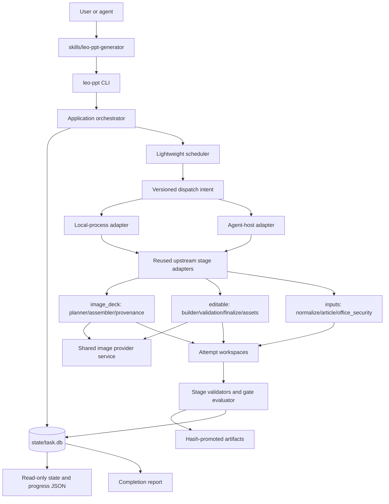
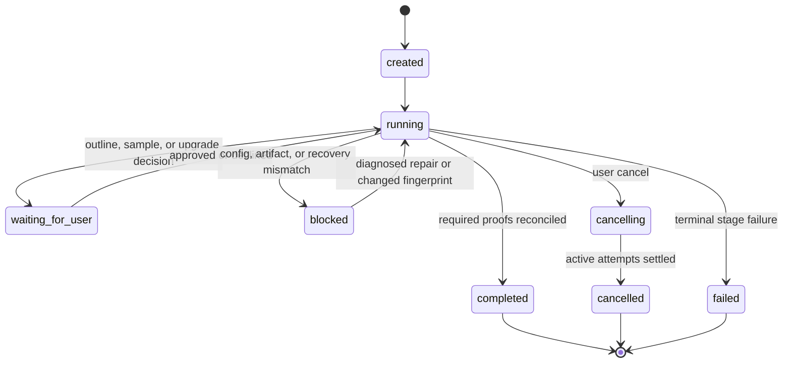

# PPT Orchestration Skill - Plan (v2)

## Goal Capsule

- **Objective:** 为个人或企业内部 PPT 生产者提供一个统一的 PPT skill 产品，**复用** `codex-ppt` 与 `image-to-editable-ppt` 经社区验证的算法能力，通过新建轻量控制面编排图片式 PPT 生成和可选的可编辑重建，先把内容或视觉材料变成高质量图片式 PPT，再按需将整套或指定页面重建为对象级可编辑 PPT。
- **Recommended approach:** 新建一个 Python package、一个 `leo-ppt` CLI 和一个仓库拥有的 `skills/leo-ppt-generator/` skill surface；**按 disposition 逐文件锁定复用/改造/淘汰策略**，以 SQLite 事务库作为唯一任务写模型，以轻量 scheduler 管理所有 slide/page work，把两个上游的生成与重建算法**保留为无状态 stage adapters**。
- **Reuse posture:** 约 60% 文件复用（26 个算法文件）、15 个状态/CLI 层淘汰，工作量复用率 80-85%（改造为局部手术）。两个上游的 prompt 准备、图片生成、PPTX 组装、manifest 构建、OCR hints、公式渲染、资产分离和页面校验算法已被社区验证，照抄或轻改即可；仅状态管理、调度入口和安全边界需新建或修复。
- **Authority hierarchy:** Product Contract 决定产品行为；本 Planning Contract 决定实现边界；目标仓库源码、契约和测试决定完成证据。两个上游仓库提供固定版本的算法导入依据，不再拥有运行时事实。
- **Decision focus:** 逐文件 disposition 锁定、单一 runtime、canonical state、轻量调度、配置和凭据迁移、产物哈希晋级、分层验收、必须修复的上游缺陷、新增安全能力（URL/SSRF、Office 主动内容、沙箱化 soffice）。
- **Verification focus:** 先迁移 editable 上游的 7 个测试作为回归基线，再为必须改造的 5 处建 characterization fixtures，新增约 15 个测试覆盖新建能力（SQLite 事务、worker envelope、并发 record、输入安全），总计约 28 个测试文件。v1 不实现 SSIM 视觉对比（降为 warning-only），依赖上游已验证的结构合同（native text、provenance、coordinates）。
- **Largest risk:** 复用决策不精确导致重写工作量，或过度保守导致继承上游缺陷。缓解：U1 前置逐文件 disposition 锁定，每个文件明确标记 verbatim/adapted/retired/dedup 及改动范围；必须修复的 4 处缺陷（裸 write_text、缺页 continue、文件名依赖、不 rehash）进入 must-fix 测试。
- **Stop conditions:** Product Contract 发生范围变化、disposition 表发现上游文件缺失或冲突、无法从 clean tree 固定上游来源、必须修复的 4 处缺陷测试未通过，或 required proof 缺失时停止推进。
- **Execution profile:** Deep 软件实施计划，共 8 个依赖有序的 Implementation Units；第一版保持单人单项目、CLI/skill 交互，不建设网页端或桌面端。U1 前置 disposition，U2-U4 为轻量控制面，U5 新增安全能力，U6-U7 按 disposition 复用算法层，U8 统一交付。
- **Tail ownership:** `spec-work` 或人工实现者按 U-ID 执行；完成判定以 Verification Contract 和 Definition of Done 为准，计划文件本身不记录实施进度。

## Product Contract

### Summary

上层 skill 统一接收主题、公开文章链接、文字稿、详细 PPT 内容稿、PPT/PPTX、PDF、截图和图片等输入，先完成运行就绪检查与输入分流，再通过内容澄清和大纲确认生成图片式 PPT；用户确认视觉结果后，可选择整套或指定页面升级为可编辑 PPT。

### Problem Frame

现有两个底层 skill 分别解决“从内容生成整页图片式 PPT”和“从视觉页面重建对象级可编辑 PPT”，但用户需要自己理解两个入口、判断何时切换，并承担不必要的配置和流程决策。

第一版的核心价值不是提供一个完整的桌面或网页工作台，而是验证一条低决策成本的生产路径：先快速得到可用的视觉初稿，确认值得继续后，再投入更高成本做可编辑重建。

### Key Decisions

- **D1. 单一 runtime 源码合并：** 当前项目吸收两个 skill 的必要源码能力，并由一个可安装、可诊断、可升级的 runtime 统一拥有入口、配置、状态、调度和产物生命周期；原有 runtime 不再作为主流程中的独立事实来源。
- **D2. 图片初稿优先：** 生成图片式 PPT 是默认第一交付；可编辑重建只有在用户确认后触发。
- **D3. 配置按需检查：** 只生成图片版时只检查图片生成能力；用户选择可编辑升级时再检查 OCR、页面重建和图片编辑能力。
- **D4. 单人单项目：** 第一版不引入多人协作、评论、审批、项目历史或复杂工作台。
- **D5. 公开链接边界：** 外部文章只支持无需登录、无需付费墙且可正常读取的公开链接。
- **D6. 多类输入统一分流：** 文字内容和已有视觉页面同时支持；已有页面可以作为转换源，也可以作为视觉参考，不能默认混为同一种输入。
- **D7. 共享配置与产物规范：** 集成后的能力必须共享统一的用户级配置边界、任务级状态和过程产物目录规范，避免两个底层能力各自生成互不关联的配置、缓存和结果。
- **D8. 统一编排与进度监控：** 当前项目必须拥有一套跨图片生成和可编辑重建的任务流程、状态和进度视图；底层能力的内部状态只能映射到这套统一编排，不得形成两套互相矛盾的用户进度。
- **D9. 单一状态权威：** 每个任务只有一个 canonical task state；slide/page 子任务可以保留内部粒度，但只能作为该任务状态下的子记录，不能独立决定任务是否完成。
- **D10. 单一调度权威：** 所有 slide worker、page worker、本地主 agent 任务、重试、取消和并发额度都由统一调度器分配并记录，底层模块不得自行派发未登记任务。
- **D11. 分层验收：** 图片版和可编辑版分别拥有阶段验收门；用户选择不升级时，图片版可作为最终交付，用户选择升级时，只有可编辑重建及 deck 校验通过后才能声称可编辑交付完成。
- **D12. 可追踪的上游治理：** 两个来源仓库的许可证、版本快照、引入文件、保留契约、本地修改和后续同步必须进入可审计账本，禁止无法回源的源码复制。

### Actors

- **A1. PPT 生产者：** 提供主题、文章、文字稿或页面文件，确认内容大纲、视觉样张和是否升级可编辑版。
- **A2. 上层编排 skill：** 执行运行就绪检查、输入识别、内容澄清、路由、阶段状态和用户提示。
- **A3. 集成后的图片式 PPT 能力：** 根据确认后的内容和视觉决策生成图片式 PPT、页面图片、演讲稿和 PPTX；其行为来源于 `codex-ppt` 的源码能力。
- **A4. 集成后的可编辑重建能力：** 根据图片/PDF/PPTX 页面重建文本框、简单形状和独立图片资产，并执行页面和 deck 校验；其行为来源于 `image-to-editable-ppt` 的源码能力。
- **A5. 外部文章来源：** 提供公开正文和来源信息；抓取失败或内容不完整时不得被假设为已读取。

### Key Flows

#### F1. 运行就绪与按需配置

- **Trigger:** 用户开始一个新任务。
- **Steps:** 检查统一入口、集成后的两个能力、当前阶段所需的图片后端和运行时；读取共享配置边界；展示可用、缺失或需补充的状态；仅在当前路径需要时引导配置。
- **Outcome:** 用户知道任务能否开始，以及缺失配置会阻塞哪一阶段；配置不会因底层能力切换而重复要求或分散存储。

#### F2. 主题或文字内容输入

- **Trigger:** 用户提供主题、公开文章链接、文字初稿或详细 PPT 内容稿。
- **Steps:** 提取可用内容，识别信息完整度；信息不足时询问目标听众、分享目的、核心结论、时长/页数、素材和必须包含内容；形成大纲和待确认项。
- **Outcome:** 用户确认一份可用于视觉生成的内容结构；原始事实、术语和用户明确要求不得被静默改写。

#### F3. 已有视觉页面输入

- **Trigger:** 用户提供 PPT/PPTX、PDF、截图或图片版幻灯片。
- **Steps:** 判断用户是要生成新视觉稿、把页面作为视觉参考，还是直接重建可编辑版本；保留页面顺序和可用备注信息；缺少目标时询问一次并路由到对应阶段。
- **Outcome:** 页面文件不会被错误地当成文字内容稿或被无条件覆盖。

#### F4. 图片式 PPT 生成

- **Trigger:** 内容结构和生成所需的视觉决策已确认。
- **Steps:** 进入集成后的图片式 PPT能力所保留的大纲、风格、图片后端、样张、全量生成和质量检查流程；输出图片式 PPT 和其相关交付物。
- **Outcome:** 用户先获得可审阅、可分享的视觉初稿。

#### F5. 可选可编辑升级

- **Trigger:** 图片式 PPT 已生成，用户选择继续编辑。
- **Steps:** 说明可编辑重建的范围和额外成本；让用户选择整套或指定页面；按需检查 editable runtime/OCR/image backend；进入集成后的可编辑重建能力并报告结构验证结果。
- **Outcome:** 输出与原图片版关联的可编辑 PPT；复杂视觉元素的图片资产边界和任何警告可见。

#### F6. 失败与降级

- **Trigger:** 公开链接不可读取、配置缺失、图片后端失败、页面重建失败或用户取消。
- **Steps:** 指明失败阶段和影响范围；保留已完成的阶段产物；提供补充材料、修复配置、重试当前阶段或结束任务的选择；不得把未完成阶段伪装成成功。
- **Outcome:** 用户可以从最近的有效阶段继续，而不是重复整个任务或误用不完整结果。

### Requirements

#### 输入与分流

- R1. 上层 skill 必须支持主题、公开文章链接、文字内容初稿、详细 PPT 内容稿、PPT/PPTX、PDF、截图和图片作为输入。
- R2. 上层 skill 必须在处理前识别输入的内容来源和视觉来源，并允许一次任务同时存在两类来源。
- R3. 对公开文章链接，系统必须保留来源信息并在无法完整读取时明确报告，不得声称已经读取未获得的正文。
- R4. 对文字内容输入，系统必须根据完整度选择直接结构化、补充澄清或大纲确认路径。
- R5. 对已有页面文件，系统必须区分“生成新稿”“作为视觉参考”和“直接转可编辑”三种意图。

#### 内容澄清与生成

- R6. 当用户只提供主题或内容不足以形成可靠大纲时，系统必须先询问目标听众、分享目的、核心结论、页数/时长和必要素材中会影响生成的最小问题集。
- R7. 系统必须在进入集成后的图片生成阶段前展示可确认的大纲、页面结构、必需素材和待补充项。
- R8. 对详细内容稿，系统必须优先保留用户提供的事实、术语和结论，只对影响生成的歧义发起澄清。
- R9. 集成后的图片生成阶段完成后，系统必须把图片式 PPT 作为独立可交付阶段报告给用户。

#### 阶段升级与可编辑边界

- R10. 系统不得默认触发可编辑重建，必须在图片式 PPT 交付后取得用户选择。
- R11. 用户选择升级时，系统必须支持整套页面或指定页面两种范围。
- R12. 系统必须在升级前说明可编辑重建主要覆盖文本框、简单形状和独立图片资产，不能承诺所有复杂视觉元素都成为原生 PowerPoint 对象。
- R13. 集成后的可编辑阶段必须保留 `image-to-editable-ppt` 的页面决策、manifest、record 和 finalize 校验语义，不得用整页截图叠加少量文字框冒充可编辑结果。

#### 配置与任务状态

- R14. 系统必须区分一次性运行环境配置和当前任务配置，并仅在当前路径需要时要求用户补充图片后端、OCR 或其他凭据。
- R15. 系统必须展示当前阶段的就绪状态、缺失依赖和对应阻塞范围。
- R16. 系统必须保留图片生成阶段和可编辑重建阶段的关联，以及每个阶段的完成、失败、取消和可恢复状态。
- R17. 任何阶段失败时，系统必须报告具体阶段、影响页面或输入、证据位置和可执行的恢复选项。

#### 源码集成与统一入口

- R18. 当前项目必须交付一个统一可发现的 skill 入口，用户不需要分别安装、选择或理解两个底层 skill 才能完成主流程。
- R19. 当前项目必须纳入两个底层 skill 的必要源码能力，并由当前项目的单一 runtime 重新编排其输入、阶段和产物边界。
- R20. 源码集成不得静默削弱既有的图片后端约束、页面重建决策、状态记录、结构校验和失败处理语义；任何有意变化必须成为后续计划中的显式决策。

#### 共享配置与过程产物

- R21. 集成后的图片生成、内容处理和可编辑重建能力必须从统一的共享配置边界读取用户级凭据、后端选择和运行时设置，禁止同一配置在多个底层位置形成互相漂移的副本。
- R22. 每次任务必须拥有可识别的任务级产物根目录，并按输入、内容结构、大纲、图片式 PPT、可编辑重建和验证结果区分过程产物。
- R23. 过程产物目录必须保留阶段之间的来源关联、状态、媒体来源和验证证据，使任务可以从最近的有效阶段继续，而不必重复已经完成的阶段。
- R24. 最终交付物、临时缓存、失败尝试和用户可复用素材必须有明确的归属和清理边界；临时失败产物不得冒充最终结果。
- R25. 目录结构和配置规范必须由当前项目统一拥有，底层集成能力不得各自引入无法被上层任务状态识别的私有产物布局。

#### 统一编排与进度监控

- R26. 当前项目必须为每次任务维护一套统一的阶段流程，覆盖输入准备、内容澄清、大纲确认、图片式 PPT 生成、用户升级选择、可编辑重建、验证和交付。
- R27. 用户可见的任务状态必须来自统一编排状态，而不是分别展示两个底层能力的独立状态。
- R28. 进度监控必须区分未开始、进行中、等待用户、配置阻塞、失败、可恢复和已完成等状态，并标明当前阻塞属于哪个阶段。
- R29. 统一编排必须允许在图片版完成后暂停，等待用户决定是否进入可编辑阶段；等待期间不得被误报为失败或完成。
- R30. 统一编排必须支持从最近的有效阶段恢复，并在恢复时复用已记录的过程产物和验证证据，避免无意义地重复整个任务。
- R31. 底层能力的内部重试、页面级任务和并发状态必须映射回统一任务进度，且不能绕过统一的失败、取消和交付判定。

#### 单一 Runtime Contract

- R32. 当前项目必须只向用户和 agent 暴露一套安装、检查、配置、任务推进和诊断入口，主流程不得要求用户另行操作旧 runtime。
- R33. 单一 runtime 必须成为输入规范化、内容生成、图片生成、可编辑重建、验证和最终交付的生命周期 owner。
- R34. 集成模块可以保留内部能力边界，但不得直接维护与 canonical task state 竞争的任务级状态、配置副本或最终交付判定。
- R35. 旧 runtime 的配置和产物只能通过受控迁移或兼容读取进入新 runtime，迁移后不得对新旧位置双写。
- R36. runtime 必须提供统一的 readiness/doctor 结果，并区分当前任务必需能力、可选升级能力和已知降级能力。

#### State Contract

- R37. 每个任务必须有一个 canonical task state，记录当前阶段、用户决策、子任务摘要、阻塞、恢复点、交付变体和完整历史。
- R38. canonical task state 只能由统一 runtime 通过受控状态转换修改，禁止 worker、底层模块或人工直接改写任务完成状态。
- R39. slide/page 子任务必须拥有稳定标识并关联到父任务、所属阶段、输入、输出、worker、尝试次数和验证结果。
- R40. 等待大纲确认、样张确认或可编辑升级选择必须使用明确的 `waiting_for_user` 语义，不得占用执行租约或被解释为失败。
- R41. `completed` 必须携带明确交付变体：图片版完成或可编辑版完成；选择升级后的任务在可编辑验收前不得降格为图片版完成来掩盖失败。
- R42. 任务恢复必须根据已记录状态和产物哈希确认可复用范围；状态与产物不一致时必须进入可诊断的阻塞状态，而不是猜测继续。

#### Configuration Contract

- R43. runtime 必须拥有一个 canonical user configuration authority，统一管理图片后端、模型、API endpoint、OCR、运行时偏好和非敏感默认值。
- R44. 配置解析优先级必须固定并可解释，遵循本次任务显式选择、受支持的环境变量、用户级配置、内置默认值的顺序。
- R45. 凭据不得写入任务目录、prompt、manifest、日志或诊断报告；任何面向用户的输出必须遮蔽敏感值。
- R46. 配置检查必须按阶段延迟执行，未选择可编辑升级的任务不得因 OCR 或可编辑专属配置缺失而阻塞图片版生成。
- R47. 从旧 `codex-ppt` 与 `editppt` 配置导入时必须报告来源、映射、冲突和结果；冲突不得静默选择，成功迁移后不得继续依赖旧配置作为并列事实来源。
- R48. 用户自定义风格等可复用非敏感资产必须与凭据配置分离，并具有独立的保留、升级和删除语义。

#### Scheduling Contract

- R49. 统一调度器必须管理所有生成页、重建页和本地执行单元的队列、并发额度、租约、取消、重试和结果记录。
- R50. 调度器不得对同一阶段和同一工作单元重复派发有效租约；重新派发必须有终止、取消、租约失效或已确认失败的证据。
- R51. 重试必须保留失败尝试和根因，并且只有在输入、配置、prompt、后端或运行条件发生相关变化后才能再次执行同一失败单元。
- R52. 用户取消必须停止新的任务派发，并把已运行单元的结果、未完成单元和可恢复点写回 canonical task state。
- R53. 页面内要求串行的图片编辑与素材处理不得被全局并发策略打乱；不同页面或 slide 的并发必须受统一额度约束。
- R54. worker 返回结果不能直接成为最终产物，必须经过统一记录、来源校验和阶段验收后才能进入正式目录。

#### Acceptance Contract

- R55. runtime readiness 验收必须证明当前路径所需依赖可用，并把可选能力缺失与主流程阻塞分开报告。
- R56. 内容阶段验收必须证明输入来源已记录、大纲已获用户确认、必需素材已映射、未解决缺口已显式披露。
- R57. 图片版验收必须证明预期页面齐全、后端来源可追踪、样张方法被继承、逐页 QA 完成且 PPTX 可打开。
- R58. 可编辑版验收必须证明每个选定页面由可重建 manifest 驱动、页面验证通过、最终 deck 页序和媒体关系正确，并且不存在整页源图叠加少量文字框的伪可编辑模式。
- R59. 图片版与可编辑版之间必须执行逐页对照；文字缺失、布局溢出、关键对象丢失、背景明显漂移和错误对象来源属于必须修复的问题，低风险装饰差异才可以作为 warning 交付。
- R60. 任何阶段未通过其必需验收门时，统一 runtime 不得把相应交付变体标记为完成。

#### Upstream Governance Contract

- R61. 当前项目必须维护两个来源仓库的 provenance ledger，至少记录来源 URL、许可证、引入版本或 commit、引入文件范围、本地修改和当前 owner。
- R62. 所有复制或修改的上游源码和实质性文档必须保留适用的 MIT 版权及许可证声明。
- R63. 上游同步必须先形成版本差异和文件账本，再分别判断安全修复、行为变化、契约变化和本地冲突，禁止无审查覆盖本地集成代码。
- R64. 上游原有的关键测试、fixture 和质量契约必须迁移或建立等价验证；缺失覆盖的上游行为不得被宣称为已保留。
- R65. 当前项目对统一 runtime 和产品行为拥有最终责任；上游更新是输入证据，不得自动覆盖当前项目已经确认的 Product Contract。
- R66. 不再使用的上游模块必须在账本中标记淘汰原因和替代能力，避免残留两套可被误调用的 runtime 路径。

### Acceptance Examples

- AE1. **主题输入：** Given 用户只提供“AI First 汇报”主题，when 没有足够的听众、目的和核心结论信息，then 系统先进行最小内容澄清，不直接调用图片生成。
- AE2. **公开文章：** Given 用户提供无需登录的公开文章链接，when 正文可读取，then 系统提取正文和来源后生成可确认的大纲；when 页面被付费墙或登录拦截，then 系统报告不可读取并要求用户提供正文或替代来源。
- AE3. **文字初稿：** Given 用户上传 Markdown 或 Word 内容初稿，when 内容足以形成页面结构，then 系统保留其事实和术语，展示结构化大纲供确认。
- AE4. **详细内容稿：** Given 用户上传逐页 PPT 内容稿，when 只有少量页面信息含糊，then 系统只询问这些歧义，不重新创作整套内容。
- AE5. **已有页面：** Given 用户上传图片版 PPT，when 用户要求直接转可编辑，then 系统跳过新稿生成，进入集成后的可编辑重建阶段；when 用户要求基于其风格重新创作，then 系统把页面作为视觉参考而不是直接转换源。
- AE6. **按需升级：** Given 图片式 PPT 已交付，when 用户选择指定第 2、5 页转可编辑，then 系统只对这些页面执行升级并报告其余页面仍为图片式结果。
- AE7. **失败恢复：** Given 图片版已完成但可编辑阶段 OCR 或图片后端失败，then 系统保留图片版产物，明确可编辑阶段未完成，并提供配置修复或重试当前阶段的选择。
- AE8. **单一状态：** Given 图片页生成任务和可编辑页面任务同时存在，when 用户查看进度，then 系统从 canonical task state 展示一个总阶段和可追踪的子任务明细，而不是返回两套互相冲突的完成状态。
- AE9. **等待用户：** Given 图片版已经通过验收，when 系统等待用户决定是否升级，then 任务进入 `waiting_for_user`，不继续派发 page worker，也不占用执行租约。
- AE10. **旧配置迁移：** Given 用户机器同时存在旧 `.codex-ppt-skill` 和 `.editppt` 配置，when 新 runtime 首次迁移，then 系统展示字段映射和冲突，写入 canonical 配置后停止对旧位置双写。
- AE11. **重复派发保护：** Given 某页面 worker 仍持有有效租约，when 调度器再次评估待办任务，then 不得为同一工作单元创建第二个 worker；只有终止、取消、失效或失败证据成立后才能重派。
- AE12. **验收隔离：** Given 用户只需要图片版，when 图片版验收通过而 OCR 未配置，then 任务可以以图片版交付完成；when 用户随后选择可编辑升级，then OCR/readiness 检查只阻塞新增的可编辑阶段。
- AE13. **防止伪可编辑：** Given 可编辑 PPTX 可以打开但页面仍是整页源图叠加少量文字框，when 执行可编辑验收，then 该页面必须失败，不能以 warning 或完成状态交付。
- AE14. **上游同步：** Given 某来源仓库发布新版本，when 维护者准备同步，then 必须先产出来源版本和文件差异账本，并在回归验证通过后才更新当前项目的上游快照记录。

### Success Criteria

- 用户可以用主题、文字稿、公开文章链接或已有页面文件启动任务，而无需理解两个底层 skill 的内部名称和命令。
- 用户在图片生成前能确认内容结构，在图片生成后能明确选择是否承担可编辑重建成本。
- 只生成图片版的任务不会被不必要的 OCR 或可编辑后端配置阻塞。
- 失败任务不会丢失已经完成的阶段产物，也不会把未完成阶段报告为成功。
- 生成结果和可编辑升级结果之间保留清晰的来源和阶段关系。
- 用户只需要安装和操作当前项目的一套 runtime，不需要额外管理旧 `codex-ppt` 或 `editppt` runtime。
- 任一任务的总状态、子任务、进度、阻塞和交付判定都能追溯到同一个 canonical task state。
- 配置迁移后不存在新旧配置双写，任务产物中不存在明文凭据。
- 同一有效工作单元不会因轮询、恢复或并发补位而被重复派发。
- 图片版与可编辑版分别通过其阶段验收，且不会把结构有效但对象来源违规的 PPTX 宣称为可编辑成功。
- 每次上游同步都能回溯来源版本、文件范围、本地改动、验证结果和保留的许可证信息。

### Scope Boundaries

#### Deferred for later

- 登录后文章、付费墙文章和内部链接。
- 多人协作、评论、审批、项目历史和批量项目管理。
- 桌面端、网页工作台和跨设备同步界面。
- 企业内网、本地-only 运行和本地 PowerPoint 深度集成。
- 自动事实核查、完整演讲训练和内容研究代理。

#### Outside this product's identity

- 以纯手工 PowerPoint 编辑器或通用在线文档编辑器为核心的产品。
- 以所有复杂视觉元素 100% 原生可编辑为承诺的完美重绘工具。

### Dependencies / Assumptions

- 两个 skill 的 MIT 源码、运行时和相关文档可以在保留版权及许可声明的前提下纳入当前项目，并允许重新编排其入口和状态边界。
- 云端图片生成和必要的 OCR/图片编辑能力在任务对应阶段可用；具体后端、凭据和配额属于后续规划与运行时验证范围。
- 公开文章抓取能力只对无需登录、无需付费墙且可正常读取的 URL 提供保证。
- 用户能够在大纲确认和可编辑升级两个关键节点做出选择。
- 复杂视觉资产在可编辑版中可能仍以独立图片存在，这是产品边界而非异常。
- 单一 runtime 可以保留生成、重建、OCR、图片后端和文档处理等内部模块边界；“单一”约束的是事实来源和操作入口，而不是要求所有代码进入一个不可分层的模块。

### Outstanding Questions

#### Deferred to Planning

- 单一 runtime 的包、模块、命令和内部适配边界如何组织。
- canonical task state、子任务记录和状态转换的具体 schema 与持久化方式。
- 调度器如何实现租约、并发额度、取消传播、重试和进程恢复。
- canonical 用户级配置的具体位置、密钥存储机制、环境变量兼容和一次性迁移实现。
- 任务产物根目录及阶段子目录的具体命名、保留周期、缓存复用、哈希和清理实现。
- 图片版与可编辑版逐页对照采用哪些自动指标和人工判断，warning 阈值如何校准。
- provenance ledger、上游版本锁定、同步脚本和回归矩阵的具体实现。
- 公开文章正文提取、图片下载和来源记录的具体运行时策略。

### Sources / Research

- `codex-ppt` skill documentation, observed 2026-08-20: https://github.com/ningzimu/codex-ppt-skill — establishes image-based slide generation, approval gates, backend selection, slide QA and speaker-note assembly.
- `image-to-editable-ppt` skill documentation, observed 2026-08-20: https://github.com/ningzimu/image-to-editable-ppt-skill — establishes visual-input normalization, page reconstruction, editable-object boundaries, OCR/image backend policy and deterministic validation.
- Current target repository snapshot, observed 2026-08-20: contains workflow governance files but no existing product implementation; implementation assumptions remain for `spec-plan` to verify.


---

## Planning Contract

Product Contract unchanged (byte-preserved upstream source slice, sha256 `01081f4439c2de9ad1b46618ef71b69643988b81e94bf3ba61c484c42a906c87`).

### What Changed From v1 Plan

v1 计划的技术诊断和复用姿态（KTD1 `new + reuse/extend`）是正确的，但执行规格按"重写"而非"编排"校准：18 个上游已存在的算法文件被列为待写新文件、约 60 个测试文件、7 个 JSON Schema、G0–G7 八道验收门、分布式级状态机制。两个上游是被真实用户使用并持续产出可用 PPT 的开源项目，其算法层已由社区使用验证，重写它们既浪费工作量又丢弃已验证行为。

v2 保留 v1 的全部正确判断（单一 runtime、canonical state、必须修复的上游缺陷、新增安全能力），把执行规格重新校准到"编排"：

| 维度 | v1 | v2 | 依据 |
| --- | --- | --- | --- |
| 上游 disposition | 推给 `path-map.yaml`，正文不承诺比例 | U1 前置逐文件锁定，正文承诺约 60% 文件复用 | 实施者读 U6/U7 只应看到改动点，不是 18 个待写文件 |
| 测试规模 | 约 60 文件，codex 全量 characterization | 约 28 文件：迁移 7 + characterization 5 + 新建 16 | characterization 是重构的代价，不是复用的代价；逐字复用只需 import smoke |
| JSON Schema | 7 个 | 2 个（worker-envelope、editable-page-manifest） | 只有跨真实进程边界才需 schema；Python 内部用 dataclass |
| 验收门 | G0–G7 八道全新建 | 3 项新增（G0/G1/G7）+ 3 项 bug 修复（G4/G5/G6）+ 2 项复用上游隐式审批（G2/G3） | 上游已在交付，其质量判断够用；新门只加在新增风险上 |
| 状态机制 | transactional outbox + fencing token + 额度分配器 + Online Backup 仪式 | 单事务 + attempt 表 + 晋级前当前性检查 + Online Backup（保留，成本低） | outbox/fencing 对抗网络分区与多写者抢占；单机 CLI 的失败模式是 crash 和磁盘满 |
| 视觉对比 | SSIM hard fail（`<0.90`），阈值在 U8 校准 | v1 降为 warning-only，硬门交给上游已验证结构合同 | 两个上游都无 PPTX→图像渲染与 SSIM，这是唯一完全无可复用的能力 |
| Attestation | 绑定 validator version / proof hashes 的密码学证明 | 带时间戳与 revision 的完成报告 | v1 无审计消费者 |
| Git source identity | 断言"当前目标目录不是 Git repo"，要求 hash ledger 兜底并压低完成声明 | 已是 git repo（commit `7ea679e`，identity `leokuang`），直接 revision-bound | v1 该断言在计划成文后已过期 |
| CHANGELOG 治理 | 8 个 unit 均未列 `CHANGELOG.md` | 每个 unit 的 Files 与 DoD 均含 `CHANGELOG.md` | 仓库强制门："变更说明缺失则拒绝生成源码变更" |

Product Contract 的 D1–D12、R1–R66、F1–F6、AE1–AE14 一律不动。R→U 追溯映射与 U-ID 编号保持稳定，`spec-work` 的执行契约不受影响。

### Implementation Summary

实现采用一个仓库拥有的 Python package、一个 `leo-ppt` CLI 和一个轻量 skill surface。CLI 是人和 agent 的唯一受控入口；Python package 持有控制面（状态、调度、配置、验收）并把两个上游的算法层作为无状态 stage adapters 调用；skill 只描述交互与调用契约，不复制 runtime 规则。

算法层按 U1 锁定的 disposition 表导入：约 26 个文件复用（其中约 22 个 verbatim/近逐字、约 4 个去重合并），约 13 个改造（局部手术，3–30 行级别），约 15 个淘汰（全部为状态/dispatch/CLI 入口，被 U2 的 SQLite 与 U4 的 scheduler 替代）。

任务状态写入 SQLite，文件系统保存大体积输入、attempt 产物、正式产物和验证报告。图片生成与可编辑重建保留独立领域边界，但只能通过统一 scheduler 取得工作、通过统一 record/validation 入口提交结果，不能再写 `slide_run_state.json`、`page_jobs.json` 或其他竞争状态。

### Key Technical Decisions

- KTD1. **控制面新建，算法层复用。** 架构 posture 为 `thin new control plane + maximal algorithm reuse`：`src/leo_ppt_generator/` 新建状态、调度、配置、验收 owner；两个上游的 prompt 准备、图片生成、provider 传输、PPTX 组装、输入归一化、manifest 构建、OCR hints、公式渲染、资产分离和页面校验算法按 disposition 表导入并保留其行为。拒绝薄包装两个旧 CLI（会保留两套状态与完成判定），同样拒绝重写算法层（会丢弃社区验证行为并放大工作量）。
- KTD2. **复用比例在 U1 前置锁定，不推给实施期。** `third_party/path-map.yaml` 在 U1 完成时必须逐文件给出 `verbatim | adapted | dedup | retired` 与改动范围（对 adapted 精确到函数或行区间）。U6/U7 的 Files 列表按 disposition 分组呈现，实施者看到的是"复用 N 个 + 改动 M 处"，不是"待写 K 个文件"。任何 disposition 变更必须更新 ledger 并说明理由。
- KTD3. **SQLite 是唯一任务写模型，JSON 只做投影。** 每个任务的 `state/task.db` 使用 SQLite WAL、外键、约束、事务和 schema migration；`state/task_state.json` 与 `reports/progress.json` 由 runtime 原子重建，删除后可恢复。**每次状态变更一个事务**即可满足单机一致性；不建 outbox 投递语义。拒绝继续合并多份 JSON：editable 上游 `deck_run_state.py:28` 直接 `path.write_text` 且无锁无原子替换，默认并发 6 页时 concurrent record 会丢更新；codex 上游虽有 FileLock，但 `slide_jobs_path` 与 `run_state_path` 是两个独立文件、两个独立锁上下文，crash 会产生跨文件分裂。
- KTD4. **轻量 scheduler：intent 先写、attempt 表、晋级前当前性检查。** scheduler 在同一事务中检查依赖与并发上限、创建不可变 attempt 与 dispatch intent；execution adapter 再激活 local-process 或 agent-host worker。`task next` 只返回版本化 dispatch intent；agent-host 通过 `activate → heartbeat/record → terminal` 协议回写，Python runtime 不假定自己能直接调用宿主 subagent 或 image tool。**产物晋级前检查提交的 attempt 是否仍是该 unit 的当前 attempt**；非当前 attempt 的迟到结果进入 quarantine，不覆盖正式产物。这替代 v1 的 fencing token：后者对抗的是多写者时钟漂移下的抢占，单机 CLI 不存在该场景。lease 超时只标记 `suspect`，需终态或重复不可达证据后才能 revoke 和重派；无 daemon，lease 过期在下次 CLI 调用时惰性发现。
- KTD5. **状态与文件以 attempt 沙箱和哈希晋级连接。** worker 只能写 `work/<stage>/<unit>/attempt_<n>/`。runtime 先验证文件、来源、哈希和 attempt 当前性，再原子晋级到 `artifacts/`；DB 记录 promotion intent 并在启动时 reconciliation。重试追加 attempt，不清空旧 prompt、配置指纹、失败原因或验证结果。
- KTD6. **配置和凭据只有一个 authority。** `${LEO_PPT_HOME}` 可覆盖基于 `platformdirs` 的用户配置根；非敏感配置存 `config.yaml`，secret 只保存 key reference，值来自任务显式运行时选择、受支持环境变量、OS credential store 或受控只读外部 resolver。`CODEX_AUTH_FILE` 是只读外部 credential reference：runtime 不复制其中 token，只验证存在性、格式、权限和可判断的过期状态。CLI 禁止通过参数接收 secret。旧 `.codex-ppt-skill/.env` 与 `.editppt/config.yaml` 仅由 `config migrate --dry-run|--apply` 一次性只读导入，成功后不再读取或双写旧位置，也不自动删除旧文件。复用 codex `codex_ppt_runtime.py` 与 editable `runtime_env.py` 的 masking/readiness 项目，移除其明文 secret 落盘路径。
- KTD7. **一个 image service，合并两个上游的 provider 能力。** 复用 codex `image_providers/{base,openai_compatible,atlascloud}.py`（verbatim，仅改 import）与 editable 的 Codex OAuth 路径（`runtime_env.py`、`image_gen.py`、`configure_image_backend.py`）。**改造 codex `factory.py`**：其 `_is_atlascloud_base_url` 用 `"atlascloud.ai" in hostname.lower()` 子串匹配隐式切 provider，`atlascloud.ai.evil.com` 会误命中；改为显式配置声明 provider，不从 URL 嗅探。全页 slide job 可跨页并发，同一 editable page 内的 image edit、分离和处理按依赖串行。provider、模型、credential origin、输入/输出哈希进入脱敏指纹及 provenance。
- KTD8. **可编辑页面的 `manifest.json` 保留为页面构建权威。** 复用上游 `manifest.json` 的 slide/content box、object coordinates、inventory、asset provenance 和 quality checks 语义；`contracts/editable-page-manifest.schema.json` 固定跨模块字段和版本（这是 evolution，不是新建）。**改造 `finalize_deck_run.py`**：其 `assert_pages_ready` 只检查 `status` 与 `validation_passed` 布尔，不重算 hash，留下 record 后篡改 manifest/asset/notes 的 TOCTOU 缺口；finalize 前必须重新计算 manifest、asset 和 notes hash 并与 record 值比对。
- KTD9. **验收门只加在新增风险上。** 上游已在向用户交付，其隐式质量判断（内容确认、样张批准）复用为 decision event，不新建 schema。实质新增门为 G0（分阶段 readiness）、G1（输入安全）、G7（跨阶段交付判定）；G4/G5/G6 是修复上游已知缺陷而非新合同。唯一完成转换由 gate evaluator 在事务中写入，生成绑定 task revision 与最终产物 hash 的 `completion_report.json`。
- KTD10. **外部文章抓取是受限输入适配器（新建能力）。** 两个上游均无此能力。只允许公开 `http/https`，每次 redirect 都重做 DNS/IP 校验，拒绝 loopback、private、link-local、metadata endpoint、凭据 URL 和非允许 scheme；限制跳转、时间、响应大小、MIME 和子资源数量，不携带 cookie 或认证。网页内容视为 untrusted data，不能通过正文指令改变工具、配置或工作流。
- KTD11. **上游同步使用 clean-tree provenance ledger。** 只从固定 commit 的 Git tree 导入，不从 dirty working tree 复制。`third_party/upstreams.yaml` 记录来源、commit、license 和 dirty policy；`third_party/path-map.yaml` 逐文件记录 disposition、blob hash、target、owner 和回归测试。同步必须先 staging、diff、ledger 校验和回归，再更新 pin；禁止 blind rsync 或 subtree 覆盖。
- KTD12. **安全边界由 runtime 强制，prompt 只做 best-effort 治理。** worker prompt 可以提醒最小权限和写入范围，但不能作为凭据、输入或状态隔离的证明。runtime 只提供 allowlisted 输入引用和 attempt 写目录，不把 DB 或 credential handle 暴露给 worker，并在结果晋级前验证 envelope、文件 containment、哈希和 provenance；宿主未提供可验证隔离时记录 `worker_isolation=unproven`。
- KTD13. **Office 输入按不可信主动内容处理，soffice 调用必须沙箱化（新建能力）。** 复用 editable `_input_normalization.py` 的 PDF/PPTX/image/notes 归一化算法，但其 `find_soffice()`/`convert` 路径（L217–247）目前是裸调用；改造为无网络、受限工作目录、no-follow 文件访问以及 CPU、内存和时间上限。PPT/PPTX 摄取在解析或转换前拒绝 VBA、OLE、DDE、外部 relationships 和远程 media。提取失败保留 blocked reason 和原始哈希。
- KTD14. **Provider endpoint 与 credential 绑定同一信任策略。** 自定义 endpoint 必须解析为经 allowlist/policy 接受的精确 HTTPS origin，启用证书校验；认证请求禁止跨 origin redirect，并在连接及每次 redirect 前抵御 private/link-local/metadata 地址与 DNS rebinding。credential resolver 只向其绑定 origin 提供 secret。
- KTD15. **v1 不实现 SSIM 视觉对比。** 两个上游均无 PPTX→图像渲染（`soffice` 仅用于输入转换）与 SSIM 实现，这是唯一完全无可复用的能力。v1 的 editable 硬门交给上游已验证的结构合同：required text 100% native 覆盖、asset provenance 合规、对象坐标完整、top-level `passed` 为布尔 true、整页 raster 检测。视觉对比在 v1 为 optional warning-only；渲染器与 SSIM 库、golden fixture 校准和 hard threshold 推迟到 v2，届时以 fixture evidence 定阈值。

### Upstream Disposition Ledger

本表是 v2 的执行核心，U1 必须把它落成 `third_party/path-map.yaml` 并逐项校验 blob hash。`verbatim` = 算法逐字保留，仅改 import 路径与 I/O 适配层；`adapted` = 算法保留，指定处改动；`dedup` = 两上游重复文件只取一份；`retired` = 被控制面替代，不进入产品源码。

上游 pin：`codex-ppt-skill` = `f2ed80372f65bb05fe62dd07979b239a17ac065d`（working tree 有 `M CHANGELOG.md`、`M docs/README.md`、`M docs/_sidebar.md`、`?? docs/execution-flow.md`，只能从 HEAD tree 导入）；`image-to-editable-ppt-skill` = `fb869763127fd31ba7288d905671ffc4ea542f60`（clean）。两者均 MIT，`Copyright (c) 2026 ningzimu`，license hash 相同但来源归属分别保留。

#### codex-ppt-skill（`skills/codex-ppt/scripts/`）

| 上游文件 | Disposition | 目标 | 改动范围 |
| --- | --- | --- | --- |
| `image_providers/base.py` | verbatim | `image/providers/base.py` | 仅 import |
| `image_providers/openai_compatible.py` | verbatim | `image/providers/openai_compatible.py` | 仅 import |
| `image_providers/atlascloud.py` | verbatim | `image/providers/atlascloud.py` | 仅 import |
| `image_providers/factory.py` | adapted | `image/providers/factory.py` | 删除 `_is_atlascloud_base_url` 子串嗅探（L17–21），改为显式 provider 声明；KTD7 |
| `prepare_slide_prompts.py` | verbatim | `image_deck/planner.py` | prompt 与 job 规划逻辑照抄，去掉读写 `slide_jobs.json` 的 I/O，改由调用方注入 |
| `image_gen.py` | verbatim | `image/service.py` | 生成调用逻辑照抄，与 editable 同名文件合并去重 |
| `assemble_ppt.py` | adapted | `image_deck/assembler.py` | **must-fix**：L258–260 缺页 `print(警告)` + `continue` 后仍 `prs.save()` 并报成功，改为期望 slide 集合精确相等否则硬失败；写后重读实际页数/页序/notes |
| `record_slide_result.py` | adapted | `image_deck/provenance.py` | 复用 L38–107 的 `_validate_backend`/`_backend_family`/`_normalized_backend_label`/`_expected_backend_labels`/`_matched_expected_backend` backend provenance 匹配逻辑（G3 依赖）与 sha256 计算；淘汰写 `slide_jobs.json` 部分 |
| `codex_ppt_runtime.py` | adapted | `runtime/config/readiness_probes.py` | 复用 masking 与 readiness 探测项目，移除明文 secret 落盘与隐式旧配置 fallback |
| `remove_chroma_key.py` | dedup | `image/chroma.py` | 纯图像处理，与 editable 同名文件取其一，另一份在 ledger 标 dedup 并记录被取代方 |
| `slide_run_state.py` | retired | — | 被 U2 SQLite 替代。其 `write_json` 的 `os.replace`+`fsync` 原子写意图（L37–47）保留为 U2 的产物晋级参考 |
| `record_slide_dispatch.py` | retired | — | 被 U4 scheduler 替代 |
| `record_slide_blocker.py` | retired | — | 被 U2 状态转换替代 |
| `slide_job_status.py` | retired | — | 被 U2 projection 替代 |

#### image-to-editable-ppt-skill（`skills/image-to-editable-ppt/cli/editppt/`）

| 上游文件 | Disposition | 目标 | 改动范围 |
| --- | --- | --- | --- |
| `runtime/build_pptx_from_manifest.py` | verbatim | `editable/builder.py` | PPTX 构建算法照抄 |
| `runtime/text_hints.py` | verbatim | `editable/text_hints.py` | — |
| `runtime/paddle_text_hints.py` | verbatim | `editable/paddle_text_hints.py` | — |
| `runtime/deck_text_hints.py` | verbatim | `editable/deck_text_hints.py` | — |
| `runtime/page_text_metrics.py` | verbatim | `editable/text_metrics.py` | — |
| `runtime/formula_renderer.py` | verbatim | `editable/formula.py` | — |
| `runtime/process_asset_sheet.py` | verbatim | `editable/assets.py` | — |
| `runtime/split_alpha_components.py` | verbatim | `editable/alpha.py` | — |
| `runtime/make_page_contact_sheet.py` | verbatim | `editable/contact_sheet.py` | — |
| `runtime/_page_artifacts.py` | verbatim | `editable/_page_artifacts.py` | — |
| `runtime/validate_pptx.py` | adapted | `editable/validation.py` | **must-fix**：L245 硬编码 `Path(path).name == "source.png"`，改名即绕过；改为按覆盖率+OCR baked-text overlap 判定，不依赖文件名与自述 provenance。`is_full_slide_image`（L216–229）逐维 `>=98%` 阈值下调为面积覆盖 85–90%。其余合同检查（provenance、coordinates、quality contracts、top-level pass）照抄 |
| `runtime/_input_normalization.py` | adapted | `inputs/normalize.py` | 归一化算法照抄；**must-fix**：`find_soffice()`/convert（L217–247）裸调用改为沙箱化（无网络、受限目录、no-follow、CPU/内存/时间上限）；路径 containment 扩展到 symlink 与 archive |
| `runtime/image_gen.py` | dedup+adapted | `image/service.py` | 与 codex 同名文件合并；保留 Codex OAuth 路径 |
| `runtime/configure_image_backend.py` | adapted | `image/backend_config.py` | 后端选择逻辑复用，配置权威改为 U3 |
| `runtime/runtime_env.py` | adapted | `runtime/config/readiness_probes.py` | 与 codex `codex_ppt_runtime.py` 合并；保留 `CODEX_AUTH_FILE` 只读 reference 语义，移除 token 复制 |
| `runtime/record_imagegen_result.py` | adapted | `image/record.py` | 结果校验逻辑复用，状态写入改 U2 |
| `runtime/remove_chroma_key.py` | dedup | — | 与 codex 版本去重，ledger 记录取代关系 |
| `runtime/finalize_deck_run.py` | adapted | `editable/finalize.py` | **must-fix**：`assert_pages_ready`（L26–36）只检查 status/布尔不重算 hash，改为 finalize 前重算 manifest/asset/notes hash 并与 record 值比对（KTD8）；build+validate 编排改由 U4 调度 |
| `runtime/prepare_deck_run.py` | retired | — | 被 U4 scheduler + U2 状态替代 |
| `runtime/deck_run_state.py` | retired | — | **含 must-fix 缺陷**：L28 裸 `path.write_text`，无锁无原子替换，并发 6 页 record 丢更新。整体被 U2 SQLite 替代 |
| `runtime/record_page_dispatch.py` | retired | — | 被 U4 替代 |
| `runtime/record_page_result.py` | retired | — | 被 U4 record 入口替代 |
| `runtime/reset_page_job.py` | retired | — | 被 U4 retry 替代 |
| `runtime/page_job_status.py` | retired | — | 被 U2 projection 替代 |
| `runtime/main.py` | retired | — | 被 U8 orchestrator 替代 |
| `cli.py` | retired | — | 被 `leo-ppt` CLI 替代；不保留 `editppt` console script |
| `scripts/build-page-worker-prompt.py` | adapted | `skills/leo-ppt-generator/prompts/page-worker.md` | prompt 内容复用为静态 reference，生成脚本淘汰 |
| `tests/test_quality_contracts.py` | migrate | `tests/upstream/editppt/` | 回归基线 |
| `tests/test_page_hints.py` | migrate | `tests/upstream/editppt/` | 回归基线 |
| `tests/test_formula_renderer.py` | migrate | `tests/upstream/editppt/` | 回归基线 |
| `tests/test_slide_layout.py` | migrate | `tests/upstream/editppt/` | 回归基线 |
| `tests/test_multi_agent_backend.py` | migrate | `tests/upstream/editppt/` | 回归基线 |
| `tests/test_script_inventory.py` | adapted | `tests/upstream/editppt/` | 脚本清单断言按新目录结构调整 |
| `tests/test_dispatch_concurrency.py` | reference-only | — | 只用 subprocess 断言容量上报，未证明真实并发写/租约/取消；被 U4 的真实并发测试取代，ledger 标记原因 |

#### 复用统计与工作量含义

- verbatim/dedup：约 22 个文件，仅需 import smoke test，不需 characterization。
- adapted：约 13 个文件，改动为 3–30 行级局部手术，其中 5 处为 must-fix 缺陷修复，需 characterization fixture。
- retired：约 15 个文件，全部集中在 state/dispatch/CLI 层，无算法损失。
- migrate：6 个上游测试直接迁移为回归基线，1 个标 reference-only。

文件复用率约 60%，工作量复用率 80–85%。codex 上游无自动化测试，其"社区验证"来源于真实用户产出可用 PPT，而非回归保护——因此 codex 侧的 verbatim 复用是安全的（行为已被使用验证），但 codex 侧的 adapted 改动必须先建 characterization fixture 固定改动前行为。

### High-Level Technical Design



虚线含义：`Reused` 分组内的三个 stage 是按 disposition 表导入的上游算法，控制面（CLI/orchestrator/state/scheduler/validators）为新建。



`stage` 使用 `readiness → input_normalization → content_clarification → outline_approval → visual_sample_approval → image_generation → image_acceptance → editable_choice → editable_reconstruction → final_acceptance → delivery`；`status` 使用 `created | running | waiting_for_user | blocked | cancelling | cancelled | failed | completed`。`completed` 必须绑定 `delivery_variant=image|editable|hybrid`。`waiting_for_user` 必须没有 active lease。图片版验收通过后，任务可在 `editable_choice/waiting_for_user` 保留一个已接受的 image deliverable；用户明确不升级时进入 `completed/image`。若选择升级，只能在 G5/G6 通过后进入 `completed/editable`（全部页面可编辑）或 `completed/hybrid`（仅指定页面可编辑）。

### Output Structure

```text
pyproject.toml
CHANGELOG.md
src/leo_ppt_generator/
  cli/
  application/
  domain/
  runtime/state/
  runtime/scheduler/
  runtime/config/
  runtime/workers/
  inputs/          # normalize.py(adapted), article_fetcher.py(new), office_security.py(new)
  content/
  image/           # providers/*(verbatim), service.py(dedup), chroma.py(dedup)
  image_deck/      # planner.py(verbatim), assembler.py(adapted), provenance.py(adapted)
  editable/        # builder.py + 9 verbatim helpers, validation.py/finalize.py(adapted)
  validation/
contracts/
  worker-envelope.schema.json
  editable-page-manifest.schema.json
skills/leo-ppt-generator/
  SKILL.md
  prompts/
  references/
  styles/
tests/
  unit/
  contracts/
  integration/
  e2e/
  evals/
  upstream/        # codex_ppt/(characterization), editppt/(migrated)
  fixtures/
evals/
  cases/
LICENSES/
THIRD_PARTY_NOTICES.md
third_party/
  upstreams.yaml
  path-map.yaml
scripts/
  sync_upstreams.py
  verify_upstreams.py
docs/
  runtime.md, migration.md, recovery.md, cleanup.md, privacy.md
```

`docs/` 与 `CHANGELOG.md` 是本计划显式授权的产品文档写入目标（v1 计划的 Implementation Scope Boundaries 未列入 `docs/`，此处补齐）。`.agents/skills/**` 与 `.codex/**` 是宿主治理面，不是产品实现目录。

任务运行目录由 `leo-ppt task create` 创建：

```text
<workspace>/<task_id>/
  state/{task.db,task_state.json}
  inputs/{originals/,normalized/,source_manifest.json}
  content/{brief.md,outline.md,deck_spec.json,decisions.json}
  work/<stage>/<unit>/attempt_<n>/
  artifacts/image/{slides/,qa/,deck.pptx}
  artifacts/editable/{selection.json,pages/,qa/,deck.pptx}
  deliverables/
  reports/{progress.json,readiness.json,acceptance.json,completion_report.json}
  logs/events.ndjson
```

`state/task.db` 是唯一可写状态；`events.ndjson`、JSON 投影和所有领域 manifest 都不能推进任务状态。正式产物不可被重试就地覆盖。全局缓存不得保存正文、源页或 OCR 全文；第一版不自动删除任务，`task cleanup --dry-run|--apply` 必须先输出分类范围、拒绝 active lease、执行 no-follow containment，并把脱敏 receipt 写到删除目标之外。

### Interface Contracts

只有跨真实进程边界的接口需要 JSON Schema。Python 内部传递使用 dataclass，等出现第二个消费者（桌面端、web API）再抽 schema。

| Interface / mode | Consumers | Canonical artifact | Contract summary | Compatibility | Verification owner |
| --- | --- | --- | --- | --- | --- |
| `leo-ppt` CLI / greenfield | skill、用户、自动化执行器 | `src/leo_ppt_generator/cli/`，U1/U4 | `doctor/config/task create\|next\|activate\|heartbeat\|record\|terminal\|status\|approve\|upgrade\|cancel\|retry\|recover\|cleanup`；机器模式输出 versioned JSON 和稳定 reason code | v1 内字段只做 additive；破坏性变更升 major；旧 `editppt` 入口不作并列兼容 | `tests/contracts/test_cli_contract.py` |
| Worker dispatch and result / greenfield | scheduler、local-process adapter、agent host、slide/page worker | `contracts/worker-envelope.schema.json`，U4 | `task next` 返回 dispatch intent；`activate/heartbeat/record/terminal` 固定 attempt、input/prompt/config hash、allowed input refs/write scope、outputs、hashes、validation refs 和终态 | v1 additive；未知 required field 或版本 fail closed；每次回写幂等；非当前 attempt 的回写只归档 | `tests/contracts/test_worker_envelope.py`、`tests/integration/test_agent_host_adapter.py` |
| Editable page manifest / evolution | editable planner、builder、validator、finalizer | `contracts/editable-page-manifest.schema.json`，U7 | 保留上游 `manifest.json` 的 slide/content box、object coordinates、inventory、asset provenance 和 quality checks；新增 page mode、source hashes 和 validator version | 从上游 schema v1 显式迁移；不接受缺坐标、缺 top-level pass 或不明对象来源 | `tests/contracts/test_manifest_compat.py` |
| Task state / internal | orchestrator、scheduler、progress、gate evaluator | `src/leo_ppt_generator/domain/task.py` dataclass + `runtime/state/migrations/`，U2 | DB 是写模型；JSON 投影为只读输出，其形状由 dataclass 定义并有序列化测试；mutation 使用 expected revision | forward-only migration；较旧 runtime 遇到新 schema 必须拒绝启动 | `tests/unit/state/` |
| Content document / internal | input router、clarifier、outline、direct-editable router | `src/leo_ppt_generator/content/document.py` dataclass，U5 | Markdown、DOCX 和 PPTX 统一为有序 block/page；每段、标题、表格单元和 speaker note 保留 source locator、用途和原始 hash | dataclass 演进；无法保真的元素标 unsupported/partial | `tests/unit/inputs/test_content_document.py` |
| Provider job payload / internal | image planner、provider transport、spy provider | `src/leo_ppt_generator/image/payload.py` dataclass，U6 | 每个 job kind 固定数据类别 allowlist、精确 endpoint origin、credential reference 和 payload hash；未声明字段 fail closed | 新字段先扩 allowlist；provider adapter 不得透传任意 task/context 字典 | `tests/unit/image/test_minimum_disclosure.py` |
| Upstream ledger / greenfield | sync script、maintainer、reviewer | `third_party/upstreams.yaml`、`third_party/path-map.yaml`，U1 | pin、license、源/目标文件、disposition、blob hash、改动范围、owner、测试一一对应 | 上游更新必须形成新 diff 和验证记录；disposition 变更需理由 | `tests/upstream/test_upstream_ledger.py` |

### State, Scheduling, and Recovery Invariants

- `(task_id, unit_id)` 最多一个 active lease；并发上限检查、attempt 创建、lease 和状态转换在同一事务完成。
- 每个 mutation 携带 expected task revision；状态转换、事件追加和进度聚合在同一事务提交。
- work unit 依次经历 `pending → dispatch_intent → leased → running → result_submitted → validating → succeeded`；失败、取消、suspect 和 revoked 是显式分支，`accepted` 是 validation/gate 结果而非执行状态。
- `task next` 不直接假定执行能力，只签发可幂等领取的 dispatch intent。local-process 与 agent-host adapter 都必须调用 `activate`，定期 `heartbeat`，通过 `record` 提交候选产物，并用 `terminal` 结束 attempt；缺步、乱序或非当前 attempt 的回写 fail closed。
- **产物晋级前检查提交的 attempt 是否仍是该 unit 的当前 attempt**（`attempts.id == units.current_attempt_id`）。非当前 attempt 的结果进入 quarantine 目录并记录，不覆盖正式产物。这是 v1 对迟到结果的完整防护；不引入 fencing token。
- 无 daemon。lease 过期在下次 CLI 调用时惰性发现并标记 `suspect`；需终态、重复不可达且无进度证据后才能 revoke 和重派。
- prompt 中的写入范围只是 best-effort 提醒。runtime 通过只读输入引用、无 DB/credential handle、attempt 目录 containment 和产物晋级校验强制边界；宿主隔离无法验证时记录 `worker_isolation=unproven`。
- `cancelling/cancelled` 禁止新 claim。无法撤销的 provider 调用标记 `cancel_requested`；迟到产物隔离，不能使任务自动完成。
- 同 fingerprint 的确定性失败禁止盲重试；瞬态错误只有在分类、退避和 attempt cap 明确时可同 fingerprint 重试。输入、prompt、配置、backend、runtime 或外部条件变化必须进入 retry evidence。
- 下游 unit 保存依赖 artifact hashes；上游内容、决策或样张变化使受影响下游 proof 失效。
- 启动恢复顺序为 DB integrity/schema、未完成晋级 intent、lease/worker reachability、正式产物 hash、projection rebuild。任何无法证明的一致性进入 `blocked/artifact_mismatch`。
- scheduler 可以通过 `global_max_workers=1` 安全降级，但不得退回旧脚本或旧状态作为第二事实源。
- SQLite migration 前先停止新 mutation、拒绝或等待 active lease 收敛，再通过 Online Backup API 写入独立备份并校验 integrity/schema/hash。恢复同样在 mutation 冻结下进行。禁止复制运行中的单个 `task.db`。

### Acceptance Gates

八道门中 G0/G1/G7 为实质新增，G4/G5/G6 为修复上游已验证缺陷，G2/G3 复用上游隐式审批语义（记为 decision event，不新建 schema）。

| Gate | 类型 | Required proof | Failure behavior |
| --- | --- | --- | --- |
| G0 Stage readiness | 新增 | runtime/package version、当前阶段依赖、backend capability、可选能力和脱敏配置摘要 | 仅阻塞依赖该能力的阶段；配置存在但网络未验证时标 `unproven` |
| G1 Input | 新增 | MIME、size、SHA-256、用途、归一化结果；URL 请求/final URL、MIME、正文/HTML hash、extractor/version 和完整性状态；Office 主动内容扫描与 converter sandbox receipt | 非法路径、archive/PPTX zip 风险、VBA/OLE/DDE/外部关系/远程媒体、SSRF、超限或软拦截进入 blocked，不声称已读取 |
| G2 Content | 复用 | source ledger、outline version/hash、用户确认 event、素材映射和 unresolved gaps | 未确认不得进入视觉生成 |
| G3 Visual contract | 复用 | style/backend/sample method、样张 hash、用户批准 event；后续 job 必须匹配 backend family 和方法（复用 `record_slide_result.py` 的 backend 匹配逻辑） | 不匹配结果隔离并失败，不自动换 backend |
| G4 Image deck | 修复 | 预期 slide ID 集合精确相等、每页 hash/backend/attempt/QA、无 active/blocked、PPTX 实际页数/页序/notes | **修复 `assemble_ppt.py` 缺页 continue 后仍报成功**；缺页、额外页、组装 warning 或 QA hard issue 均失败；通过后可交付 image variant |
| G5 Selected editable pages | 修复 | versioned manifest、required native text 100% 覆盖、对象坐标/来源、asset/media hash、page validation、整页 raster 检测 | **修复 `validate_pptx.py` 文件名依赖**；伪可编辑、文字缺失/溢出、对象来源违规或 hash mismatch hard fail |
| G6 Editable/hybrid deck | 修复 | record hash 重算、immutable manifests、page mode、页数/页序、notes/media relationships、final hash、open smoke | **修复 `finalize_deck_run.py` 不 rehash 的 TOCTOU**；未选页明确保留 image mode；不得把 hybrid 声称为全套 editable |
| G7 Completion | 新增 | 当前 task/decision revision 下所有 required proof、用户决策、final artifact hash | 任一 proof missing/failed/stale/hash mismatch 时拒绝 `completed` |

#### 反伪可编辑判定（v1，不依赖 SSIM）

v1 的 editable 硬门完全由上游已验证的结构合同构成，**不引入渲染器与 SSIM**：

- **required text 100% native 覆盖是主门。** 伪页把文字烘进位图后 native 覆盖率≈0，此门独立成立，不依赖整页 raster 检测先命中。
- 整页 raster 检测按**面积覆盖 85–90%**（v1 计划为逐维 `>=98%`，会让 95% 尺寸居中留细边的伪页逃逸），且不依赖文件名或自述 provenance。
- source OCR boxes 与背景 raster OCR 检查 baked-text overlap。
- asset provenance 不接受 foreground crop/approximation/warning-only 交付。
- manifest 缺坐标、top-level `passed` 非布尔 true、foreground 使用 user-provided/direct raster provenance 均 hard fail。
- 公式或复杂插画只有逐对象用户批准才能以独立 raster 保留。

视觉相似度对比在 v1 为 optional warning-only（无渲染器时跳过并记 `not_applicable`）。渲染器、SSIM 库、golden fixture 校准与 hard threshold 推迟到 v2；v1 不得声称已做视觉回归。

### Configuration, Privacy, and Network Boundaries

- 配置优先级固定为任务显式非敏感选择、环境变量、用户配置、内置默认值；输出必须解释每个生效值的来源，但 secret 只显示 presence、reference 和不可逆指纹。
- secret 不得进入 CLI argv、任务 DB/投影、prompt、manifest、日志、异常、subprocess command、diagnostic 或 proof。用户配置权限为 0600，拒绝 symlink 覆盖；secret canary 必须扫描全任务目录和诊断包。
- OS credential store 不可用时仅允许环境变量注入，doctor 报告 capability missing；不得回退为明文配置。`CODEX_AUTH_FILE` 只作为外部只读 reference，doctor 独立报告 missing、malformed、unsafe-permissions 和 expired/unverifiable，不复制 token 或把完整路径写入任务。旧明文迁移先 preview mapping/conflict，再写 secret store、验证 reference、写 migration marker，保留旧文件只读并提示用户清理。
- provider credential 绑定精确 HTTPS origin；传输必须校验证书，禁止携带认证跨 origin redirect，并对初始连接和每次 redirect 执行 private/link-local/metadata IP 与 DNS rebinding 防护。系统代理、adapter fallback 或用户自定义 endpoint 都不能放宽该策略。**`factory.py` 的域名子串嗅探必须移除**（KTD7）。
- 云端处理按阶段记录 provider、job kind、payload 版本、实际上传数据类别、用途和已知 retention；每种 job kind 的 data-class allowlist 默认拒绝无关原文、OCR、内部 prompt、日志和其他页面。spy provider 必须断言真实 request 仅含允许字段。诊断默认只含脱敏元数据，含正文或图像的 support bundle 必须显式 opt-in。
- 结构化日志使用字段 allowlist；默认禁止正文、OCR、prompt、图片内容、绝对路径和 URL query，路径只记录 task-relative handle 或不可逆 hash，URL 只记录经策略接受且去 query 的 origin。**上游算法层的 `print()` 诊断输出（如 `assemble_ppt.py` 的中文进度打印）必须由复用时的薄 I/O 适配层捕获并转为 allowlisted 结构化字段**，这是 verbatim 复用的已知附加成本。测试必须使用 PII、内部术语、恶意文件名、OCR 和 query canary。
- URL 抓取不执行正文中的指令，不访问登录态，不使用系统代理凭据绕过边界。200 响应或 extractor 成功不能单独证明正文完整，truncated、paywall-like 或 blocked reason 必须保留。
- `soffice` 在输入转换与（v2）渲染两处共用同一套受限调用封装：无网络、受限工作目录、no-follow、CPU/内存/时间上限。

### Implementation Scope Boundaries

- 产品源码只能进入 `src/`、`contracts/`、`skills/leo-ppt-generator/`、`tests/`、`evals/`、`third_party/`、`LICENSES/`、`docs/`、根 `CHANGELOG.md` 和受控 `scripts/`；`.agents/skills/**` 与 `.codex/**` 是宿主治理/runtime 面。
- `skills/leo-ppt-generator/` 只拥有入口、prompt、reference 和 styles。状态机、CLI 实现、provider、builder 和 validator 必须在 `src/leo_ppt_generator/`。
- 第一版不提供 daemon、server、桌面/网页 UI 或多人锁；scheduler 是由 CLI/agent 驱动的本地控制面。
- 不支持旧任务原地继续；若提供导入，只生成新 task id 和 reconciliation report，失败不修改 legacy 目录。
- 旧命令不承诺长期兼容。若实现短期 shim，只能只读提示新命令或单向转发，必须带移除版本且禁止双写。
- 本仓库已是 Git repo（commit `7ea679e`，identity `leokuang`），source identity 可用，上游同步与完成声明均为 revision-bound。**v1 计划关于"当前目标目录不是 Git repo"及 hash-ledger 兜底的约束已过期，不再适用。**
- 每个 Implementation Unit 必须更新根 `CHANGELOG.md`，格式 `- v版本号 YYYY-MM-DD HH:MM:SS 作者: 变更摘要 [(user-visible)]`，`author` 读 `~/.spec-first/.developer` 或回退 git identity。变更说明缺失时拒绝生成源码变更。

### Evidence & Limitations

- 目标仓库在 2026-08-20 有治理文件、CHANGELOG、v1 计划和本计划，无产品源码、测试或 `.codegraph/`。**已是 Git repo**（commit `7ea679e`，git identity `leokuang`），source identity 可用——这修正了 v1 计划的过期断言。所有目标路径都是本计划的新 owner。
- `codex-ppt-skill` 固定到 `f2ed80372f65bb05fe62dd07979b239a17ac065d`。其 working tree 对 `CHANGELOG.md`、`docs/README.md`、`docs/_sidebar.md` 有修改，另有未跟踪 `docs/execution-flow.md`；U1 只能从 HEAD tree 导入。
- `image-to-editable-ppt-skill` 固定到 `fb869763127fd31ba7288d905671ffc4ea542f60`，clean。两者均 MIT，`Copyright (c) 2026 ningzimu`，license hash 相同但来源归属分别保留。
- **两个上游的"社区验证"成色不同。** editable 有 7 个测试文件（6 个可迁移为回归基线）；codex 零测试，其验证来源于真实用户持续产出可用 PPT。含义：codex 侧 verbatim 复用是安全的（行为已被使用验证），但 codex 侧任何 adapted 改动必须先建 characterization fixture 固定改动前行为。
- 上游缺陷已逐行核验：codex `assemble_ppt.py:258-260` 缺页 `print` 后 `continue`，L299 仍 `prs.save()` 并按输入列表长度报页数；editable `deck_run_state.py:28` 裸 `path.write_text` 无锁无原子替换；`finalize_deck_run.py:26-36` 只检查 status/布尔不重算 hash；`validate_pptx.py:245` 硬编码 `Path(path).name == "source.png"`；`_input_normalization.py:217-247` 裸调 soffice；`factory.py:17-21` 子串匹配 `atlascloud.ai` 隐式切 provider。这些分别落入 U6、U2、U7、U7、U5、U6 的 must-fix tests。
- `record_slide_result.py` 看似纯状态入口，实际 L38–107 含 backend provenance 匹配逻辑（G3 依赖），必须 adapted 而非 retired。这说明 disposition 必须逐文件判、不能按文件名归类。
- editable `tests/test_dispatch_concurrency.py` 只用 subprocess 断言容量上报（`test_page_status_uses_default_capacity_of_six`、`test_page_status_reports_batch_capacity_without_acting_as_scheduler`），未证明真实并发写、可执行租约、取消或恢复；标 reference-only，由 U4 真实并发测试取代。
- **两个上游均无 PPTX→图像渲染与 SSIM。** `soffice` 仅在 `_input_normalization.py` 用于输入转 pdf/pptx；无 scikit-image/pdf2image。这是唯一完全无可复用的能力，故 v1 将视觉对比降为 warning-only。
- codex 上游无依赖 manifest。其 import 包含 `filelock`、`PIL`、`pptx`（经 `assemble_ppt.py`）；editable `cli/pyproject.toml` 声明 `PyMuPDF>=1.24.0`、`Pillow>=10.0.0`、`openai>=2.0.0`、`PyYAML>=6.0.0`、`numpy>=1.26.0`、`requests>=2.31.0`，`requires-python = ">=3.10"`。U1 必须显式补 `python-pptx` 与 `filelock`（若保留原子写辅助）。
- 本轮只做本地源码研究，未联网核验第三方库最新版本、provider 政策或 retention。依赖版本在 U1 锁定前需以官方 metadata 验证。

### Resolved During Planning

| Deferred question | Resolution |
| --- | --- |
| 包、模块、命令和适配边界 | 一个 `leo_ppt_generator` package、一个 `leo-ppt` CLI、一个静态 skill surface；两个上游算法为内部 stage adapters，按 disposition 表导入 |
| 上游复用比例与边界 | U1 前置逐文件 disposition ledger：约 22 verbatim/dedup、约 13 adapted（含 5 must-fix）、约 15 retired、6 tests migrate |
| canonical state 与持久化 | SQLite WAL 写模型、append-only event/attempt、dataclass 定义的只读 JSON projection |
| 租约、并发、取消、重试和恢复 | 单事务原子 claim、attempt 表、晋级前当前性检查、suspect/revoke 证据、fingerprint-aware retry；无 outbox、无 fencing token |
| 配置与密钥迁移 | platformdirs root + `LEO_PPT_HOME` override；YAML 非敏感配置；env/credential store secret；dry-run/apply 单次迁移 |
| 产物目录、缓存、哈希和清理 | attempt 沙箱、验证后 hash promote、任务显式清理、全局缓存不存敏感内容 |
| 图片与 editable 对照 | v1 依赖上游已验证结构合同（native text 100%、provenance、coordinates、面积覆盖 85–90% 整页检测）；SSIM 与渲染器推迟到 v2 |
| provenance 与同步 | clean-tree pin、upstream/path-map ledger、license notices、staging diff 和回归后更新 |
| 公开文章策略 | 安全 fetch adapter、逐 redirect SSRF 防护、完整 provenance、untrusted content 隔离 |
| Schema 数量 | 只保留跨进程边界的 worker-envelope（新建）与 editable-page-manifest（上游 evolution）；其余用 dataclass |

### Deferred / Open Questions

| Concern | Disposition | Owner / trigger |
| --- | --- | --- |
| Product Contract 的 Summary 未概括已由 F3、R5 和 AE5 定义的 direct-editable 路径 | 不在 `spec-plan` 中改写只读 Product Contract；实现继续以稳定 R/F/AE 为准，非 implementation-ready blocker | 返回 `spec-brainstorm` owner；下次产品契约修订时补齐 |
| PPTX 渲染器与 SSIM 视觉回归 | v1 明确不做，降为 warning-only 并在文档声明验证边界 | v2；触发条件为出现视觉回归漏检的真实案例 |
| 多机/共享存储下的 fencing token 与 outbox | v1 单机不需要；若未来引入共享 workspace 再补 | v2；触发条件为多机并发写同一 workspace |

### Sequencing and Rollback

U1 建立 package、版本和**逐文件 disposition ledger**（这是后续所有 unit 的输入）；U2 建立 canonical state；U3 建立配置和 readiness；U4 在 U2 上建立轻量 scheduler；U5 接入输入内容并新建 URL/Office 安全能力；U6、U7 按 disposition 导入图片生成与可编辑重建算法并修复 must-fix 缺陷；U8 完成统一 skill、跨阶段验收和发布证据。U6 与 U7 可在 U1–U5 稳定后并行，但不能各自创建状态或配置。

U1 的 disposition ledger 若在实施中发现上游文件缺失、行号漂移或 disposition 判断错误，必须先更新 ledger 并记录理由，再继续对应 unit；不得在 unit 内临时改变复用策略。

每次 DB migration 前先停止新 mutation，拒绝或等待 active lease 收敛，再通过 SQLite Online Backup API 写入独立备份文件；备份必须通过 `integrity_check`、schema/version 和哈希记录后才可迁移。恢复同样在 mutation 冻结下进行，恢复后重跑完整性和 artifact reconciliation。旧 runtime 遇到更高 schema version 必须拒绝启动。正式产物只通过新 attempt 晋级。

配置迁移是 copy-on-write：不修改或删除 legacy 文件。应用失败不写 marker。上游同步每次独立变更并可回滚 pin、path map 和适配代码。算法层回滚到上一个 pinned commit 时保留 task DB、attempt 和交付物。

### System-Wide Impact

| Surface | Disposition | Impact |
| --- | --- | --- |
| User/agent entry | in-scope | 从两个 skill/CLI 收敛到一个 skill 和 `leo-ppt`，保留确认节点与结构化进度 |
| Runtime/backend | in-scope | 单一 Python environment、合并后的 provider service、stage-lazy doctor |
| Upstream algorithms | in-scope: reuse | 约 26 文件复用为 stage adapters，13 处局部改造，15 个状态/CLI 入口淘汰 |
| State/data | in-scope | 新 SQLite schema、events、attempts、leases、artifact hashes 和 projection |
| Cross-module contracts | in-scope | CLI JSON、worker envelope、editable manifest（其余为内部 dataclass） |
| Operations | in-scope | status、cancel、retry、recover、diagnostics、startup reconciliation 和 explicit cleanup |
| Security/privacy | in-scope | SSRF、Office 主动内容、soffice sandbox、provider origin、credential store、payload/log allowlist、redaction、cloud transfer disclosure |
| Verification | in-scope | 上游测试迁移、must-fix characterization、unit/contract/integration/e2e、skill eval、真实 provider smoke、人工视觉验收 |
| Visual regression (SSIM) | out-of-scope: v2 | v1 无渲染器，硬门依赖结构合同；文档必须声明该边界 |
| Desktop/web UI | out-of-scope: Product Contract deferred | CLI/skill 投影提供未来 UI 可消费的稳定 JSON |
| Collaboration/history service | out-of-scope: single-user v1 | 不增加账号、服务端数据库、共享锁、评论或审批 |
| Deployment service | out-of-scope: local installable runtime | 不建设常驻服务；发布只验证 wheel/skill bundle 和本地安装 |

### Risks and Mitigations

| Risk | Mitigation | Rollback / owner-visible signal |
| --- | --- | --- |
| **Disposition 判断错误导致重写或继承缺陷** | U1 前置逐文件 ledger，adapted 精确到函数/行区间；`record_slide_result.py` 式的"看似状态入口实含算法"必须逐文件核 | ledger diff 可审计；disposition 变更需理由与 owner |
| **verbatim 复用带来的风格与日志冲突** | 复用文件配薄 I/O 适配层，捕获上游 `print()`/`sys.exit()` 并转为 allowlisted 结构化字段 | log allowlist canary 测试失败即暴露未包装的直写 |
| DB 与文件跨介质不原子 | attempt 沙箱、fsync/hash、晋级 intent、启动 reconciliation | `artifact_mismatch` 阻塞；保留旧 accepted artifact |
| worker spawn 无法事务化 | intent 先写、幂等 activation、晋级前 attempt 当前性检查、迟到隔离 | stale/duplicate/late-result 指标；安全降级为单 worker |
| 宿主 Agent 隔离能力不可证明 | prompt 仅作治理提醒；runtime 强制输入、凭据、写目录和晋级边界，记录 `worker_isolation=unproven` | proof limitation 可见；不能声明 sandboxed worker |
| 合并 provider 改变输出默认值 | operation-specific defaults、sample method pin、provider contract tests；`factory.py` 显式声明替代嗅探 | 回滚 provider adapter/pin，不改变 canonical state |
| editable 假通过 | native text 100% 覆盖为主门、面积覆盖 85–90% 整页检测、baked-text overlap、provenance、人工关键页复核 | G5 hard fail；不能用 warning override |
| **v1 无视觉回归** | 硬门交给结构合同；文档明确声明未做视觉回归 | 不得声称视觉等价；v2 补渲染器与 SSIM |
| URL/文件输入攻击 | SSRF、redirect DNS/IP、大小/MIME/zip/path/symlink、Office 主动内容和沙箱化 soffice；prompt-injection 隔离 | blocked reason 和 source evidence |
| provider endpoint 或过量披露 | credential-origin binding、TLS、认证 redirect 禁止、payload data-class allowlist、spy provider | 请求策略失败即阻塞；轮换泄漏 credential |
| secret 泄漏 | credential reference、argv 禁止、全链路 redaction、canary scan、0600 | completion gate 阻塞，撤销并轮换 credential |
| 上游同步覆盖本地改造 | pinned clean tree、path map、staging diff、owner review、回归矩阵 | 回滚 pin 和独立同步变更集 |

---

## Implementation Units

每个 unit 的 Files 按 `[new]`、`[reuse]`、`[adapt]`、`[migrate]` 标注来源，实施者据此判断是写新代码还是导入/改动上游代码。所有 unit 均须更新根 `CHANGELOG.md`。

### U1. Bootstrap Package and Disposition Ledger

- **Goal:** 建立可安装 package、开发工具链、repo-owned skill 目录，并**前置锁定逐文件 disposition ledger**作为 U2–U8 的输入。
- **Requirements:** R18–R20、R32–R35、R61–R66；F1；AE14。
- **Dependencies:** 无。
- **Files:** `[new] pyproject.toml`、`[new] src/leo_ppt_generator/__init__.py`、`[new] src/leo_ppt_generator/cli/__init__.py`、`[new] skills/leo-ppt-generator/SKILL.md`、`[new] third_party/upstreams.yaml`、`[new] third_party/path-map.yaml`、`[new] THIRD_PARTY_NOTICES.md`、`[new] LICENSES/codex-ppt-skill-MIT.txt`、`[new] LICENSES/image-to-editable-ppt-skill-MIT.txt`、`[new] scripts/sync_upstreams.py`、`[new] scripts/verify_upstreams.py`、`[new] tests/upstream/test_upstream_ledger.py`、`[new] tests/contracts/test_package_surface.py`、`CHANGELOG.md`。
- **Approach:** 统一 Python `>=3.10`；依赖取两上游并集并显式补 `python-pptx`（codex `assemble_ppt.py` 需要但上游无 manifest）与 editable 声明的 6 项，版本以官方 metadata 验证后锁定。`path-map.yaml` 落成本计划 Upstream Disposition Ledger 全表：逐文件记录 pinned commit、source blob hash、target、disposition、改动范围（adapted 精确到函数/行区间）、owner、对应测试。只从两个固定 commit 的 clean Git tree 生成 ledger。runtime 只在 `src/`，skill 只持有 agent-facing contract。旧独立 CLI、state scripts 和 runtime homes 标记 retired。
- **Patterns to follow:** editable `cli/pyproject.toml` 提供 package/依赖事实；两个仓库 `LICENSE` 提供法律文本。导入不得读取 codex dirty working-tree 文件（`CHANGELOG.md`、`docs/README.md`、`docs/_sidebar.md`、`docs/execution-flow.md`）。
- **Test scenarios:**
  1. Covers AE14. ledger 中每个条目都有 pinned commit、source blob hash、target、disposition、owner 和测试引用，缺任一项验证失败；disposition 取值限于 `verbatim|adapted|dedup|retired|migrate|reference-only`。
  2. 对 codex dirty 文件运行 staging 同步时，脚本只读取 HEAD tree，4 个 dirty/untracked 文件不进入 snapshot。
  3. 两份 MIT notice 和 copyright 均存在，打包 wheel/skill bundle 后仍可发现。
  4. 安装后只暴露 `leo-ppt`，不暴露 `editppt` 或可写旧 task state 的 console entry point。
  5. ledger 声明的每个 `verbatim` 源文件在 pinned tree 中存在且 blob hash 匹配；每个 `adapted` 条目的行区间在源文件行数范围内。
- **Verification:** package metadata 可构建；ledger hash 对固定 tree 可重复；所有 product source 都在声明目录且没有 `.agents/skills/**` write target；`CHANGELOG.md` 已追加本 unit 条目。

### U2. Canonical State Store and Artifact Ledger

- **Goal:** 实现唯一事务状态、受控转换、事件/attempt 历史、artifact hash ledger 和可重建进度投影。
- **Requirements:** R16–R17、R21–R25、R33–R42；F6；AE7–AE9。
- **Dependencies:** U1。
- **Files:** `[new] src/leo_ppt_generator/domain/task.py`、`[new] src/leo_ppt_generator/domain/artifacts.py`、`[new] src/leo_ppt_generator/runtime/state/store.py`、`[new] src/leo_ppt_generator/runtime/state/transitions.py`、`[new] src/leo_ppt_generator/runtime/state/projections.py`、`[new] src/leo_ppt_generator/runtime/state/backup.py`、`[new] src/leo_ppt_generator/runtime/state/migrations/`、`[new] tests/unit/state/test_transitions.py`、`[new] tests/unit/state/test_atomic_store.py`、`[new] tests/unit/state/test_projection.py`、`[new] tests/unit/state/test_schema_migration.py`、`[new] tests/unit/state/test_backup_restore.py`、`CHANGELOG.md`。
- **Approach:** SQLite WAL + schema version；task、decision、unit、attempt、lease、event、artifact、proof 分表但同一 DB authority。所有 mutation 使用**单事务 + expected revision**；不建 outbox 表。正式 JSON/NDJSON 为只读输出，其形状由 `domain/task.py` dataclass 定义并有序列化测试（不建 JSON Schema）。领域文件只通过 artifact ledger 和 SHA-256 关联。backup service 在 migration/recovery maintenance lock 下停止新 mutation、处理 active lease，通过 SQLite Online Backup API 生成一致快照并验证 integrity/schema/hash。
- **Patterns to follow:** 复用 codex `slide_run_state.py` 的 `write_json` 原子写模式（`os.replace` + `fsync`，L37–47）作为**产物晋级**的实现参考；该文件本身 retired。明确拒绝 editable `deck_run_state.py:28` 的裸 `write_text` 无锁 read-modify-write。
- **Test scenarios:**
  1. Covers AE8. 并发写入 unit result 和 task cancel 时只有合法顺序提交，另一个收到 revision conflict 且状态不丢失。
  2. Covers AE9. 进入三类 `waiting_for_user` 时 active lease 数为零，projection 显示 wait reason 与 resume stage。
  3. 非法 `completed`、缺 delivery variant 被 transition guard 拒绝。
  4. task DB 在事务中断后重开保持一致；删除 projection 后可从 DB 重建出相同形状与 revision。
  5. 上游 artifact hash 变化使依赖 proof 失效，并将任务置于可诊断 blocked。
  6. WAL 有未 checkpoint 内容时 Online Backup 仍包含已提交事务；活动 mutation/lease 阻止 migration，截断或 schema/hash 不匹配备份不能恢复。
  7. **回归 editable 上游缺陷**：模拟 6 个并发 record 写同一 unit，SQLite 事务路径无丢更新（对照上游裸 `write_text` 会丢）。
- **Verification:** 状态转换表、DB constraints、Online Backup/restore 和 dataclass 序列化测试同时证明单一 authority；没有其他模块直接写 task completion；`CHANGELOG.md` 已更新。

### U3. Unified Configuration, Secrets, and Stage Readiness

- **Goal:** 建立一个配置/secret authority、stage-lazy doctor 和旧配置一次性迁移。
- **Requirements:** R14–R15、R21、R32、R35–R36、R43–R48、R55；F1、F6；AE10、AE12。
- **Dependencies:** U1、U2。
- **Files:** `[new] src/leo_ppt_generator/runtime/config/models.py`、`[new] src/leo_ppt_generator/runtime/config/loader.py`、`[new] src/leo_ppt_generator/runtime/config/secrets.py`、`[new] src/leo_ppt_generator/runtime/config/migration.py`、`[adapt] src/leo_ppt_generator/runtime/config/readiness_probes.py`（合并 codex `codex_ppt_runtime.py` + editable `runtime_env.py`）、`[new] src/leo_ppt_generator/runtime/readiness.py`、`[new] src/leo_ppt_generator/runtime/logging.py`、`[new] src/leo_ppt_generator/cli/config.py`、`[new] src/leo_ppt_generator/cli/doctor.py`、`[new] tests/unit/config/test_precedence.py`、`[new] tests/unit/config/test_secret_redaction.py`、`[new] tests/unit/config/test_codex_auth_file.py`、`[new] tests/unit/config/test_legacy_migration.py`、`[new] tests/unit/config/test_permissions.py`、`[new] tests/unit/runtime/test_log_allowlist.py`、`[new] tests/integration/test_stage_readiness.py`、`CHANGELOG.md`。
- **Approach:** 非敏感配置从 task/env/user/default 解析并输出来源；secret 只通过 env、credential store 或受控外部 resolver。`CODEX_AUTH_FILE` 仅解析为只读 reference。doctor 分别报告 package、input converter、image backend、OCR、formula renderer、agent tool capability 和外部 credential 的状态，区分 required/optional/unproven/degraded；**PPTX renderer 与 visual-compare 能力报告为 v1 optional/not-implemented**。结构化日志以字段 allowlist 和 task-relative/hash 引用替代自由文本与绝对路径，并提供供 U6/U7 复用文件包装上游 `print()` 的适配入口。迁移支持 dry-run、冲突报告、apply、marker 和幂等重执行。
- **Patterns to follow:** 复用 codex `codex_ppt_runtime.py` 与 editable `runtime_env.py` 的 masking/readiness 项目，移除 plaintext secret write、CLI secret 参数和隐式旧配置 fallback。
- **Test scenarios:**
  1. task 非敏感选择覆盖 env/user/default；secret env 覆盖 credential reference，但值从不出现在解释结果。
  2. Covers AE12. image-only 路径在 OCR 未配置时 G0 通过并显示 optional missing；选择 editable 后同一缺失变成当前阶段 blocker。
  3. Covers AE10. 两个旧配置映射相同值时迁移一次成功；冲突时 dry-run 不写 canonical config/marker；apply 后不再读取旧值。
  4. secret canary 注入后，任务目录、prompt、manifest、events、exception、diagnostic 和 proof 全量扫描为零命中。
  5. credential store 不可用时 doctor 要求 env，不创建明文 fallback；配置 symlink 或非 0600 权限被拒绝。
  6. `CODEX_AUTH_FILE` 缺失、损坏、权限过宽、已过期和无法判断过期分别返回稳定状态；不复制 token 或绝对路径。
  7. PII、内部术语、正文、OCR、prompt、图片、恶意文件名和带 query URL canary 在各日志调用点均被拒绝或转为脱敏字段。
  8. doctor 对 PPTX renderer 报告 `not_implemented_v1`，不因其缺失阻塞任何 v1 阶段。
- **Verification:** doctor JSON、日志 allowlist 与迁移报告通过；配置迁移不修改 legacy 文件，不产生双写；`CHANGELOG.md` 已更新。

### U4. Lightweight Scheduler, Worker Protocol, and Recovery

- **Goal:** 统一全部 slide/page/local work 的队列、并发上限、租约、取消、重试、结果提交和崩溃恢复。
- **Requirements:** R26–R31、R37–R42、R49–R54；F4–F6；AE8、AE9、AE11。
- **Dependencies:** U2、U3。
- **Files:** `[new] src/leo_ppt_generator/runtime/scheduler/service.py`、`[new] src/leo_ppt_generator/runtime/scheduler/leases.py`、`[new] src/leo_ppt_generator/runtime/scheduler/recovery.py`、`[new] src/leo_ppt_generator/runtime/scheduler/policies.py`、`[new] src/leo_ppt_generator/runtime/workers/protocol.py`、`[new] src/leo_ppt_generator/runtime/workers/local_process.py`、`[new] src/leo_ppt_generator/runtime/workers/agent_host.py`、`[new] src/leo_ppt_generator/runtime/cleanup.py`、`[new] src/leo_ppt_generator/cli/task.py`、`[new] contracts/worker-envelope.schema.json`、`[new] tests/unit/scheduler/test_atomic_claim.py`、`[new] tests/unit/scheduler/test_attempt_currency.py`、`[new] tests/unit/scheduler/test_cancellation.py`、`[new] tests/unit/scheduler/test_retry_policy.py`、`[new] tests/unit/scheduler/test_crash_recovery.py`、`[new] tests/unit/runtime/test_cleanup.py`、`[new] tests/contracts/test_cli_contract.py`、`[new] tests/contracts/test_worker_envelope.py`、`[new] tests/integration/test_agent_host_adapter.py`、`[new] tests/integration/test_concurrent_result_recording.py`、`CHANGELOG.md`。
- **Approach:** `task next` 只从 canonical store 派生版本化 dispatch intent；claim、并发上限、attempt、lease 在**同一事务**提交（无 outbox 表）。local-process 和 agent-host adapter 共享 `activate/heartbeat/record/terminal` 回写协议，宿主负责实际 subagent/image-tool 调用。worker prompt 只做 best-effort 提醒；runtime 仅提供 allowlisted input refs 和 attempt write scope。record 先验证 envelope、**attempt 当前性**（`attempts.id == units.current_attempt_id`）、hash、containment 和当前 revision；非当前 attempt 的结果进 quarantine。cancel 冻结新派发，recover 先 reconciliation，retry 必须满足失败分类和 fingerprint policy。cleanup 先产生分类 dry-run，active lease 时拒绝 apply。无 daemon，lease 过期在下次 CLI 调用惰性发现。
- **Patterns to follow:** 保留两个上游"worker 只拥有单页/单 slide"的隔离；替换其"先 spawn 后记录"和把 `dispatched` 当 lease 的非原子模式。editable `tests/test_dispatch_concurrency.py` 标 reference-only，其容量语义（默认 6）作为 policy 默认值参考。
- **Test scenarios:**
  1. Covers AE11. 两个 scheduler 同时 claim 同一 unit，只有一个取得 lease；全局最大 1 时不超发。
  2. 在 intent commit、spawn、activation、result submit 和 promote 各 crash point 重启，恢复既不重复派发也不丢失已验证结果。
  3. 旧 attempt 在被新 attempt 取代后提交同 hash 结果，因非当前 attempt 进入 quarantine，正式产物不变。
  4. 用户取消时停止新 claim；无法撤销 provider 调用的迟到结果被隔离；所有 active unit settled 后才进入 cancelled。
  5. 同 fingerprint 的确定性失败不可重试；明确 transient failure 按 backoff/cap 重试；配置或输入变化形成新 fingerprint 和 attempt。
  6. 同一 editable page 的 image edit→split→manifest→validate 串行，不同页面按统一并发上限并发。
  7. agent host 对同一 intent 重复 activate/record/terminal 保持幂等；缺 heartbeat、乱序调用、非当前 attempt、越界输入引用和宿主工具失败都形成可恢复终态。
  8. cleanup dry-run 精确列出类别/数量/bytes；active lease、symlink escape、未知类别或 accepted deliverable 默认删除均被拒绝。
  9. lease 过期在下次 CLI 调用被标 `suspect`，单次不可达不触发 revoke。
- **Verification:** concurrency/race tests 在真实 SQLite 临时 DB 上运行；agent-host contract 可由 fixture host 重放；worker 无法通过 prompt 或文件写入改变 canonical state；`CHANGELOG.md` 已更新。

### U5. Input Routing, Public Article Safety, and Content Approval

- **Goal:** 统一主题、URL、文字和视觉文件输入，形成有 provenance 的 brief、outline、素材映射和确认事件；新建 URL/Office 安全能力并沙箱化 soffice。
- **Requirements:** R1–R8、R14–R17、R22–R23、R26、R56；F2、F3、F6；AE1–AE5。
- **Dependencies:** U2–U4。
- **Files:** `[new] src/leo_ppt_generator/inputs/router.py`、`[new] src/leo_ppt_generator/inputs/local_files.py`、`[adapt] src/leo_ppt_generator/inputs/normalize.py`（editable `_input_normalization.py`，must-fix soffice 沙箱）、`[new] src/leo_ppt_generator/inputs/documents.py`、`[new] src/leo_ppt_generator/inputs/office_security.py`、`[new] src/leo_ppt_generator/inputs/sandbox.py`、`[new] src/leo_ppt_generator/inputs/article_fetcher.py`、`[new] src/leo_ppt_generator/inputs/provenance.py`、`[new] src/leo_ppt_generator/content/document.py`、`[new] src/leo_ppt_generator/content/clarifier.py`、`[new] src/leo_ppt_generator/content/outline.py`、`[new] src/leo_ppt_generator/content/deck_spec.py`、`[new] skills/leo-ppt-generator/references/input-routing.md`、`[new] skills/leo-ppt-generator/prompts/content-clarification.md`、`[new] tests/unit/inputs/test_router.py`、`[new] tests/unit/inputs/test_documents.py`、`[new] tests/unit/inputs/test_content_document.py`、`[new] tests/unit/inputs/test_url_policy.py`、`[new] tests/unit/inputs/test_archive_safety.py`、`[new] tests/unit/inputs/test_office_active_content.py`、`[new] tests/unit/inputs/test_converter_sandbox.py`、`[new] tests/integration/test_content_approval.py`、`[new] tests/e2e/test_public_url_to_outline.py`、`CHANGELOG.md`。
- **Approach:** 输入先 copy/reference、MIME/size/hash 和 content/visual/both 分类。复用 editable `_input_normalization.py` 的 PDF/PPTX/image/notes 归一化算法；**must-fix**：其 `find_soffice()`/convert（L217–247）裸调用改为经 `sandbox.py` 的无网络、受限目录、no-follow、CPU/内存/时间上限调用，路径 containment 扩展到 symlink 与 archive。Markdown/DOCX/PPTX 统一写入 `content/document.py` dataclass（不建 JSON Schema），无法保真的元素标 partial/unsupported。Office 文件在任何解析/转换前扫描 VBA、OLE、DDE、外部 relationship 和远程 media。URL adapter 使用受限 fetch 和可替换 extractor，保存 raw/extracted hash 与完整性状态。clarifier 根据缺口生成最小问题集。outline approval 写入 decision revision。
- **Patterns to follow:** editable `_input_normalization.py` 的归一化逻辑是复用主体；文章正文只作为数据，不作为 agent 指令。
- **Test scenarios:**
  1. Covers AE1. 仅主题且缺听众/目的/结论时先返回最小问题集，不创建 image jobs。
  2. Covers AE2. 公开 URL 完整正文生成 provenance 和大纲；登录/软付费墙、truncated 或 extractor 空结果明确 blocked/partial。
  3. redirect 到 localhost、private/link-local/metadata IP、DNS rebinding、超限 body、伪 MIME 和恶意正文 prompt injection 均不能访问内部资源或改变工作流。
  4. Covers AE3/AE4. Markdown/DOCX 保留标题、段落、表格、事实和术语；PPTX 保留页序、shape text、表格和 speaker notes；详细逐页稿只询问含糊页；每个 block 可回溯原始来源。
  5. Covers AE5. 同一 PPTX 分别路由为内容源、视觉参考或 direct editable；缺意图只询问一次并记录选择。
  6. PDF/PPTX zip bomb、path traversal、symlink escape 和不支持格式在写 attempt 外部前失败。
  7. **回归上游缺陷**：含 VBA/OLE/DDE/外部 relationship/远程 media 的 PPT/PPTX 在 converter 前 blocked；恶意输入下 soffice 无法联网、越出受限目录或突破 CPU/内存/时间上限（上游裸调无此保护）。
  8. 复用的归一化算法对上游 fixture 产生与上游一致的输出（characterization）。
- **Verification:** G1/G2 机器报告通过；确认前无图片生成 side effect；source manifest 能追溯每个 outline/asset；`CHANGELOG.md` 已更新。

### U6. Image-Deck Generation via Reused Codex Algorithms

- **Goal:** 按 disposition 表导入 codex-ppt 的 planner、provider、生成、QA、notes 和 assembly 算法，修复缺页仍成功的缺陷，并合并两上游的 provider 能力。
- **Requirements:** R7–R9、R18–R20、R26–R31、R49–R57；F4、F6；AE6–AE9、AE11–AE12。
- **Dependencies:** U1–U5。
- **Files（按 disposition 分组）:**
  - `[reuse verbatim] src/leo_ppt_generator/image/providers/base.py`、`providers/openai_compatible.py`、`providers/atlascloud.py`（codex，仅改 import）
  - `[reuse verbatim] src/leo_ppt_generator/image_deck/planner.py`（codex `prepare_slide_prompts.py`，去 I/O）
  - `[dedup] src/leo_ppt_generator/image/service.py`（codex + editable `image_gen.py` 合并）、`image/chroma.py`（`remove_chroma_key.py` 取一份）
  - `[adapt] src/leo_ppt_generator/image/providers/factory.py`（**must-fix**：删除 `_is_atlascloud_base_url` 子串嗅探 L17–21）
  - `[adapt] src/leo_ppt_generator/image_deck/assembler.py`（**must-fix**：`assemble_ppt.py` L258–260 缺页 continue 后仍成功保存）
  - `[adapt] src/leo_ppt_generator/image_deck/provenance.py`（`record_slide_result.py` L38–107 backend 匹配逻辑，去状态写入）
  - `[adapt] src/leo_ppt_generator/image/backend_config.py`（editable `configure_image_backend.py`）、`image/record.py`（editable `record_imagegen_result.py`）
  - `[new] src/leo_ppt_generator/image/providers/transport.py`、`image/payload.py`、`image_deck/validation.py`
  - `[new] skills/leo-ppt-generator/prompts/slide-worker.md`、`references/image-deck.md`
  - `[new] tests/upstream/codex_ppt/test_planner_characterization.py`、`test_assembler_characterization.py`、`test_backend_matching_characterization.py`、`tests/unit/image/test_provider_smoke.py`、`test_provider_endpoint_policy.py`、`test_minimum_disclosure.py`、`tests/integration/test_image_deck_flow.py`、`test_image_acceptance.py`、`tests/e2e/test_theme_to_image.py`
  - `CHANGELOG.md`
- **Approach:** 先为三处 codex adapted 改动建 characterization fixture 固定改动前行为（codex 无测试，这是必要的安全网），verbatim 复用文件只需 import smoke。sample approval 成为 decision event；每页 job 通过 U4 调度。provider transport 解析并固定精确 HTTPS origin、校验证书、禁止认证跨 origin redirect，并在连接/redirect 前执行地址与 DNS rebinding 防护。每种 job kind 由 `image/payload.py` dataclass 和 data-class allowlist 构造最小请求。**assembler must-fix**：写 deck 前要求 expected slide set 精确相等，写后重新读取实际页数/页序/notes；任何 warning 不能替代 G4。复用文件的 `print()` 输出经 U3 的日志适配层转为 allowlisted 结构化字段。
- **Patterns to follow:** codex `prepare_slide_prompts.py`、`image_gen.py`、`image_providers/`、`assemble_ppt.py`、`record_slide_result.py` 的领域规则是复用主体；淘汰其 CLI/state/config ownership。
- **Test scenarios:**
  1. 样张批准后所有 slide job 携带相同 backend family、sample method、style ref hash 和必需资产；不匹配结果被隔离（复用 `record_slide_result.py` 的匹配逻辑）。
  2. **must-fix 回归**：缺 `slide_03`、多余 `slide_99` 或页序错误时 assembler hard fail，不能保存并返回成功（上游会 warning 后成功）。
  3. **must-fix 回归**：`base_url` 为 `https://atlascloud.ai.evil.com` 时不被误判为 AtlasCloud provider（上游子串匹配会误命中）。
  4. provider 瞬态失败按 U4 重试；backend/config 不变的确定性失败不盲重试。
  5. worker 只写 attempt 目录，record 后正式 slide hash/provenance 可重建；已接受样张不被全量生成覆盖。
  6. G4 验证 PPTX zip、实际页数、页面 media、notes、全部逐页 QA；通过后在 editable 未选择时可交付 image variant。
  7. Covers AE12. OCR 缺失不影响 image-only；agent built-in image tool 不可用时只按已记录 fallback policy 选择 CLI provider。
  8. HTTP endpoint、证书失败、认证跨 origin redirect、private/link-local/metadata 地址、DNS rebinding、系统代理改写 origin 均在发送 credential 或 payload 前失败。
  9. spy provider 对每种 job kind 捕获实际 request；只出现 allowlist 字段，不含无关原文、其他页、OCR、日志、内部 prompt 或绝对路径。
  10. verbatim 复用的 3 个 provider 文件可被导入且主路径不 crash（smoke）。
  11. 复用文件的 `print()` 不直接进入日志，全部经适配层转为 allowlisted 字段（log canary）。
- **Verification:** 三处 adapted 改动均有 characterization 前后对照；ledger 中每个 codex retained contract 有目标测试；图片 deck 的完成 proof 不引用旧 JSON state；`CHANGELOG.md` 已更新。

### U7. Editable Reconstruction via Reused Editable Algorithms

- **Goal:** 按 disposition 表导入 editable 的归一化、OCR/text hints、资产分离、manifest builder 和 validator，修复文件名依赖与 finalize 不 rehash 的缺陷，支持整套/指定页/direct editable 路由。
- **Requirements:** R10–R13、R16–R20、R26–R31、R49–R54、R58–R60；F3、F5、F6；AE5–AE7、AE13。
- **Dependencies:** U1–U5；image-first 升级场景依赖 U6，direct editable 不依赖 U6 产物。
- **Files（按 disposition 分组）:**
  - `[reuse verbatim] src/leo_ppt_generator/editable/builder.py`（`build_pptx_from_manifest.py`）、`text_hints.py`、`paddle_text_hints.py`、`deck_text_hints.py`、`text_metrics.py`、`formula.py`、`assets.py`、`alpha.py`、`contact_sheet.py`、`_page_artifacts.py`
  - `[adapt] src/leo_ppt_generator/editable/validation.py`（**must-fix**：`validate_pptx.py` L245 文件名依赖 + L216–229 阈值）
  - `[adapt] src/leo_ppt_generator/editable/finalize.py`（**must-fix**：`finalize_deck_run.py` L26–36 不 rehash）
  - `[new] src/leo_ppt_generator/editable/prepare.py`、`editable/manifest.py`、`editable/selection.py`
  - `[new] contracts/editable-page-manifest.schema.json`（上游 manifest schema 的 evolution）
  - `[new] skills/leo-ppt-generator/prompts/page-worker.md`（内容源自上游 `build-page-worker-prompt.py`）、`references/editable-page.md`
  - `[migrate] tests/upstream/editppt/test_quality_contracts.py`、`test_page_hints.py`、`test_formula_renderer.py`、`test_slide_layout.py`、`test_multi_agent_backend.py`
  - `[adapt] tests/upstream/editppt/test_script_inventory.py`（清单断言按新目录调整）
  - `[new] tests/contracts/test_manifest_compat.py`、`tests/integration/test_editable_page_acceptance.py`、`test_finalize_rehashes_recorded_inputs.py`、`test_hybrid_finalize.py`、`tests/fixtures/pptx/`
  - `CHANGELOG.md`
- **Approach:** 先迁移 6 个上游测试建立回归基线，再导入 verbatim 文件（10 个），最后做两处 must-fix 改造。保留 page manifest 的构建权威和上游对象决策树；prepare/record/finalize 改成 U2/U4 services。selected page mode 与选择 hash 固化，attempt 内构建 page PPTX、preview、validation 和 assets；record 保存每个 hash。**validation must-fix**：整页 raster 判定改为面积覆盖 85–90%（上游逐维 `>=98%`）+ OCR baked-text overlap，不依赖文件名与自述 provenance；其余合同检查（provenance、coordinates、quality contracts、top-level pass）照抄。**finalize must-fix**：finalize 前重算 manifest/asset/notes hash 并与 record 值比对，关闭 TOCTOU。v1 不实现 SSIM，视觉对比为 optional warning-only。
- **Patterns to follow:** editable `build_pptx_from_manifest.py`、`validate_pptx.py`、text/formula/asset helpers 及现有 tests 是复用主体；不复用 `main.py`、`deck_run_state.py`、dispatch/record/reset/finalize 状态入口。
- **Test scenarios:**
  1. Covers AE6. 选择第 2、5 页时 selection hash 固定，只有两页进入 editable unit；其余页明确 `page_mode=image`，报告为 hybrid 而非整套 editable。
  2. Covers AE13 + **must-fix 回归**：`source.png`、**改名后的源图**、伪 provenance、imagegen 整页 raster 加一个文本框、baked-text background 都因覆盖率/文字/来源规则失败（上游改名即绕过）。
  3. **must-fix 回归**：95% 尺寸居中留细边的整页 raster 被面积覆盖阈值捕获（上游逐维 98% 会逃逸）。
  4. required text native coverage 不是 100%、文字溢出、manifest 缺坐标、foreground crop/approximation、top-level `passed` 非布尔 true 均 hard fail。
  5. **must-fix 回归**：record 后修改 manifest、asset 或 notes，finalize 复算 hash 后进入 `artifact_mismatch`，不构建完成 deck（上游不 rehash 会通过）。
  6. Covers AE7. OCR/provider 失败保留已接受 image deck 和所有 attempts；editable task 不完成，修复配置后只重试受影响页。
  7. direct editable 的 image/PDF/PPTX、非 16:9 canvas、notes、公式和 page order 使用上游 fixture 回归；manifest→PPTX 能重建。
  8. 6 个迁移的上游测试在新目录结构下全部通过（回归基线）。
  9. 10 个 verbatim 文件可被导入且对上游 fixture 产生一致输出。
  10. 无渲染器时视觉对比记 `not_applicable` 且不阻塞 G5；不得声称已做视觉回归。
- **Verification:** G5/G6 全部 proof source-bound；final deck 页序/media/notes 和 final hash 可追溯到每个 recorded page manifest；6 个迁移测试 + 2 处 must-fix 回归全通过；`CHANGELOG.md` 已更新。

### U8. Unified Skill Experience, Completion Gates, and Release Proof

- **Goal:** 完成一个对用户可发现的 skill、结构化进度、全流程验收、行为 eval、迁移/恢复文档和发布门。
- **Requirements:** R1–R66；F1–F6；AE1–AE14；全部 Success Criteria。
- **Dependencies:** U1–U7。
- **Files:** `[new] src/leo_ppt_generator/application/orchestrator.py`、`[new] application/progress.py`、`[new] src/leo_ppt_generator/validation/gates.py`、`[new] validation/completion_report.py`、`[new] validation/visual_compare.py`（v1 optional stub，无渲染器时返回 `not_applicable`）、`[new] skills/leo-ppt-generator/SKILL.md`、`[new] skills/leo-ppt-generator/references/workflow.md`、`[new] docs/runtime.md`、`[new] docs/migration.md`、`[new] docs/recovery.md`、`[new] docs/cleanup.md`、`[new] docs/privacy.md`、`[new] docs/limitations.md`、`[new] evals/cases/`、`[new] tests/evals/test_skill_behavior.py`、`[new] tests/contracts/test_required_proof_reconciliation.py`、`[new] tests/integration/test_image_then_optional_editable.py`、`[new] test_cancel_resume_recover.py`、`[new] tests/e2e/test_existing_pptx_direct_editable.py`、`test_selected_page_upgrade.py`、`test_input_route_matrix.py`、`CHANGELOG.md`。
- **Approach:** skill 只通过 `leo-ppt ... --json` 与 runtime 交互，显示一个 task stage 和子任务摘要；审批/升级选择通过 versioned decision command 写入。gate evaluator 按 `image|editable|hybrid`、逐页 mode 和 selection hash 解析 required proof set，生成绑定 task revision、decision hashes、required proof IDs 和 final artifact hash 的 `completion_report.json`（v1 不做密码学 attestation）。行为 eval 覆盖主题、URL、详细稿、视觉输入、等待、失败恢复、清理和升级边界；发布前运行离线全量、真实 provider 最小 smoke 与人工关键页复核。`docs/limitations.md` 必须显式声明 v1 未做视觉回归、未做 PowerPoint 桌面实测。
- **Patterns to follow:** 保留两个上游 SKILL 的审批和单页 worker 最小权限意图，但不把 prompt 或未证明的宿主隔离当安全边界；只引用新的唯一 references/commands。相同规则只在一个 source file 定义。
- **Test scenarios:**
  1. Covers AE1–AE5. 输入 route matrix 产生正确 clarification/approval/direct-editable action，用户无需知道旧 skill 名称。
  2. Covers AE8/AE9. progress 始终来自同一 projection；三个 waiting gate 不占 lease，resume 只恢复其后依赖单元。
  3. Covers AE7/AE11. editable 失败、cancel、stale lease、进程重启和 hash mismatch 都保留最近有效交付与明确 recovery action。
  4. G7 对 image-only、full editable、selected-page hybrid 使用不同 required proof set；逐页 mode/selection hash 与 delivery variant 不一致或 missing/stale proof 一律拒绝 completed，hybrid 不得声明 full editable。
  5. 真实 provider 仅生成一个最小 slide 和一个最小 editable page，报告 provider、上传数据类别、网络结果、成本/配额和 source revision；无凭据时明确 deferred。
  6. 人工逐页复核 cover、普通内容、数据/流程和结束页；Microsoft PowerPoint 未实机 smoke 时只声明 OOXML/LibreOffice 结构兼容。
  7. skill eval 的 deterministic checks 验证不跳过大纲/样张/升级确认、不要求无关 OCR、不把伪 editable 或部分失败报告为成功。
  8. `visual_compare.py` 在无渲染器环境返回 `not_applicable` 且不阻塞任何 gate；`docs/limitations.md` 声明该边界。
- **Verification:** G0–G7 reconciliation 生成唯一 completion report；wheel、skill bundle、docs、ledger 和所有 required proof 指向同一 source identity（git revision）；`CHANGELOG.md` 已更新。

---

## Verification Contract

### Product Confirmation and Largest Unproven Risk

- **Product Contract confirmation:** `confirmed`，owner/source basis 为 Product Contract 中当前用户已确认的 D1–D12、R1–R66 和 AE1–AE14。计划、实现和部分审查可能由同一 agent 链路完成，除当前用户决策和获授权的只读研究外，不暗示独立人工批准。
- **Largest unproven risk:** disposition 表的复用判断在实施期是否成立（上游行号漂移、看似状态入口实含算法、verbatim 文件的隐式依赖），以及 editable 结构合同在无 SSIM 视觉回归的情况下能否独立拦住伪可编辑。
- **Claim ceiling:** 迁移的 6 个上游测试证明 editable 算法层未回退；characterization fixtures 证明 5 处 must-fix 改动的前后行为差异；unit/contract 测试证明新建控制面机制；fixture e2e 证明受控工作流；真实 provider smoke 只证明当次凭据/网络/模型路径；逐页人工复核证明选定样例视觉。**v1 无视觉回归证据**，不得声称视觉等价或 PowerPoint 桌面兼容。

### Required Proof Intents

| Proof intent | Status | Owner | Required evidence / limitation |
| --- | --- | --- | --- |
| P1 Upstream/legal integrity | required | U1 | clean-tree pin、逐文件 disposition ledger（blob hash + 改动范围）、license/notices |
| P2 Reuse fidelity | required | U6/U7 | 6 个迁移测试通过、verbatim 文件 import smoke + fixture 一致性、5 处 must-fix characterization 前后对照 |
| P3 Canonical state invariants | required | U2/U4 | transition、atomic claim、attempt currency、Online Backup/restore、revision conflict、agent-host dispatch、cancel/retry/recovery/cleanup tests |
| P4 Secret/privacy boundary | required | U3/U5/U6 | secret/PII/OCR/log canary、external credential/config permissions、Office/soffice sandbox、SSRF/provider-origin、payload allowlist |
| P5 Image delivery | required when image path runs | U6 | G0–G4、expected slide set 精确相等、actual PPTX page order、QA evidence |
| P6 Editable/hybrid delivery | required when selected | U7 | G5–G6、manifest/assets hash recheck、anti-fake（含改名源图与 95% 覆盖逃逸）、native text 100% |
| P7 End-to-end behavior | required | U8 | input/route/state matrix、skill eval、G7 completion report、package install smoke |
| P8 Real cloud provider | required before release claim | runtime owner | one-slide generation and one-page reconstruction smoke；无凭据时 deferred 且阻止 cloud-ready claim |
| P9 Human visual acceptance | required before quality claim | Product Owner/maintainer | 样张与代表性关键页逐页复核；v1 无自动视觉回归，人工复核是唯一视觉证据 |
| P10 Visual regression (SSIM) | deferred to v2 | release owner | v1 明确不实现；`docs/limitations.md` 必须声明该边界，不得以结构验证冒充视觉验证 |
| P11 Microsoft PowerPoint desktop | deferred | release owner | 只有真实 PowerPoint open/edit/save smoke 才能声称桌面兼容 |

### Verification Commands

| Gate | Command | Observable pass condition |
| --- | --- | --- |
| Static quality | `python -m ruff check src tests scripts` | exit 0 |
| Unit and contract | `python -m pytest -q tests/unit tests/contracts` | 所有 state/config/scheduler/schema/security tests 通过 |
| Upstream regression | `python -m pytest -q tests/upstream` | 6 个迁移测试 + codex characterization + ledger 一致性全部通过 |
| Integration | `python -m pytest -q tests/integration` | image/editable/hybrid、竞态、cancel/retry/recovery 和 hash mismatch 通过 |
| Offline e2e | `python -m pytest -q tests/e2e -m 'not live_provider'` | 全输入/路由矩阵通过，无网络依赖 |
| Skill behavior | `python -m pytest -q tests/evals` | 每个 `evals/cases/` deterministic expectation 通过 |
| Package | `python -m build` | sdist/wheel 构建成功，bundle 含 license、contracts、skill assets |
| Upstream ledger | `python scripts/verify_upstreams.py --check` | pins、blob/target hashes、disposition、改动范围行界、license 和 tests 一致 |
| Live provider | `python -m pytest -q tests/e2e -m live_provider` | 最小真实调用通过并生成脱敏 evidence；需显式凭据/网络授权 |

### Required-Proof Reconciliation

closeout 读取 delivery variant 和当前 task revision，逐项把 required intent 对应到 `passed` result、明确 `not_applicable`、带 owner/unblock 的 `deferred` 或 source/provider limitation。遗漏 proof intent 与失败 proof 同样阻止 `completed`/`verified` claim。每个 proof 记录 evidence authority：本地命令输出为 `source-bound` 需绑定 git revision/hash；外部 provider 只有可验证 receipt 才为 `provider-confirmed`；人工确认记录 owner、时间、subject hash 和 decision revision。

P10（视觉回归）在 v1 一律为 `deferred`，且其 deferred 状态必须出现在 `docs/limitations.md` 与 release notes 中；以 P6 的结构合同证据冒充视觉证据视为 proof 违规。

最终 `reports/completion_report.json` 至少绑定 task revision、delivery variant、decision hashes、required proof IDs、final artifact hash、git source identity 和未关闭 limitations。运行日志、chat、单个 worker 返回或"PPTX 可以打开"都不能替代该报告。

### Regression Matrix

- **输入:** theme、public URL、Markdown/DOCX text draft、detailed per-slide content、images、PDF、PPT/PPTX（含 speaker notes）、mixed content+visual。
- **路由:** image-only、direct editable、full upgrade、selected-page hybrid。
- **状态:** waiting outline/sample/upgrade、agent-host activate/heartbeat/record/terminal、restart、cancel、stale lease、late result（非当前 attempt）、retry、artifact mismatch、cleanup dry-run/apply。
- **能力:** built-in image backend、OpenAI-compatible/AtlasCloud/Codex OAuth fallback、OCR present/absent、optional converter/formula capability missing、renderer absent（v1 常态）。
- **上游缺陷回归:** missing/extra/wrong-order slides（codex assembler）、并发 record 丢更新（editable deck_run_state）、renamed full-slide raster 与 95% 覆盖逃逸（editable validate）、record 后篡改 manifest/asset/notes（editable finalize）、`atlascloud.ai.evil.com` provider 误判（codex factory）、裸 soffice 调用（editable normalization）。
- **恶例:** broken OOXML relationship/media、notes mismatch、baked text、overflow/missing required text、SSRF/rebinding、provider origin/redirect、oversize/MIME masquerade、PPTX zip/VBA/OLE/DDE/external media、converter escape、prompt injection、secret/PII/OCR/log canary、over-disclosed provider payload、上游 `print()` 直入日志。

---

## Definition of Done

### Global Completion

- Product Contract 保持原始 R/A/F/AE/D 语义，所有 R1–R66 都由至少一个 U-ID 和可观察验证覆盖。
- **`third_party/path-map.yaml` 逐文件记录全部上游文件的 disposition、blob hash、目标路径、改动范围和对应测试**；实际复用比例与本计划声明的约 60% 文件复用一致，偏差需在 ledger 说明理由。
- 用户只安装和操作 `leo-ppt` 与 `skills/leo-ppt-generator/`；旧 runtime、状态、配置和完成判定不再是主流程 owner。
- `state/task.db` 是唯一任务写模型；所有 projection 可重建；没有 worker 或领域模块可直接写 task completion。
- SQLite migration/restore 只接受经 Online Backup API 生成并通过 integrity/schema/hash 校验的备份。
- **5 处 must-fix 上游缺陷全部有回归测试并通过**：codex 缺页仍成功、codex provider 域名嗅探、editable 并发 record 丢更新、editable 整页图文件名依赖、editable finalize 不 rehash；第 6 处（裸 soffice）有沙箱逃逸测试。
- **6 个迁移的 editable 上游测试在新结构下通过**；10 个 verbatim editable 文件与 3 个 verbatim codex provider 文件有 import smoke 与 fixture 一致性证据。
- 图片版、editable/hybrid 版分别通过适用 G0–G7；任何 missing、failed、stale 或 hash-mismatch required proof 都无法生成 completion report。
- 两个上游的来源、commit、license、文件 disposition、改动范围、测试和 owner 可由 ledger 逐项追溯；codex dirty user changes（4 个文件）未被复制。
- secret/PII/OCR/log canary、SSRF/provider-origin、Office active-content/soffice sandbox/archive/path safety、payload allowlist、非当前 attempt 隔离、agent-host 回写、并发 record、cancel/retry/recovery/cleanup 和 fake-editable fixtures 全部通过。
- 一个 image-only、一个 direct editable、一个 selected-page hybrid 和一个公开 URL fixture 完成离线 e2e；真实 provider 与人工视觉 proof 按 P8/P9 收口。
- **P10（视觉回归/SSIM）明确 deferred 到 v2，且该限制出现在 `docs/limitations.md` 与 release notes**；不得以结构验证冒充视觉验证。
- wheel 和 skill bundle 可从干净环境安装；doctor 能区分当前必需、可选、degraded、unproven 和 `not_implemented_v1`（renderer）。
- 文档覆盖安装、配置迁移、目录/清理、状态解释、恢复、隐私、上游同步和产品限制；不承诺 100% 原生对象、视觉等价或未经真实 smoke 的 PowerPoint 兼容。
- 每个 unit 均已按仓库格式追加 `CHANGELOG.md` 条目。
- 实施过程中产生的实验代码、旧入口、重复 image/chroma helper（已 dedup）、临时 fixture 和未引用 prompt 已清理。

### Per-Unit Done

- **U1:** package、skill surface、licenses 和**逐文件 disposition ledger**可验证，固定来源不含 dirty worktree 内容；ledger 的 blob hash 与行区间对 pinned tree 可重复校验。
- **U2:** 合法/非法转换、revision、事务恢复、Online Backup/restore、artifact staleness、JSON projection 和并发 record 无丢更新均有通过测试。
- **U3:** precedence、stage-lazy readiness、env/store/`CODEX_AUTH_FILE` credential reference、日志 allowlist（含上游 `print()` 适配入口）、redaction、permissions 和幂等迁移通过，legacy 未双写。
- **U4:** atomic claim、并发上限、crash points、agent-host 协议、attempt 当前性隔离、cancel、retry、recovery 和 cleanup 竞态通过，worker 不能改 canonical state。
- **U5:** content-document dataclass、全部输入分流、最小澄清、确认、Office/soffice sandbox/SSRF/archive/path 安全和 URL provenance 通过；复用的归一化算法对上游 fixture 输出一致。
- **U6:** 3 个 verbatim provider 有 smoke，3 处 adapted 有 characterization 前后对照，缺/多/错序页面 hard fail，provider 域名嗅探已移除，payload allowlist 通过，G4 完整。
- **U7:** 6 个迁移测试通过，10 个 verbatim 文件输出一致，validation 的改名源图/95% 覆盖逃逸与 finalize 的 rehash 均有回归，anti-fake/native text gates 和 G5/G6 通过，无渲染器时视觉对比记 `not_applicable`。
- **U8:** 单一进度/交互、`image|editable|hybrid` 交付语义、全部 AE 路由、skill eval、G7 reconciliation、install/live/human proof policy、release docs 完成，且 `docs/limitations.md` 声明 v1 无视觉回归。

