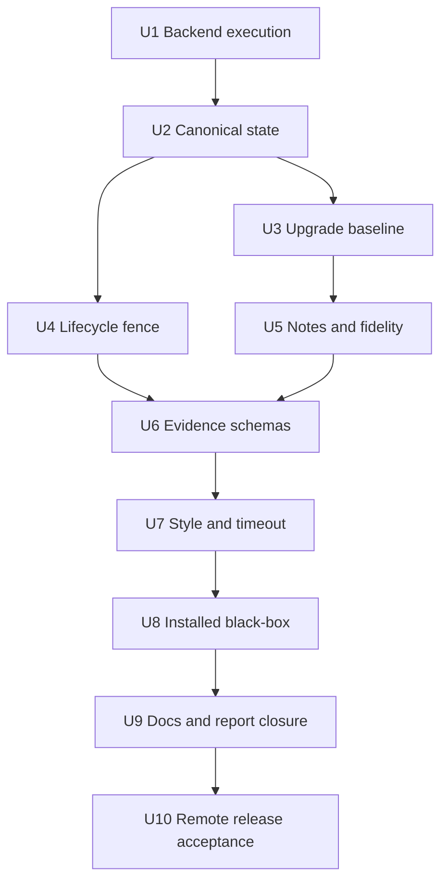

# Leo PPT Generator Release Hardening and Review Closure Plan

## Goal Capsule

- **目标：** 把审查报告中的 18 个发布缺口逐个关闭，使 `leo-ppt-generator` 从“本地确定性骨架”升级为可安装、可配置、可稳定执行、四条 route 可闭环且交付证据可信的 Skill。
- **推荐方法：** 不按报告顺序做孤立补丁；先修 backend execution、唯一状态真值、upgrade baseline 和终态 fence 四个根因，再修 PPT 保真与 evidence schema，最后做安装后黑盒和发布验收。
- **完成口径：** 每个问题都必须拥有独立的行为修复、负向/正向测试、安装后证据和文档状态；局部单测通过不等于问题完成。
- **决策焦点：** 唯一 canonical state、凭据解析安全边界、upgrade 基线不可变性、cancel/finalize 终态、PPT 视觉/notes 真值和现场验收 claim ceiling。
- **验证焦点：** clean install 后只使用绝对 `leo-ppt` 走四条 route；禁止通过 direct import、手写私有状态或 fixture provider 冒充现场结果。
- **最大风险：** 真实 provider、PowerPoint 桌面、人工逐页验收和远端 tag 属于外部证据；本地实现不能伪造这些完成状态。
- **停止条件：** 任一非补偿 gate 失败、报告状态与证据不一致、`third_party/` 重现、bundle 出现第二个 `SKILL.md`，或需要未获授权的 commit/push/tag 时停止相应发布动作。

---

## Product Contract

### Problem Frame

用户真正要解决的不是“让 169 个测试继续全绿”，而是让一个外部用户从安装开始，经初始化、配置、路由、执行、恢复、交付和验收，始终面对一个可信的 Skill、一个 CLI、一套状态真值和一套不夸大的完成证据。

审查报告中的 18 个问题不是等价的独立缺陷。backend contract 未进入执行层、顶层与 vendor 双状态、upgrade 无基线和 finalize/cancel 无 fence 是深层结构问题；notes、provenance、视觉验证、replay、黑盒旅程和发布可达性是这些结构问题在交付层的表现。若逐条局部打补丁，会继续产生平行状态、重复 schema 和不可验证的“绿色”。

### Scope

本计划覆盖审查报告 P1-01 至 P1-10、P2-01 至 P2-08，以及报告状态更新、release suite、安装/配置/教程/MIT/README 的最终一致性。

本计划不把以下外部事实伪装成本地完成：真实 OpenAI/Atlas 请求成功、在线 OCR、Microsoft PowerPoint 桌面打开、人工逐页视觉/演讲验收、非已发布平台矩阵、远端 commit/tag 安装。它们必须以独立 receipt 或 `外部验收待定` 状态表达。

### Requirements

#### State and execution

- R1. 每个 run 只允许一个顶层 canonical state；vendor 只保留算法与格式工具职责，不再拥有用户可见的并行任务真值。
- R2. backend contract 的 hash、provider、model、credential reference、timeout 和 retry 必须进入实际执行，并生成不含秘密的 execution receipt。
- R3. 任何 dispatch、record、finalize、replay 都必须校验 run 冻结的 backend identity、lifecycle generation 和当前 lease。
- R4. cancel 后的迟到结果、旧 lease、并发 finalize 和丢响应重试必须 fail closed，且不能创建新 delivery。

#### Upgrade and fidelity

- R5. `upgrade-full` 与 `upgrade-selected` 都必须从已完成 image delivery 导入同一份不可变 baseline；页序、尺寸、图片、notes、source/delivery hash 全部绑定。
- R6. partial hybrid 必须由 propose/confirm 两阶段 receipt 驱动；失败集合改变时旧确认自动失效。
- R7. speaker notes 必须从输入/baseline 经 prepare、record、PageArtifact、finalize 到最终 PPTX 全链路保留，并以 text hash 校验。
- R8. 图片式 PPT 默认无损嵌入，显式使用 contain/crop/letterbox 策略；不允许静默降质或双轴拉伸。
- R9. replay fingerprint 必须覆盖 page order、尺寸、source/artifact/manifest/validation/notes identity、selection、failures 和 assembly policy。

#### Evidence and product truth

- R10. validation、preview、manifest、source、validator 及最终 PPTX 必须拥有可追溯 identity；同一 worker 的布尔自证不能成为独立质量证据。
- R11. 公式完整性必须从 source-side expected inventory 到 manifest/validation/finalize 闭环，不能靠 worker 是否写入公式条目决定。
- R12. image provenance 必须包含 provider、model、endpoint class、prompt/input/reference hash 和 provider receipt identity，且日志、状态和报告不得包含 secret。
- R13. 人工验收必须通过正式命令记录，并绑定 PPTX hash、客户端/版本、逐页结论、验收人和时间；未记录时保持 `not_run`。
- R14. “视觉近似重建”“对象级可编辑”“模板/母版/主题语义保留”必须作为不同能力声明和 gate，不能互相替代。
- R15. 自定义 style 必须有持久化 loader、重名确认、隐私过滤、跨 run 优先级和可执行测试。

#### Installation and release

- R16. 发布支持矩阵必须与实际 lock 一致；本轮默认诚实收窄为 Python 3.12 + macOS arm64，其他平台在拥有真实 lock 和黑盒证据前不声明支持。
- R17. clean temp 安装后必须只通过绝对 console script 完成四 route 的成功、replay、失败保留和报告验证；测试不得 direct import adapter/RunIndex 或手写领域状态。
- R18. 只有在本地 release gates 全绿且用户授权 commit/push/tag 后，才能关闭远端安装问题；远端全新 HOME 安装是最后证据。
- R19. `skills/leo-ppt-generator/third_party/` 必须不存在，bundle 内只能有一个 `SKILL.md`，README 不恢复用户禁止的审计性短语。
- R20. 每个审查问题只能按 `待处理 → 实施中 → 已完成` 或 `外部验收待定` 转换，且状态旁必须记录证据路径；后续回归失败要重新打开。

### Acceptance Flows

- F1. 新用户从固定远端 ref 安装 Skill，执行 ensure/doctor/configure，获得唯一绝对 CLI 和与平台匹配的 runtime。
- F2. 用户从内容创建 `generate` run，provider execution 与 canonical image state 一致，最终图片 PPTX 无静默压缩/拉伸，notes、provenance 和验收状态可查。
- F3. 用户从图片/PDF/PPTX 创建 `direct-editable` run，所有页从 canonical editable state 完成，notes 和 validation refs 出现在 delivery summary。
- F4. 用户从已完成 image delivery 导入 upgrade baseline，分别完成 full 和 selected；selected 的 partial confirmation 只能确认被冻结的失败集合。
- F5. 用户 cancel 活跃 run 后，旧 worker 的 record/finalize 被 generation/lease fence 拒绝；并发 finalize 只产生一个 revision 和一个 delivery。
- F6. 发布负责人从 wheel 与 Skill bundle 分别 clean install，执行完整矩阵，核对 MIT、README、教程、限制、inventory 和文件树。

---

## Planning Contract

### Five-Lens Review

#### 第一重审视：问题与领域

**这一重审视改变了什么：** 把问题从“逐条修 18 个 bug”改写为“建立可证明的用户交付系统”。领域不只是 Python 工程，还包括可靠性工程、凭据安全、可复现构建、PPT/Open XML 保真和产品 claim governance。错误定义会导致测试数量增加但安装后旅程仍然断裂。

#### 第二重审视：领域大师理论体系与判断主轴

采用三组长期有效的体系作为判断工具：Deming 的系统质量与特殊/共同原因区分，要求优先修共同根因而不是追逐表面缺陷；Parnas 的信息隐藏与单一设计决策 owner，要求状态、凭据和 baseline 各只有一个权威边界；可靠性工程的幂等、fencing token、write-ahead/atomic commit 和非补偿 gate，要求失败不能被其他绿色指标抵消。PPT 侧使用 OOXML 包关系与 source-of-truth 思路，将视觉像素、对象可编辑性、notes、theme/master 视为不同语义层。

**这一重审视改变了什么：** 确立“唯一真值 + 不可变输入 + fenced mutation + 独立 evidence”四条判断主轴；测试数量、文件字节一致和 worker 自报只作为次要证据。

#### 第三重审视：关键事实与综合理论体系

当前源码证明：`RunIndex` 冻结 backend contract 但 `upstream_bridge` 不消费；image/editable adapter 各有顶层 jobs，而 vendor 仍暴露另一套状态命令；upgrade run 没有 image delivery baseline；finalizer 在共享事务外读写；PageArtifact 未绑定 validation hash；image assembler 会压缩并双轴铺满；人工验收固定 `not_run`。因此系统表层是 18 个缺口，中层是跨层合同没有贯通，深层是多个 owner 同时声称拥有状态和完成真值。

综合模型为：用户交付可信度 = 安装可达性 × 输入/凭据真实性 × canonical state 一致性 × 输出语义完整性 × 独立验证 × 现场证据。该模型是乘法关系，任一项为零时其他本地测试不能补偿。

**这一重审视改变了什么：** 将实现顺序从 P1/P2 编号顺序改为根因依赖顺序，并把“报告改为已完成”放到每个 gate 的最后一步。

#### 第四重审视：反方压力与结论前提辩证分析

最强反方是：这是一个本地 Skill，不应为尚未发生的并发、host broker、PowerPoint 现场和多平台构建引入过度工程；保留 vendor 原状态机可降低上游同步成本，文档诚实声明限制可能比重构可靠。这个反方在“产品只做内部技术预览、单用户、fixture provider、无需公开发布”时成立。

但当前目标明确是公开可安装、高质量交付且完整集成两上游；审查已观察到双状态、凭据断链、upgrade 不可达和 cancel/finalize 终态矛盾，不是纯假设。最佳折中不是建设分布式平台，而是在本地文件系统范围内实现最小 run lock、generation/lease、原子交付和 capability-gated resolver；同时把未获现场证据的能力保持为待验收。

关键前提及判断动作：canonical state 可由顶层 adapter 承担是源码事实，前提通过；macOS Keychain/host broker 的具体宿主可用性尚未验证，因此做 capability gate 和 fake broker 测试，真实 receipt 待定；Python 跨平台支持没有 lock 证据，因此收窄边界；远端发布需要用户授权，因此不能在本地关闭。

**这一重审视改变了什么：** 淘汰“保留两套状态再做同步”和“一次性建设通用 scheduler”两种极端方案，选择本地、窄边界、可证伪的可靠性实现。

#### 第五重审视：全貌理解与可验证收束

系统应被理解为一条证据链：安装身份 → 冻结 request/backend → canonical domain mutation → immutable baseline/artifacts → atomic delivery → structural/visual/manual evidence → release identity。每个阶段只接受上游阶段的 hash/receipt，不接受自由字符串或可变路径作为完成依据。

**这一重审视改变了什么：** 明确最终收束不是“源码写完”，而是 18 个问题各自有测试和证据、四 route 安装后黑盒通过、外部项诚实留待验收、最后才更新报告和远端发布状态。

### Bidirectional Steelman by Finding

| ID | 支持当前修复方向的最强论证 | 反对/替代方案的最强论证 | 真正分歧与关键变量 | 推荐方案与完成 gate |
| --- | --- | --- | --- | --- |
| P1-01 | 正式文档指向远端，远端不可达使产品入口为零。 | 本地未提交阶段本就不应要求远端可用，提前发布会固化缺陷。 | 分歧是“本地完成”还是“公开可安装”；变量是发布授权和固定 ref。 | 最后处理；本地 gates 全绿后经授权发布，再从全新 HOME 按原命令验收。此前标 `外部验收待定`。 |
| P1-02 | 兼容声明会直接决定用户是否尝试安装，错误声明是确定性失败。 | 收窄到单平台降低产品覆盖面，补齐全矩阵更理想。 | 分歧是广覆盖承诺还是证据充分；变量是 lock 构建与 CI/真机资源。 | 本轮收窄为 Python 3.12/macOS arm64；矩阵负向测试确保其他平台明确 fail-fast。 |
| P1-03 | 合同未被执行消费意味着 provider/凭据选择只是文档幻觉。 | secret broker 增加攻击面，env-only 更简单安全。 | 分歧是保留多来源能力还是删除未实现声明；变量是 resolver 安全性与宿主能力。 | 建唯一 execution adapter；env/Atlas/Codex auth-file 可执行，host/keychain capability-gated；fake broker 全链路与脱敏 receipt 通过。 |
| P1-04 | 双状态可产生相互矛盾的 pending/completed，是所有恢复和 provenance 的根因。 | vendor 状态机成熟，删除会增加上游同步成本。 | 分歧是同步两套真值还是只保留一个 owner；变量是 vendor 算法能否无状态调用。 | 顶层 state 为唯一权威；vendor stateful CLI 从公开面移除或适配到同 repository，禁止第二份 jobs/state。 |
| P1-05 | 没有 immutable image baseline，upgrade 的“升级”语义不可证明。 | 同 run 直接读取现有图片更简单，另建 import 合同显得繁重。 | 分歧是路径引用还是内容身份；变量是跨 run、失败恢复和原 delivery 可用性。 | 新增 inspect/import-baseline；full/selected 只从 baseline 派生，hash/page order/size/notes 全绑定。 |
| P1-06 | CLI 自签确认使用户从未确认具体失败集合。 | 单用户 CLI 额外两阶段会增加摩擦。 | 分歧是便利布尔值还是可审计知情确认；变量是失败集合是否可能漂移。 | propose/confirm receipt；主体、时间、集合 hash 绑定，任何集合变化拒绝旧 receipt。 |
| P1-07 | cancel 后迟到写入与并发 finalize 会破坏终态、隐私和 revision。 | 本地单进程下概率低，完整调度系统会过度设计。 | 分歧是必要本地 fence 还是分布式 scheduler；变量是重试/并发是否真实存在。 | 只实现本地 run mutation lock、generation/lease、temp+fsync+rename 和单事务 delivery，不建设 daemon。 |
| P1-08 | 静默 JPEG 降质和拉伸直接破坏 PPT 最终视觉。 | 大图无损会显著增加文件体积，crop/contain 也需产品选择。 | 分歧是质量优先还是体积优先；变量是尺寸、透明度和目标显示。 | 默认无损，显式 fit policy；门控像素/比例，记录嵌入 hash 并重渲染比较。 |
| P1-09 | notes 是演讲交付的一部分，丢失即语义不完整。 | 部分输入没有 notes，把它设为必需可能增加空字段负担。 | 分歧是“字段必需”还是“内容非空”；变量是源是否含 notes。 | 合同字段和 hash 必需，文本可为空；源有 notes 时必须逐页一致。 |
| P1-10 | 直接 import 和手写状态绕过了真实安装/CLI 缺陷。 | 全黑盒测试慢且难诊断，单元/集成测试仍有价值。 | 分歧是替代还是分层；变量是运行成本。 | 保留快速测试，同时新增安装后绝对 CLI 四 route 非绕行套件，作为发布 gate。 |
| P2-01 | 文字合同不能证明跨 run 保存、冲突和隐私。 | style 本可由 Agent 文件操作完成，不一定需要 runtime API。 | 分歧是 Agent 约定还是产品行为；变量是跨宿主一致性。 | 增加最小 style store/CLI 和 eval；用户 style 优先、重名确认、敏感内容过滤。 |
| P2-02 | 无顶层 timeout 会永久卡住且无状态反馈。 | 某些 provider/Office 操作耗时不确定，固定 timeout 会误杀。 | 分歧是无限等待还是可配置 deadline；变量是操作类型和 child tree。 | contract timeout 传入 bridge，超时终止进程组、记录 reason/receipt，允许受限配置。 |
| P2-03 | validation 文件可替换且 summary refs 为空，完成证据可漂移。 | 每个 hash 增加 schema 和迁移成本。 | 分歧是路径可用还是内容不可变；变量是 replay/审计需求。 | PageArtifact schema 升级，绑定 validation/preview/validator identity；delivery 返回逐页 refs。 |
| P2-04 | worker 自填 quality booleans 不独立，无法证明视觉质量。 | 自动视觉指标也不能替代专家判断，过强 gate 会误判。 | 分歧是结构证据、机器证据和人工证据各自上限；变量是 PowerPoint/renderer 可用性。 | 分层 evidence：结构必过、独立 render/字体/对比/遮挡 receipt、PowerPoint/人工可选但发布高质量声明必需。 |
| P2-05 | 无 expected formula inventory 时“省略公式”不会失败。 | OCR/TeX 识别并不总可靠，强制 inventory 可能产生误报。 | 分歧是 source truth 的来源；变量是输入类型和提取置信度。 | prepare 生成带置信度 inventory；确认后冻结，高置信缺失 fail closed，低置信进入人工确认。 |
| P2-06 | notes/尺寸/validation 不进 fingerprint 会 replay 旧语义。 | fingerprint 太宽会导致无害 metadata 改动无法复用。 | 分歧是语义字段与非语义字段边界；变量是哪些变化会改变交付。 | 只覆盖交付语义 identity，排除时间戳/绝对路径等非语义字段，并做逐字段 mutation test。 |
| P2-07 | provenance 和人工验收不绑定最终 hash，交付链无法闭合。 | provider receipt 形态不统一，人工命令可能增加流程负担。 | 分歧是最低共同 receipt 还是 provider 专有细节；变量是 provider API 与现场角色。 | 定义最小稳定 provenance/acceptance schema，专有字段放扩展区，最终 hash 强绑定。 |
| P2-08 | 普通对象近似不等于模板/主题/母版继承，错误承诺会误导品牌用户。 | 完整保留任意模板语义成本很高，可能超出本 Skill 核心。 | 分歧是实现模板保留还是收窄声明；变量是输入 OOXML 复杂度。 | 本轮明确区分并只承诺视觉重建/对象可编辑；模板语义标为不支持，增加检测和文档 gate。 |

### Key Technical Decisions

- KTD1. **Canonical state owner：extend。** 扩展 `application/run_index.py` 及顶层 domain repository，使其成为 lifecycle、backend identity、baseline、lease、delivery 的唯一 owner；image/editable adapter 通过同一 mutation API 操作。vendor 保留算法和格式能力，不保留公开业务状态。
- KTD2. **Backend execution：compose / thin-glue。** 新建窄 execution adapter，只负责读取冻结 contract、调用 capability-gated credential resolver、构造最小 vendor env、deadline/retry、脱敏 receipt。provider 算法仍由 vendor owner；secret 不进入 run state。
- KTD3. **Credential policy。** `env:`、Atlas env 和经用户明确引用的 Codex auth file 为本轮基础能力；`keychain:` 与 `host:` 只有 resolver readiness 通过才执行，否则 doctor/execute 同一 reason code fail closed。不得静默回退到其他 provider 或 ambient credential。
- KTD4. **Upgrade baseline：new boundary。** baseline 是跨 run 的不可变交付合同，不属于 image/editable 任一内部 jobs 文件；由顶层 upgrade owner 写入一次并以内容 hash 引用。
- KTD5. **Lifecycle fence：extend。** 在本地文件系统模型内加入 run-level mutation lock、generation 和一次性 lease；不引入数据库、daemon 或分布式 scheduler。
- KTD6. **Schema evolution。** PageArtifact、delivery、baseline、execution receipt、partial confirmation 和 manual acceptance 使用显式 schema version；旧 v1 可读但不能生成新 release delivery，迁移发生在受控 import/prepare 边界。
- KTD7. **PPT fidelity。** 默认无损、比例策略显式、notes/content identities 纳入 assembly；theme/master 保留不在本轮实现范围，产品声明收窄。
- KTD8. **Evidence independence。** worker manifest 只能作为声明；validator/render/PowerPoint/manual receipts 分层记录，不以单一布尔合并为“高质量已通过”。
- KTD9. **Compatibility。** 在缺少其他平台 lock 和执行证据时，公开支持收窄到 Python 3.12 + macOS arm64；后续平台逐个通过同一 installed black-box gate 后再扩张。
- KTD10. **Review status governance。** 审查报告增加统一状态与证据字段。每个实现单元完成后只更新其已通过的 finding；涉及真实 provider、PowerPoint 或远端发布的 finding 可保持 `外部验收待定`。

### Dependency Order

### Evidence and Limitations

- 当前源码身份为 `2230fa83bf358a64386d21b97765c5421d4537df`，工作树存在大量已修改和未跟踪文件；执行时必须保留用户现有改动，不能用 reset/checkout 清理。
- CodeGraph 当前索引混入 `.agents` 且未覆盖未提交 Skill 主体，只用于发现索引 freshness 风险；本计划的关键判断以 `docs/three-round-skill-product-review-2026-08-21.md`、当前 `skills/leo-ppt-generator/runtime/src/` 和 `tests/` 为依据。
- 真实 provider、在线 OCR、PowerPoint 桌面、人工逐页验收和远端发布在当前计划阶段无新证据，不能计入 implementation-ready 的本地执行完成度。
- `skills/leo-ppt-generator/third_party/` 必须持续不存在；所有修改发生在项目-owned source、vendor durability patch、tests 和 docs 内。

---

## Implementation Units

### U1. Backend execution and credential boundary

- **Goal:** 关闭 P1-03，并为 P2-02、P2-07 提供执行真值。
- **Files:** `skills/leo-ppt-generator/runtime/src/leo_ppt_generator/config/backend_contract.py`、`skills/leo-ppt-generator/runtime/src/leo_ppt_generator/upstream_bridge.py`、新增 `skills/leo-ppt-generator/runtime/src/leo_ppt_generator/backend_execution.py`、相关 schema 与 `tests/unit/test_backend_contract.py`、`tests/integration/test_upstream_bridge.py`。
- **Behavior:** 从 run 冻结 contract 构建 execution context；验证 contract hash；解析 allowlist reference；映射 OpenAI/Atlas/Codex OAuth；应用 deadline/retry；输出脱敏 receipt；不读未声明 ambient secret。
- **Test scenarios:** env/Atlas/Codex auth-file/host/keychain fake resolver 正向；缺 resolver、hash drift、未知 ref、secret 泄露、provider mismatch、timeout/retry exhaustion 负向；日志和 JSON 全树 secret scan。
- **Done evidence:** fake-server 跨层调用准确收到 provider/model/base URL/auth，run 只保存 reference 与 receipt hash。

### U2. Canonical image and editable state

- **Goal:** 关闭 P1-04，消除恢复、进度和 provenance 的双真值。
- **Files:** `application/run_index.py`、`image_deck/adapter.py`、`editable/adapter.py`、`cli.py`、`upstream_bridge.py`、`references/image-deck-workflow.md`、`references/editable-workflow.md`、`tests/boundary/test_vendor_state.py`、`tests/integration/test_stable_workflow_commands.py`。
- **Behavior:** domain mutation 必须经过 RunIndex-owned repository；dispatch/record 校验 backend receipt 和 lifecycle；vendor stateful 命令不再创建第二份 jobs/state，公开 help 不再教用户进入双状态路径。
- **Test scenarios:** 每个公开 prepare/dispatch/record/status/finalize 后全树只能发现一份 domain truth；vendor/top 交叉调用结果原子一致；backend 或 generation 漂移 fail closed。
- **Done evidence:** canonical-state test 枚举 run 全部 JSON 并证明无第二业务状态文件；四 route status 与 delivery 同源。

### U3. Immutable upgrade baseline and partial confirmation

- **Goal:** 关闭 P1-05、P1-06。
- **Files:** `cli.py`、`application/routes.py`、新增 `upgrade/baseline.py` 与 baseline/confirmation schema、`hybrid/assembler.py`、`tests/integration/test_cli_protocol.py`、`tests/unit/test_hybrid_assembler.py`。
- **Behavior:** `upgrade inspect` 只读验证 image delivery；`upgrade import-baseline` 一次性冻结；full/selected 从 baseline 派生；partial 先 propose 再 confirm，receipt 绑定 actor/time/failure set/baseline/selection。
- **Test scenarios:** 合法导入/replay；源 deck、图片、notes、页序、尺寸、PPTX 任一变化拒绝；full happy path；selected happy path；旧确认在失败集合变化时拒绝。
- **Done evidence:** installed CLI 不手写私有状态即可从 image delivery 完成两条 upgrade route。

### U4. Lifecycle fencing and atomic finalize

- **Goal:** 关闭 P1-07，并覆盖 P2-02 的进程终止语义。
- **Files:** `lifecycle.py`、`application/run_index.py`、`storage.py`、三个 finalizer、`observability.py`、`tests/boundary/test_atomic_state.py`、`tests/integration/test_run_lifecycle.py`。
- **Behavior:** 所有 mutation/finalize 使用 run lock；dispatch 发行 generation-bound lease；cancel 增加 generation 并撤销 lease；record/finalize 检查 terminal state；交付以 temp+fsync+atomic rename 与 revision 同事务提交。
- **Test scenarios:** 两进程并发 finalize、finalize 丢响应重试、cancel 后迟到 record、旧 lease replay、crash at each checkpoint、timeout 杀 child tree、相同 operation replay。
- **Done evidence:** 压力循环中始终只有一个 delivery/revision，cancelled run 无新增 artifact。

### U5. PPT fidelity, notes and semantic replay

- **Goal:** 关闭 P1-08、P1-09、P2-06、P2-08。
- **Files:** `contracts.py`、image/editable/hybrid assembler、vendor `assemble_ppt.py` 与 durability patch ledger、editable builder、相关 schema、`tests/ppt_fixtures.py`、`tests/unit/test_adapters.py`、`tests/unit/test_hybrid_assembler.py`、`tests/upstream/test_capability_behaviors.py`。
- **Behavior:** PageArtifact 绑定 notes hash/尺寸；image assembly 显式 fit policy、默认无损；hybrid fingerprint 覆盖所有语义 identity；输出声明区分视觉重建、对象可编辑和模板语义。
- **Test scenarios:** 透明 PNG、中文小字、图表细线、非 16:9、contain/crop/letterbox；notes 新增/删除/修改；尺寸/manifest/validation mutation；theme/master 检测与“不支持保留”报告。
- **Done evidence:** 解包 PPTX 的嵌入媒体 hash/尺寸/notes 与 delivery manifest 一致，replay mutation matrix 全部符合预期。

### U6. Independent validation, formula inventory and acceptance receipts

- **Goal:** 关闭 P2-03、P2-04、P2-05、P2-07。
- **Files:** PageArtifact/delivery schema、editable validator、`observability.py`、`cli.py`、新增 evidence/acceptance owner、`tests/unit/test_schemas.py`、`tests/integration/test_stable_workflow_commands.py`、结构与视觉 fixtures。
- **Behavior:** validation/preview/validator/source identity 全绑定；prepare 产出并冻结 expected formula inventory；独立 renderer 生成视觉 evidence；新增 manual acceptance record/show；final summary 返回逐页 refs。
- **Test scenarios:** 替换 validation/preview/validator、删除高置信公式、伪造 worker quality booleans、PPTX hash 变化后复用 acceptance、缺页结论、secret 进入 provenance 等全部拒绝。
- **Done evidence:** delivery summary 能从最终 PPTX 追到每页 source/manifest/validation/render/provenance/manual 状态，且各层 claim 独立。

### U7. Style behavior and subprocess deadline

- **Goal:** 关闭 P2-01、P2-02。
- **Files:** 新增 style store/CLI owner、`references/style-library.md`、`upstream_bridge.py`、runtime config、`tests/skill-evals/`、`tests/integration/test_upstream_bridge.py`。
- **Behavior:** style list/show/save/use，用户 style 跨 run 优先；重名需确认；私密路径/secret pattern 过滤；所有 vendor subprocess 使用 contract deadline 并终止进程组。
- **Test scenarios:** 两次独立进程跨 run 读取、内置/用户重名、恶意文件名/内容、并发保存、无 timeout、合法长任务、hang child/grandchild。
- **Done evidence:** Agent eval 与 CLI 黑盒都能证明 style 行为；hang fixture 在 deadline 后无残留 child。

### U8. Installed black-box and compatibility matrix

- **Goal:** 关闭 P1-02、P1-10，并为 P1-01 建立本地前置证据。
- **Files:** `runtime/pyproject.toml`、constraints、`scripts/runtime_manager.py`、`tests/release/test_wheel_release.py`、新增 `tests/release/test_installed_routes.py`、README/教程兼容表。
- **Behavior:** wheel 和 Skill 两种布局 clean install；只用绝对 `leo-ppt`；四 route 成功/replay/失败保留/report；不 direct import、不 seed 私有状态；不支持平台明确阻断。
- **Test scenarios:** Python 3.12 macOS arm64 正向；3.10/3.11/3.13、Intel/Linux/Windows lock selection 负向或真实 lock 正向；从非 Skill cwd 执行；ensure installed→reused；唯一 Skill/CLI。
- **Done evidence:** isolated site-packages 与 fresh Skill HOME 两套黑盒结果及 inventory hash。

### U9. Documentation and finding-by-finding closure

- **Goal:** 让 README、用户教程、限制、兼容、测试和审查状态与最终行为同源。
- **Files:** `README.md`、`docs/user-guide.md`、`docs/testing.md`、`docs/compatibility.md`、`docs/limitations.md`、`SKILL.md`、工作流 references、`docs/three-round-skill-product-review-2026-08-21.md`、`tests/release/test_release_docs.py`。
- **Behavior:** 每个 finding 增加状态、关闭证据和剩余外部 gate；只有对应测试/receipt 通过后改为 `已完成`；文档命令全部从 clean install 复演。
- **Test scenarios:** 链接/命令/支持矩阵/route/claim 自动核对；禁止短语、`third_party/`、第二个 SKILL、Skill README、许可证 drift 回归。
- **Done evidence:** 18 项逐条状态均与可执行证据一致；外部项保持待定，不以汇总数字替代。

### U10. Remote release acceptance

- **Goal:** 最终关闭 P1-01。
- **Files:** 无预设源码修改；发布后只更新 release identity 与审查证据。
- **Behavior:** 仅在用户明确授权后 commit/push/tag；从真实 origin 固定 ref 在全新 HOME 按 README 原命令安装并重跑关键黑盒。
- **Test scenarios:** tag/commit pin、唯一 Skill、双布局、ensure reused、四 route doctor、绝对 CLI、license/inventory hash。
- **Done evidence:** 真实远端 clone/install receipt。未授权或未发布时必须保持 `外部验收待定`。

---

## Verification Contract

| Gate | 覆盖 | 必须证据 | 不可替代项 |
| --- | --- | --- | --- |
| V1 Backend | U1 | fake server/resolver 跨层请求、脱敏 execution receipt、timeout/retry | dry-run 或 contract parse |
| V2 Canonical state | U2 | 全 run 树状态枚举、交叉入口一致性、无第二 jobs/state | 单一 adapter 单测 |
| V3 Upgrade | U3 | baseline mutation matrix、full/selected installed happy path、partial receipt | 手工 seed adapter |
| V4 Terminal safety | U4 | 多进程 finalize、cancel late result、crash checkpoint、child tree timeout | 单线程 replay |
| V5 PPT semantics | U5 | 嵌入 media hash、比例策略、notes hash、semantic fingerprint mutation | 源图片 hash |
| V6 Evidence | U6 | validation/preview/validator identity、formula inventory、render/manual schema | worker `passed=true` |
| V7 Style/deadline | U7 | 跨进程 style eval、冲突/隐私、hang process tree | 文档文字断言 |
| V8 Installed routes | U8 | wheel + Skill clean install、绝对 CLI 四 route、平台矩阵 | direct import e2e |
| V9 Regression | U1-U9 | 169 当前套件、58 capability、82 editable、U0、vendor lock、静态检查 | 任一子集 |
| V10 Field acceptance | U9-U10 | 真实 provider、PowerPoint、逐页人工 receipt、远端 fixed-ref install | fixture/LibreOffice/本地路径 |

执行方向采用 characterization-first：每个 finding 先增加能复现审查缺口的失败测试，再做最小 canonical-owner 修复；focused gate 通过后跑相关根因簇，最后才跑全量 release suite。Python 验证统一设置 `PYTHONDONTWRITEBYTECODE=1`。固定 vendor 只做登记的 durability patch，不使用 Ruff 自动改写。

最终测试必须包括：当前全量 pytest、58 项 capability proof_case 逐项、editable 82、U0 隔离、vendor sync/check、wheel build/install、Skill bundle install、四 route 黑盒、schema/文档/license/inventory、`third_party/` 不存在和 bundle 单一 `SKILL.md`。

---

## Definition of Done

- D1. P1-02 至 P1-10、P2-01 至 P2-08 每项都有源码修复或明确的产品边界收窄、正向/负向测试、安装后证据和审查报告状态。
- D2. P1-01 只有在真实远端固定 ref 安装通过后为 `已完成`；否则明确为 `外部验收待定`，不能由本地 wheel 代替。
- D3. 四 route 从 clean install 的绝对 CLI 完成 happy path、replay、失败保留和最终 summary；测试没有 direct import adapter/RunIndex、没有手写领域状态。
- D4. canonical state、upgrade baseline、lease/finalize fence、notes、PPT 嵌入保真、validation identity、formula inventory、provenance 和 manual acceptance 均通过独立 mutation/negative tests。
- D5. 所有非补偿 release gates 全绿；第 8 类回归测试不能补偿第 1-7 类失败。
- D6. README、用户教程、兼容性、限制、MIT 和 SKILL/reference 与实际行为一致；用户禁止的审计性短语不出现。
- D7. `skills/leo-ppt-generator/third_party/` 不存在，bundle 只有一个 `SKILL.md`，不恢复 `skills/leo-ppt-generator/README.md`。
- D8. 真实 provider、PowerPoint、人工验收等未执行证据保持 `not_run`/`外部验收待定`，不从 fixture 外推。
- D9. 工作树中的用户既有改动未被清理、覆盖或错误归因；未经授权不 commit、不 push、不建 PR、不发布 tag。
- D10. 审查报告中的完成状态可从证据路径反查；任何后续回归失败会重新打开相应 finding。
