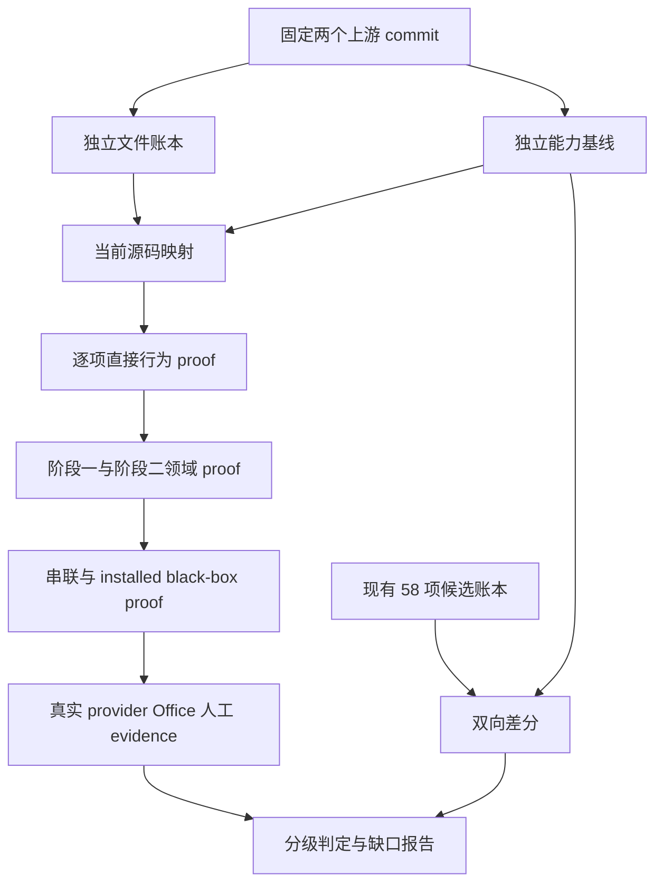

# Upstream Capability Integration Review - Plan

## Goal Capsule

| 项目 | 内容 |
| --- | --- |
| 目标 | 独立重建两个固定上游版本的应继承能力基线，并判断当前项目是否完整、等价且可验证地集成了这些能力 |
| 推荐方法 | 采用“源能力基线 → 文件与合同映射 → 行为 proof → 跨阶段 proof → 现场 claim ceiling”的五层审查，而不是目录比对或聚合测试 |
| 权威顺序 | 固定上游源码与测试 > 上游合同文档 > 当前源码与测试 > 当前能力账本与审计报告 > Graphify/CodeGraph 导航结果 |
| 决策重点 | 区分 `完整继承`、`适配后等价`、`增强且不弱化`、`明确排除`、`缺失/退化`，并逐项给出可复核证据 |
| 验证重点 | 58 项现有声明必须逐项独立复核；两阶段各自可用不等于串联闭环成立；最终 PPTX 存在不等于对象级可编辑和视觉可接受 |
| 最大风险 | 当前 `upstream-capabilities.yaml`、对应测试和既有审计报告可能互相引用形成自证循环 |
| 停止条件 | 上游 commit 无法固定、工作树内容与固定 commit 不一致、能力边界需要产品裁决，或真实 provider/Office/人工验收证据缺失时，降低结论而不是推测通过 |

## Product Contract

### Problem Frame

当前项目声称集成并编排 `codex-ppt-skill` 与 `image-to-editable-ppt-skill`，形成“内容生成图片式 PPT，再重建为对象级可编辑 PPT”的完整工作流。两个上游项目的社区验证只能证明它们在各自版本和环境中的能力，不能自动证明当前项目复制、适配、封装和串联后的能力完整性。

本审查需要先从固定上游事实反向生成应继承能力基线，再核对当前项目，而不是让当前项目已有的 58 项能力账本定义自己的通过标准。审查目标是形成可证伪、逐项可追溯的判断，不实施修复，也不把测试绿色外推为真实 provider、PowerPoint 或人工视觉质量。

### Requirements

**基线与范围**

- R1. 审查固定 `codex-ppt-skill@f2ed80372f65bb05fe62dd07979b239a17ac065d` 与 `image-to-editable-ppt-skill@fb869763127fd31ba7288d905671ffc4ea542f60`，并记录当前项目源码身份与 dirty worktree 限制。
- R2. 能力基线必须独立来源于两个上游的 `SKILL.md`、执行文档、prompt、CLI、源码、测试和 fixture；当前 `skills/leo-ppt-generator/upstream-capabilities.yaml` 仅作为复核对象。
- R3. 基线必须覆盖正常路径、确认门禁、状态与恢复、输入输出合同、provider/依赖、异常路径、质量验证、交付报告和明确限制，不能只枚举用户可见命令。
- R4. 上游内部实现细节只有在承载用户能力、稳定合同、失败保护或质量证明时才进入“应继承”集合；纯安装方式、仓库布局和已被当前受管 runtime 等价替代的机制可列为候选排除项。

**映射与判定**

- R5. 每项上游能力必须映射到当前 owner、入口、相关源码、直接 proof、跨阶段影响及处置类别；没有独立 proof 的条目不得判为完整。
- R6. `adapted`、`enhanced` 或 `replaced` 必须证明上游可观察语义未弱化，并说明新旧入口、错误行为、状态和产物的差异。
- R7. 文件账本必须覆盖两个上游范围内的全部相关文件，逐个标记 `exact-copy`、`patched`、`merged`、`adapted`、`replaced`、`excluded` 或 `missing`；聚合数量不能替代路径账本。
- R8. 当前已有的 58 项声明必须逐项与独立基线做双向差分：找出上游有而账本无、账本有而上游证据不足、多个能力被错误合并，以及一项 proof 被不当地复用为多个结论。

**行为与链路**

- R9. `codex-ppt` 阶段必须验证从需求、大纲/内容/风格/后端/样张门禁，到逐页派发、结果记录、QA、speaker notes 和图片式 PPTX 的完整行为链。
- R10. `image-to-editable-ppt` 阶段必须验证输入规范化、逐页 manifest、worker 隔离、对象重建、结构验证、失败恢复、speaker notes 和最终可编辑 PPTX 的完整行为链。
- R11. 串联审查必须证明第一阶段交付的页序、尺寸、图片 identity、notes 和 provenance 能被第二阶段稳定消费，并验证 `generate → upgrade-full` 与 `generate → upgrade-selected` 的正反向场景。
- R12. 必须区分结构可编辑、对象可编辑、文字可编辑、视觉相似、公式保真、notes 保留、theme/master 保留；不得用一个“PPTX 可打开”结论替代这些维度。

**证据与报告**

- R13. 证据按 `source-contract`、`deterministic-test`、`installed-black-box`、`real-provider`、`Office-render`、`human-acceptance` 分层，每项结论不得超过其最高证据等级。
- R14. 聚合测试只用于回归概览；最终能力判定必须记录逐项命令、退出状态和 artifact/evidence 路径。
- R15. 最终报告必须先列问题，按严重度排序，并为每项给出上游依据、当前证据、影响、最强反方、判定和最小修复 owner；没有问题时也要明确剩余测试缺口和现场风险。
- R16. 审查只读三个项目的源码；所有审查计划、账本和报告只写入当前项目。未经单独授权，不修改实现、不修复、不提交、不推送。
- R17. 真实 provider、Office、人工验收和安装验证产生的证据必须脱敏落盘：禁止记录令牌、认证文件原文、环境变量值、完整请求头、原始私密日志或可恢复凭据；只允许记录能力状态、脱敏错误、命令退出状态、artifact 路径、必要哈希和 receipt 元数据。

### Acceptance Examples

- AE1. 某上游能力对应文件已逐字节 vendored，但当前顶层入口不可达或缺少错误处理测试时，判为“源码存在、集成未证明”，不能判为完整。
- AE2. 当前 runtime 替代了上游安装脚本，且 clean install、doctor、依赖锁和失败提示覆盖原可观察能力时，可判为“替代后等价”。
- AE3. 单元测试能生成 PPTX，但未验证真实 PowerPoint 渲染和对象编辑时，只能证明确定性结构合同，现场可编辑性保持待验证。
- AE4. 58 项候选账本全部有测试，但独立基线发现第 59 项上游失败恢复能力未被登记时，整体结论必须是“不完整”。

### Scope Boundaries

- 审查对象为三个本地仓库的当前固定版本；不评价上游社区声誉，也不重新设计 PPT 产品。
- 上游仓库只读。当前项目仅允许新增或更新审查类 Markdown/JSON/YAML 证据；任何实现修复应另立 `spec-work` 范围。
- 网络 provider、在线 OCR、PowerPoint 桌面和人工视觉验收仅在具备真实条件时执行；未执行时保留 `not-run`，不能由 mock 或 fixture 补偿。

## Planning Contract

### Key Technical Decisions

- KTD1. **基线生成优先，现有账本后验比对。** 先从两个上游独立抽取能力，再读取当前 58 项映射进行差分，避免以被审对象定义审查标准。
- KTD2. **复用 + 组合的架构视角。** 上游算法与领域状态可复用；当前项目的 adapter、route、run index 和 hybrid/upgrade 是组合层。完整性要求两类 owner 各守边界，并由跨阶段证据连接。
- KTD3. **能力原子化。** 一项能力必须能对应一个可观察行为和一个明确失败条件；把多个门禁或多个恢复行为合成一项会掩盖缺口。
- KTD4. **非补偿式门禁。** 源码映射、顶层可达、合同不弱化、直接行为 proof、端到端 proof 五项互不补偿；任一关键项失败即不能判为完整。
- KTD5. **独立 Judge。** 清单一致性测试只证明账本自洽；能力成立必须由不依赖该账本内容的测试、真实产物检查或人工验收证明。
- KTD6. **结论分级。** 最终只使用 `confirmed-complete`、`equivalent-adaptation`、`enhanced-no-regression`、`intentional-exclusion`、`missing-or-regressed`、`not-proven` 六种状态，禁止含糊的“基本支持”。
- KTD7. **证据脱敏。** 审查 evidence 目录是可分享的审计产物，不是诊断转储；采集器在写入前过滤 secret-like keys、认证文件内容、Authorization/Cookie 请求头、环境变量值和未脱敏 provider/Office 日志。无法安全脱敏时只记录 `redacted` 与 reason code，不保存原始值。

### High-Level Technical Design

### Evidence Provenance and Limitations

- CodeGraph 与 `graphify-out/` 仅用于定位 `upstream_bridge.py`、两个 adapter、`run_index.py`、hybrid assembler 和测试关系；重要结论回到逐文件源码、测试、日志和 PPTX 产物。
- 当前观察到的上游 HEAD 与既有账本固定 commit 一致，但执行审查时仍需重新记录 commit、dirty 状态和文件哈希。
- `docs/audits/upstream-feature-integration-audit-2026-08-21.md` 已声明 43 个上游 Python 文件和 58 项能力均有映射；该声明是审查输入，不是完成证据。
- 当前工作树已有大量修改和未跟踪文件。审查执行不得归因、覆盖或清理这些变更，报告必须记录证据来自该 dirty snapshot。

## Implementation Units

### U1. 冻结三仓证据快照

- **Goal:** 建立可复核的版本、工作树和审查范围边界。
- **Files:** `skills/leo-ppt-generator/upstreams.yaml`、`skills/leo-ppt-generator/vendor-lock.json`、两个上游的 `SKILL.md` 与 Git metadata。
- **Method:** 记录三个仓库 HEAD、dirty 状态、上游 remote/ref、相关文件全集和 SHA-256；所有后续账本引用 repository label + repo-relative path。
- **Test Scenarios:** 上游 HEAD 与 pin 一致；上游 dirty 时标记快照偏差；路径缺失或 symlink 越界时停止相关结论。
- **Output:** `docs/audits/upstream-integration/evidence/source-snapshot.json`。
- **Covers:** R1、R2、R7、R16、R17。

### U2. 独立重建上游文件与能力基线

- **Goal:** 在不读取当前 58 项能力内容作为分类输入的前提下，建立两个上游的原子能力集合。
- **Files:** 上游 `SKILL.md`、`docs/execution-flow.md`、`prompts/`、`references/`、`scripts/`、`cli/`、`tests/`。
- **Method:** 先建完整文件账本，再从入口、状态机、数据合同、异常路径、质量门禁和交付边界抽取能力；每项绑定至少一个上游 source/contract/test anchor。
- **Test Scenarios:** 每个范围文件有处置；每项能力有可观察成功行为和失败条件；纯实现辅助不被误列为用户能力；所有明确限制进入基线。
- **Output:** `docs/audits/upstream-integration/evidence/upstream-file-ledger.yaml`、`docs/audits/upstream-integration/evidence/independent-capability-baseline.yaml`。
- **Covers:** R2、R3、R4、R7。

### U3. 当前项目映射与双向差分

- **Goal:** 确认每项能力在当前项目中的 owner、入口和处置，并检验现有 58 项账本是否漏项或过度声明。
- **Files:** `skills/leo-ppt-generator/SKILL.md`、`references/`、`prompts/`、`runtime/src/leo_ppt_generator/`、`skills/leo-ppt-generator/upstream-capabilities.yaml`、`tests/`。
- **Method:** 对独立基线逐项追踪 public route → adapter → vendor/owner → state/artifact → validator；随后与现有账本做双向集合和语义差分。
- **Test Scenarios:** vendored 但不可达；adapted 入口弱化错误合同；enhanced patch 改变上游成功语义；账本 proof_case 不存在、重复或只检查字符串；上游能力未登记。
- **Output:** `docs/audits/upstream-integration/evidence/integration-traceability.yaml`、`docs/audits/upstream-integration/evidence/inventory-diff.json`。
- **Covers:** R5、R6、R8。

### U4. 两个领域阶段的逐项行为审查

- **Goal:** 独立验证图片生成阶段与可编辑重建阶段的核心能力和负向保护。
- **Files:** `tests/upstream/`、`tests/unit/`、`tests/integration/`、`tests/e2e/` 及对应 runtime owner。
- **Method:** 先校验/收集全部 proof case，再按独立基线逐项运行；检查测试断言是否验证可观察行为，而非仅检查文件存在或 literal anchor。
- **Test Scenarios:** 用户门禁未批准、缺页、错误 backend/provenance、worker 丢失、并发 lease、失败 validation、PDF/PPTX 页序、notes、manifest 对象与 finalize 拒绝。
- **Output:** `docs/audits/upstream-integration/evidence/per-capability-results.json`。
- **Covers:** R9、R10、R13、R14。

### U5. 跨阶段与安装后黑盒审查

- **Goal:** 证明两个完整领域链路被当前顶层工作流真实连接。
- **Files:** `runtime/src/leo_ppt_generator/cli.py`、`application/routes.py`、`application/run_index.py`、`image_deck/adapter.py`、`editable/adapter.py`、`hybrid/assembler.py`、发布与 e2e 测试。
- **Method:** 从 clean install 的绝对 `leo-ppt` 入口运行离线确定性 fixture，不 direct import、不手写领域完成状态；验证 `generate`、`direct-editable`、`upgrade-full`、`upgrade-selected` 及失败恢复。
- **Test Scenarios:** 全量升级；选择性升级；上游图片 hash/页序/尺寸/notes 漂移；部分确认集合漂移；第二阶段失败后第一阶段交付仍可用；重试不污染既有 delivery。
- **Output:** `docs/audits/upstream-integration/evidence/installed-e2e-results.json` 及隔离产物目录。
- **Covers:** R11、R14。

### U6. PPTX 语义与现场证据分层

- **Goal:** 防止把结构有效误判为视觉和对象级可编辑质量已验证。
- **Files:** 页面 manifest、源图、页面预览、最终 PPTX、validation 和 delivery receipts。
- **Method:** 分别检查 OOXML 结构、对象类型/数量、文本可编辑、notes、公式、页面尺寸、重渲染相似度、PowerPoint 打开与人工编辑；每层独立记录结果。
- **Test Scenarios:** 只有整页背景图；透明文字覆盖；文本变为不可编辑轮廓；对象越界/遮挡；字体替换；notes 丢失；theme/master 未保留但文档误报支持。
- **Output:** `docs/audits/upstream-integration/evidence/pptx-quality-matrix.json`。
- **Covers:** R12、R13。

### U7. 独立裁决与最终报告

- **Goal:** 给出逐项可追溯、不会超过证据上限的完整性判断。
- **Files:** U1-U6 全部 evidence、`docs/audits/upstream-feature-integration-audit-2026-08-21.md`、`docs/reviews/verification-report-2026-08-21.md`。
- **Method:** 对每项能力应用五个非补偿门禁并给出六态判定；先报告缺陷，再给总体结论、边界、最强反方、修复 owner 和复验要求。
- **Test Scenarios:** 任一关键门禁失败时总体不得为完整；intentional exclusion 必须有产品边界；not-run 现场项不得被 fixture 补偿；零问题时仍报告残余风险。
- **Output:** `docs/audits/upstream-capability-integration-review-2026-08-21.md`。
- **Covers:** R5、R13、R15、R17。

## Verification Contract

| Gate | 方法 | 通过标准 | 声明上限 |
| --- | --- | --- | --- |
| V1 来源身份 | 三仓 `git rev-parse HEAD`、`git status --short`、全路径 SHA-256 | pin、snapshot、dirty 限制全部记录 | 固定审查对象 |
| V2 文件账本 | 上游全量相关文件与当前处置逐项核对 | 零未处置路径；排除项有理由 | 源文件覆盖 |
| V3 能力基线 | 每项绑定上游 contract/source/test anchor | 零无依据能力；成功与失败条件明确 | 上游能力集合 |
| V4 映射门禁 | source、reachability、semantic parity、direct proof、integration proof 五项分别判断 | 关键能力五项全过；非关键排除有边界 | 当前集成完整性 |
| V5 单项 proof | 先 `pytest --collect-only`，再按独立基线逐项执行 node id | 每项有退出状态和 evidence；不以聚合结果替代 | 确定性行为 |
| V6 聚合回归 | 使用 `docs/guides/testing.md` 的标准 pytest、sync check、skill validation 和 build 命令 | 全部 required gate exit 0，既有失败单列 | 当前 snapshot 回归 |
| V7 clean install | 临时隔离环境安装 wheel，通过绝对 CLI 执行四 route | 不依赖源码导入、旧 CLI 或 ambient PATH | 安装后离线闭环 |
| V8 PPTX 分层 | OOXML、render、PowerPoint、人工编辑分别生成 receipt | 各维度独立判定；缺失为 `not-run` | 对应层级质量 |

执行证据采用机器可读 JSON/YAML；最终报告中的每个结论必须引用具体 evidence ID、源路径和测试 case。任何需要凭据、联网、PowerPoint 或人工判断的动作在执行前单独确认条件，缺失时保留未验证状态。

## Definition of Done

- D1. 三个仓库的固定版本、dirty 状态和完整审查文件集合已落盘，可复现本次范围。
- D2. 两个上游的独立能力基线完成，且生成过程不依赖当前 58 项账本定义能力集合。
- D3. 每个上游相关文件和每项独立能力都有当前项目映射或明确排除理由，无未归属路径。
- D4. 现有 58 项账本已完成双向差分，所有新增、缺失、合并、过度声明和 proof 复用均被记录。
- D5. 每项纳入能力都有独立行为 proof；每个关键负向路径都有 fail-closed 或恢复证据。
- D6. 四条顶层 route 的 installed black-box 证据完整，且至少包含图片生成到完整/选择性可编辑升级的串联场景。
- D7. 结构、对象、文字、视觉、公式、notes、theme/master 的结论分开表达，没有用 PPTX 可打开替代可编辑质量。
- D8. 最终报告按严重度列出问题，并给出六态逐项判定、总体结论、证据上限、最强反方和复验要求。
- D9. 未运行的真实 provider、在线 OCR、Office/PowerPoint 和人工验收均明确标记 `not-run`；总体结论据此降级。
- D10. 审查未修改两个上游源码或当前实现，未覆盖用户 dirty changes，未提交、推送或发布。
- D11. 所有 evidence 和最终报告均通过脱敏检查；未发现令牌、认证文件原文、环境变量值、完整私密请求头或未脱敏外部日志，无法安全输出的内容以 `redacted` receipt 表示。
