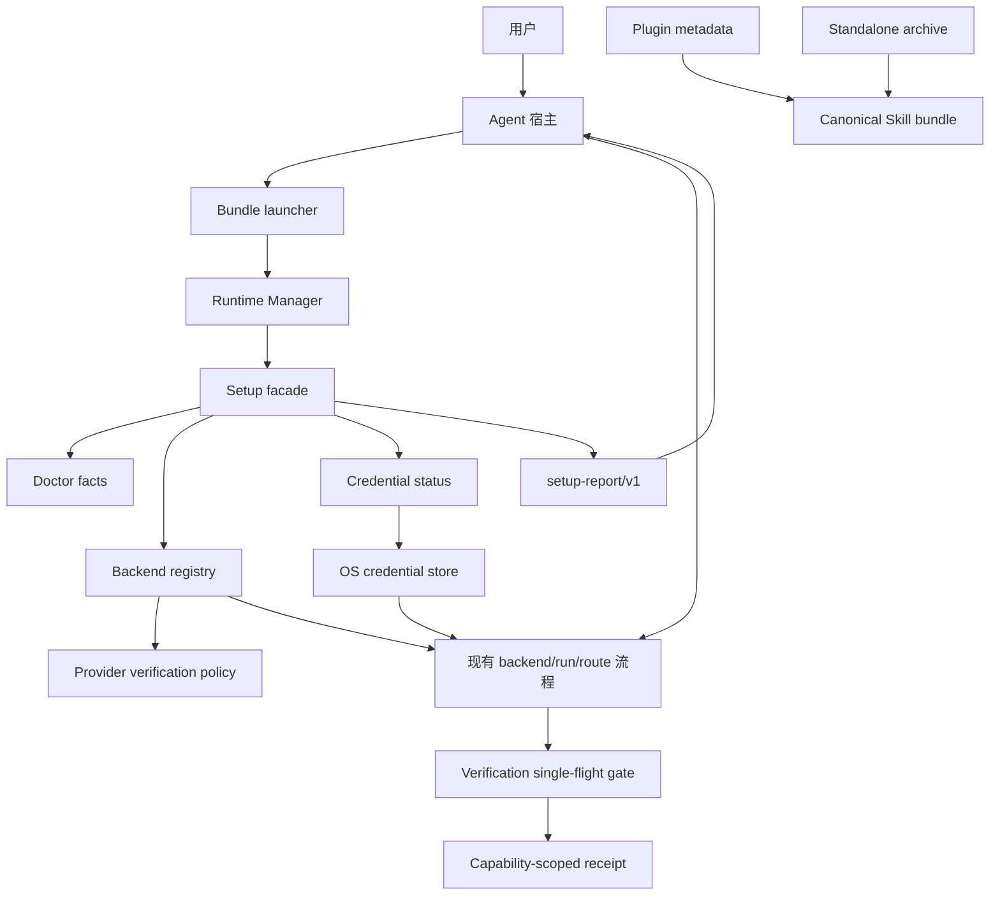
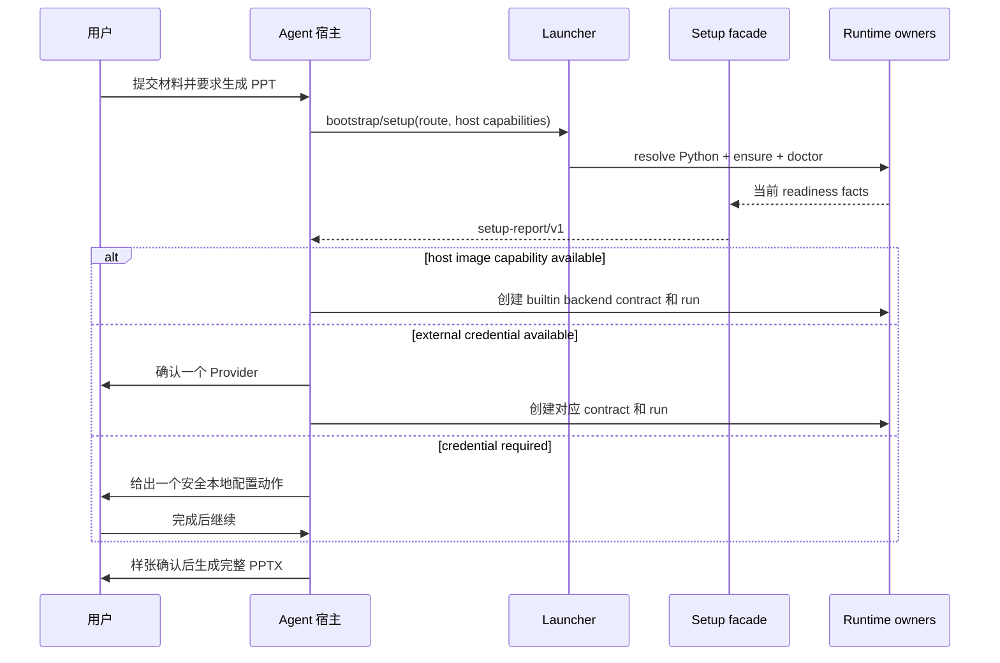
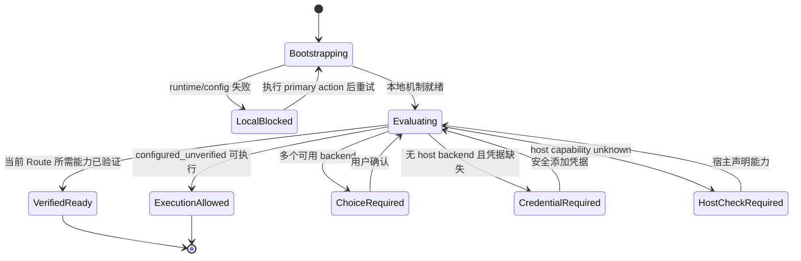
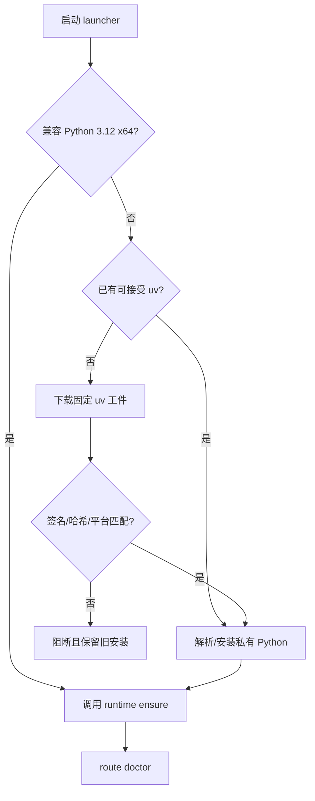
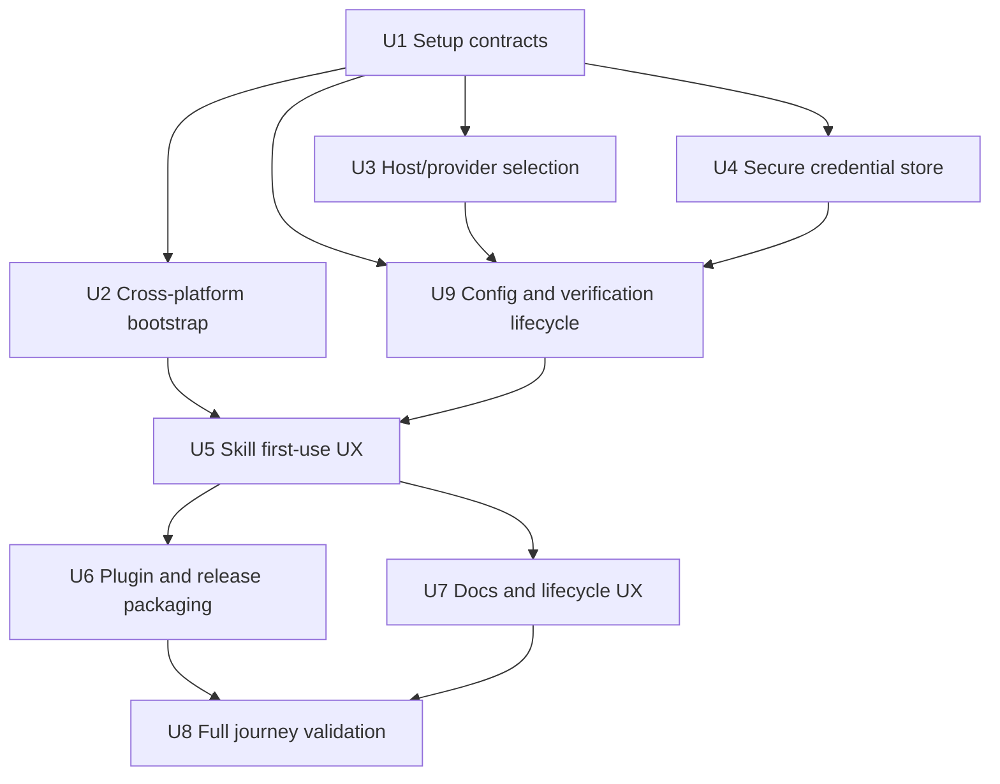

# Leo PPT Generator Frictionless Onboarding and Distribution Plan

## Goal Capsule

- **目标：** 把用户从发现项目到生成第一份 PPTX 的流程压缩为“安装一次、在新对话中提交材料、必要时只完成一次安全凭据设置”，同时保留四条 route、原子安装、backend contract、运行证据和失败恢复的完整性。
- **推荐方法：** 在现有确定性 owner 之上增加薄的 setup facade 和跨平台 bootstrap；默认优先零密钥宿主图片能力，外部 provider 与在线 OCR 按需渐进披露；先优化 standalone Skill，再增加 Plugin 分发，不以新 UI 或第二套状态替代现有合同。
- **决策焦点：** 用户界面与机器接口分层、Python 3.12 私有受管安装、host capability 真值、Provider 选择与确认、配置完整与能力级真实验证分离、付费验证 single-flight、安全凭据存储、Plugin/standalone 单源发布。
- **验证焦点：** macOS arm64 与 Windows x64 全新用户环境；零密钥和外部 provider 两条首次成功路径；重复安装、无 Python、网络中断、凭据失效、非交互宿主、升级回滚和 secret 扫描。
- **成功指标：** 普通用户手工命令不超过 1 条；首次流程最多 2 个必要问题；本地机制安装中位耗时不超过 10 分钟且成功率不低于 95%；具备可用图片能力后的首次真实任务成功率目标不低于 90%；每个失败结果只给一个首选恢复动作。
- **最大风险：** Agent 宿主能力不能由 runtime 自行推断，Plugin 安装也不天然提供生命周期 hook；若把 `unknown` 当 `available`，会产生零密钥路径假绿。
- **停止条件：** 需要把明文 secret 写入项目、Skill、run 或普通配置；需要静默修改系统 Python/系统 PATH；需要删除旧 runtime 或用户配置才能升级；Plugin 与 standalone 产生不同 Skill 内容；或未获得真实 Windows/macOS 证据却扩大兼容声明。

---

## Product Contract

### Problem Frame

当前项目已经具备受管 runtime、四 route doctor、backend registry、非敏感 backend contract、原子安装和失败保持旧版等可靠性能力，但这些内部概念在首次使用阶段暴露过多。普通用户需要理解 Python 3.12、Skill 发现目录、`SKILL_DIR`、`ensure`、`doctor`、`print-cli`、Provider 环境变量和 backend JSON，才能确信系统可用。

真正需要解决的是首次价值实现，而不是继续增加说明文字。用户应只表达 PPT 目标；Agent 和确定性 runtime 应承担安装识别、平台准备、能力检测、Provider 排序、合同生成、状态解释和恢复建议。高级命令仍需保留给开发者、支持人员和自动化，但不得成为普通用户主路径。

### Actors

- A1. 普通用户：安装 Skill，提交材料，选择必要服务，确认样张并接收 PPTX。
- A2. Agent 宿主：识别并加载 Skill，声明真实 host capability，执行内部确定性命令，向用户渐进披露必要选择。
- A3. Runtime：拥有安装 identity、doctor、backend contract、run lifecycle、reason code 和机器可读 receipt。
- A4. 支持/运维人员：使用详细诊断、JSON 报告、固定版本和回滚能力定位问题。
- A5. 发布维护者：生成同源 standalone Skill 与 Plugin，维护平台工件、校验和、版本和发布证据。

### Requirements

#### Installation and discovery

- R1. macOS arm64 与 Windows x64 用户均可通过一个公开入口安装；主路径不要求预装精确 Python 3.12，也不要求管理员权限。
- R2. 安装器优先复用兼容的系统 Python；缺失时下载固定版本、固定校验和的 bootstrap 工具并把 Python 3.12 安装到 Leo 私有 home，不修改系统 Python、系统 PATH 或其他项目环境。
- R3. 通过 `skill-installer` 或 Plugin 安装、未执行仓库根安装器时，Skill 首次调用仍能使用 bundle 内 bootstrap 完成同一 runtime 初始化。
- R4. 用户级默认发现目录与当前宿主官方支持保持一致；首次发布前不兼容旧开发目录，但必须检测重复活动副本并给出唯一清理动作，不得同时激活多个同名 Skill。
- R5. Plugin 与 standalone Skill 必须从同一 canonical bundle 构建，内容 hash 一致；任何渠道不得维护功能分叉。

#### Setup and progressive disclosure

- R6. 系统提供一个稳定 setup facade，组合已有 `ensure`、route `doctor`、backend registry 和 credential status，不复制其验证规则或持久化第二套 readiness 状态；报告必须分开呈现配置状态、验证状态、目标 Route/Capability readiness scope、执行资格和 typed primary action。
- R7. setup 必须区分 `available`、`unavailable`、`unknown`；runtime 不得自行把宿主图片能力或 worker 能力从 `unknown` 提升为 `available`。
- R8. 当宿主图片能力已确认可用时，默认推荐 `builtin-imagegen`，不要求 API Key；不可用时只展示当前 route 可用的外部图片 Provider。
- R9. OpenAI、OpenAI-compatible 与 AtlasCloud 为图片 Provider 选择关系，不要求同时配置；任意 OpenAI-compatible endpoint 的 endpoint-specific 策略默认 unknown。PaddleOCR 只在可编辑路径实际需要在线 OCR 时延迟询问，未配置时明确使用本地降级能力。
- R10. External Provider 本地配置完整时返回 `configured_unverified` 与 `execution_eligibility=allowed`；`ready` 仅对当前 Route 所需且已由显式 Provider smoke、真实业务图片或宿主现场能力覆盖的 capabilities 成立。可能计费的 smoke 必须由用户明确肯定同意，默认回车、超时、取消和安装流程均不得触发；跳过后首张真实业务图片通过同一 Verification Scope 的 single-flight gate 惰性写 receipt。普通用户主流程不得要求手写 backend JSON、定位 CLI、理解 runtime identity 或读取完整 doctor JSON。

#### Credentials and security

- R11. 已存在的允许环境变量继续受支持；新增凭据设置入口必须使用隐藏输入，并将 secret 写入 macOS Keychain 或 Windows DPAPI 保护的用户级存储。
- R12. backend contract、run、日志、receipt、错误文本和遥测不保存 secret 值、长度、前后缀或裸 secret hash；receipt 只允许保存由设备本地受保护 Fingerprint Key 生成的 HMAC credential version，且人类输出不得展示完整 HMAC。
- R13. Agent 不得要求用户把密钥粘贴到聊天；无法提供安全交互输入时，系统只给出一条本地终端命令和官方申请入口。
- R14. 提供凭据的添加、状态、删除和覆盖确认；删除凭据不删除 run，既有 run 在再次执行时以稳定 reason code 报告 reference unavailable。

#### User-facing behavior and recovery

- R15. 安装、setup 和首次调用的人类输出均采用“当前阶段、结果、唯一首选下一步”的结构；详细字段通过 `--json` 提供给 Agent 和自动化。
- R16. 长操作必须持续输出阶段进度，不能静默等待；失败时不得默认打印 Python stack trace 或内部绝对路径。
- R17. 每个阻断状态必须拥有一个 typed primary action；非阻断状态可使用开始任务、恢复任务或无动作，结果未知时可要求确认新请求。只有 CLI 动作包含 command；替代路径只能在高级详情中展示，避免一次抛出多条互相竞争的修复建议。
- R18. 安装结束必须给出一条可直接发送给 Agent 的首次使用示例；首次生成必须在完整制作前经过已有样张确认合同。

#### Compatibility, rollout, and evidence

- R19. `ensure`、`doctor`、backend create/validate、Provider Registry、统一 config/verification lifecycle、run lifecycle 和四 route CLI 分别保持明确 canonical owner；setup facade 不能成为新的领域真值 owner。Registry 对未声明的探测、模型发现、幂等、重试和 endpoint-specific capability 使用 `unknown` fail closed。项目尚未对外发布，不为开发期命令或配置格式建立兼容承诺。
- R20. 首次公开发布只保留统一的安装、配置、固定版本、升级、卸载和 JSON 自动化合同；开发期重复入口和旧配置可以直接收敛，不增加迁移层或兼容周期。
- R21. 体验结论必须区分本地机制、真实宿主加载、真实 Provider/OCR 和最终 PPT 现场效果；离线 fixture 不能计入首次真实任务成功率。
- R22. README 首屏只保留选择路径、最短安装、首次使用和必要密钥决策；开发者命令、合同示例和完整故障处理移入用户教程或运维参考。
- R23. 体验指标必须声明平台、渠道、route、Provider、样本量和失败分类；安装成功率至少基于每个平台/渠道 20 次隔离重复，真实任务成功率至少基于每个平台 10 次符合条件的首次任务，否则只能报告为探索性结果。

### Acceptance Flows

- F1. **零密钥首次生成**
  - **Trigger:** A1 在支持宿主图片能力的 Codex 中首次调用 Skill 并提交内容材料。
  - **Steps:** A2 声明 host image capability 为 available；bootstrap 复用或准备私有 runtime；setup 选择 `builtin-imagegen`；Agent 完成 route、样张和 run 流程。
  - **Outcome:** A1 不配置密钥、不接触 backend JSON，获得经验证的 PPTX。
  - **Covers:** R1-R10、R15-R19、R21。
- F2. **外部 Provider 首次生成**
  - **Trigger:** host image capability 为 unavailable，且无可用图片凭据。
  - **Steps:** setup 只展示满足 route 的 External Provider；A1 通过隐藏输入、环境变量引用或显式 `--key-stdin` 添加凭据；本地检查返回 `configured_unverified` 与 `allowed`；配置向导只在 A1 明确同意后执行可能计费的 smoke，否则 Agent 继续样张确认，并以首张真实业务图片完成惰性验证。
  - **Outcome:** 跳过 smoke 不阻断任务；首张图片成功后保留业务产物、原子写 receipt 并升级为 `ready`。聊天、日志、run 和 backend JSON 中不存在 secret；失败时保留任务上下文并给出唯一恢复动作。
  - **Covers:** R8-R18、R21。
- F3. **无 Python 的 Windows 用户**
  - **Trigger:** Windows x64 没有 Python 3.12，也没有 `uv`。
  - **Steps:** PowerShell bootstrap 下载并校验固定 bootstrap 工件，在用户级私有目录安装 Python，完成 runtime ensure 和四 route 本地 doctor。
  - **Outcome:** 不要求管理员权限，不修改系统 PATH；安装成功后新对话能发现并调用 Skill。
  - **Covers:** R1-R5、R15-R20。
- F4. **凭据失效恢复**
  - **Trigger:** 先前配置的 Provider 凭据被撤销或从 OS store 删除。
  - **Steps:** setup、显式 smoke 或首次业务图片返回稳定 reason code；Agent 只提示重新设置当前 Provider；主题、材料、大纲、逐页稿、旧 run 和已完成产物保持不变。
  - **Outcome:** 用户修复后从图片节点安全恢复，不重复创建 run、切换 Provider 或为同一验证意图重复计费。
  - **Covers:** R11-R17、R19-R21。
- F5. **双渠道升级**
  - **Trigger:** standalone 或 Plugin 用户升级到新版本。
  - **Steps:** 新 bundle 在 stage 中完成 hash、runtime 和 route 验证；成功后原子激活，失败则保留旧版本；重复副本检测不会静默选择。
  - **Outcome:** 两个渠道运行同一 Skill bundle identity，用户配置和 active run 不被删除。
  - **Covers:** R3-R5、R19-R21。

### Acceptance Examples

- AE1. **Given** macOS 无 `OPENAI_API_KEY` 和 `ATLASCLOUD_API_KEY`，但宿主明确提供图片能力，**when** 首次 setup，**then** 返回 `ready`、推荐 `builtin-imagegen`，不得把图片凭据缺失列为 blocker。
- AE2. **Given** 宿主图片能力为 `unknown`，**when** setup，**then** 返回 `host_check_required`，不得推测为可用或静默切换外部 Provider。
- AE3. **Given** Windows 无兼容 Python，**when** 执行一键安装，**then** 只在 Leo 私有 home 创建工具链，系统 Python 和 PATH 前后不变。
- AE4. **Given** 用户在隐藏输入中配置 OpenAI，**when** 全树扫描安装目录、home、run、日志和 receipt，**then** 找不到原始 secret 或其派生摘要。
- AE5. **Given** Plugin bundle 与 standalone bundle 来自同一 release，**when** 生成发布清单，**then** canonical Skill tree hash 完全一致。
- AE6. **Given** 安装下载中断或校验和不符，**when** 安装退出，**then** 旧 Skill 仍可用、stage 被隔离或安全清理、输出一个重试动作。
- AE7. **Given** PaddleOCR Token 缺失，**when** 普通图片式生成，**then** 不询问 OCR；当可编辑转换需要 OCR 时才说明本地降级和可选在线增强。
- AE8. **Given** setup 被 Agent 以 `--json` 调用，**when** 出现阻断，**then** schema 中恰有一个 `primary_action`，且人类消息与机器字段语义一致。
- AE9. **Given** External Provider 本地配置完整但没有有效 receipt，**when** 用户跳过可能计费的 smoke，**then** 返回 `configured_unverified`、`execution_eligibility=allowed` 和 `installation_readiness=usable_unverified`；首次真实业务图片成功后保留图片、写 receipt 并升级为 `ready`。
- AE10. **Given** 真实业务图片已经成功但 receipt 原子写入失败，**when** 用户执行恢复动作，**then** 保留图片和任务上下文，只重试 receipt 持久化，不再次调用 Provider。
- AE11. **Given** 多个页面在同一 Verification Scope 下并发请求首张业务图片，**when** 尚无有效 receipt，**then** 最多一个可能计费请求在途，其余页面等待并共享同一成功或失败结果。
- AE12. **Given** 现有 receipt 只验证 `generate`，**when** 目标 Route 还需要 `edit`、`mask` 或 `reference`，**then** 该 Route 不返回 `ready`，并列出缺失能力。

### Scope Boundaries

**本计划包含：** standalone 安装、bundle bootstrap、setup facade、Provider 推荐、安全凭据存储、用户输出、Plugin 打包、README/教程重构、macOS/Windows 测试和体验指标。

**本计划不包含：** 新建桌面设置应用、托管云服务、Provider OAuth 网页、自动购买额度、修改 Codex 本体、替用户创建服务商账号、改变四 route 产品语义、削弱样张确认或最终人工验收。

**延后到后续工作：** Linux 原生发布、组织级集中凭据、企业代理/证书安装器、远程匿名遥测、Plugin marketplace 正式上架。它们只有在对应 owner、隐私策略和真机证据就绪后进入新计划。

---

## Planning Contract

### Canonical Guided Provider Config Inputs

本计划中的 Provider 配置、验证和恢复语义由以下三份上游合同共同约束：

- `.kiro/specs/guided-provider-config/requirements.md`：R1-R19 的 WHAT、验收与边界真值。
- `.kiro/specs/guided-provider-config/flow.md`：安装、配置、验证、宿主恢复和终止状态真值。
- `.kiro/specs/guided-provider-config/config-file.md`：`config.yaml`、Credential Reference、Provider Registry policy、Verification Receipt/Fingerprint 和原子恢复合同。

三份上游合同与本计划冲突时，先返回 `spec-prd` 修复产品语义，再更新本计划；实现不得自行选择冲突的一侧。下方 upstream trace 使用 `GR1-GR19` 区分上游 Requirement ID，避免与本计划 R1-R23 混淆。

### Existing Capability Inventory and Architecture Posture

- `install.sh`、`install.ps1`：继续拥有下载、stage、并发防护、route 验证和原子激活；选择 **extend**，增加解释器解析、工件校验、渠道 metadata 和面向人的单一下一步。
- `skills/leo-ppt-generator/scripts/runtime_manager.py`：继续拥有 runtime identity、私有 home、ensure/current/doctor/remove；选择 **extend**，接受由 bootstrap 解析出的受管解释器，并提供 setup 聚合入口或安全转发。
- `leo_ppt_generator.cli.doctor_report` 与 `BackendRegistry`：继续拥有 readiness 事实和 Provider capability；选择 **compose / thin-glue**，由 setup facade 读取结构化结果、排序选择并生成下一步，不复制检查规则。
- `backend_execution.py`：继续拥有 credential reference 解析与 execution context；选择 **extend**，接入 OS store resolver，不让 auth 命令直接构造 provider 环境。
- `skills/leo-ppt-generator/agents/openai.yaml`：继续拥有宿主可见名称、描述和默认提示；选择 **extend**，把首次使用提示对齐简化后的流程。
- `.codex-plugin/plugin.json` 与发布生成器：选择 **new**。现有仓库没有 Plugin manifest owner；新边界只拥有分发 metadata 和 canonical Skill tree 引用，不拥有 Skill 行为、runtime 或用户状态。

### Key Technical Decisions

- KTD1. **双层接口。** 普通用户只接触 Agent 对话和安装入口；Agent 使用稳定机器接口；支持人员可进入高级命令。README 不再把内部 CLI 当主路径。
- KTD2. **setup 是薄胶水。** setup 只做已有检查的 sequencing、结果归一、Provider 排序、failure propagation 和 evidence aggregation。`ensure`、`doctor`、registry、credential resolver 和 run state 仍是唯一权威。
- KTD3. **host capability 必须由宿主声明。** setup 接受 `available|unavailable|unknown`，缺省为 `unknown`。只有 Agent 现场确认后才能选择 `builtin-imagegen`；这避免零密钥路径假绿。
- KTD4. **默认选择优先级。** 已确认 host-managed 且满足 route capability时优先；否则复用用户已确认且 credential available 的 Provider；多项可用或需要切换时请求用户选择；不得基于环境中偶然存在的 secret 静默改变已冻结 run。
- KTD5. **私有 Python bootstrap。** 安装器按“兼容系统 Python → 已安装且可信的 `uv` → 下载固定 `uv` 工件并校验 → 私有安装 Python 3.12”解析。下载仅允许 release manifest 声明的 HTTPS origin、平台、版本、最大字节数和 SHA-256；工件必须先完整落入私有 stage、校验后才能执行，不执行远程 pipe、浮动版本或校验失败后的替代源。
- KTD6. **bundle 内跨平台 launcher。** 新增 POSIX 和 PowerShell launcher，使 `skill-installer`/Plugin 安装后第一次调用也能完成 bootstrap；Skill 指令调用 launcher，不再直接假设 `python` 或 `py -3.12` 存在。
- KTD7. **OS store 抽象。** macOS 使用 service/account 隔离的 Keychain item；Windows 使用当前用户 DPAPI 加密 blob，并把容器目录和文件 ACL 收窄到当前用户。统一保存为 `os-store-reference`，backend contract 只记录 `keychain:` 或 `host:dpapi/` reference。环境变量作为无持久化兼容入口继续支持；该模型不承诺抵御已取得同一用户会话权限的恶意进程。
- KTD8. **安全输入通道。** 交互式 TTY 使用隐藏输入；非 TTY 可复用环境变量引用，或仅在用户显式指定 `--key-stdin` 时消费一次 stdin。明文参数、普通 pipe 的隐式读取和聊天密钥始终拒绝；Agent 只提供准确终端命令并复查结果。
- KTD9. **人类输出与机器输出同源。** setup 先构造 `setup-report/v1`，再分别渲染 concise human 和 JSON；reason code、primary action 和状态不得维护两份逻辑。
- KTD10. **单一 typed primary action。** 每个阻断 reason code 映射一个稳定 typed action；非阻断状态可返回开始、恢复或空动作，结果未知可返回确认新请求。只有 `run_cli` 包含 command；可选替代方案只在 `details.alternatives` 中出现，安装器和 Agent 均消费同一映射。
- KTD11. **Plugin 是附加渠道。** standalone Skill 保持完全可用；Plugin 只包装 canonical Skill 和 metadata。Plugin manifest、marketplace 示例及发布 zip 由构建脚本生成并验证，不手工复制 Skill tree。
- KTD12. **渐进发布。** 先发布 setup 与 bootstrap 的 opt-in/内部路径，再切换 README 和 Skill 默认路径，最后发布 Plugin。任何阶段失败都可回退到现有 direct commands，且不迁移 run schema。
- KTD13. **配置与验证分离。** `(session-settled: user-approved — chosen over mandatory paid smoke: preserve ready as verified while allowing configured_unverified execution and lazy first-use verification)`。付费 Provider smoke 仅在用户明确肯定同意或显式 `config verify` 时执行，交互默认值为“否”，授权只覆盖当前操作；`configured_unverified` 可进入图片节点，首张真实业务图片复用同一验证包装器和 operation id，成功后写 receipt 并升级为 `ready`。只有 registry 明确声明幂等支持时才对结果不确定的调用自动重试；否则返回 `provider_outcome_unknown`。Auth probe 只有在 registry 明确声明无费用且无实质副作用时自动运行，且永不提升为 `ready`。
- KTD14. **Provider policy fail closed。** Provider Registry 是 checked-in runtime source；探测、模型发现、幂等、重试、TTL 与 adapter policy 缺失时均为 `unknown`。任意 OpenAI-compatible endpoint 不继承乐观 endpoint-specific 声明，静态 capability 只生成候选，不生成 `ready`。
- KTD15. **惰性验证 single-flight。** 同一 Verification Scope 在有效 receipt 产生前最多一个可能计费请求在途；其他页面等待并共享同一结果。协调机制可复用 run operation/lease 或实现独立文件 lease，但不得让 worker 各自决定是否验证。
- KTD16. **能力级 readiness。** `ready` 按 `required_capabilities(route) ⊆ verified_capabilities(receipt)` 计算；Host Provider 使用独立 `available|unavailable|unknown` 现场状态，不伪造 External Provider receipt。
- KTD17. **失败状态不制造第二套持久真值。** `degraded` 是当前 Provider 调用或恢复上下文的结果；纯本地 status 没有当前失败上下文时从 config、credential 和成功 receipt 重新计算，完整但未验证则回到 `configured_unverified`。

### Threat Model

- **供应链替换：** 攻击者替换 bootstrap 下载或诱导 fallback 到浮动版本。通过 allowlisted HTTPS origin、release manifest、平台匹配、大小上限、SHA-256-before-execute 和无替代源策略缓解。
- **凭据泄露：** secret 经聊天、参数、pipe、异常、日志、run 或发布包泄露。通过 TTY 隐藏输入、OS store、reference-only contract、统一脱敏和全树 secret scan 缓解。
- **同名 Skill 劫持：** 用户目录中多个同名 Skill 或备份目录被宿主同时发现，导致调用旧版或非预期版本。通过官方默认目录、旧目录迁移检查、激活前重复副本扫描和 bundle identity 输出缓解。
- **未知 Provider 策略与重复计费：** 任意中转站被乐观声明为支持探测、幂等或所有能力，或多页并发同时承担首次验证。通过 endpoint-specific fail-closed policy、能力级 receipt、single-flight gate 和结果未知不自动重试缓解。
- **边界声明：** 当前用户账户已被攻陷、宿主本身恶意、服务商账户被接管或操作系统凭据服务失陷不由本计划完全解决；遇到这些条件应撤销 Provider key、删除 OS-store item 并停止执行，而不是声称本地加密仍安全。

### High-Level Technical Design

以下结构为方向性设计，用于约束 owner 和接口，不是可复制实现代码。

#### Component ownership

setup 不保存 readiness snapshot；每次调用从当前 owner 重新计算。Plugin 和 standalone 只引用同一 canonical Skill tree，禁止各自维护脚本副本。

#### First-use sequence

#### Setup state model

`VerifiedReady` 对应当前 Route 的协议 `status=ready`；`ExecutionAllowed` 对应 `configured_unverified` 与 `execution_eligibility=allowed`。两者都不表示最终 PPT 已验收。

#### Bootstrap decision tree

### Interface Contracts

#### `bootstrap-result/v1`

canonical owner 为 bundle launcher 与 `runtime_manager.py`。核心字段包括 schema version、platform、architecture、python source、runtime outcome、runtime identity、CLI reference、stage、status、reason code 和 primary action。路径字段仅进入 JSON 详情；默认人类输出不展示内部绝对路径。

#### `setup-report/v1`

canonical owner 为 setup facade。报告包含：

- `status`: `ready|configured_unverified|choice_required|action_required|blocked`
- `configuration_state`: `not_configured|locally_configured|invalid`
- `verification_state`: `not_run|passed|failed|stale`
- `execution_eligibility`: `allowed|retryable|blocked`
- `installation_readiness`: `ready|usable_unverified|installed_not_ready`
- `readiness_scope`: route、required/verified/missing capabilities
- `route` 与 route capability demand
- `local_mechanism`: 聚合现有 ensure/doctor，但保留原始 evidence ref
- `host_capabilities`: 每项为 `available|unavailable|unknown`
- `provider_options`: provider、capabilities、credential status、execution owner、推荐原因
- `selected_provider`: 仅在选择唯一且符合用户确认规则时存在
- `primary_action`: 可为空的 typed action；`run_cli` 才包含 command，其他稳定 kind 覆盖开始、恢复、等待和确认新请求
- `details`: warnings、alternatives、原始 reason codes、非敏感 evidence refs

schema 必须由 JSON Schema 验证；人类输出由同一对象渲染。

#### `leo-ppt-config/v1`、Provider policy 与 verification receipt

canonical owner 为 Config Command、runtime config loader、Provider Registry loader 和 verification lifecycle。`leo-ppt-config/v1` 分开报告 configuration、verification、readiness scope、execution eligibility、installation readiness、Provider options、reason code、evidence refs 和 typed primary action。`config.yaml`、Provider policy 与 `leo-ppt-verification-receipt/v1` 分别使用独立 schema；用户配置不能覆盖 Registry 安全声明。

verification lifecycle 负责 Paid Verification Consent、能力级 fingerprint/TTL、single-flight、图片校验、operation id、幂等边界、receipt 原子写入和 receipt-only recovery。业务图片成功但 receipt 写失败时，run evidence 是恢复输入，不能再次调用 Provider。

#### Credential store contract

canonical owner 为新的 OS store adapter，execution resolver 只按 reference 读取。必须支持 `put/get/status/delete`，并返回 `stored|missing|unavailable|permission_denied|corrupt` 等稳定状态。adapter 不接受命令行明文参数，不向调用者返回用于日志的 printable secret 对象。

#### Distribution manifest

canonical owner 为发布构建脚本。manifest 记录 release identity、canonical Skill tree hash、platform bootstrap 工件版本与 SHA-256、standalone archive hash、Plugin archive hash、许可证集合和验证 receipts。Plugin manifest 位于 `.codex-plugin/plugin.json`，其 Skill 内容必须由 canonical bundle 复制或链接生成并在发布测试中比较 tree hash。

### Failure Semantics and Observability

- 安装和 bootstrap 采用阶段事件：`platform_check`、`python_resolve`、`runtime_ensure`、`route_doctor`、`activate`。默认输出每个阶段开始/完成，避免长时间无响应。
- `reason_code` 保持机器稳定；用户文案可演进。每个 blocked reason 必须映射一个 `primary_action` 和一个验证条件。
- setup 和安装默认不做付费 Provider 调用。只有用户明确肯定同意或显式运行 `config verify` 才执行独立 Provider smoke；交互默认值为“否”，授权不持久化。跳过后返回 `configured_unverified` 与 `allowed`，首张真实业务图片承担惰性验证，成功后原子写 receipt 并升级为 `ready`。
- Auth probe 仅在 registry 对当前 adapter/endpoint 明确声明无费用且无实质副作用时自动运行；成功不产生 receipt，不改变 `configured_unverified`。显式 smoke 与惰性验证共享验证包装器、产物校验和错误分类；同一 Verification Scope 通过 single-flight 共享一个 operation id 和结果。只有 Provider 明确支持幂等或能够证明请求未被接受时才自动重试。结果不确定时返回 `provider_outcome_unknown`；业务图片成功但 receipt 写入失败时保留图片和 run 恢复证据，只重试 receipt，不重复调用 Provider。
- 本地日志只能记录 provider 名、reference type、available/missing、耗时、stage 和 operation id。对运行目录、home、临时目录和异常文本做 secret 扫描。
- 体验指标默认先在测试/用户研究中离线收集，不在未经明确隐私同意时加入联网遥测。

### Dependency Order and Phased Delivery

- Phase A：U1-U4 与 U9 建立合同、bootstrap、凭据和验证基础，但不切换默认文档入口。
- Phase B：U5 切换 Skill 内部首次路径，并保留 direct-command 兼容逃生通道。
- Phase C：U6-U7 发布双渠道与简化文档。
- Phase D：U8 完成隔离环境、真机和真实任务验收；未通过前不宣传体验指标。

### Alternatives Considered

- **仅重写 README：拒绝。** 可以降低阅读成本，但无法消除 Python、进程环境变量继承和首次调用 bootstrap 的真实摩擦。
- **构建桌面设置应用：暂不采用。** UI 体验最好，但会引入新应用、发布签名、自动更新和第二套状态；与当前 Skill 交付形态不匹配。
- **只依赖环境变量：保留兼容但不作为理想主路径。** 安全边界简单，但普通用户难以理解终端会话、进程继承和持久化；Windows/macOS 行为也不一致。
- **把 secret 写入 YAML 或 backend JSON：拒绝。** 使用方便但破坏开源、日志、分享和 run 归档的安全边界。
- **Plugin 取代 standalone：拒绝。** 官方分发体验更好，但会丢失通用 Agent 和本地开发路径；采用同源双渠道。
- **把所有步骤合并成新的 `generate` 大命令：拒绝。** 会让 setup facade拥有 route、样张、worker 和 delivery 真值，形成第二套 orchestrator；Agent 继续拥有意图与交互编排。

### Evidence & Limitations

- 当前源码已确认：安装器会 stage、ensure、检查四 route 后原子激活；`runtime_manager.py` 已拥有私有 home、runtime identity 和 current；`doctor_report` 已区分 credential、worker、provider、Office 和人工验收；`BackendRegistry` 已拥有 Provider/capability/credential allowlist。
- 当前 `agents/openai.yaml` 已有显示名、描述和默认提示，可直接扩展首次使用表达，不需要第二份 UI metadata。
- 外部研究（2026-08-22）显示：PPTAgent 使用交互式 `onboard`；Presenton 把 Provider 配置放入应用；Marp 提供 `npx`、包管理器和独立二进制；GitHub CLI 使用交互认证和状态检查；OpenAI 官方建议公开复用 Skill 可通过 Plugin 分发。它们是设计输入，不证明本项目用户效果。
- 当前工作树包含大量已有修改和未跟踪文件。实施必须只修改本计划列出的 owner，保留并行用户变更，不能以 reset/checkout 清理。
- Windows PowerShell 可用不等于 Windows x64 全新用户矩阵已通过；DPAPI、安装器、私有 Python 和 Codex 发现仍需真机验证。
- 真实 Provider、在线 OCR、宿主 worker、PowerPoint 和人工视觉均保持独立现场证据，不被 setup `ready` 外推覆盖。

---

## Implementation Units

### U1. Setup contracts and single-action diagnostics

- **Goal:** 建立 `bootstrap-result/v1`、`setup-report/v1`、稳定 primary action 映射和同源人类/JSON输出。
- **Files:** `skills/leo-ppt-generator/runtime/src/leo_ppt_generator/cli.py`、新增 `skills/leo-ppt-generator/runtime/src/leo_ppt_generator/setup.py`、新增 `skills/leo-ppt-generator/runtime/src/leo_ppt_generator/schemas/setup-report-v1.schema.json`、`skills/leo-ppt-generator/runtime/src/leo_ppt_generator/observability.py`、`skills/leo-ppt-generator/references/reason-codes.md`、`tests/unit/test_setup.py`、`tests/unit/test_schemas.py`、`tests/unit/test_reason_code_docs.py`。
- **Architecture posture:** compose / thin-glue；setup 调用现有 owner，不复制 runtime、route、registry 或 credential 判定。
- **Behavior:** 支持 route、host capability facts、human/JSON 模式；分开输出 configuration、verification、execution eligibility 和 installation readiness，输出候选 Provider、选择结果或唯一 primary action；保留原始 evidence refs。
- **Test scenarios:** `ready`、`configured_unverified`、`degraded`、`not_configured`、`invalid` 的映射与优先级；host available/unavailable/unknown；0/1/2 个外部 Provider 可用；非法 route；config blocked；credential resolver unavailable；每个 blocked reason 恰有一个 primary action；`configured_unverified` 无阻断 action；human 与 JSON golden semantic parity；schema version 不兼容 fail closed。
- **Verification:** setup 单元和 schema tests 通过；reason code 文档枚举完整；没有新的 readiness 持久化文件。

### U2. Cross-platform private Python bootstrap

- **Goal:** 让仓库安装器、`skill-installer` 和 Plugin 首次调用在无 Python 3.12 时仍能安全准备 runtime。
- **Files:** `install.sh`、`install.ps1`、新增 `skills/leo-ppt-generator/scripts/leo-bootstrap.sh`、新增 `skills/leo-ppt-generator/scripts/leo-bootstrap.ps1`、`skills/leo-ppt-generator/scripts/runtime_manager.py`、新增 `skills/leo-ppt-generator/runtime/bootstrap-lock.json`、`tests/release/test_installer.py`、新增 `tests/release/test_bootstrap.py`、`tests/integration/test_runtime_manager.py`。
- **Architecture posture:** extend installers/runtime manager；launcher 只解析平台、解释器并转发，不拥有 runtime identity。
- **Behavior:** 复用兼容解释器；否则只从 manifest allowlist 下载并校验固定 bootstrap 工件，在 Leo home 安装私有 Python；全程无需管理员权限；阶段进度可见；网络/校验/磁盘错误保持旧版；安装前扫描宿主可发现目录，发现同名活动副本时阻断并返回唯一清理动作，不建立旧开发目录迁移逻辑。
- **Test scenarios:** system Python 命中；已有 uv 命中；完全缺失自动安装；不兼容架构；非 HTTPS/非 allowlist origin、超大小、下载 404、超时、截断、SHA mismatch；代理失败；只读 home；磁盘满；并发 bootstrap；中断重试；升级后复用；默认目录、重复活动副本和可发现 backup 目录；PATH、系统 Python 和其他 venv 前后不变。
- **Verification:** macOS 和 Windows isolated home 测试；真机 receipt 记录解释器来源；全树无临时 bootstrap 残留；现有原子升级测试继续通过。

### U3. Host capability and Provider selection policy

- **Goal:** 实现零密钥优先、外部 Provider 二选一和 OCR 延迟披露，同时阻止 host capability 假绿。
- **Files:** `skills/leo-ppt-generator/runtime/src/leo_ppt_generator/setup.py`、`skills/leo-ppt-generator/runtime/src/leo_ppt_generator/config/backend_contract.py`、`skills/leo-ppt-generator/references/backend-selection.md`、`skills/leo-ppt-generator/references/input-routing.md`、`tests/unit/test_setup.py`、`tests/unit/test_backend_contract.py`、`tests/skill-evals/cases.yaml`、`tests/skill-evals/test_skill_contract.py`。
- **Architecture posture:** reuse registry，新增选择 policy 作为 setup 的窄协调逻辑；backend contract 继续由 registry 生成。
- **Behavior:** 只有明确 available 才选择 host backend；外部 Provider 按 capability、credential status、execution eligibility 和用户既有确认排序；Registry 对 probe、model discovery、idempotency、retry 和 endpoint-specific capability 缺失声明时 fail closed 为 unknown；静态 capability 只生成候选；OCR 不参与图片 Provider 选择；切换 Provider 保持样张重新确认合同。
- **Test scenarios:** 四 route 完整 required-capability matrix；host unknown 不选择；host unavailable + ready/configured_unverified External Provider；两个外部 Provider 同时可用要求选择；OpenAI-compatible endpoint-specific policy 默认 unknown；仅 Atlas 在 mask route 不足时阻断；静态 capability 不产生 ready；环境中出现新 secret 不改变已冻结 run；OCR 缺失不阻断 generate；在线 OCR 仅在相关 editable 场景出现。
- **Verification:** deterministic matrix 和 skill eval 全绿；所有推荐均能追到 registry capability 和非敏感证据。

### U4. Secure credential lifecycle

- **Goal:** 提供不经过聊天、不写明文配置的 Provider 凭据添加、状态、覆盖和删除能力。
- **Files:** 新增 `skills/leo-ppt-generator/runtime/src/leo_ppt_generator/credentials.py`、`skills/leo-ppt-generator/runtime/src/leo_ppt_generator/backend_execution.py`、`skills/leo-ppt-generator/runtime/src/leo_ppt_generator/cli.py`、新增 `skills/leo-ppt-generator/runtime/src/leo_ppt_generator/schemas/credential-status-v1.schema.json`、`tests/unit/test_credentials.py`、`tests/unit/test_backend_execution.py`、`tests/integration/test_cli_protocol.py`、`tests/boundary/test_contract_matrix.py`。
- **Architecture posture:** new OS-store adapter，extend existing execution resolver；adapter 是 secret storage owner，backend execution 仍是唯一消费 owner。
- **Behavior:** `auth add/status/remove` 采用 provider allowlist；add 默认接受 TTY 隐藏输入，并支持环境变量引用与显式 `--key-stdin`；环境变量只保存引用，不复制值；macOS Keychain item 绑定固定 service 和 provider account，写入过程不得把 secret 放入可被进程列表观察的子进程 argv；Windows DPAPI 使用 current-user scope，密文容器目录/文件限制当前用户 ACL；状态输出不含 secret 特征。
- **Test scenarios:** add/status/overwrite-confirm/remove；TTY 隐藏输入、环境变量引用、显式 `--key-stdin`；环境变量值不复制；明文 CLI 参数、子进程 argv 和普通 pipe 隐式读取拒绝；Keychain locked/denied/missing 和错误 service/account；DPAPI encrypt/decrypt、用户身份不符、ACL 过宽、blob 损坏；环境变量优先级与宿主进程缺失恢复；删除后执行稳定失败；异常、receipt、日志、run、core dump fixture 的 secret scan；同用户进程攻击明确记录为不在保护上限内。
- **Verification:** fake OS store 单元测试与两平台真机 smoke；backend contract 只有 reference；release secret scanner 通过。

### U5. Skill first-use orchestration and progressive disclosure

- **Goal:** 让 Agent 自动运行 bootstrap/setup，只向用户询问任务本身和必要选择，隐藏内部 CLI 细节。
- **Files:** `skills/leo-ppt-generator/SKILL.md`、`skills/leo-ppt-generator/agents/openai.yaml`、新增 `skills/leo-ppt-generator/references/first-use.md`、`skills/leo-ppt-generator/references/backend-selection.md`、`skills/leo-ppt-generator/references/image-deck-workflow.md`、`skills/leo-ppt-generator/references/editable-workflow.md`、`tests/skill-evals/cases.yaml`、`tests/skill-evals/test_skill_contract.py`、`tests/release/test_release_docs.py`。
- **Architecture posture:** extend existing Skill workflow；Agent 继续拥有意图、确认、worker 和交付判断，setup 只提供确定性事实。
- **Behavior:** 首次调用自动选择平台 launcher；普通用户不看 `SKILL_DIR`、`print-cli` 或 backend JSON；host unknown 时 Agent 先核实能力；需要 secret 时禁止聊天粘贴并给出单一终端动作；`configured_unverified` 直接进入图片节点，首张业务图片惰性写 receipt；失败时保留任务上下文并从图片节点恢复。
- **Test scenarios:** 零密钥生成；缺 Provider；多个 Provider；configured_unverified 首次生成成功/失败；receipt 写入失败从本地 run 证据恢复且不重复调用 Provider；无幂等保证的结果未知不自动重试；用户拒绝外部服务；OCR 延迟；Windows launcher；setup blocked；用户要求跳过样张；Provider 切换；Agent 不得安装额外历史 CLI；所有 case 检查引用最小化与 next action 唯一性。
- **Verification:** fresh-context skill eval、真实 Codex 显式 `$leo-ppt-generator` 与隐式触发各一轮；宿主加载、runtime 调用和现场结果分层记录。

### U6. Canonical Plugin and dual-channel packaging

- **Goal:** 在不分叉 Skill 行为的前提下提供 Plugin 分发，并保持 standalone 安装和通用 Agent 目录可用。
- **Files:** 新增 `.codex-plugin/plugin.json`、新增 `scripts/build_release.py`、新增 `scripts/validate_release.py`、`skills/leo-ppt-generator/agents/openai.yaml`、新增 `tests/release/test_plugin_package.py`、`tests/release/test_wheel_release.py`、`tests/release/test_release_docs.py`、发布工作流配置。
- **Architecture posture:** new distribution metadata owner；canonical source 始终是 `skills/leo-ppt-generator`，构建器只生成包装与 manifest。
- **Behavior:** manifest 名称与目录一致；Plugin 只包含实际存在的 skill/assets/scripts，不声明不存在的 MCP/app；standalone 与 Plugin 的 Skill tree hash 一致；版本、许可证和 bootstrap lock 同步。
- **Test scenarios:** valid manifest；名称不一致、缺 Skill、额外第二个 `SKILL.md`、tree hash drift、缺许可证、错误 bootstrap checksum、陈旧 cachebuster、Plugin/standalone 版本不同全部阻断；从本地 marketplace 安装后新线程发现 Skill。
- **Verification:** 使用 plugin validator、skill quick validator、release manifest 验证和 isolated Codex install smoke；不得修改用户个人 marketplace 作为发布测试的永久状态。

### U7. Documentation and lifecycle UX

- **Goal:** 将 README 重构为最短成功路径，把完整安装、凭据、升级、卸载、固定版本、故障处理和证据边界放入对应文档。
- **Files:** `README.md`、`docs/user-guide.md`、`docs/compatibility.md`、`docs/limitations.md`、`docs/testing.md`、新增 `docs/troubleshooting.md`、`CHANGELOG.md`、`tests/release/test_release_docs.py`。
- **Architecture posture:** extend current docs ownership；不在 Skill bundle 增加重复 README。
- **Behavior:** README 首屏依次展示 Plugin/Agent 安装、首次使用示例、零密钥/一个图片密钥/可选 OCR 三档；高级命令移出主路径；macOS/Windows 示例对等；说明 `configured_unverified` 可立即开始、付费 smoke 仅明确同意后执行、首次业务图片会惰性验证；错误入口按 primary action 索引。
- **Test scenarios:** 所有链接可达；命令来自真实 CLI help；平台示例 parity；禁止历史项目信息；密钥申请入口和安全警告存在；费用文案将交互默认值设为“否”，且不把默认回车、超时、取消、安装、更新或宿主调用视为同意；README 不要求普通用户手写 backend JSON；限制和现场证据声明一致。
- **Verification:** release docs tests、链接检查、命令 smoke 和至少 5 名角色化读者任务测试；文档通过不外推为安装成功。

### U8. Murphy-driven journey tests and experience gates

- **Goal:** 用全新环境和真实用户旅程验证简化没有制造假绿、安全回退或平台分叉。
- **Files:** 新增 `tests/journeys/test_first_use.py`、新增 `tests/journeys/test_credential_recovery.py`、`tests/release/test_installer.py`、`tests/release/test_installed_routes.py`、`tests/e2e/test_offline_routes.py`、`docs/testing.md`、`docs/verification-report-2026-08-21.md` 或新的当期验证报告。
- **Architecture posture:** extend现有分层测试；新增 journey harness 只编排公开入口，不 direct import 领域 owner 或手写私有状态。
- **Behavior:** 测试层级分为 deterministic fixture、isolated host、真实 Provider/OCR、真实 Office/PowerPoint 和人工任务；每层独立结论，非补偿式 promotion。
- **Test scenarios:** macOS/Windows × system/private Python × standalone/Plugin × zero-key/OpenAI/OpenAI-compatible/Atlas × 四 route；显式同意 smoke、默认回车/取消/超时跳过 smoke、lazy success、lazy provider failure、多页 single-flight、generate receipt 不覆盖 edit/mask/reference、业务图片成功但 receipt 写失败、幂等 Provider 重试、非幂等 Provider 结果未知不重试、receipt 恢复不调用 Provider；重复安装、重复副本、网络抖动、限流、凭据撤销、OS store 锁定、磁盘满、进程中断、长路径、空格/中文路径、代理、升级失败、日志泄露、宿主 capability unknown、人工拒绝样张。
- **Verification:** deterministic 全量绿；两平台 clean-home receipt；至少一条零密钥真实生成和一条外部 Provider 真实生成；PowerPoint/人工验收保持独立；发布报告记录样本数、耗时、成功率和失败分类。

### U9. Unified config and verification lifecycle

- **Goal:** 实现 `leo-ppt config` 用户合同、目标 schema v1、Provider verification policy、能力级 receipt 和 single-flight 惰性验证，使配置完成可执行而 `ready` 保持强证据语义。
- **Files:** `skills/leo-ppt-generator/runtime/src/leo_ppt_generator/cli.py`、`skills/leo-ppt-generator/runtime/src/leo_ppt_generator/config/runtime_config.py`、`skills/leo-ppt-generator/runtime/src/leo_ppt_generator/config/backend_contract.py`、新增 `skills/leo-ppt-generator/runtime/src/leo_ppt_generator/config/provider_policy.py`、新增 `skills/leo-ppt-generator/runtime/src/leo_ppt_generator/verification.py`、`skills/leo-ppt-generator/runtime/src/leo_ppt_generator/backend_execution.py`、新增 `skills/leo-ppt-generator/runtime/src/leo_ppt_generator/schemas/runtime-config-v1.schema.json`、新增 `skills/leo-ppt-generator/runtime/src/leo_ppt_generator/schemas/config-report-v1.schema.json`、新增 `skills/leo-ppt-generator/runtime/src/leo_ppt_generator/schemas/verification-receipt-v1.schema.json`、`tests/unit/test_runtime_config.py`、新增 `tests/unit/test_provider_policy.py`、新增 `tests/unit/test_verification.py`、`tests/unit/test_backend_execution.py`、`tests/unit/test_cli.py`、`tests/integration/test_cli_protocol.py`。
- **Architecture posture:** replace development config contract + extend registry/execution；Config Command 是 config/receipt/reference 关系的用户写入 owner，Provider Registry loader 是安全策略 owner，verification lifecycle 是费用授权、single-flight、产物校验和 receipt owner；setup 只消费结果。
- **Behavior:** 提供 `config/status/verify/repair/change`；使用 typed primary action；完整本地配置返回 configured_unverified/allowed；按 Route required capabilities 与 receipt verified capabilities 计算 ready；Registry 缺失声明 fail closed；degraded 只属于当前调用/恢复上下文；开发期配置返回 `development_config_reset_required` 并经确认原子重建；凭据覆盖中断后 repair 根据非敏感证据恢复或 fail closed。
- **Test scenarios:** config schema 最小值、三 Provider 和边界值；primary action 各 kind 与 command 条件字段；status 不调用 Provider；Paid Verification Consent 默认否且 operation-scoped；Auth Probe/model discovery/idempotency unknown；receipt TTL/fingerprint/capability invalidation；四 route readiness scope；多进程/多 worker single-flight；等待者共享成功/失败；business image 成功但 receipt 写失败；receipt-only repair；provider outcome unknown；operation-local degraded；environment HMAC rotation；credential generation 中断恢复；development config reset；OpenAI-compatible endpoint policy 默认 unknown。
- **Verification:** config/report/receipt schemas、unit/integration/boundary tests 全绿；并发 fixture 证明每个 Verification Scope 仅一次 Provider 调用；secret scan 与 duplicate charge counter 为零；至少一个真实 Provider receipt 作为独立 G7 证据，不用 fixture 替代。

### Guided Provider Config Upstream Trace

| Upstream | Implementation units | Focused verification |
| --- | --- | --- |
| GR1 统一配置入口 | U9、U5、U7 | CLI protocol、Skill eval、release docs |
| GR2 状态与机器合同 | U1、U9 | setup/config schemas、human/JSON parity、typed action |
| GR3 密钥安全录入 | U4、U9 | TTY/stdin/env、argv/log secret scan |
| GR4 OpenAI-compatible | U3、U4、U9 | profile schema、独立凭据、endpoint policy unknown |
| GR5 本地配置检查 | U1、U9 | status 零 Provider 调用、selection、receipt freshness |
| GR6 真实图片验证 | U9、U5、U8 | consent、single-flight、lazy success/failure、恢复 |
| GR7 receipt 与失效 | U9、U8 | fingerprint、TTL、能力 scope、HMAC rotation |
| GR8 首次安装引导 | U2、U5、U7、U8 | TTY/no-TTY、usable_unverified、CLI path |
| GR9 更新后检查 | U2、U7、U8、U9 | receipt reuse/stale、repair、配置保留 |
| GR10 非交互配置 | U4、U5、U7 | env/stdin、shell quoting、无隐式 stdin |
| GR11 宿主守卫与恢复 | U1、U5、U9 | allowed 放行、节点恢复、上下文保留 |
| GR12 Host Provider 边界 | U1、U3、U5 | independent host state、unknown fail closed |
| GR13 幂等、取消与部分失败 | U5、U8、U9 | operation id、unknown outcome、receipt-only repair |
| GR14 跨平台凭据存储 | U4、U8 | Keychain/DPAPI/ACL 真机与 fixture |
| GR15 隐私与可观测性 | U1、U4、U8、U9 | reason code、evidence、全树 secret scan |
| GR16 Route/Provider 兼容 | U3、U9 | 四 route capability matrix、scope subset |
| GR17 文档与帮助 | U7 | help/link/platform parity、Reason Code 完整性 |
| GR18 首次发布与回归 | U6、U7、U8、U9 | development reset、无兼容分支、无投影直改 |
| GR19 Provider Registry | U3、U9 | policy schema、unknown defaults、版本失效 |

---

## Verification Contract

### Non-Compensating Gates

| Gate | Scope | Required Evidence | Failure Meaning |
| --- | --- | --- | --- |
| G1 Structure | Plugin、Skill、manifest、licenses、单一 `SKILL.md` | validators、tree hash、release manifest | 包结构不可发布 |
| G2 Deterministic behavior | setup、bootstrap、selection、credential、typed action、状态映射、费用同意、single-flight、能力级 receipt、reason code | unit/integration/boundary tests | 机制不可信 |
| G3 Installed black-box | standalone 与 Plugin 的公开入口、四 route | isolated home、绝对 launcher/CLI receipts | 安装后不可执行 |
| G4 Platform | macOS arm64、Windows x64 | 对应真机 bootstrap/install/upgrade receipts | 该平台不得声明支持 |
| G5 Credential security | env、Keychain、DPAPI、logs/runs | TTY tests、OS smoke、secret scan | 凭据路径不可发布 |
| G6 Host integration | Codex 显式/隐式发现和 capability declaration | 新线程 host receipts | 不能声称宿主可用 |
| G7 Field execution | 零密钥或真实 Provider/OCR | provider receipts、成本/超时记录 | 不能声称真实任务可用 |
| G8 Delivery quality | PPTX render、PowerPoint、人工验收 | final hash、render、manual receipt | 不能声称高质量交付 |

G1-G6 是公开安装发布的最低门禁；G7-G8 决定真实效果声明。任何后层通过都不能补偿前层失败。

### Test Suites

- `tests/unit/test_setup.py`：setup 分层状态、execution eligibility、Provider 排序、primary action 和 human/JSON parity。
- `tests/release/test_bootstrap.py`、`tests/release/test_installer.py`：解释器选择、私有 Python、工件校验、原子激活和回滚。
- `tests/unit/test_credentials.py`、`tests/unit/test_backend_execution.py`：OS store、reference resolution 和 secret boundaries。
- `tests/unit/test_runtime_config.py`、`tests/unit/test_provider_policy.py`、`tests/unit/test_verification.py`、`tests/integration/test_cli_protocol.py`：目标 config schema、Registry fail-closed、typed action、Verification Scope、TTL、single-flight 和 receipt-only recovery。
- `tests/skill-evals/`：Agent 首次调用、渐进披露、禁止聊天密钥和样张合同。
- `tests/release/test_plugin_package.py`、`tests/release/test_release_docs.py`：双渠道 tree hash、manifest、文档和许可证。
- `tests/journeys/`、`tests/release/test_installed_routes.py`：显式 smoke、跳过 smoke、惰性验证成功/失败、多页 single-flight、能力级 readiness、receipt 写失败不重复计费，以及不绕行的安装后首次成功与四 route。
- 现有全量 suite：防止 setup 简化破坏 canonical state、upgrade、PPT fidelity、evidence 和 upstream capability。

### Experience Measurement

- `time_to_installed_local_ready`：开始安装到本地机制 ready。
- `time_to_first_sample`：首次任务开始到样张可确认。
- `time_to_first_verified_pptx`：首次任务开始到最终 PPTX 完成结构与渲染验证。
- `manual_command_count`：用户亲自执行的终端命令数，目标普通路径 0-1。
- `necessary_question_count`：首次流程中用户必须回答的问题数，目标不超过 2，且不计业务内容澄清。
- `recovery_success_rate`：收到 primary action 后无需人工开发介入即可恢复的比例。
- `secret_exposure_count`：任何聊天、日志、配置、run、receipt 中的 secret 命中，目标始终为 0。
- `implicit_paid_verification_count`：没有明确用户同意而触发的独立付费 smoke 次数，目标始终为 0。
- `duplicate_provider_charge_count`：同一验证意图因重试、恢复或 receipt 修复产生的重复 Provider 调用次数，目标始终为 0。

每项指标必须注明平台、安装渠道、Provider、route、是否真实服务和样本量。安装成功率至少使用每个平台/渠道 20 次隔离重复；真实任务成功率至少使用每个平台 10 次符合条件的首次任务。低于该口径只能作为探索性试点，不对外推广为总体表现。

### Pre-release Replacement and Rollback

- 项目尚未对外发布；开发期命令、配置字段和目录布局不构成兼容基线。实现以首次公开发布合同为准，直接删除重复入口和更新 fixtures，不编写迁移层；发现旧开发配置时返回 `development_config_reset_required`，仅在用户确认后由 `config repair` 原子重建，失败时旧文件字节不变。
- launcher 或 setup 失败时不得自动删除 current runtime、OS store credential 或 run；发布候选回滚依赖原子激活和 stage 隔离，不依赖旧配置兼容代码。
- 文档主路径切换前先在发布候选中验证；若 field failure 超过阈值，回退尚未发布的 README/SKILL 候选变更并修复 canonical source。
- Plugin 发布失败不影响 standalone release；tree hash 不一致时两个渠道均阻断，而不是选择其中一个继续发布。

---

## Definition of Done

- D1. R1-R23 均能追溯到至少一个实施单元、测试场景和可观察证据。
- D2. setup facade 只组合已有 owner，仓库中不存在第二份 runtime readiness、backend registry 或 run lifecycle 真值。
- D3. macOS arm64 与 Windows x64 在无预装 Python 3.12 的 clean user home 中完成安装、私有 runtime 初始化、四 route doctor 和新线程 Skill 发现。
- D4. 零密钥路径在宿主明确 available 时不要求图片 API Key；host unknown 不产生 ready 假绿。
- D5. OpenAI、OpenAI-compatible、AtlasCloud 选择和 PaddleOCR 延迟配置行为满足 route capability；未知中转站策略 fail closed，Provider 切换继续触发样张重新确认。
- D6. 环境变量、macOS Keychain 和 Windows DPAPI 三条 credential 路径可添加、检查、删除和执行；所有 secret scans 为零命中。
- D7. 普通用户主路径不要求手写 backend JSON、寻找 `SKILL_DIR`、运行 `print-cli` 或解析 doctor JSON；高级路径仍完整可用。
- D8. standalone 与 Plugin 的 canonical Skill tree hash 相同，manifest/版本/许可证/工件校验和完整，安装与升级均通过 isolated smoke。
- D9. 所有 blocked setup/install reason 只有一个 typed primary action，并在执行该动作后有明确复验条件；只有 `run_cli` 动作包含 command。
- D10. deterministic、integration、release、skill eval、upstream 和四 route installed tests 全绿；开发期 fixture 已切换到首次发布合同，不存在配置迁移或兼容分支。
- D11. 至少完成 macOS、Windows 各一轮真实首次使用；至少一条零密钥真实任务与一条外部 Provider 真实任务有独立 receipt；未完成的现场层保持明确待验收。
- D12. README、用户教程、兼容性、限制、测试和发布报告与实际命令、渠道和证据上限一致，不出现历史项目来源信息或不安全密钥示例。
- D13. 达成指标目标或明确记录未达标原因、失败样本和下一轮决策；不得只凭测试全绿宣布用户体验完成。
- D14. `skills/leo-ppt-generator/third_party/` 持续不存在，仓库已有用户改动未被覆盖，且未执行未经授权的 commit、push、tag 或 marketplace 外部发布。
- D15. `ready` 仅由覆盖当前 Route required capabilities 的真实图片证据或宿主现场能力产生；`configured_unverified` 可执行且安装状态为 `usable_unverified`。默认回车、取消、超时、安装和更新均不会触发可能计费的 smoke。
- D16. 首次业务图片的 lazy success、Provider failure、receipt write failure、幂等重试、非幂等结果未知和中断恢复均有测试；同一 Verification Scope 最多一个付费请求在途，等待页面共享结果；业务图片与任务上下文不丢失，receipt 修复不调用 Provider。
- D17. `leo-ppt config/status/verify/repair/change`、`leo-ppt-config/v1`、目标 `config.yaml` schema、Provider policy 和 verification receipt 均有明确 canonical owner、schema 与 focused tests。
- D18. Provider Registry 对缺失探测、模型发现、幂等、重试和 endpoint-specific capability 的声明统一返回 unknown；用户配置、安装器和 Agent 不能覆盖安全策略。
- D19. 上游 GR1-GR19 均能追溯到至少一个 implementation unit 和 focused verification；实现评审按该 trace 检查遗漏，不用计划自身 R1-R23 替代上游追踪。
- D20. `degraded` 只由当前 Provider 调用或恢复上下文产生；纯本地 status 在配置完整且无有效 receipt 时稳定返回 `configured_unverified`，Host Capability State 不伪造 External Provider Verification State。
