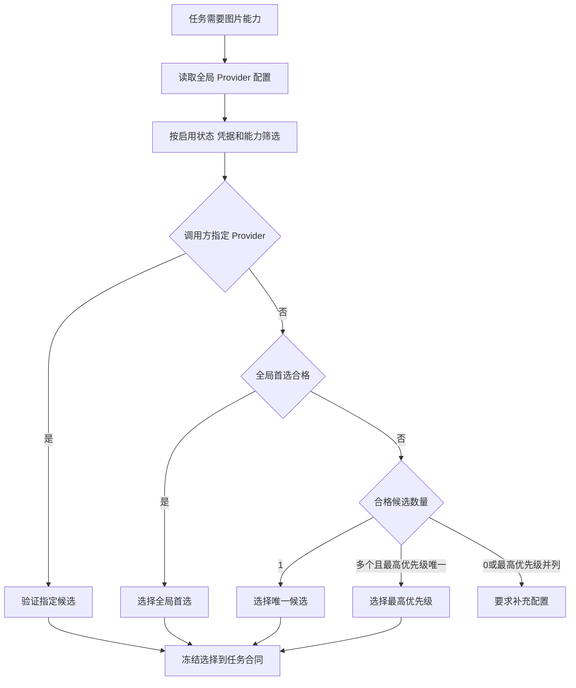

# Provider Default Selection - Plan

## Goal Capsule

- **目标：** 让已配置的图片 Provider 在任务开始时被确定性选择，并将选择结果冻结到本次任务；用户不应在每次使用时重复确认。
- **产品权威：** 当前用户要求单一已配置 Provider 自动选择；多个已配置 Provider 按配置的优先级自动选择。
- **边界：** 不引入随机权重、动态质量排序或调用失败后的跨 Provider 切换。
- **已确认决策：** 合格的已配置外部 Provider 优先于宿主 `imagegen`；宿主能力仅在没有合格外部 Provider 时兜底。

---

## Product Contract

### Summary

Provider 配置阶段应把用户的长期偏好写入用户级配置；任务运行阶段只读取该配置、按当前任务能力筛选候选并冻结一次选择结果。

“权重”在本功能中表示确定性的优先级，不表示随机抽样概率。

### Problem Frame

当前配置可以保存多个 Provider profile 和一个显式 `selected_provider`，但未选择时即使只有一个可用外部 Provider 也会要求确认；多个候选也没有优先级策略。

这使已完成配置的用户在每次任务开始时仍需介入，并使选择结果依赖临时对话而非可审计的全局偏好。

### Key Decisions

- **持久化偏好与运行时决策分离：** 配置阶段维护 Provider profile、启用状态、优先级与可选的显式偏好；任务运行阶段不得为了方便而改写这些偏好。
- **确定性优先于随机权重：** 同一配置、任务能力和宿主能力状态必须得到同一 Provider；优先级相同不得按随机权重选择。
- **一次选择，任务内冻结：** 已创建任务的 Provider、模型、选择来源和选择依据不得因后续全局配置变化而漂移。
- **失败不静默跨 Provider：** 已选 Provider 的真实调用失败时保留失败证据并按原 Provider 报告；本功能不授权因失败而切换到另一外部 Provider。
- **已配置 Provider 优先：** 合格外部 Provider 是用户已表达的长期意图，优先于宿主 `imagegen`；无合格外部 Provider 时才使用可用宿主能力。

### Requirements

**配置与偏好**

- R1. 系统必须在用户级配置中持久化每个已配置 Provider 的启用状态和确定性优先级。
- R2. 系统必须允许用户显式指定一个全局首选 Provider；显式首选仅在它满足当前任务能力且本地凭据可用时生效。
- R3. 配置或更新某个 Provider 时，不得无提示地覆盖已有的全局首选 Provider 或其他 Provider 的优先级。
- R4. 配置界面必须展示已配置 Provider 的当前选择状态、优先级和当前任务所需能力，允许用户调整这些偏好。

**任务启动时的选择**

- R5. 每次需图片能力的任务启动时，系统必须从全局配置读取候选，而不是依赖上一轮对话中的临时选择。
- R6. 候选 Provider 必须同时满足：已启用、profile 合法、凭据引用可用，以及当前 route 所需静态能力匹配。
- R7. 若任务或调用方明确指定 Provider，该指定优先于全局自动选择；不满足候选资格时必须明确失败，不得改选其他 Provider。
- R8. 当不存在显式首选且仅有一个合格外部 Provider 时，系统必须自动选择它。
- R9. 当不存在显式首选且有多个合格外部 Provider 时，系统必须选择唯一最高优先级的 Provider。
- R10. 当多个合格 Provider 并列最高优先级时，系统必须要求用户配置优先级或显式首选；不得依赖遍历顺序、随机数或最近一次调用结果。
- R11. `configured_unverified` 的合格 Provider 可以被选中用于首张真实业务图片，沿用现有惰性验证；未通过真实验证不得被表述为已验证可用。

**任务冻结与可解释性**

- R12. 系统必须把最终 Provider、模型、选择来源、触发的优先级规则及配置版本身份冻结到本次 backend contract 和 run 记录中。
- R13. 任务恢复、重试和审计必须使用已冻结的选择，不得因全局配置变化重新选择 Provider。
- R14. 选择结果必须向用户说明其来源：调用方指定、全局首选、唯一候选或优先级胜出。

### Key Flows



- F1. 首次只配置一个外部 Provider
  - **触发：** 任务需要该 Provider 支持的图片能力。
  - **结果：** 系统自动选择该 Provider，并将来源标为“唯一候选”。
- F2. 配置多个外部 Provider
  - **触发：** 当前 route 有多个合格候选，且没有合格的全局首选。
  - **结果：** 系统选择唯一最高优先级 Provider；若并列，要求用户调整配置。
- F3. 已冻结任务后修改全局偏好
  - **触发：** 用户新增 Provider、调整优先级或切换首选。
  - **结果：** 新任务按新配置决策；已有任务继续使用创建时冻结的 Provider。

### Acceptance Examples

- AE1. **单候选自动选择**
  - **Given：** 只有 `openai` 已启用、凭据可用且支持当前 route。
  - **When：** 用户启动未指定 Provider 的生成任务。
  - **Then：** 任务使用 `openai`，不要求确认，并记录“唯一候选”。
- AE2. **多候选按优先级选择**
  - **Given：** `openai` 和 `atlascloud` 均合格，且 `openai` 优先级更高。
  - **When：** 用户启动未指定 Provider 的生成任务。
  - **Then：** 任务使用 `openai`，并记录“优先级胜出”。
- AE3. **平级候选不猜测**
  - **Given：** 两个或更多合格 Provider 共享最高优先级，且没有合格全局首选。
  - **When：** 用户启动未指定 Provider 的任务。
  - **Then：** 系统要求补充配置，不调用任何 Provider。
- AE4. **调用失败不静默换服务**
  - **Given：** 任务已冻结 Provider `openai`。
  - **When：** `openai` 的真实业务调用失败。
  - **Then：** 系统保留失败证据并报告该失败，不自动调用 `atlascloud`。

### Scope Boundaries

- 不引入按概率随机分配流量的权重机制。
- 不引入基于价格、延迟、成功率或历史质量的动态排序。
- 不把 Provider 调用失败自动转移到其他外部 Provider。
- 不把凭据明文、调用记录或业务材料写入全局配置。

### Dependencies And Assumptions

- 依赖现有 Provider profile、凭据引用、静态能力 registry 和 backend contract。
- 假设已配置 Provider 的优先级由用户维护；系统不推断“价格最低”或“质量最好”。
- `configured_unverified` 仍只代表可进行首张业务图片的惰性验证，不代表真实 Provider 已验证。

### Outstanding Questions

**Deferred To Planning**

- OQ1. 优先级调整的命令行与交互式配置体验。

---

## Planning Contract

### Key Technical Decisions

- KTD1. **扩展现有全局配置 owner。** `ConfigStore` 继续拥有用户级配置与 CAS；配置升级为 v2，开发阶段直接拒绝旧 v1 配置并要求重新配置。新增 `preferred_provider`、每个 profile 的 `enabled` 和 `priority`，不再以持久化 `selected_provider` 表示用户意图。架构姿态：`extend`。
- KTD2. **新增纯选择器，不新增状态库。** 新的 `config/selection.py` 接收已校验配置、凭据 metadata、route 所需能力、宿主能力和可选调用方指定，返回确定性决策或稳定原因码。它不读写文件、不调用 Provider、不写 receipt。`ConfigService`、`setup` 与 contract 创建只消费该决策。架构姿态：`new`，因为把选择策略塞入任一现有 owner 会复制或混淆状态计算。
- KTD3. **按一次性决策创建 v2 backend contract。** backend contract 使用 `selection` 对象冻结 provider、source、priority、配置摘要与策略版本；任务创建继续复制该 contract，恢复与重试只读取冻结副本。架构姿态：`extend`。
- KTD4. **不自动 failover。** Provider 调用错误保留原 contract 与错误证据；自动选择仅发生在 task start，不能在 task execution 中改变 provider。

### Decision Order

```text
调用方指定且合格
  > 合格 preferred_provider
  > 唯一合格的已配置 Provider
  > 唯一最高优先级的已配置 Provider
  > 可用 builtin-imagegen
  > 配置或优先级错误
```

候选资格是 `enabled`、profile 合法、凭据引用可用和静态能力匹配的交集。`configured_unverified` 可以进入候选集合，但选择器本身不发起真实验证。

### Evidence And Limitations

- `ConfigStore` 当前对 profile 字段执行严格 schema 校验并以 CAS 写入；该能力可承载 v2 配置。
- `ProviderRegistry` 已是静态能力 owner；不得把优先级或用户偏好放入 registry。
- backend contract 当前已经是 run 创建时的冻结输入，但只允许两种选择来源；v2 必须同步其 schema、loader 与 run snapshot。
- 当前工作树含其他用户改动，实施只触及本计划列出的 canonical source、测试和必要文档，不覆盖无关变更。

---

## Implementation Units

### U1. 升级 Provider 偏好配置与纯选择决策

- **Requirements:** R1-R3, R5-R11, AE1-AE3
- **Files:** `skills/leo-ppt-generator/runtime/src/leo_ppt_generator/config/runtime_config.py`, `skills/leo-ppt-generator/runtime/src/leo_ppt_generator/config/selection.py`, `skills/leo-ppt-generator/runtime/src/leo_ppt_generator/config/models.py`, `tests/unit/test_runtime_config.py`, `tests/unit/test_provider_selection.py`
- **Approach:** 定义 v2 配置校验与 deterministic selection result；将 profile 的启用状态、优先级、全局首选和候选拒绝原因建模为非敏感数据。
- **Test scenarios:** 单候选、首选覆盖优先级、最高优先级、并列最高、禁用项、能力不匹配、凭据缺失、configured-first 与宿主兜底。
- **Verification:** 新增选择器单测及配置 schema 测试；每个决策重复执行得到相同输出。

### U2. 让配置服务、向导和 setup 共享选择器

- **Requirements:** R3-R11, R14, AE1-AE3
- **Files:** `skills/leo-ppt-generator/runtime/src/leo_ppt_generator/config/service.py`, `skills/leo-ppt-generator/runtime/src/leo_ppt_generator/config/transactions.py`, `skills/leo-ppt-generator/runtime/src/leo_ppt_generator/config/wizard.py`, `skills/leo-ppt-generator/runtime/src/leo_ppt_generator/setup.py`, `skills/leo-ppt-generator/runtime/src/leo_ppt_generator/cli.py`, `tests/unit/test_config_service.py`, `tests/unit/test_config_wizard.py`, `tests/unit/test_setup.py`, `tests/integration/test_cli_protocol.py`
- **Approach:** 配置操作保留用户既有偏好，暴露调整首选/优先级的命令；setup 和 status 不再各自重算候选或因宿主能力 unknown 阻断合格外部 Provider。
- **Test scenarios:** 增加第二 Provider 不覆盖首选；显式任务指定不合格时失败；配置输出展示选择来源与候选状态。
- **Verification:** 通过公开 CLI 运行 status、setup 与 provider 配置路径，确认相同输入得到相同选择。

### U3. 冻结选择到 backend contract 和任务执行链

- **Requirements:** R12-R13, AE4
- **Files:** `skills/leo-ppt-generator/runtime/src/leo_ppt_generator/config/backend_contract.py`, `skills/leo-ppt-generator/runtime/src/leo_ppt_generator/application/run_index.py`, `skills/leo-ppt-generator/runtime/src/leo_ppt_generator/cli.py`, `skills/leo-ppt-generator/runtime/src/leo_ppt_generator/schemas/backend-contract-v1.schema.json`, `skills/leo-ppt-generator/runtime/src/leo_ppt_generator/schemas/run.schema.json`, `tests/unit/test_backend_contract.py`, `tests/unit/test_run_creation.py`, `tests/unit/test_cli.py`, `tests/integration/test_run_lifecycle_recovery.py`
- **Approach:** 引入 v2 contract validation 与冻结选择 metadata；确保 run 恢复与执行 context 不重新解析全局配置。
- **Test scenarios:** 全局偏好变更后旧 run 保持原 Provider；未知 selection source 拒绝；调用错误不创建下一 Provider 的调用意图。
- **Verification:** 创建 run 后修改全局配置，再验证 manifest 与 execution context 仍绑定创建时 contract。

### U4. 更新用户入口、提示词与回归合同

- **Requirements:** R4, R14
- **Files:** `skills/leo-ppt-generator/SKILL.md`, `skills/leo-ppt-generator/references/first-use.md`, `docs/guides/user-guide.md`, `README.md`, `skills/leo-ppt-generator/prompts/slide-worker.md`, `tests/release/test_release_docs.py`, `tests/upstream/test_feature_inventory.py`
- **Approach:** 说明配置优先级、自动选择来源和不自动 failover；保持 worker 只接收冻结 backend contract。
- **Test scenarios:** 文档合同匹配当前安装分发状态；worker prompt 包含 v2 contract 输入。
- **Verification:** 运行发布文档、worker prompt 与 upstream inventory 的聚焦检查；将已知外部 upstream 漂移与本地变更结果分开报告。

---

## Verification Contract

| Gate | Required proof | Scope |
| --- | --- | --- |
| 配置与选择 | 选择器、配置服务、setup、CLI 测试通过 | U1-U2 |
| 冻结与恢复 | contract/run 创建与恢复测试通过 | U3 |
| 文档与 worker 合同 | 发布文档及 prompt 合同测试通过 | U4 |
| 回归 | 受影响的 unit、integration、property 测试通过 | U1-U4 |
| 真实 Provider | 不作为本轮必要证明；仅保持 `configured_unverified` 与真实 field outcome 的边界 | 全局 |

## Definition of Done

- R1-R14 与 AE1-AE4 都有对应的实现和聚焦自动化证明。
- 新任务的 Provider 选择可由冻结 contract 完整解释，已有任务不受全局配置变化影响。
- 配置或 Provider 执行失败不会泄漏密钥、改变全局偏好或静默换服务。
- 受影响的发布文档测试与 worker prompt 合同测试恢复通过；无关 upstream 漂移单独记录。
- 不提交、不推送、不创建 PR，除非另获明确授权。

---

## Appendix

### Source Evidence

- `skills/leo-ppt-generator/runtime/src/leo_ppt_generator/config/runtime_config.py`：当前只持久化 `selected_provider` 和 `provider_profiles`，且 `selected_provider` 必须指向已配置 profile。
- `skills/leo-ppt-generator/runtime/src/leo_ppt_generator/setup.py`：无显式选择时，单一外部候选返回 `provider_confirmation_required`，多个候选返回 `provider_choice_required`；宿主内置 `imagegen` 当前直接优先。
- `skills/leo-ppt-generator/runtime/src/leo_ppt_generator/config/backend_contract.py`：当前 contract 的选择来源仅允许 `user-confirmed` 与 `fallback-policy`。

### Evidence Limits

- 本文依据当前工作树的静态源码与单元测试结论，不主张真实 Provider 调用、费用、质量或现场可用性已得到验证。
- 上述 source evidence 在 Provider 配置模型、setup 决策或 backend contract 变化后失效，规划前必须重新核对。
