# Leo PPT Generator 端到端逻辑流程

本文从安装开始，说明 Leo PPT Generator 的用户路径、Agent 编排逻辑、确定性 runtime、
Provider 配置、四条 PPT 生产路线、质量门禁、失败恢复、升级和卸载流程。

本文描述的是当前实现。普通用户只需要理解“用户主路径”；launcher、setup、backend
contract 和 run 状态机由 Agent 自动操作，仅在高级诊断时才需要用户直接调用。

## 1. 角色与职责边界

| 角色 | 负责 | 不负责 |
| --- | --- | --- |
| 用户 | 提供材料和目标；确认可信输入、内容、Provider、样张、升级页集合和最终结果 | 手写 backend/run 状态；向聊天发送密钥；判断内部步骤 |
| Agent 宿主 | 发现 Skill；声明宿主图片能力；保存任务上下文；完成内容设计、视觉判断、worker 派发和用户确认 | 从 PATH 猜测 CLI；伪造 worker 成功；跳过样张或人工验收 |
| Skill 指令层 | 选择 route；规定确认顺序、安全边界、质量门和唯一恢复动作 | 持久化运行状态；保存原始密钥 |
| launcher/runtime manager | 准备隔离 Python 3.12 runtime；返回准确 `cli_reference`；处理 runtime 升级、回滚和引用保护 | 修改系统 Python/PATH；读取图片服务密钥 |
| `leo-ppt` runtime | setup、合同生成、run 状态、输入冻结、验证、组装、证据和清理 | 替代用户审美判断；把结构通过外推为现场通过 |
| 图片 Provider | 按冻结合同生成或编辑图片 | 决定叙事、事实或最终验收 |
| 页面 worker | 只处理分配给自己的一个 slide/page，并返回产物与证据 | 修改其他页面、顶层 run、最终 PPTX 或 Git 状态 |

## 2. 用户主路径

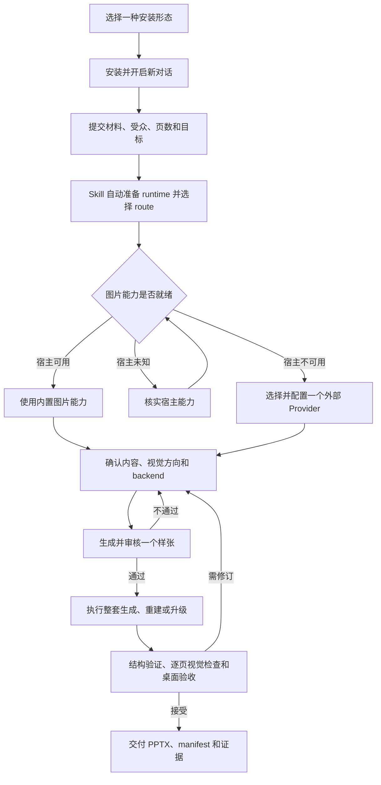

对普通用户而言，核心流程只有四步：

1. 选择一种安装方式并开启新对话。
2. 提交材料、受众、页数、使用场景和风格目标。
3. 确认大纲、逐页内容、视觉方向、图片服务和一页样张。
4. 审阅最终 PPTX；未完成的真实服务或人工验收保持 `not-run`。

## 3. 安装流程

### 3.1 安装形态选择

Plugin 与 standalone Skill 是同一 canonical Skill 的两种发布形态，只选择一种，不能在
多个发现目录保留同名副本。

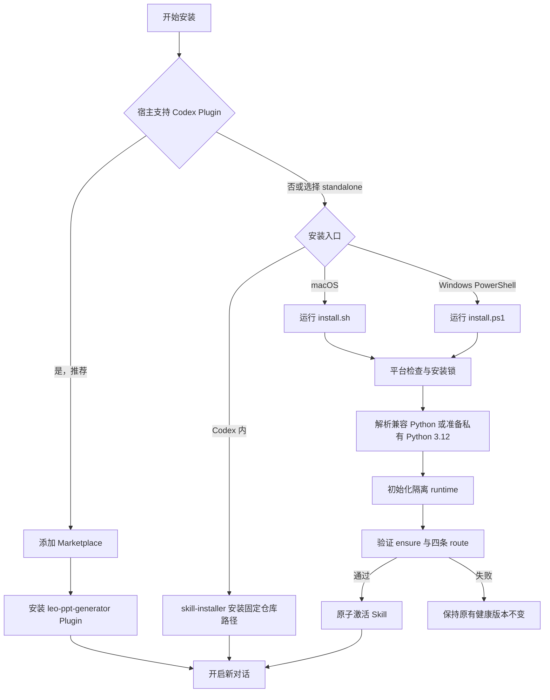

安装器遵守以下边界：

- 支持 macOS arm64 与 Windows 10/11 x64，不要求管理员权限或预装 Python。
- 不修改系统 Python 和系统 PATH，不读取或保存 API Key；macOS standalone 只在用户级命令目录安装稳定 launcher，目录不在 PATH 时明确提示。
- 同一目标只允许一个安装器持有安装锁；竞争安装 fail closed。
- 新版本先在临时位置完成本地机制验证，再原子激活。
- URL 或 release tag 不存在时停止重试，不能把本地 checkout 通过外推为远程可安装。
- 安装完成后开启新对话，使宿主重新执行 Skill 发现。

### 3.2 安装后发现验证

新对话中发送一条真实任务：

> 使用 `$leo-ppt-generator` 把这份材料做成 12 页、面向管理层的 PPT，先确认大纲和样张。

结果分为三类：

| 结果 | 含义 | 下一步 |
| --- | --- | --- |
| Skill 被识别并开始询问任务信息 | 安装与发现成功 | 继续原任务 |
| 未识别 Skill | 宿主尚未刷新，或存在重复/错误目录 | 重启宿主或开启新对话，再检查只存在一个副本 |
| launcher 返回稳定 reason code | Skill 已发现，但 runtime 准备失败 | 只执行返回的一个 `primary_action` |

## 4. 首次启动与自动初始化

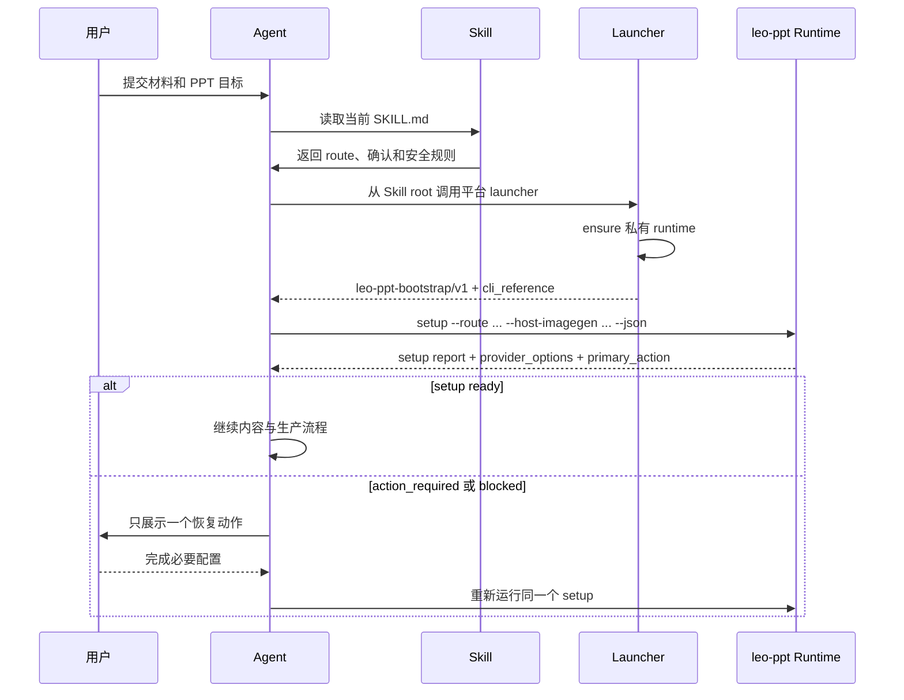

关键规则：

- Skill root 来自宿主正在使用的 `SKILL.md`，不从 cwd、仓库名或 PATH 猜测。
- launcher 成功后只消费返回的绝对 `cli_reference`。
- runtime 可复用兼容 Python 3.12，也可在 Leo 私有目录准备隔离 runtime。
- `setup ready` 只表示本地机制和当前选择可以开始，不代表真实 Provider、PowerPoint
  或人工验收已经通过。
- 非 ready 时只执行 `primary_action`，完成后回到原任务，不重复询问已经确认的内容。

## 5. 输入路由

Skill 只允许四条 route：

| 输入和目标 | Route | 主要输出 | 必要确认 |
| --- | --- | --- | --- |
| 文章、报告、笔记或大纲生成新演示文稿 | `generate` | 图片式 PPTX | 受众、目标、页数、大纲、逐页稿、风格、backend、样张 |
| 图片、PDF 或可信 PPTX 重建为对象级可编辑版本 | `direct-editable` | 全可编辑 PPTX | 输入范围、Office 可信确认、backend、worker |
| 已完成 image-deck 整套升级 | `upgrade-full` | 全可编辑 PPTX | 原 run、全部页、交付类型变化 |
| 已完成 image-deck 只升级指定页 | `upgrade-selected` | hybrid 或用户确认的 partial-hybrid | 冻结页集合、失败集合、是否接受 partial |

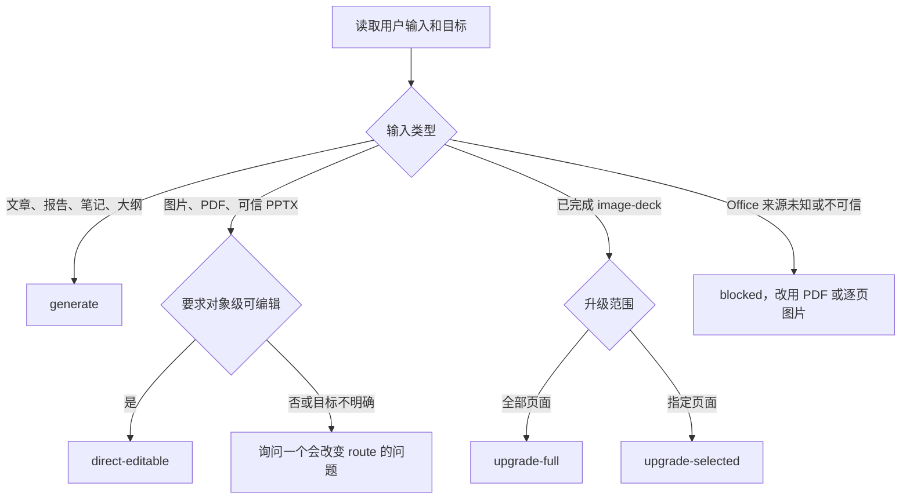

同时提供正文和视觉稿时，必须确认视觉稿是需要严格重建，还是只作为新演示文稿的素材或
风格参考，不能自行串联两条 route。

## 6. 图片能力与 Provider 配置

普通用户的唯一推荐配置入口是 `leo-ppt config`。macOS standalone 安装提供稳定的用户级短命令；Agent、Plugin 与自动化仍必须使用 launcher 解析出的绝对 `cli_reference`，不能从 PATH、cwd 或仓库名猜测可执行文件。`auth`、顶层 `provider configure` 与 `config change` 只保留为兼容入口，不是首次使用或常规恢复路径。

### 6.1 状态、宿主能力与 Provider 决策

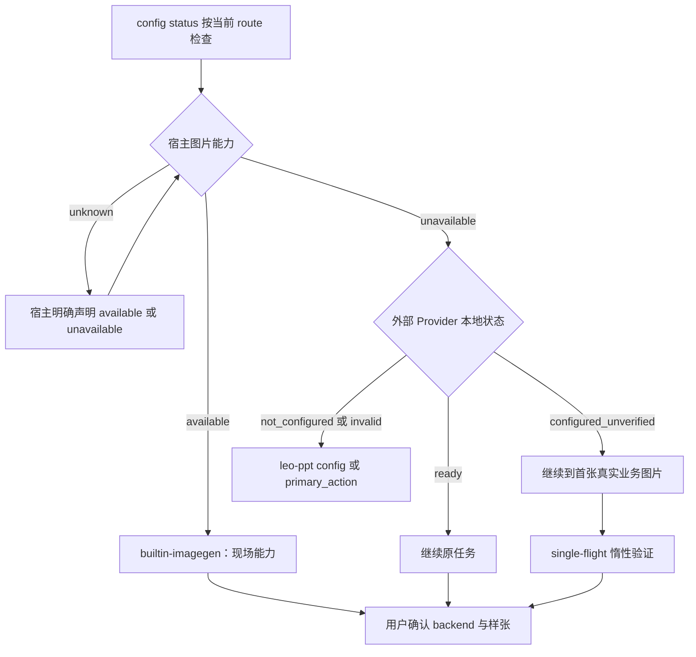

- Host Provider 的 `available`、`unavailable`、`unknown` 由当前宿主现场声明；
  `unknown` 不能被推测为可用，也不能写成 External Provider 的 receipt。
- `config status --route <route> --json` 只读检查本地 schema、档案、凭据引用、route
  capability 与 receipt 新鲜度，不访问 Provider。未指定 route 时固定检查 `generate`。
- `ready` 只表示当前 readiness scope 所需能力已由有效 Capability Evidence 完整覆盖，或
  当前宿主现场能力已覆盖；`generate` 的 receipt 不能证明 `edit`、`mask` 或 `reference`。
- `configured_unverified` 表示配置完整、`execution_eligibility=allowed`、
  `installation_readiness=usable_unverified`。它允许进入图片节点，首张真实业务图片才会
  完成验证；`blocked` 或 `retryable` 才对应 `installed_not_ready`。
- 宿主不可用时，setup 只展示满足当前 task capability 的 External Provider；一个可用
  Provider 仍需用户确认，多个候选必须让用户选择。PaddleOCR 不是图片 Provider，只在
  editable 任务实际需要在线文字 hints 时披露；缺失时使用 `builtin-ink`，不阻断图片生成。

### 6.2 统一配置、明确同意与惰性验证

```text
leo-ppt config
  -> 选择 OpenAI、OpenAI-compatible、AtlasCloud 或退出
  -> 使用已存在的环境变量引用，或真实 TTY 隐藏输入，或用户显式 --key-stdin
  -> 写入非敏感档案和 Credential Reference
  -> Local_Configuration_Check
  -> configured_unverified / allowed
  -> 仅在用户对当前操作明确同意时，config verify --yes 执行 generate-only Provider smoke
```

`config`、`config status`、`config provider`、`config credential`、`config verify` 与 `config repair` 分别负责
配置、只读检查、显式真实验证、按当前 reason code 恢复，以及主动变更 Provider/档案。
人类输出只给一个结论和至多一个 `primary_action`；JSON 输出使用 `leo-ppt-config/v1`，
并分开报告配置状态、验证状态、执行资格、安装就绪度和当前 route 的能力作用域。

可能计费的 smoke 仅在当前操作获得明确肯定同意后执行。默认回车、超时、取消、安装、
更新、宿主调用和进入向导均不是同意；跳过后保持 `configured_unverified`，不阻断原任务。
同一 Verification Scope 尚无有效证据时最多一个可能计费请求在途，其他页面等待并共享同一
成功或失败结果。非幂等 Provider 在结果未知时返回 `provider_outcome_unknown`，不得自动重试。

真实业务图片成功后会保留为任务产物，并为实际执行的能力原子写入 receipt。若 receipt
写入失败，图片和任务上下文必须保留，当前 route 不能宣称 `ready`；`config repair` 只重试
本地证据持久化，不再次调用 Provider。

### 6.3 OpenAI-compatible 与凭据安全

OpenAI-compatible Provider 在 `config` 向导中设置独立的 HTTPS `endpoint_origin`、图片模型
和 Credential Reference。endpoint 不得包含用户名、密码、查询参数或 fragment，且必须指向
真实兼容图片生成/编辑接口；仅支持聊天补全的中转站不能生成 PPT 图片。endpoint、模型、
凭据版本、adapter 或验证策略变化会使旧 receipt 失效，但不会阻断首张真实业务图片承担
新的惰性验证。

密钥只能通过三条通道进入系统：真实 TTY 的隐藏输入、既有环境变量引用，或用户显式选择的
`--key-stdin`。明文命令参数、URL、普通 stdin 的隐式读取、聊天、YAML、项目目录、run、
receipt 与日志均禁止保存密钥。非敏感 profile 写入 `${LEO_PPT_HOME}/config.yaml`；密钥写入
macOS Keychain 或 Windows 当前用户 DPAPI。环境变量只保存 `env:<NAME>` 引用，不复制值。

覆盖凭据前必须经用户确认；覆盖会使依赖旧凭据版本的 receipt 失效。环境中后来出现的新密钥
不会改变已经冻结的 run。

## 7. Backend Contract 与 Run 冻结

用户确认 Provider 和 mode 后，Agent 通过 registry 生成 backend contract，并立即使用
同一 loader 自校验。普通用户不手写 JSON。

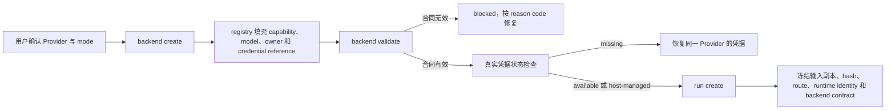

Run 创建后的不变量：

- backend contract 只记录 `env:`、`host:` 或 `keychain:` 引用，不记录 secret value。
- 输入以流式方式复制到 run，并记录路径、大小、类型和 hash。
- Office 输入只有用户确认可信后才能传 `--office-trusted`；宏、嵌入对象、外部关系、
  远程模板、损坏 PPTX 和旧 `.ppt` 仍会 fail closed。
- 相同请求使用同一 idempotency key。响应丢失时查询 operation，不能换 key 重复创建。
- 样张确认后冻结 backend 和 generation method。切换 Provider、模型或主要风格必须创建
  新 run 或新确认，并重新生成样张。

## 8. 内容与样张门禁

所有会改变最终结果的路线都必须先关闭相应确认：

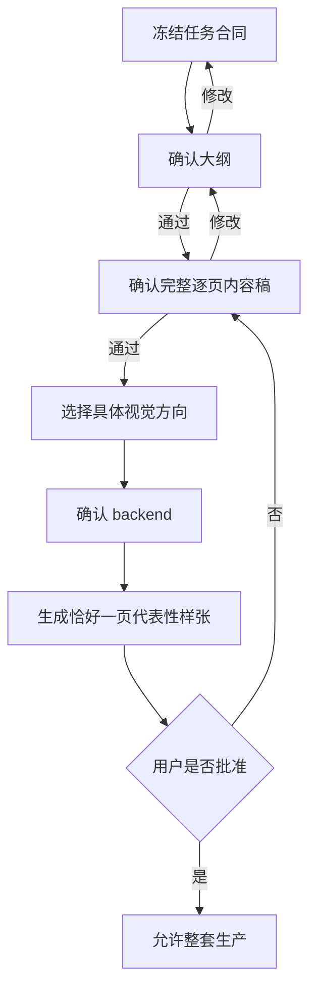

不能跳过的门禁：

- 来源不足的数字、引用、客户名、结论或因果关系标记为 `unknown`，不能补写。
- 每页只承担一个可复述任务，并与演讲时长和整体叙事相容。
- 样张必须使用最终计划采用的 backend 和 generation method。
- 用户要求跳过样张时仍不能跳过。
- 旧样张不能用于证明切换 Provider、模型或主要风格后的新结果。

## 9. 四条生产路线

### 9.1 `generate` 图片式路线

`generate` 从文章、报告、笔记或大纲生成新的图片式 PPTX。完整 workflow 包含 18 个
节点，而不是从 `image prepare` 才开始计算：

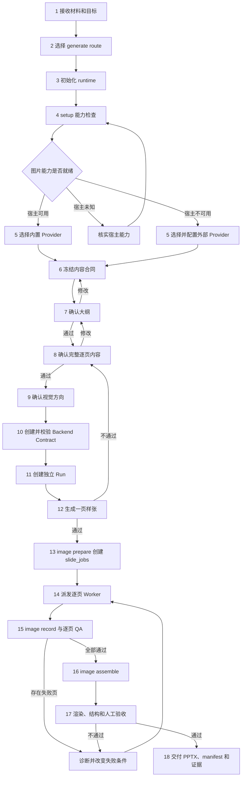

各节点的输入、动作、产出和推进门禁如下：

| 节点 | 核心动作 | 主要产出 | 推进门禁 |
| --- | --- | --- | --- |
| 1. 接收材料和目标 | 收集正文、大纲或附件，以及受众、场景、时长、页数和风格目标 | 原始任务上下文 | 缺少会改变 route 或内容规模的信息时先确认 |
| 2. 选择 `generate` route | 判断目标是创建新演示文稿，而不是严格重建现有视觉稿 | 唯一 route：`generate` | 同时存在正文和视觉稿且意图不明确时不能自行串联 route |
| 3. 初始化 runtime | 从 Skill root 调用 launcher，执行 ensure 并读取绝对 `cli_reference` | `leo-ppt-bootstrap/v1`、可用 runtime、CLI 引用 | launcher blocked 时只执行其一个恢复动作 |
| 4. setup 能力检查 | 检查本地机制、宿主图片能力、任务 capability、Provider profile 和凭据状态 | versioned setup report、候选 Provider、`primary_action` | `unknown` 不能当作 available；非 ready 必须先关闭恢复动作 |
| 5. 选择或配置 Provider | 选择 `builtin-imagegen`、OpenAI、OpenAI-compatible 中转站或 AtlasCloud | 用户确认的 Provider、可解析凭据引用 | 外部 Provider 缺 profile/凭据、能力不覆盖任务或用户未确认时不能继续 |
| 6. 冻结内容合同 | 固定主题、受众、行动目标、页数、素材来源、必须出现事实和不可杜撰项 | 内容合同、事实边界、`unknown` 清单 | 来源不足的数字、引用、客户名和因果关系不能补写 |
| 7. 确认大纲 | 设计叙事主线、页面顺序和每页角色 | 用户批准的大纲 | 未批准或要求修改时返回内容合同/大纲，不进入逐页设计 |
| 8. 确认完整逐页内容 | 为每页定义页面任务、核心结论、关键文字、事实来源、资产、衔接和讲述时长 | 用户批准的完整逐页内容稿 | 事实、密度、页数或衔接未确认时不能制图 |
| 9. 确认视觉方向 | 提供 2–3 个具体方向，确定版式、图像语言、颜色、字体气质和图表风格 | 用户批准的视觉方向 | 不使用“简洁高级”等不可执行描述直接进入生成 |
| 10. 创建 Backend Contract | 由 registry 填充 Provider、模型、capability、owner、endpoint 和 credential reference，并自校验 | 非敏感、版本化 backend contract | 合同无效、凭据引用缺失或 capability 不足时 fail closed |
| 11. 创建独立 Run | 流式冻结输入副本、hash、route、runtime identity、backend contract 和 idempotency key | 独立 run、canonical index、初始 operation | 输入不可信、目标冲突或同 key 不一致时拒绝创建 |
| 12. 生成并确认一页样张 | 用最终内容、Provider、模型、generation method 和视觉方向生成代表性页面 | 用户批准的样张及对应 fingerprint | 用户拒绝时返回逐页内容/视觉方向；切换 Provider、模型、方法或主要风格后旧样张失效 |
| 13. Prepare 页面任务 | 调用 `image prepare`，把已确认内容转成唯一 `slide_jobs.json` | 每页 job、prompt、输入引用和 canonical state | 内容或样张确认缺失时不能 prepare |
| 14. 派发逐页 Worker | 一页按 CLI 明确许可本地执行；多页为每页真实派发受限 worker | worker/slide 绑定、lease、逐页执行上下文 | 多页 worker 未授权、不可用或未真实派发时必须阻断，主 Agent 不静默串行替代 |
| 15. Record 与逐页 QA | Worker 返回后调用 `image record`，登记产物、provenance 和逐页验证 | recorded slide、图片 hash、QA/validation evidence | 缺页或任一事实、视觉、资产、图表、状态检查失败都阻止 assemble |
| 16. Assemble PPTX | 全部页面通过后调用 `image assemble`，按页序组装图片、notes 和结构 | 新 artifact revision、最终 PPTX、delivery manifest | 未全部 recorded、页序/结构不一致或旧状态 hash 时拒绝组装 |
| 17. 最终验收 | 重新打开和连续逐页渲染，核对结构、可读性、PowerPoint 桌面效果并进行人工验收 | provenance、visual、manual receipt；`delivery_readiness` | `artifact_invalid` 先修结构；`acceptance_pending` 必须补齐缺失证据 |
| 18. 交付 | 确认最终 PPTX、manifest 和全部证据绑定相同 artifact hash | PPTX、manifest、逐页图片和证据包 | 只有 `delivery_readiness.status=accepted` 且 `next_action.kind=none` 才能声明闭环 |

节点 15 的逐页 QA 必须分别检查事实文字、对比度、遮挡、截断、required asset、图表
数值、单位、标签、排序和样张风格继承。任何一项失败都不能由其他绿色检查补偿。

Workflow 中存在四个关键回环：

1. 大纲未通过：返回节点 6–7，重新调整内容合同或叙事。
2. 逐页内容未通过：返回节点 7–8，不进入制图。
3. 样张未通过：返回节点 8–12，修改内容或视觉方向后重新生成样张。
4. 页面或最终验收失败：先诊断并改变失败条件，再回到节点 14–17；不能原样重复执行。

### 9.2 `direct-editable` 可编辑重建路线

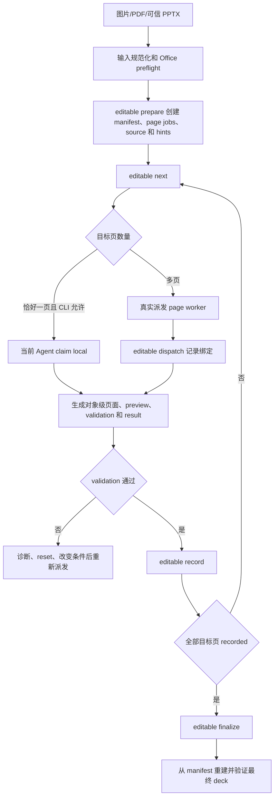

整页截图或覆盖全画布的栅格图不能冒充可编辑交付。标题、正文和图表文字必须是原生可选
文本；字体替代、溢出、遮挡、边界、对比度、图表真值和对象可编辑性均为非补偿门禁。

### 9.3 `upgrade-full` 全量升级

1. inspect 已完成的 image-deck。
2. 冻结每页 source hash、页序、尺寸和 notes。
3. 对全部页面执行 editable prepare、dispatch、record 和 finalize。
4. 任一页面失败都不能删除或降级原图片式交付物。
5. 全部页面和 deck validation 通过后，才能声明全可编辑。

### 9.4 `upgrade-selected` 指定页升级

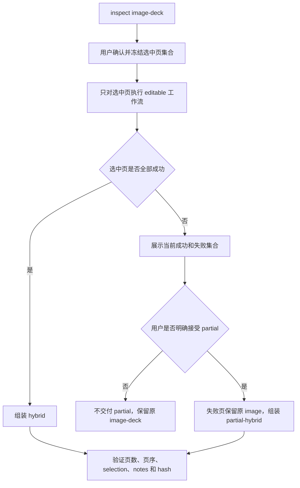

失败集合发生变化后必须重新展示和确认；`hybrid` 和 `partial-hybrid` 均不能声称全可编辑。

## 10. Worker 调度与并发边界

多页任务需要 worker 时，必须同时满足：

1. 当前用户允许派发。
2. 当前会话存在可调用的 worker 能力。
3. 宿主容量可用且真实派发成功。
4. 每个 worker 只拥有一个 slide/page 目录。

CLI 不模拟 Agent worker。派发能力缺失、未知或调用失败时，多页任务返回
`blocked/worker_capability_unavailable`，主 Agent 不能静默串行替代。恰好一页时，只有
CLI 明确返回 `single_unit_current_agent_allowed`，当前 Agent 才能本地执行。

Worker 返回必须包括 worker/agent id、slide/page id、绝对产物路径、backend 和输入
provenance、validation/QA 结果、证据路径，以及失败时的稳定 reason code。

## 11. 五层质量门与交付验收

五层质量门互不补偿：

| 质量层 | 通过条件 | 常见阻断 |
| --- | --- | --- |
| 内容事实 | 与来源一致，不杜撰 | 来源不足、数字/引用/因果不确定 |
| 叙事结构 | 主线清楚，每页一个任务 | 页面无作用、顺序断裂、时长不匹配 |
| 视觉呈现 | 文字准确可读、对比充分、无遮挡截断、图表真值完整 | 小字、低对比、遮挡、资产遗漏、风格漂移 |
| PPTX 结构 | 页数、页序、尺寸、notes、媒体关系和 hash 一致 | 缺页、损坏引用、manifest 不一致 |
| 现场验收 | 真实 Provider、桌面打开、投屏和人工审美分别验证 | 只用 fixture 或“能打开”代替现场验证 |

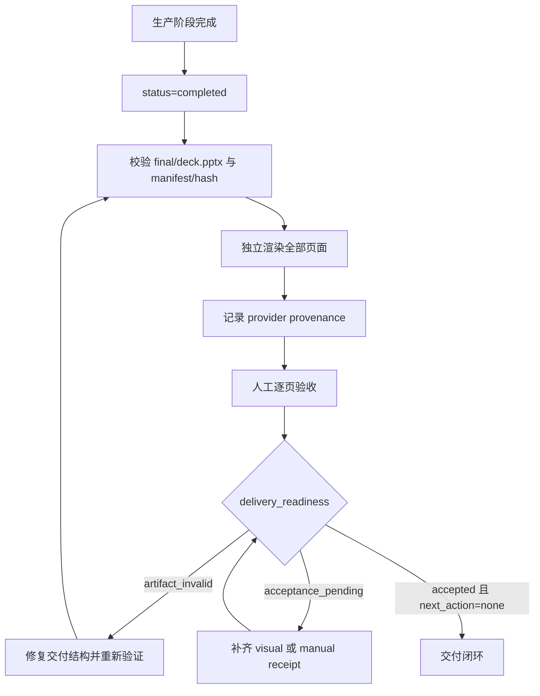

`status=completed` 只表示产物阶段结束。只有 `delivery_readiness.status=accepted` 且
`next_action.kind=none` 才表示交付闭环。

最终证据至少覆盖：

- Provider receipt：页面、Provider、模型、prompt/input/artifact hash；
- Visual receipt：最终 PPTX hash、renderer/version、连续逐页渲染路径和 QA 结论；
- Manual receipt：相同 PPTX hash、reviewer、客户端版本和逐页接受结果；
- Delivery manifest：交付类型、页数、页序、notes、媒体和最终 artifact hash。

任何 receipt 绑定旧 PPTX hash、存在缺页、拒绝页或包含 secret 时都必须阻断。

## 12. 失败、恢复、取消与清理

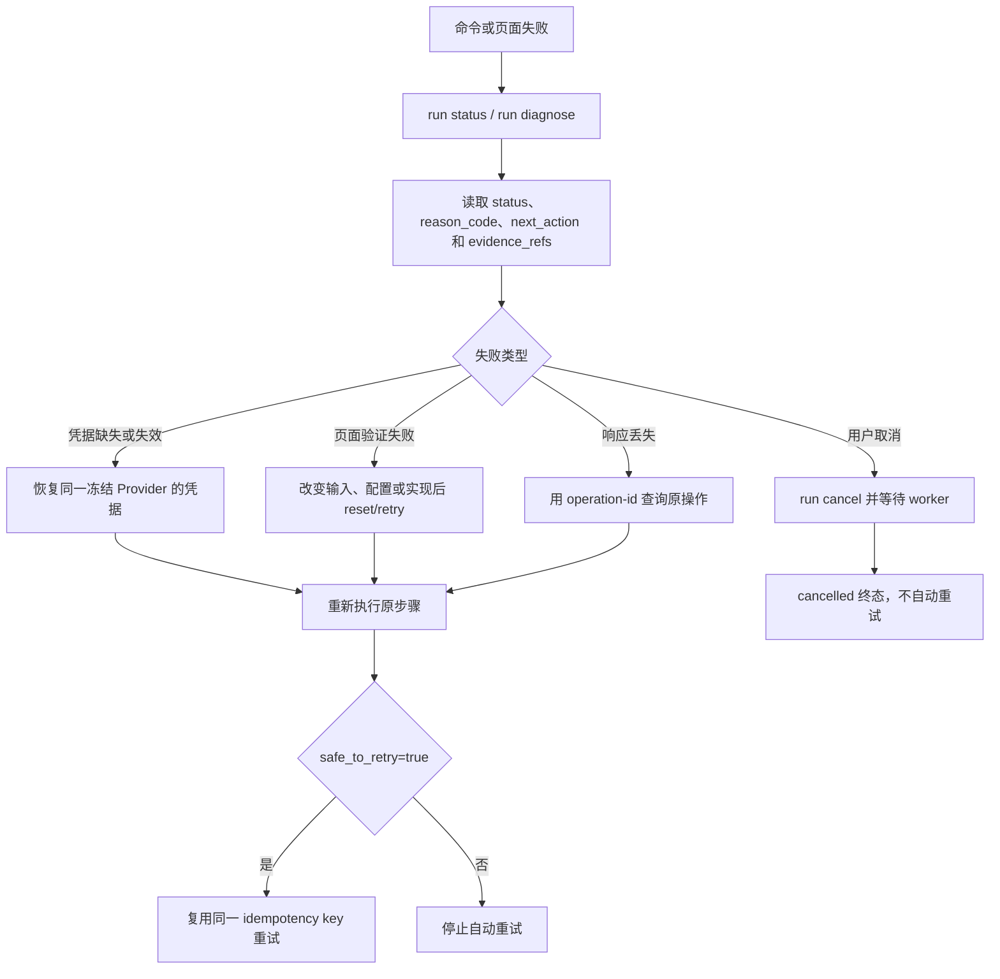

恢复规则：

- 同一失败再次执行前，必须改变输入、配置、backend 或实现条件。
- 只有 `safe_to_retry=true` 才能自动重试，并复用原 idempotency key。
- 响应丢失时查询原 operation/status，不创建重复 mutation。
- 中断保留已完成产物和 checkpoint；cancel 是不可自动重试的终态。
- 清理先生成 dry-run preview，再应用完全相同的 preview。
- `input` 只允许在 terminal run 且无 active worker 时删除；删除后该 run 不能重新 prepare。
- `image-deck/`、`editable/` 和 `final/` 不属于默认临时清理范围。

## 13. 升级、回滚与卸载

### 13.1 升级

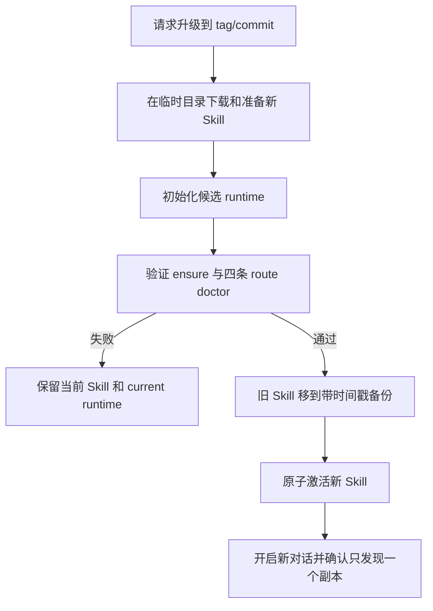

生产环境应固定 release tag 或 commit。使用 `main` 代表跟随最新版本，不代表内容固定。

### 13.2 Runtime 回滚和移除

- current runtime 不能直接删除；先切换到另一个已验证的健康 identity。
- 被 active run 引用的 runtime identity 不能删除。
- runtime manager 将精确目标移入 quarantine，不递归删除整个 runtime 根目录。
- `LEO_PPT_HOME` 下的非敏感配置、OS store 凭据、有效或失效的 verification receipt、
  run、交付 PPTX 与 runtime 是独立生命周期。升级、回滚和卸载 Skill 不自动删除其中任一
  项；仅在确认无 active run 引用后，才可按受保护流程处理非 current runtime。

### 13.3 卸载

1. 将 Plugin 或 standalone Skill 移出宿主发现目录。
2. 重启宿主，确认不再发现 `leo-ppt-generator`。
3. 保留需要的 run、PPTX 和旧版本备份。
4. 仅在确认无 active run 引用后，按 runtime manager 的受保护流程处理非 current runtime。
5. 需要撤销 Provider 时，单独执行对应 `auth remove`；卸载 Skill 不隐式删除凭据。

## 14. 状态与责任速查

| 状态或信号 | 表示 | 不表示 |
| --- | --- | --- |
| 安装器成功 | Skill 文件和本地机制已通过安装门禁 | 宿主新会话一定已经发现 |
| launcher `ready` | 可用 runtime 和准确 CLI 已准备 | Provider 或 PowerPoint 已通过 |
| setup `ready` | route、本地机制和当前 Provider 选择可开始 | 真实 API 调用成功 |
| backend `valid` | 合同结构、capability 和引用合法 | 凭据可解析或服务可用 |
| page/slide `recorded` | 单页产物和当前验证已登记 | 整套 PPTX 已完成 |
| run `completed` | 产物阶段已经结束 | 用户已经接受交付 |
| `acceptance_pending` | PPTX 已生成，但视觉或人工证据未闭环 | 可以声明最终完成 |
| `accepted` | 最终 artifact、渲染和人工 receipt 绑定同一 PPTX | 所有未执行外部场景都自动通过 |

### 14.1 产物台账

每个阶段都有独立产物。最终 PPTX 不是唯一产物，也不能反向替代前置决策和验证证据。

| 阶段 | 主要产物 | 作用 |
| --- | --- | --- |
| 安装 | Skill 文件、Plugin/standalone 目录、runtime receipt、`cli_reference` | 证明 Skill 被发现并有可调用 runtime |
| 首次启动 | `leo-ppt-bootstrap/v1`、`leo-ppt-setup/v1` | 记录 runtime、宿主图片能力、Provider 候选和恢复动作 |
| 内容梳理 | 内容合同、大纲、完整逐页内容稿、视觉方向、样张确认 | 保存用户与 Agent 对内容和视觉的共同决策；不是普通配置文件 |
| Provider 配置 | `${LEO_PPT_HOME}/config.yaml` 中的非敏感 profile、OS store 中的凭据引用 | 保存中转站地址/模型和密钥引用；不保存原始密钥 |
| Backend | `backend.json` | 冻结 Provider、模型、capability、endpoint 和 credential reference |
| Run 初始化 | `run.json`、输入副本、输入 hash、runtime identity、idempotency 信息 | 固定一次交付的输入和执行上下文 |
| 图片式生成 | `image-deck/slide_jobs.json`、逐页图片、record、worker evidence | 记录每页生成状态、图片 hash、Provider provenance 和 QA |
| 可编辑生成 | `deck_manifest.json`、`page_jobs.json`、逐页 `manifest.json`、source、notes manifest、page PPTX、preview、validation | 作为对象级页面和最终组装的权威输入 |
| 最终交付 | `final/deck.pptx`、delivery manifest、`final/validation-summary.json` | 输出 PPTX 和结构验证结果 |
| 交付证据 | Provider receipt、visual receipt、manual acceptance receipt | 分别证明真实 Provider、渲染结果和人工验收 |
| 运行观测 | `events.ndjson`、`logs/run.log`、`reports/timing.json` | 记录状态变化、耗时、操作和恢复信息；不记录正文或密钥 |
| 升级/混合 | baseline、选中页集合、failure report、hybrid/partial-hybrid manifest | 支持全量升级、指定页升级和失败页保留原图 |

### 14.2 稳定性分层

“稳定执行”必须按证据层级理解，不能把本地 fixture 或结构测试外推为真实服务成功：

| 层级 | 当前判断 | 证据边界 |
| --- | --- | --- |
| 流程合同和状态机 | 稳定 | route、setup、backend、run、record、finalize、reason code 均有明确合同 |
| 本地确定性 runtime | 已具备稳定基础 | 单元、journey、发布和回归测试覆盖锁、幂等、fail-closed、schema 和状态迁移 |
| macOS 安装与宿主发现 | 有重复性证据 | 既有验证记录包含 standalone/Plugin 冷安装和新会话发现结果；新版本变更后需重跑发布验证 |
| Windows 真机 | 部分验证 | PowerShell/依赖解析不等于 Windows NTFS、DPAPI 和宿主真机验证 |
| 真实 Provider | 未完成现场闭环 | 需要实际 API Key、网络、服务商图片接口和 provider receipt；本地合同通过不等于 API 成功 |
| 最终 PPT 现场质量 | 未完成现场闭环 | 需要真实渲染、PowerPoint/桌面客户端打开、投屏可读性和人工逐页验收 |

因此，当前可声明的是：本地流程、状态管理、合同校验、安装机制和失败恢复具备可重复执行
基础；不能直接声明所有服务商、Windows 环境或最终 PPT 视觉质量已经现场稳定。

## 15. 不可绕过的不变量

- 只使用四条固定 route，不接受运行时注入的任意流程。
- 不从 PATH 猜测 `leo-ppt`，只使用 launcher 返回的 `cli_reference`。
- 不在聊天、YAML、backend contract、run 或日志中保存原始密钥。
- 不用“合同有效”替代凭据、真实 Provider 或现场验证。
- 不用聊天回复替代 canonical state、manifest、validation 或 receipt。
- 不用整页截图加少量文本框冒充对象级可编辑页面。
- 多页 worker 未真实派发时，不记录 dispatch 成功，也不由主 Agent 静默串行替代。
- 缺页、事实错误、视觉错误、结构错误或人工拒绝任一项都不能被其他绿色检查补偿。
- 切换 Provider、模型、generation method 或主要风格后必须重新确认样张。
- 最终图片或 PPTX hash 变化后，旧渲染、验证和人工 receipt 全部失效，必须重新闭环。

## 16. 相关文档

- [README](../README.md)：安装和第一次使用入口。
- [用户教程](user-guide.md)：安装命令、高级 CLI、升级和卸载说明。
- [故障处理](troubleshooting.md)：稳定 reason code 与唯一恢复动作。
- [兼容性说明](compatibility.md)：平台和现场验证边界。
- [测试方案与证据分层](testing.md)：自动化、真实宿主和现场证据的声明边界。
- [已知限制](limitations.md)：不能由本地机制替代的外部限制。
