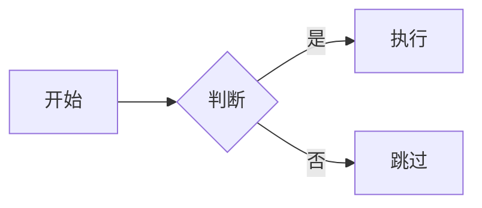

# 图表语法：流程图（Flowchart）

**分类:** 11_图表语法

**定位:** 有序流程/分支判定 — 过程/工作流/管道。节点+边,LR/TB 方向。与 07 信息图类型·流程图互补——本文件是**可执行文本语法**。

## 说明

**Mermaid 类型**：`Flowchart`。文本描述即可渲染（mermaid 语法），是「可执行的图解」——与 07 信息图类型的「静态骨架」互补。

## 示例语法

> 图表的坐标轴/图例/配色处理沿用 `08_图片渲染` 与 `data-journalism`；颜色来自 deck colors 锚点，本文件只定结构与语法。