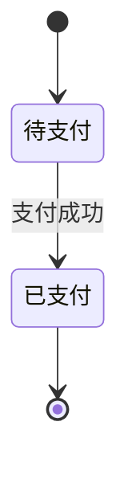

# 图表语法：状态图（StateDiagram）

**分类:** 11_图表语法

**定位:** 生命周期状态机 — 状态机/生命周期迁移。用于流程状态、订单状态、用户状态。

## 说明

**Mermaid 类型**：`StateDiagram`。文本描述即可渲染（mermaid 语法），是「可执行的图解」——与 07 信息图类型的「静态骨架」互补。

## 示例语法

> 图表的坐标轴/图例/配色处理沿用 `08_图片渲染` 与 `data-journalism`；颜色来自 deck colors 锚点，本文件只定结构与语法。