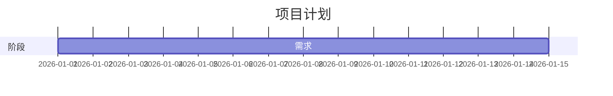

# 图表语法：甘特图（Gantt）

**分类:** 11_图表语法

**定位:** 项目排期条形图 — 项目排期,时间轴条形。用于计划、里程碑、资源。

## 说明

**Mermaid 类型**：`Gantt`。文本描述即可渲染（mermaid 语法），是「可执行的图解」——与 07 信息图类型的「静态骨架」互补。

## 示例语法

> 图表的坐标轴/图例/配色处理沿用 `08_图片渲染` 与 `data-journalism`；颜色来自 deck colors 锚点，本文件只定结构与语法。